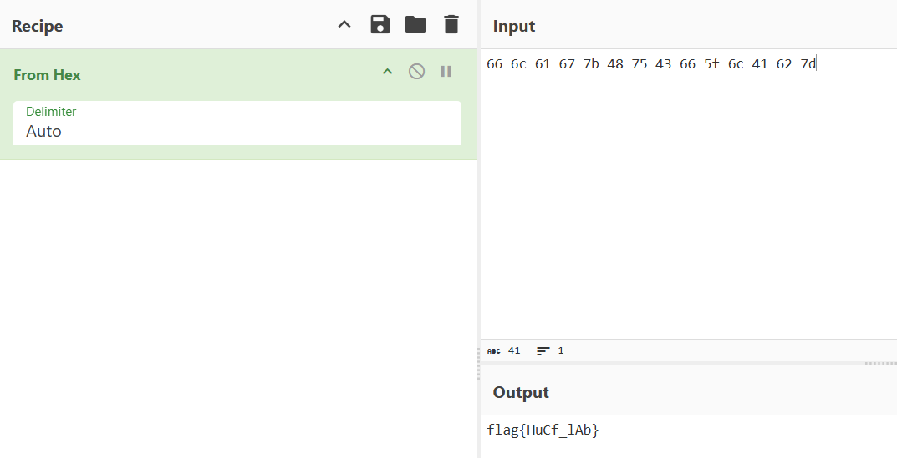

# helithumper re

## Basic inspection

After giving permission to launch the ELF, we can try to enter some random input

```bash
└─$ ./rev 
Welcome to the Salty Spitoon™, How tough are ya?
:)
Yeah right. Back to Weenie Hut Jr™ with ya
```

Seems we get rejected. If we check the `.rodata` section of the ELF, we can see that there is a ‘Right this way’ string, which should be our target

```bash
└─$ objdump -s -j .rodata rev 

rev:     file format elf64-x86-64

Contents of section .rodata:
 2000 01000200 00000000 57656c63 6f6d6520  ........Welcome 
 2010 746f2074 68652053 616c7479 20537069  to the Salty Spi
 2020 746f6f6e e284a22c 20486f77 20746f75  toon..., How tou
 2030 67682061 72652079 613f0025 73005269  gh are ya?.%s.Ri
 2040 67687420 74686973 20776179 2e2e2e00  ght this way....
 2050 59656168 20726967 68742e20 4261636b  Yeah right. Back
 2060 20746f20 5765656e 69652048 7574204a   to Weenie Hut J
 2070 72e284a2 20776974 68207961 00        r... with ya. 
```

However we can’t know the logic of the ELF further

## Gdb-pwndbg

We can first view all the functions available. The main and validation functions seem worth taking a look.

```bash
pwndbg> info func
All defined functions:

Non-debugging symbols:
0x0000000000001000  _init
0x0000000000001030  puts@plt
0x0000000000001040  strlen@plt
0x0000000000001050  __stack_chk_fail@plt
0x0000000000001060  calloc@plt
0x0000000000001070  __isoc99_scanf@plt
0x0000000000001080  __cxa_finalize@plt
0x0000000000001090  _start
0x00000000000010c0  deregister_tm_clones
0x00000000000010f0  register_tm_clones
0x0000000000001130  __do_global_dtors_aux
0x0000000000001170  frame_dummy
0x0000000000001175  main
0x00000000000011ea  validate
0x00000000000012d0  __libc_csu_init
0x0000000000001330  __libc_csu_fini
0x0000000000001334  _fini
```

We can first take a glance at the main function

```nasm
pwndbg> disass main
Dump of assembler code for function main:
   0x0000000000001175 <+0>:     push   rbp
   0x0000000000001176 <+1>:     mov    rbp,rsp
   0x0000000000001179 <+4>:     sub    rsp,0x10
   0x000000000000117d <+8>:     mov    esi,0x1
   0x0000000000001182 <+13>:    mov    edi,0x32
   0x0000000000001187 <+18>:    call   0x1060 <calloc@plt>
   0x000000000000118c <+23>:    mov    QWORD PTR [rbp-0x8],rax
   0x0000000000001190 <+27>:    lea    rdi,[rip+0xe71]        # 0x2008
   0x0000000000001197 <+34>:    call   0x1030 <puts@plt>
   0x000000000000119c <+39>:    mov    rax,QWORD PTR [rbp-0x8]
   0x00000000000011a0 <+43>:    mov    rsi,rax
   0x00000000000011a3 <+46>:    lea    rdi,[rip+0xe91]        # 0x203b
   0x00000000000011aa <+53>:    mov    eax,0x0
   0x00000000000011af <+58>:    call   0x1070 <__isoc99_scanf@plt>
   0x00000000000011b4 <+63>:    mov    rax,QWORD PTR [rbp-0x8]
   0x00000000000011b8 <+67>:    mov    rdi,rax
   0x00000000000011bb <+70>:    call   0x11ea <validate>
   0x00000000000011c0 <+75>:    test   eax,eax
   0x00000000000011c2 <+77>:    je     0x11d7 <main+98>
   0x00000000000011c4 <+79>:    lea    rdi,[rip+0xe73]        # 0x203e
   0x00000000000011cb <+86>:    call   0x1030 <puts@plt>
   0x00000000000011d0 <+91>:    mov    eax,0x0
   0x00000000000011d5 <+96>:    jmp    0x11e8 <main+115>
   0x00000000000011d7 <+98>:    lea    rdi,[rip+0xe72]        # 0x2050
   0x00000000000011de <+105>:   call   0x1030 <puts@plt>
   0x00000000000011e3 <+110>:   mov    eax,0x1
   0x00000000000011e8 <+115>:   leave
   0x00000000000011e9 <+116>:   ret
End of assembler dump.
```

It might seems overwhelming, but it basically calls the validate function, and after that test if the `EAX` is changed.

If EAX stays the same (due to jump equal), it will jump to `<main+98>`, which is what we saw earlier

```bash
pwndbg> jump *main+98
Continuing at 0x5555555551d7.
Yeah right. Back to Weenie Hut Jr™ with ya
[Inferior 1 (process 11854) exited with code 01]
```

Else, it will not perform the jump, which will proceed to `<main+79>`

```bash
pwndbg> jump *main+79
Continuing at 0x5555555551c4.
Right this way...
[Inferior 1 (process 11224) exited normally]
```

To know when and how the EAX is changed, we need to observe the `validate` function

```nasm
pwndbg> disass validate
Dump of assembler code for function validate:
   0x00000000000011ea <+0>:     push   rbp
   0x00000000000011eb <+1>:     mov    rbp,rsp
   0x00000000000011ee <+4>:     sub    rsp,0x60
   0x00000000000011f2 <+8>:     mov    QWORD PTR [rbp-0x58],rdi
   0x00000000000011f6 <+12>:    mov    rax,QWORD PTR fs:0x28
   0x00000000000011ff <+21>:    mov    QWORD PTR [rbp-0x8],rax
   0x0000000000001203 <+25>:    xor    eax,eax
   0x0000000000001205 <+27>:    mov    DWORD PTR [rbp-0x40],0x66
   0x000000000000120c <+34>:    mov    DWORD PTR [rbp-0x3c],0x6c
   0x0000000000001213 <+41>:    mov    DWORD PTR [rbp-0x38],0x61
   0x000000000000121a <+48>:    mov    DWORD PTR [rbp-0x34],0x67
   0x0000000000001221 <+55>:    mov    DWORD PTR [rbp-0x30],0x7b
   0x0000000000001228 <+62>:    mov    DWORD PTR [rbp-0x2c],0x48
   0x000000000000122f <+69>:    mov    DWORD PTR [rbp-0x28],0x75
   0x0000000000001236 <+76>:    mov    DWORD PTR [rbp-0x24],0x43
   0x000000000000123d <+83>:    mov    DWORD PTR [rbp-0x20],0x66
   0x0000000000001244 <+90>:    mov    DWORD PTR [rbp-0x1c],0x5f
   0x000000000000124b <+97>:    mov    DWORD PTR [rbp-0x18],0x6c
   0x0000000000001252 <+104>:   mov    DWORD PTR [rbp-0x14],0x41
   0x0000000000001259 <+111>:   mov    DWORD PTR [rbp-0x10],0x62
   0x0000000000001260 <+118>:   mov    DWORD PTR [rbp-0xc],0x7d
   0x0000000000001267 <+125>:   mov    rax,QWORD PTR [rbp-0x58]
   0x000000000000126b <+129>:   mov    rdi,rax
   0x000000000000126e <+132>:   call   0x1040 <strlen@plt>
   0x0000000000001273 <+137>:   mov    DWORD PTR [rbp-0x44],eax
   0x0000000000001276 <+140>:   mov    DWORD PTR [rbp-0x48],0x0
   0x000000000000127d <+147>:   jmp    0x12aa <validate+192>
   0x000000000000127f <+149>:   mov    eax,DWORD PTR [rbp-0x48]
   0x0000000000001282 <+152>:   movsxd rdx,eax
   0x0000000000001285 <+155>:   mov    rax,QWORD PTR [rbp-0x58]
   0x0000000000001289 <+159>:   add    rax,rdx
   0x000000000000128c <+162>:   movzx  eax,BYTE PTR [rax]
   0x000000000000128f <+165>:   movsx  edx,al
   0x0000000000001292 <+168>:   mov    eax,DWORD PTR [rbp-0x48]
   0x0000000000001295 <+171>:   cdqe
   0x0000000000001297 <+173>:   mov    eax,DWORD PTR [rbp+rax*4-0x40]
   0x000000000000129b <+177>:   cmp    edx,eax
   0x000000000000129d <+179>:   je     0x12a6 <validate+188>
   0x000000000000129f <+181>:   mov    eax,0x0
   0x00000000000012a4 <+186>:   jmp    0x12b7 <validate+205>
   0x00000000000012a6 <+188>:   add    DWORD PTR [rbp-0x48],0x1
   0x00000000000012aa <+192>:   mov    eax,DWORD PTR [rbp-0x48]
   0x00000000000012ad <+195>:   cmp    eax,DWORD PTR [rbp-0x44]
   0x00000000000012b0 <+198>:   jl     0x127f <validate+149>
   0x00000000000012b2 <+200>:   mov    eax,0x1
   0x00000000000012b7 <+205>:   mov    rcx,QWORD PTR [rbp-0x8]
   0x00000000000012bb <+209>:   xor    rcx,QWORD PTR fs:0x28
   0x00000000000012c4 <+218>:   je     0x12cb <validate+225>
   0x00000000000012c6 <+220>:   call   0x1050 <__stack_chk_fail@plt>
   0x00000000000012cb <+225>:   leave
   0x00000000000012cc <+226>:   ret
End of assembler dump.
pwndbg> 
```

We can first see that there are many hex values pushed into the stack

```nasm
   0x0000555555555205 <+27>:    mov    DWORD PTR [rbp-0x40],0x66
   0x000055555555520c <+34>:    mov    DWORD PTR [rbp-0x3c],0x6c
   0x0000555555555213 <+41>:    mov    DWORD PTR [rbp-0x38],0x61
   0x000055555555521a <+48>:    mov    DWORD PTR [rbp-0x34],0x67
   0x0000555555555221 <+55>:    mov    DWORD PTR [rbp-0x30],0x7b
   0x0000555555555228 <+62>:    mov    DWORD PTR [rbp-0x2c],0x48
   0x000055555555522f <+69>:    mov    DWORD PTR [rbp-0x28],0x75
   0x0000555555555236 <+76>:    mov    DWORD PTR [rbp-0x24],0x43
   0x000055555555523d <+83>:    mov    DWORD PTR [rbp-0x20],0x66
   0x0000555555555244 <+90>:    mov    DWORD PTR [rbp-0x1c],0x5f
   0x000055555555524b <+97>:    mov    DWORD PTR [rbp-0x18],0x6c
   0x0000555555555252 <+104>:   mov    DWORD PTR [rbp-0x14],0x41
   0x0000555555555259 <+111>:   mov    DWORD PTR [rbp-0x10],0x62
   0x0000555555555260 <+118>:   mov    DWORD PTR [rbp-0xc],0x7d

```

We can convert them from hex using Cyberchef, and we can get the flag



However we are still lost at the checking logic itself, so let’s check the code below

```nasm
   0x0000555555555267 <+125>:   mov    rax,QWORD PTR [rbp-0x58]
   0x000055555555526b <+129>:   mov    rdi,rax
   0x000055555555526e <+132>:   call   0x555555555040 <strlen@plt>
   0x0000555555555273 <+137>:   mov    DWORD PTR [rbp-0x44],eax
   0x0000555555555276 <+140>:   mov    DWORD PTR [rbp-0x48],0x0
   0x000055555555527d <+147>:   jmp    0x5555555552aa <validate+192>
```

So after the characters are pushed into the stack, our input( `:)` in this case) will be call the `strlen` function, and return the length. Notice that I set the first breakpoint in `<validate+137>`.

```bash
pwndbg> b *validate+129
Breakpoint 2 at 0x55555555526b
pwndbg> r
...
Welcome to the Salty Spitoon™, How tough are ya?
:)
Breakpoint 2, 0x000055555555526b in validate ()
LEGEND: STACK | HEAP | CODE | DATA | WX | RODATA
──────────────────────────────────────────────────────────────────────────────────────────[ REGISTERS / show-flags off / show-compact-regs off ]───────────────────────────────────────────────────────────────────────────────────────────
...
 RDI  0x555555559310 ◂— 0x293a /* ':)' */
 
pwndbg> c
Continuing.
Breakpoint 1, 0x0000555555555273 in validate ()
LEGEND: STACK | HEAP | CODE | DATA | WX | RODATA
──────────────────────────────────────────────────────────────────────────────────────────[ REGISTERS / show-flags off / show-compact-regs off ]───────────────────────────────────────────────────────────────────────────────────────────
*RAX  2
```

After checking the length, it will jump to `<validate+192>`, which has the following instructions

```nasm
  0x00005555555552aa <+192>:   mov    eax,DWORD PTR [rbp-0x48]
  0x00005555555552ad <+195>:   cmp    eax,DWORD PTR [rbp-0x44]
  0x00005555555552b0 <+198>:   jl     0x55555555527f <validate+149>
  0x00005555555552b2 <+200>:   mov    eax,0x1
  0x00005555555552b7 <+205>:   mov    rcx,QWORD PTR [rbp-0x8]
  0x00005555555552bb <+209>:   xor    rcx,QWORD PTR fs:0x28
  0x00005555555552c4 <+218>:   je     0x5555555552cb <validate+225>
  0x00005555555552c6 <+220>:   call   0x555555555050 <__stack_chk_fail@plt>
  0x00005555555552cb <+225>:   leave
  0x00005555555552cc <+226>:   ret
```

I created another breakpoint in `<main+195>`, and find out that it is compare `EAX`(which is 0 due to `<validate+192>`) and the length 

```nasm
pwndbg> x/d $rbp-0x44
0x7fffffffd9bc: 2
pwndbg> x/d $eax
0x0:    Cannot access memory at address 0x0
```

Because of the `jl`(jump if less), this is probably a loop. However, as for my current level, it is still too hard to understand the logic :(.

## Ghidra

Because we want to know more about the logic, we can use Ghidra to decompile it. and find the main function under symbol tree → function

It is way better compared to assembly, but Ghidra still product an output that is not that readable


To improve the readibility, we can rename the variable (using `l`) and adding comments (using `;`).

For the messages(e.g. `&DAT_00102008`), click them to view the text.


After some time, I do annotate in a way that I can understand how it works.

```c
/* Allocate memory for input */

bool main(void)

{
  int result;
  void *input;
  
  input = calloc(0x32,1);
                    /* print welcome message */
  puts(&DAT_00102008);
                    /* Read and store our input */
  __isoc99_scanf(&DAT_0010203b,input);
  result = validate(input);
                    /* Failed
                        */
  if (result == 0) {
                    /* Success
                        */
    puts(&DAT_00102050);
  }
  else {
    puts("Right this way...");
  }
  return result == 0;
}
```

However, what we want to know is the validate function. I think it is a bit much easier to read compared to the main function.


But it is best to annotate it, and here it is

```c
undefined8 validate(char *input)

{
  size_t Length;
  undefined8 status;
  long in_FS_OFFSET;
  int count;
  int flag [14];
  long canary;
  
  canary = *(long *)(in_FS_OFFSET + 0x28);
  flag[0] = 0x66;
  flag[1] = 0x6c;
  flag[2] = 0x61;
  flag[3] = 0x67;
  flag[4] = 0x7b;
  flag[5] = 0x48;
  flag[6] = 0x75;
  flag[7] = 0x43;
  flag[8] = 0x66;
  flag[9] = 0x5f;
  flag[10] = 0x6c;
  flag[0xb] = 0x41;
  flag[0xc] = 0x62;
  flag[0xd] = 0x7d;
  Length = strlen(input);
  count = 0;
  do {
    if ((int)Length <= count) {
      status = 1;
LAB_001012b7:
                    /* If canary got overwrite */
      if (canary != *(long *)(in_FS_OFFSET + 0x28)) {
                    /* WARNING: Subroutine does not return */
        __stack_chk_fail();
      }
      return status;
    }
                    /* Compare the characters one by one */
    if ((int)input[count] != flag[count]) {
      status = 0;
      goto LAB_001012b7;
    }
    count = count + 1;
  } while( true );
}
```

So we can know that it is just a loop that compare the input with the flag array. However it is nearly unreadable for me in the assembly code.

To verify the flag, we can submit it to the ELF, and we get ‘Right this way…’ this time!

```bash
└─$ ./rev
Welcome to the Salty Spitoon™, How tough are ya?
flag{HuCf_lAb}
Right this way...
```

Flag: `flag{HuCf_lAb}`
