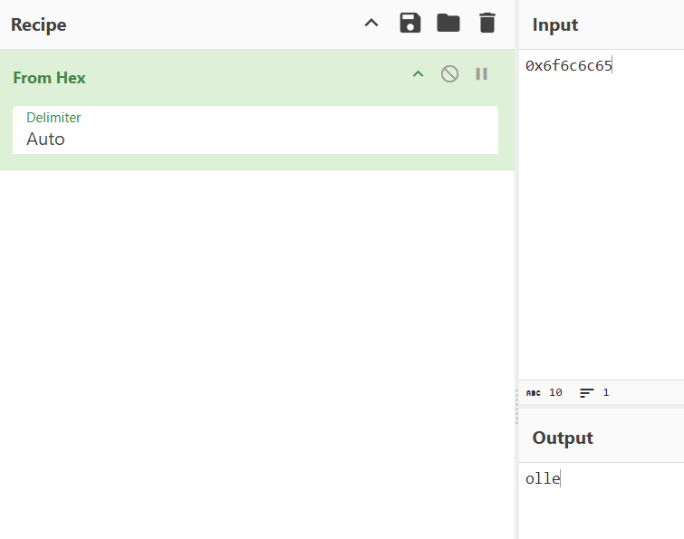

# Hello World

## Challenge

> Installation link: https://github.com/kablaa/CTF-Workshop/raw/refs/heads/master/Reversing/Challenges/HelloWorld/hello_world
> 

## Objdump

To learn something from a program, we can use `objdump`. Check [here](https://man7.org/linux/man-pages/man1/objdump.1.html) for more info.

In short, it displays information about an object, the `-D` flag will try to disassemble all available content, we can then use main to focus on the main function

`objdump -D hello_world|grep -A20 '<main>'`

```bash
└─$ objdump -D hello_world|grep -A20 '<main>'                                                                                                                                                                                             
080483fb <main>:
 80483fb:       8d 4c 24 04             lea    0x4(%esp),%ecx
 80483ff:       83 e4 f0                and    $0xfffffff0,%esp
 8048402:       ff 71 fc                push   -0x4(%ecx)
 8048405:       55                      push   %ebp
 8048406:       89 e5                   mov    %esp,%ebp
 8048408:       51                      push   %ecx
 8048409:       83 ec 04                sub    $0x4,%esp
 804840c:       83 ec 0c                sub    $0xc,%esp
 804840f:       68 b0 84 04 08          push   $0x80484b0
 8048414:       e8 b7 fe ff ff          call   80482d0 <puts@plt>
 8048419:       83 c4 10                add    $0x10,%esp
 804841c:       b8 00 00 00 00          mov    $0x0,%eax
 8048421:       8b 4d fc                mov    -0x4(%ebp),%ecx
 8048424:       c9                      leave
 8048425:       8d 61 fc                lea    -0x4(%ecx),%esp
 8048428:       c3                      ret
 8048429:       66 90                   xchg   %ax,%ax
 804842b:       66 90                   xchg   %ax,%ax
 804842d:       66 90                   xchg   %ax,%ax
 804842f:       90                      nop
```

## GDB

We can also use a tool called gdb to help us. Here I will use gdb-pwndbg which is a plugin of gdb([Installation guide](https://pwndbg.re/stable/setup/)). We can first load the program to gdb-pwndbg, then use `info func` to view all functions, and use `disass` to disassemble the function we are interested.

```bash
└─$ gdb-pwndbg hello_world 
Reading symbols from hello_world...
(No debugging symbols found in hello_world)
pwndbg: loaded 215 pwndbg commands. Type pwndbg [filter] for a list.
pwndbg: created 13 GDB functions (can be used with print/break). Type help function to see them.
------- tip of the day (disable with set show-tips off) -------
Use $base("heap") to get the start address of a [heap] memory page
pwndbg> info func
All defined functions:

Non-debugging symbols:
0x08048290  _init
0x080482d0  puts@plt
0x080482e0  __gmon_start__@plt
0x080482f0  __libc_start_main@plt
0x08048300  _start
0x08048330  __x86.get_pc_thunk.bx
0x08048340  deregister_tm_clones
0x08048370  register_tm_clones
0x080483b0  __do_global_dtors_aux
0x080483d0  frame_dummy
0x080483fb  main
0x08048430  __libc_csu_init
0x08048490  __libc_csu_fini
0x08048494  _fini
pwndbg> disass main
Dump of assembler code for function main:
   0x080483fb <+0>:     lea    ecx,[esp+0x4]
   0x080483ff <+4>:     and    esp,0xfffffff0
   0x08048402 <+7>:     push   DWORD PTR [ecx-0x4]
   0x08048405 <+10>:    push   ebp
   0x08048406 <+11>:    mov    ebp,esp
   0x08048408 <+13>:    push   ecx
   0x08048409 <+14>:    sub    esp,0x4
   0x0804840c <+17>:    sub    esp,0xc
   0x0804840f <+20>:    push   0x80484b0
   0x08048414 <+25>:    call   0x80482d0 <puts@plt>
   0x08048419 <+30>:    add    esp,0x10
   0x0804841c <+33>:    mov    eax,0x0
   0x08048421 <+38>:    mov    ecx,DWORD PTR [ebp-0x4]
   0x08048424 <+41>:    leave
   0x08048425 <+42>:    lea    esp,[ecx-0x4]
   0x08048428 <+45>:    ret
End of assembler dump.

```

We can see that there is puts function used, which prints character until a null(`\x00`) character is met

<aside>
💡

For the current time, I will skip PLT(Procedure Linkage Table) for a while, but I found one detailed article that worth-reading, I will attached here as a further reading. 

GOT and PLT for pwning. (https://systemoverlord.com/2017/03/19/got-and-plt-for-pwning.html)

</aside>

```bash
0x0804840f <+20>:    push   0x80484b0
   0x08048414 <+25>:    call   0x80482d0 <puts@plt>
```

But what is inside the address `0x80484b0`? We can use the gdb to read it

In order to use gdb, you must know how to access to instructions and memory contents. `x` is designed to do the job

```bash
pwndbg> help x
Examine memory: x/FMT ADDRESS.
ADDRESS is an expression for the memory address to examine.
FMT is a repeat count followed by a format letter and a size letter.
Format letters are o(octal), x(hex), d(decimal), u(unsigned decimal),
  t(binary), f(float), a(address), i(instruction), c(char), s(string)
  and z(hex, zero padded on the left).
Size letters are b(byte), h(halfword), w(word), g(giant, 8 bytes).
The specified number of objects of the specified size are printed
according to the format.  If a negative number is specified, memory is
examined backward from the address.

Defaults for format and size letters are those previously used.
Default count is 1.  Default address is following last thing printed
with this command or "print".
```

That means that we can try to read a string using `x/s` on the push instruction

```bash
pwndbg> x/s 0x80484b0
0x80484b0:      "hello world!"
```

We can also use `i` to help us read the instructions

```bash
pwndbg> x/i 0x80484b0
   0x80484b0:   push   0x6f6c6c65
```

We can then convert the hex to ascii character, which is reverse?



It is because of endianess. For x86 processors and programs, they use little endian, which means that the least significant byte(character) will be put at the very first. In this case it is `o` .

To display in a more readable format, consider swapping the endianness to big endian(which is what we used to read), then we can see `ello`


But where is the rest of the characters? It turns out that it misinterpreted the remaining character as code, so it doesn’t display. To display them all, we can print 20 bytes(`b`) in hexadecimal(`x` ) and take a look

```bash
pwndbg> x/20bx 0x80484b0
0x80484b0:      0x68    0x65    0x6c    0x6c    0x6f    0x20    0x77    0x6f
0x80484b8:      0x72    0x6c    0x64    0x21    0x00    Cannot access memory at address 0x80484bd
```

Notice because we print out byte by byte this time, we do not need to care about the endianness. And we get back the `hello world!` string


Finally, we can run the program, to see it is indeed print out the string `hello world!`

```bash
└─$ chmod +x hello_world 

└─$ ./hello_world 
hello world!
```
