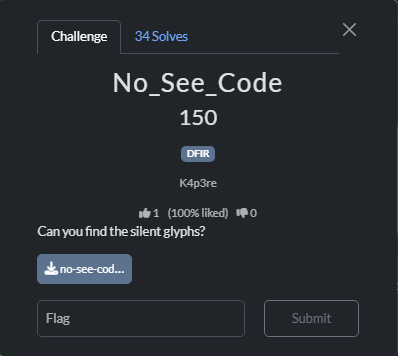

# No-See-Code



Using fcrackziphttps://sohvaxus.github.io/content/fcrackzip-bruteforce-tutorial.html, we can obtain the password

```bash
└─$ fcrackzip -u -D -p /usr/share/wordlists/rockyou.txt no-see-code.zip 

PASSWORD FOUND!!!!: pw == secret123
```

password: `secret123`

Unzipping that zip file, we get `n0t_fl4g.txt`, with the content:

```markdown
r00‌t‌{n‌a‍ah_‌n‌o‌t‌_‍the‌_‌f‌l‌a‍g‌‌‌‍‌‍‌‌‌‌‌‍‌‌‌‍‌‌‌‌‍‌‌‌‌‍‌‌‍‌‌‍‌‍‌‌‌‍‌‌‍‌‍‌‌‌‌‌‍‌‌‌‍‌‌‌‍‌‌‌‍‌‌‍‌‍‌‌‌‍‌‌‌‍‌‌‍‌‌‌‌‍‌‌‌‍‌}

```

I then suspect that the text file contains non-printing characters. To verify, we just need to use `ord()` to print them out

```python
with open('not_fl4g.txt', 'r') as file:
    content = file.read()
    print(' '.join(str(ord(x)) for x in content))
```

Here are the results. We can neglect the values smaller than 8203, as it is the ASCII values of the fake flag:

```markdown
114 8203 8203 48 8203 48 8204 116 8204 123 8203 110 8204 97 8205 97 8203 104 8203 95 8204 110 8204 111 8204 116 8204 95 8205 116 8203 104 8203 101 8204 95 8204 102 8204 108 8204 97 8205 103 8203 8203 8203 8204 8203 8204 8204 8205 8203 8203 8203 8203 8204 8203 8203 8205 8203 8204 8204 8203 8204 8204 8204 8205 8203 8203 8204 8204 8204 8203 8205 8203 8203 8204 8204 8203 8204 8204 8205 8203 8203 8204 8204 8203 8204 8204 8205 8203 8203 8204 8204 8203 8203 8205 8203 8203 8204 8203 8203 8203 8204 8205 8203 8204 8203 8203 8203 8203 8203 8205 8203 8203 8204 8204 8204 8203 8205 8203 8203 8204 8203 8203 8203 8204 8205 8203 8204 8203 8203 8203 8203 8203 8205 8203 8204 8203 8204 8204 8204 8204 8205 8203 8203 8204 8203 8203 8204 8204 8205 8203 8203 8204 8203 8204 8204 8205 8203 8203 8204 8204 8204 8203 8205 8203 8203 8204 8203 8203 8203 8204 8205 8203 8204 8203 8203 8203 8203 8203 8205 8203 8204 8203 8204 8204 8203 8203 8205 8203 8203 8204 8204 8204 8203 8205 8203 8203 8204 8204 8203 8203 8203 8205 8203 8203 8204 8203 8204 8204 8204 8205 8203 8203 8203 8204 8203 8204 8204 8205 8203 8203 8203 8203 8203 8204 8203 125 10

```

Cleaning them out, we get the following

```markdown
8203 8203 8203 8204 8204 8203 8204 8205 8203 8203 8204 8204 8204 8204 8205 8203 8203 8204 8204 8204 8204 8205 8203 8203 8203 8204 8203 8204 8204 8205 8203 8203 8203 8203 8204 8203 8203 8205 8203 8204 8204 8203 8204 8204 8204 8205 8203 8203 8204 8204 8204 8203 8205 8203 8203 8204 8204 8203 8204 8204 8205 8203 8203 8204 8204 8203 8204 8204 8205 8203 8203 8204 8204 8203 8203 8205 8203 8203 8204 8203 8203 8203 8204 8205 8203 8204 8203 8203 8203 8203 8203 8205 8203 8203 8204 8204 8204 8203 8205 8203 8203 8204 8203 8203 8203 8204 8205 8203 8204 8203 8203 8203 8203 8203 8205 8203 8204 8203 8204 8204 8204 8204 8205 8203 8203 8204 8203 8203 8204 8204 8205 8203 8203 8204 8203 8204 8204 8205 8203 8203 8204 8204 8204 8203 8205 8203 8203 8204 8203 8203 8203 8204 8205 8203 8204 8203 8203 8203 8203 8203 8205 8203 8204 8203 8204 8204 8203 8203 8205 8203 8203 8204 8204 8204 8203 8205 8203 8203 8204 8204 8203 8203 8203 8205 8203 8203 8204 8203 8204 8204 8204 8205 8203 8203 8203 8204 8203 8204 8204 8205 8203 8203 8203 8203 8203 8204 8203
```

In most CTF challenges, it is either replacing one of them with `0` and the other with `1`, but we have three different values here. What should we do?

I passed my findings to my friend, and he solved it with the aid of AI. 

> The string you provided contains a sequence of zero-width characters hidden between the visible letters. These invisible characters encode the real flag using a binary system.
> 
> 
> The hidden flag is: **`r00t{H1dd3n_1n_Pl41n_S1ght}`**
> 
> ## Decoding Analysis
> 
> The hidden data uses three specific zero-width Unicode characters. By analyzing the binary patterns, the encoding scheme is as follows:
> 
> - **Zero Width Space (`\u200b`)**: Represents binary **`1`**
> - **Zero Width Non-Joiner (`\u200c`)**: Represents binary **`0`**
> - **Zero Width Joiner (`\u200d`)**: Acts as a separator between characters
> 
> When extracted and converted, the hidden characters form standard ASCII values that spell out the flag. For example, the first hidden chunk is **`1110010`**, which corresponds to the ASCII character **`r`**.
>
Flag: `r00t{H1dd3n_1n_Pl41n_S1ght}`
