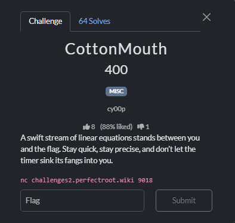

# CottonMouth



I solved this with AI, with manual debugging. In the beginning a banner will appear, we need to solve the equations very quickly, which is impossible to do it manually.


Script generated by AI

```python
#!/usr/bin/env python3

from pwn import remote
from sympy import symbols, solve, sympify
import re

r = remote("challenges2.perfectroot.wiki", xxxx)

# Skip banner
for _ in range(7):
    r.recvline()

x = symbols('x')
print("[+] Ready!\n")

while True:
    try:
        line = r.recvuntil(b">> ").decode(errors='ignore')
        print(line.strip())

        # Extract: expression, target, variable letter
        # Group1: LHS, Group2: RHS, Group3: Variable 
        m = re.search(r"\)\s*(.+?)=\s*([-]?\d+),\s*Solve for\s+([a-zA-Z])", line)
        if not m:
            continue

        raw_expr = m.group(1).strip()      # "18 * 79 * 63 * 4z - 10"
        target   = int(m.group(2))         # 12542030
        var      = m.group(3)              # 'z'

        # === CRITICAL FIX: insert '*' before the variable if missing ===
        # This turns "4z" → "4*z", "99z" → "99*z", etc.
        # We look for pattern: digit followed by the variable letter
        expr = re.sub(rf'(\d)({re.escape(var)})', r'\1*\2', raw_expr)
        # Also handle case like "-z" or "+z" → "-1*z" etc. (rare but safe)
        expr = re.sub(rf'([+-])({re.escape(var)})', r'\1 1*\2', expr)

        # Now replace the letter with x
        expr = expr.replace(var, 'x')

        # Parse safely
        left = sympify(expr)
        eq   = left - target

        solution = int(solve(eq, x)[0])
        answer = f"{solution}"

        print(f"[+] {var} = {solution} → sending {answer}\n")
        r.sendline(answer.encode())

    except EOFError:
        break
    except Exception as e:
        print("[-] Error:", e)
        break

# Get the flag
print("\n" + r.recvall(timeout=5).decode())
r.close()

```

Result(after 499 equations)

```bash
499) 44 - 93 * 27 - 4m - 52 = -2915, Solve for m
>>
[+] m = 99 → sending 99

>>>>
[+] Receiving all data: Done (1.56KB)                                                                                                                                                                                                       
[*] Closed connection to challenges2.perfectroot.wiki port xxxx                                                                                                                                                                            

CORRECT ✔✔✔✔✔✔✔✔✔✔✔✔✔✔✔✔✔✔✔✔✔✔✔✔✔✔✔✔✔✔✔✔✔✔✔✔✔✔✔✔✔✔✔✔✔✔✔✔✔✔✔✔✔✔✔✔✔✔✔✔✔✔✔✔✔✔✔✔✔✔✔✔✔✔✔✔✔✔✔✔✔✔✔✔✔✔✔✔✔✔✔✔✔✔✔✔✔✔✔✔✔✔✔✔✔✔✔✔✔✔✔✔✔✔✔✔✔✔✔✔✔✔✔✔✔✔✔✔✔✔✔✔✔✔✔✔✔✔✔✔✔✔✔✔✔✔✔✔✔✔✔✔✔✔✔✔✔✔✔✔✔✔✔✔✔✔✔✔✔✔✔✔✔✔✔✔✔✔✔✔✔✔✔✔✔✔✔✔✔✔✔✔✔✔✔✔✔✔✔✔✔✔✔✔✔✔✔✔✔✔✔✔✔✔✔✔✔✔✔✔✔✔✔✔✔✔✔✔✔✔✔✔✔✔✔✔✔✔✔✔✔✔✔✔✔✔✔✔✔✔✔✔✔✔✔✔✔✔✔✔✔✔✔✔✔✔✔✔✔✔✔✔✔✔✔✔✔✔✔✔✔✔✔✔✔✔✔✔✔✔✔✔✔✔✔✔✔✔✔✔✔✔✔✔✔✔✔✔✔✔✔✔✔✔✔✔✔✔✔✔✔✔✔✔✔✔✔✔✔✔✔✔✔✔✔✔✔✔✔✔✔✔✔✔✔✔✔✔✔✔✔✔✔✔✔✔✔✔✔✔✔✔✔✔✔✔✔✔✔✔✔✔✔✔✔✔✔✔✔✔✔✔✔✔✔✔✔✔✔✔✔✔✔✔✔✔✔✔✔✔✔✔✔✔✔✔✔✔✔✔✔✔✔✔✔✔✔✔✔✔✔✔✔✔✔✔✔✔✔✔✔✔✔✔✔✔✔✔✔✔✔✔✔✔✔✔✔✔✔✔✔✔✔✔✔✔✔✔✔✔✔✔✔✔✔✔✔✔✔✔✔✔✔✔✔✔✔✔✔✔✔✔✔✔✔✔✔✔✔✔✔✔✔✔✔✔✔✔✔

CONGRATS!! HERE'S YOUR REWARD: r00t{sl33k_c0770n_m0u7h_h47_b33n_unr4v3ll3d}

```

Flag: `r00t{sl33k_c0770n_m0u7h_h47_b33n_unr4v3ll3d}`
