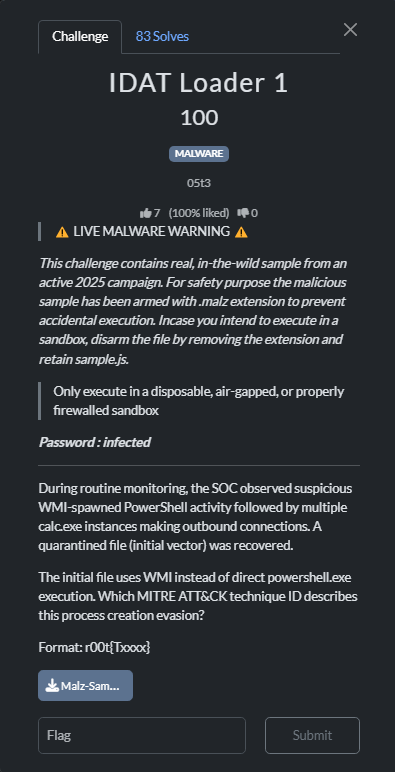

# IDAT series

## IDAT Loader 1



This challenge requires us to find the technique ID under the MITRE ATT&CK framework.

We can quickly locate a suitable answer T1047, let’s dive into the details


https://attack.mitre.org/techniques/T1047/

> Adversaries may abuse Windows Management Instrumentation (WMI) to execute malicious commands and payloads. WMI is designed for programmers and is the infrastructure for management data and operations on Windows systems.[1] WMI is an administration feature that provides a uniform environment to access Windows system components.
> 

Seems it is. We get the flag

Flag: `r00t{T1047}`

## IDAT Loader2


This challenge can be solved by uploading the malware to Virustotal. We can find the onion url under the ‘memory Pattern Domains’ session

https://www.virustotal.com/gui/file/235e0b80a093e6ae1eaea0a49846537a10222f358f025587bafb98bcbacaa694/behavior


Flag: `r00t{archivep75mbjunhxc6x4j5mwjmomyxb573v42baldlqu56ruil2oiad.onion}`

## IDAT Loader 3


Using strings, we can locate a large chunk of the base64 payload in the png file, which is definitely abnormal. Here is a part of it

```bash
Dg4SgLEFCAASgqEGIAEBEYVNBQgAEoCxAwgADkEBADNTeXN0ZW0uUmVzb3VyY2VzLlRvb2xzLlN0cm9uZ2x5VHlwZWRSZXNvdXJjZUJ1aWxkZXIIMTcuMC4wLjAAAAQGEYYQBAYRhhQEBwIJCAQAAQkOBAYShVkEBhKApQUgAB0SNQkgAgEShVkSgKUoBxEdEjUShV0ShWEShWUdBRKDnRKAoR0ShWkICBI1EoVtHQUdBQgICAYgAB0ShWkFIAAShWEFAAAShWUIIAEShV0ShiAYBwoSg50ShW0dEoZ0CBKGdAgShnQdBQgIBCABAQUMAAMdBRKFYR0ShnQCDAADARKFYRKFbRKGdAYHAhGGRAkEIAAROQUgAQgROQ0gBQEOEjUdEjUShVkCEiAHAQ4RhXERhXUSNR0SNRI1Ag0gBBKFXQ4SNR0SNRI1BSgAHRI1BAYRhhwFBh0ShmwFBh0ShnQCBgoCBhwEBhKGOAQGEoYwBAYShXkFBwIdAwgEIAAdAwUAABKDBQYgARKGIAgRBwcShjgShoQSgwUcEoaEDggEIAEcHAYgARKGOAgSBwcdBRKFgR0FCB0FEoOdEoWFBSACDggDBQAAEoWJBiABHQUdBQgAAwESVRJVCAkgAhKFkR0FHQUMIAMBEoMFEoWREYWVDCADEoMFEoaEEoMFDgoHBBKAjRKDBQ4IBQAAEoY4BQgAEoMFBSAAEoVZDCAEAQ4SNR0SNRKFWQUgABKFmQcgARKBIRI1CAABEoMFEoMFOQcUEjUShZ0SgKESgKESgKESgKESgKESgKESgKERhaERhaERhaERhaERhaEdEoChCBKAoR0ShWkICAUAARI1DhMgBRKAoQ4RgKkSgK0dEjUdEYWlCSABHRKAoRGAqRIgBBKFnRGAqRKArR0SNR0RhaUHIAEShakSNQUgABGFoQQGEYWxCSACARGFsRKAoQkgAgERhbERhaEGIAEBEYWhBiABARGFsQcgAgERhbEOCSACARGFsRKFnQYAAQEShZkIIAESgwUSgwUMIAMSgRkSgwUSgR0cCCABEoMFEoEZCiADEoEZCBKBHRwGIAEOEoEZAgYFBAYRhjQBAwEEAQUBBwEIAQkBCgELAQwBDQEOAQ8BEAQGEoChBAYShbUDBh0OBQYdEoZwBQYdEoaEBAYShiAGIAAdEoVZBSACAQICByACAQ4SgwUSBwsKCBKGIAgIHRKGdAgICAgIByACCgoRg+UHBwMIEoaECAYgARKGhA4GIAEShoQIBQcBEoZ8BSAAEoZ8AyAABQYgAQEShnwJBwQIHRKGbAgIBiAAHRKGbAYgARKGdAIHBwQIHQgKCAUgAR0ICAUgABKGbAcHBQoKCgoIBQcDCAgIGwcKCBUSgMkBEoZsEoZoCBGGQBKGbAgShmwICAgVEoDJARKGbB4HDBKGZBKGWBKGaBKGaBKGVBKGaAgShmgIEoZoCAgGIAEBEoZsDwcHEoZkEoZUEoZYCAgICAYgAQIShmwKBwYICBKGhAgICAUgAR0FCCQHEhKGbBKGbAgCCBKGbBKGVAUShmwShmwShlgIAggShmwICAgIFRKCNQEShmwQIAIShmwRhkAVEoI1ARKGbAMHAQUHBwUOCAgICAYAAQgShiAGIAEShnAIBQcBEoZsBiABEoZsCBYHDwgICBGGNA4IEjUEHQgdCAgICAgIAyAADAQgAQEMBCABAQ0DIAAEDCADARKGIBKFbRKFYQcHAhGGSBI1CSACARKFbRKFYR8HDh0SNRGAqRI1EoWdCBKGbBI1EoChEjUIHRI1CAgIBSAAEYXBBiABCBGFwQggAggRhcERORYgBhKAoQ4RgKkSgK0RhXUdEjUdEYWlCCABEoChHRI1DCADARKGfBKFbRKFYREHBxKGbBI1EoVlHRI1CBI1CAoAAhKFZRGFxRI1BSABCB0FEgcKCBKGgBJ5EYCpEjUICAgICAggAhJ5DhGAqQUgABGD9QYgAQgRg/UKAAMIEoVhEnkSNQggAggRg/UROQcAAgEIEoVtCCACARI1HRI1CQcEHRJ5CBJ5CA4gBBJ5EYCpHRJ5HBKAsQ8HBR0SgKUIEoClHRKFaQgaIAcSgKURgKkdEoClEB0cHRGFpRKAsR0OEBwJIAMcHBI1EoCxByACARAdHBwNBwUSgKUIEoClEoChCBMgBBKApRGAqR0SgKUdEjUdEYWlCwcEHRKDtQgSg7UIFSAFEoO1EYCpHRKDtRI1HRI1HRGFpQYgAQISgKUJIAICHRKFaR0cCgACAh0ShWkdEjUEBhGGQAQGEYZEBAYRhkgFIAARhkAHIAIBEoZsCAcHAxKBVQgIBSgAEYZABAYShmwFIAAShnAGIAEBEoZwBSgAEoZsBSgAEoZwBAYShnAKBwQSgVUIEoZsCAcgAQ4dEoZsBAYRhngEKAAdBQMoAAUEBhGFzQUAABKF0QYgAQEShdUFIAARhc0PBwYSNRKGWBKGVBKGUAgIBSABETkIByABEjUdEjUFIAESNQgKAAISNRKGbBKGIAcAARI1EoZsBwcDHRI1CAgMAAIdEjUdEoZsEoYgBwcDHRE5CAgIAAEdETkdEjUFBwESgI0JAAISgI0cEoXZBAYShd0YBwkOEoXhHRI1EoChEoXlHRKFWRGB7QgIByAEAQgICAgGIAEShd0OCiACEjUShiAShhgfBw0OEoXtEjUSNRKF8RKF8RKFnRKFmRKAoRGB7QgICAsgAxKF7Q4RhfUSNQggAgERhbESeQ4gBBKF+Q4RhXESNR0SNQsgAxKF8Q4SNRGF/Q4gAxKGARGFcRGFdR0SNQggAhwShV0SNQYHAhKF7QgGIAEBEYYFCiADEjUOEjUdEjUMBwUSgVUdEjUIEjUICAACDhI1HRI1BAYShpQFBwESgwVDBxoRhXEdBR0OEoX5EjUSgKESgKESgKESgKEShZ0ShZ0SgKESgKESgKESgKESgKERhaERhaERhaERhaERhaEICAgICAYgAQEdEjUHIAIBEYWxCAggAgERhbESNQogAxKGCQgRhg0OCSACEoX5DhGFcQggARKF+RKF7Q8HBRKF4R0SNRKAoRKF7QgJIAIShe0OEYX1BiABDhKDBQQAAQgIBAABCggEAAEMCAQAAQ0IBwcCEoMFElUGAAESVR0FCSACEoEZEoEdHAQGEoagBAYShqQDBh0KAwYdDAMGHQ0JBwUShbUICAgIDQcHEoW1CA4FElUdBQgHIAMIHQUICAUgAR0DCAYAAhI1DgIHAAISVRI1CAcAARJVEoMFBQcDCBwIAyAACwUgABGBlQUgAgEcCAoABAEFElUIEoW1HwcXEoVZDwUOAgcHDwkPCQkJCQkJCAkJDwkJCQkICAgGAAEYEoVZBQABDwEYBAYShV0IIAIBEoVdEjUIIAISgSESNRwGIAESgSEcDAcFEoYYEoVdEjUcCA4AAxKGuBKGjBKGIBKApQUAAhgYDgUHARKBIQgQAQISgSEODgQGEoKZBiABARKGEQwHBBKCmRKGzBKG2AgFAAEKEAoEAAEBCAYgAgIYEAIMIAQSgRkYEAISgR0cCCACAhACEoEZBAYShtAEBhKG1AQGEoE9BQoBEobQBQoBEobUBQAAEoE9BAYShtwFCgEShtwOBwYIEYbgEoE9DhGByQgHIAIIDhGByQwgBQgYCBARhuAIEAgSIAcSgRkYCBARhuAIEAgSgR0cDCADCBARhuAQCBKBGQQGEoEhByACARKBIQIFIAEcHRwGIAMBDhwCCgYVEoG9AggShvQJBhUSgMkBEob0CRUSgb0CCBKG9AgHAhKG9BKGuAoVEoG9AhI1Eoa4CSACEoa4CBKApQcHAxKG9AgICiADAQgSgKUShrgcBwcICBURglkBEob0Eob0FRGFLQIIEob0Eob0CAgVEoDJARKG9AgVEYJZARKG9AQAAQgNCRUShSkCCBKG9AkVEYUtAggShvQEBhKGuAsGFRKBvQISNRKGuAQGEoYVBAYShvAEBhKGJAQGEoaMBAYShvgMBwQShrgSgQkcEoHVCgAEHAgSgKUcHRwEAAEcDgsHAxKGuBGGGRKGuAYgARGGGQgHIAEBEBGGGQogAxKGuAgSgKUcDgcEEoYgEoa4Eoa4EoEJBQYdEYcMBAYShxQNBwsICAgICAgICAgICAcAAggdCB0IBwcFCAgICAgIBwMdEYcMCAgIAAEdEYcMHQgQBwwIHQgdCAgICAgICAgICAcAAQEdEYcMDQACEocUHRGHDB0RhwwNBwYdEYcECAgRhwQICAkAARKHEB0RhwwUBwgdEYcEHRGHBBKHEAgICBGHBAgMAAQShxAdEYcECAgICAADAQgQCBAIBAcCCAgKAAQBCBAIEAgQCAcAAh0IHQgIBgABHQgdCAwHCBKHCAgICAgICAgIAAMdCB0ICAgSBwsdCB0ICB0IHQgdCAgICAgIChACAgEdHgAdHgEZBxEIHR0IHQgdCAgICB0ICAgdCAgICAgICAgHBR0ICAgICAgAAh0IHQgdCAQGEYcMBgcDHQgICAQoAQgIBAYShxAJBwQdBRKHHAgIByADAR0FCAgJAAIBEoMFEoMFBAYShyQEBhKHIA4HBh0RhwwdEYcMCAgICAoHCAgICAgICAgIBQACCAgICAcFCB0FCAgICSADAR0FEAgQCAUHAh0FCAQHAR0FCQACCBKHIBKHEAcAAggShyAIFAcNCAgIHQgdCBKHEB0ICAgICAgIECADARKHIBAdEYcMEB0RhwwNBwodCAgICAgICAgICAsAAx0IEocgEocQCAQGEoMFBwcEHQUICAgGIAIdBQgIBAYShh0GBwIRgYUIBQYdEoYhCiAFCB0FCAgdBQgIIAMdBR0FCAgjBxIShbUIHQUIHQUFEoWBEoOdCBKFtQUIHQUShYUSg50ICAgFIAASheEFIAAShZEGAAEShYEFBQAAEoYlBQAAEoYpBQAAEoYtBQAAEoYxBQAAEoY1HgEAAQBUAhZXcmFwTm9uRXhjZXB0aW9uVGhyb3dzAQYgAQERhkUIAQAHAQAAAAA3AQAaLk5FVEZyYW1ld29yayxWZXJzaW9uPXY0LjUBAFQOFEZyYW1ld29ya0Rpc3BsYXlOYW1lABUBABBHaXRIdWIgQ29tbXVuaXR5AAAbAQAWQ29weXJpZ2h0IMKpIDIwMDItMjAyNQAARwEAQlByb3ZpZGVzIGEgc2luZ2xlIGFzc2VtYmx5IHdyYXBwZXIgZm9yIHRoZSBXaW5kb3dzIFRhc2sgU2NoZWR1bGVyLgAADQEACDIuMTIuMi4wAAAiAQAdTWljcm9zb2Z0LldpbjMyLlRhc2tTY2hlZHVsZXIAADoBAA1SZXBvc2l0b3J5VXJsJ2h0dHBzOi8vZ2l0aHViLmNvbS9kYWhhbGwvdGFza3NjaGVkdWxlcgAACgEABWVuLVVTAAAIAQALAAAAAAAAAAAAAAAAyhVBBgABTVACAAAAjwAAAMxhBgDMQwYAAAAAAAAAAAABAAAAEwAAACcAAABbYgYAW0QGAFJTRFMDcGosco2FOYPTtgmu1/5mAQAAAEY6XEhhY2tpbmdcVGFza1NjaGVkdWxlci0yLjEyLjJcVGFza1NjaGVkdWxlci0yLjEyLjJcVGFza1NlcnZpY2VcYmluXERlYnVnXG5ldDQ1XG9iZl9NaWNyb3NvZnQuV2luMzIuVGFza1NjaGVkdWxlci5wZGIAU0hBMjU2AANwaixyjYU5g9O2Ca7X/mbKFUEGahXyoEwm/w079cV5AACsYgYAAAAAAAAAAADOYgYAACAAAAAAAAAAAAAAAAAAAAAAAAAAAAAAwGIGAAAAAAAAAAAAAAAAAAAAAAAAAF9Db3JEbGxNYWluAG1zY29yZWUuZGxsAAAAAAD/JQAgABAAAAAAAAAAAAAAAAAAAAAAAAAAAAAAAAAAAAAAAAAAAAAAAAAAAAAAAAAAAAAAAAAAAAAAAAAAAAAAAAAAAAAAAAAAAAAAAAAAAAAAAAAAAAAAAAAAAAAAAAAAAAAAAAAAAAAAAAAAAAAAAAAAAAAAAAAAAAAAAAAAAAAAAAAAAOqaMrgAAAAAAAAAAAAAAAAAAAAAAAAAAAAAAAAAAAAAAAAAAAAAAAAAAAAAAAAAAAAAAAAAAAAAAAAAAAAAAAAAAAAAAAAAAAAAAAAAAAAAAAAAAAAAAAAAAAAAAAAAAAAAAAAAAAAAAAAAAAAAAAAAAAAAAAAAAAAAAAAAAAAAAAAAAAAAAAAAAAAAAAAAAAAAAAAAAAAAAAAAAAAAAAAAAAAAAAAAAAAAAQAQAAAAGAAAgAAAAAAAAAAAAAAAAAAAAQABAAAAMAAAgAAAAAAAAAAAAAAAAAAAAQAAAAAASAAAAFiABgBGBAAAAAAAAAAAAABGBDQAAABWAFMAXwBWAEUAUgBTAEkATwBOAF8ASQBOAEYATwAAAAAAvQTv/gAAAQAMAAIAAAACAAwAAgAAAAIAPwAAAAAAAAAEAAAAAgAAAAAAAAAAAAAAAAAAAEQAAAABAFYAYQByAEYAaQBsAGUASQBuAGYAbwAAAAAAJAAEAAAAVAByAGEAbgBzAGwAYQB0AGkAbwBuAAAAAAAAALAEpgMAAAEAUwB0AHIAaQBuAGcARgBpAGwAZQBJAG4AZgBvAAAAggMAAAEAMAAwADAAMAAwADQAYgAwAAAAngBDAAEAQwBvAG0AbQBlAG4AdABzAAAAUAByAG8AdgBpAGQAZQBzACAAYQAgAHMAaQBuAGcAbABlACAAYQBzAHMAZQBtAGIAbAB5ACAAdwByAGEAcABwAGUAcgAgAGYAbwByACAAdABoAGUAIABXAGkAbgBkAG8AdwBzACAAVABhAHMAawAgAFMAYwBoAGUAZAB1AGwAZQByAC4AAAAAAEIAEQABAEMAbwBtAHAAYQBuAHkATgBhAG0AZQAAAAAARwBpAHQASAB1AGIAIABDAG8AbQBtAHUAbgBpAHQAeQAAAAAAZAAeAAEARgBpAGwAZQBEAGUAcwBjAHIAaQBwAHQAaQBvAG4AAAAAAE0AaQBjAHIAbwBzAG8AZgB0AC4AVwBpAG4AMwAyAC4AVABhAHMAawBTAGMAaABlAGQAdQBsAGUAcgAAADIACQABAEYAaQBsAGUAVgBlAHIAcwBpAG8AbgAAAAAAMgAuADEAMgAuADIALgAwAAAAAABkACIAAQBJAG4AdABlAHIAbgBhAGwATgBhAG0AZQAAAE0AaQBjAHIAbwBzAG8AZgB0AC4AVwBpAG4AMwAyAC4AVABhAHMAawBTAGMAaABlAGQAdQBsAGUAcgAuAGQAbABsAAAAUAAWAAEATABlAGcAYQBsAEMAbwBwAHkAcgBpAGcAaAB0AAAAQwBvAHAAeQByAGkAZwBoAHQAIACpACAAMgAwADAAMgAtADIAMAAyADUAAABsACIAAQBPAHIAaQBnAGkAbgBhAGwARgBpAGwAZQBuAGEAbQBlAAAATQBpAGMAcgBvAHMAbwBmAHQALgBXAGkAbgAzADIALgBUAGEAcwBrAFMAYwBoAGUAZAB1AGwAZQByAC4AZABsAGwAAABcAB4AAQBQAHIAbwBkAHUAYwB0AE4AYQBtAGUAAAAAAE0AaQBjAHIAbwBzAG8AZgB0AC4AVwBpAG4AMwAyAC4AVABhAHMAawBTAGMAaABlAGQAdQBsAGUAcgAAADYACQABAFAAcgBvAGQAdQBjAHQAVgBlAHIAcwBpAG8AbgAAADIALgAxADIALgAyAC4AMAAAAAAAOgAJAAEAQQBzAHMAZQBtAGIAbAB5ACAAVgBlAHIAcwBpAG8AbgAAADIALgAxADIALgAyAC4AMAAAAAAAAAAAAAAAAAAAAAAAAAAAAAAAAAAAAAAAAAAAAAAAAAAAAAAAAAAAAAAAAAAAAAAAAAAAAAAAAAAAAAAAAAAAAAAAAAAAAAAAAAAAAAAAAAAAAAAAAAAAAAAAAAAAAAAAAAAAAAAAAAAAAAAAAAAAAAAAAAAAAAAAAAAAAAAAAAAAAAAAAAAAAAAAAAAAAAAAAAAAAAAAAAAAAAAAAAAAAAAAAAAAAAAAAAAAAAAAAAAAAAAAAAAAAAAAAAAAAAAAAAAAAAAAAAAAAAAAAAAAAAAAAAAAAAAAAAAAAAAAAAAAAAAAAAAAAAAAAAAAAAAAAAAAAAAAAAAAAAAAAAAAAAAAAAAAAAAAAAAAAAAAAAAAAAAAAAAAAAAAAAAAAAAAAAAAAAAAAAAAAAAAAAAAAAAAAAAAAAAAAAAAAAAAAAAAAAAAAAAAAAAAAAAAAAAAAAAAAAAAAAAAAAAAAAAAAABgBgAMAAAA4DIAAAAAAAAAAAAAAAAAAAAAAAAAAAAAAAAAAAAAAAAAAAAAAAAAAAAAAAAAAAAAAAAAAAAAAAAAAAAAAAAAAAAAAAAAAAAAAAAAAAAAAAAAAAAAAAAAAAAAAAAAAAAAAAAAAAAAAAAAAAAAAAAAAAAAAAAAAAAAAAAAAAAAAAAAAAAAAAAAAAAAAAAAAAAAAAAAAAAAAAAAAAAAAAAAAAAAAAAAAAAAAAAAAAAAAAAAAAAAAAAAAAAAAAAAAAAAAAAAAAAAAAAAAAAAAAAAAAAAAAAAAAAAAAAAAAAAAAAAAAAAAAAAAAAAAAAAAAAAAAAAAAAAAAAAAAAAAAAAAAAAAAAAAAAAAAAAAAAAAAAAAAAAAAAAAAAAAAAAAAAAAAAAAAAAAAAAAAAAAAAAAAAAAAAAAAAAAAAAAAAAAAAAAAAAAAAAAAAAAAAAAAAAAAAAAAAAAAAAAAAAAAAAAAAAAAAAAAAAAAAAAAAAAAAAAAAAAAAAAAAAAAAAAAAAAAAAAAAAAAAAAAAAAAAAAAAAAAAAAAAAAAAAAAAAAAAAAAAAAAAAAAAAAAAAAAAAAAAAAAAAAAAAAAAAAAAAAAAAAAAAAAAAAAAAAAAAAAAAAAAAAAAAAAAAAAAAAAAAAAAAAAAAAAAAAAAAAAAAAAAAAAAAAAAA-BaseEnd

```

We can check the character count, which is huge

```bash
└─$ strings MSI_PRO_with_b64.png|tail -n1|wc -c
550931
```

To only extract the base64 payload, decode them, and place them inside extracted.dll, we can use the following command to also remove the `BaseStart-` and `-BaseEnd` tag

```bash
strings MSI_PRO_with_b64.png|tail -n1|sed 's/BaseStart-//'|sed 's/-BaseEnd//'|base64 -d > extracted.dll
```

After that, use exiftool to extract the timestamp

```bash
└─$ exiftool extracted.dll 
ExifTool Version Number         : 13.25
File Name                       : extracted.dll
Directory                       : .
File Size                       : 413 kB
File Modification Date/Time     : 2025:12:08 10:33:47-05:00
File Access Date/Time           : 2025:12:08 10:33:47-05:00
File Inode Change Date/Time     : 2025:12:08 10:33:47-05:00
File Permissions                : -rw-rw-r--
File Type                       : Win32 DLL
File Type Extension             : dll
MIME Type                       : application/octet-stream
Machine Type                    : Intel 386 or later, and compatibles
Time Stamp                      : 2025:11:24 12:56:13-05:00
Image File Characteristics      : Executable, Large address aware, DLL
PE Type                         : PE32
Linker Version                  : 48.0
Code Size                       : 410624
Initialized Data Size           : 2048
Uninitialized Data Size         : 0
Entry Point                     : 0x662de
OS Version                      : 4.0
Image Version                   : 0.0
Subsystem Version               : 6.0
Subsystem                       : Windows command line
File Version Number             : 2.12.2.0
Product Version Number          : 2.12.2.0
File Flags Mask                 : 0x003f
File Flags                      : (none)
File OS                         : Win32
Object File Type                : Dynamic link library
File Subtype                    : 0
Language Code                   : Neutral
Character Set                   : Unicode
Comments                        : Provides a single assembly wrapper for the Windows Task Scheduler.
Company Name                    : GitHub Community
File Description                : Microsoft.Win32.TaskScheduler
File Version                    : 2.12.2.0
Internal Name                   : Microsoft.Win32.TaskScheduler.dll
Legal Copyright                 : Copyright © 2002-2025
Original File Name              : Microsoft.Win32.TaskScheduler.dll
Product Name                    : Microsoft.Win32.TaskScheduler
Product Version                 : 2.12.2.0
Assembly Version                : 2.12.2.0
PDB Modify Date                 : 1973:04:29 06:51:54-04:00
PDB Age                         : 1
PDB File Name                   : F:\Hacking\TaskScheduler-2.12.2\TaskScheduler-2.12.2\TaskService\bin\Debug\net45\obf_Microsoft.Win32.TaskScheduler.pdb

```

Flag: `r00t{2025-11-24 17:56:13}`

## IDAT Loader 4


Similar as IDAT Loader 1, we can find it with careful searching


https://attack.mitre.org/techniques/T1620/

Flag: `r00t{T1620}`
