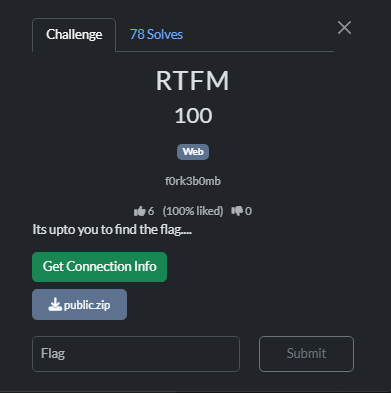

# RTFM



Inside the app.py, I Found two endpoints that are very critical, the first one is `/addAdmin`, we just need to add the username as an argument when accessing, then we can add that user to be an admin:

```java
@app.route('/addAdmin', methods=['GET'])
def addAdmin():
    username = request.args.get('username')
    
    if not username:
        return response('Invalid username'), 400
    
    result = makeUserAdmin(username)

    if result:
        return response('User updated!')
    return response('Invalid username'), 400
@app.route('/admin/dashboard', methods=['GET'])

```

The second one is the `/admin/dashboard` , it is where the FLAG is located

```java
@app.route('/admin/dashboard', methods=['GET'])
def admin_dashboard():
    username = session.get('username')
    
    if not username:
        return jsonify({'success': False, 'error': 'Not logged in'}), 401
    
    user = get_user(username)
    
    if not user:
        return jsonify({'success': False, 'error': 'User not found'}), 404
    
    if not user['is_admin']:
        return jsonify({'success': False, 'error': 'Access denied: Admin only'}), 403
    
    return jsonify({
        'success': True,
        'title': 'Admin Dashboard',
        'FLAG': 'flag\{example_flag_for_testing\}',
        'message': 'Admin panel accessed successfully'
    })
```

In the init_db() function, a guest account has already created for us

```java
def init_db():
    
    conn = sqlite3.connect(DB_PATH)
    c = conn.cursor()
    
    
    c.execute('''CREATE TABLE IF NOT EXISTS users
                 (id INTEGER PRIMARY KEY AUTOINCREMENT,
                  username TEXT UNIQUE NOT NULL,
                  password_hash TEXT NOT NULL,
                  is_admin INTEGER DEFAULT 0)''')
    
    
    try:
        c.execute("INSERT INTO users (username, password_hash, is_admin) VALUES (?, ?, ?)",
                  ('guest', hashlib.sha256('guest123'.encode()).hexdigest(), 0))
    except sqlite3.IntegrityError:
        pass
    
    conn.commit()
    conn.close() 
```

So to solve this challenge:

1. Go to the endpoint `/addAdmin` with `?username=guest`


1. Go to `/admin/dashboard`
    
    
    

Flag: `r00t{749b487afaf662a9a398a325d3129849}`
