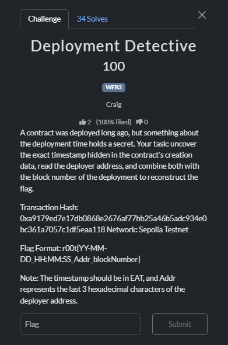

# Deployment Detective

We can quickly locate this with the given Network

https://sepolia.etherscan.io/tx/0xa9179ed7e17db0868e2676af77bb25a46b5adc934e0bc361a7057c1df5eaa118

To check the time, we can click 1(https://sepolia.etherscan.io/address/0xa3336e06889c1fb333de35c3f493f3664594b28c#code). Notice that we are finding the time of the contract creation, not the timestamp of the transaction

We then know the timestamp is `1763100345`

However, we need to convert it to EAT:

1. Most tools convert the UNIX timestamp to UTC first(https://www.epochconverter.com/)
    
    
    

2 Then we add 3 to the hour as EAT is UTC+3, which is `25-11-14_09:05:45`

Combining 2 and 3, we get the flag

Flag: `r00t{25-11-14_09:05:45_2aC_9398687}`
