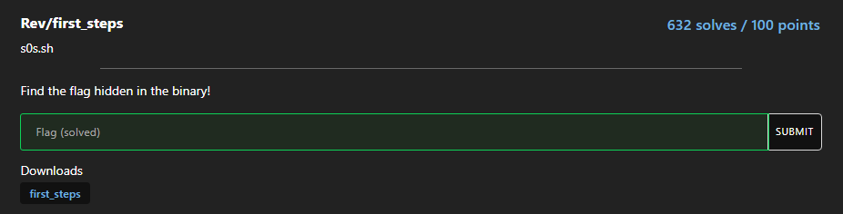

# first_steps



If we run the binary directly, we will see that it want us to look at the `.rodata`  section

```bash
└─$ ./first_steps 
I was up late last night exploring the .rodata section, but I seem to have lost my flag!

I'm sure it's around here somewhere... Can you find it for me? <3
```

## Strings

We can find the flag by simply using strings

```bash
└─$ strings first_steps|grep RUSEC
RUSEC{well_th4t_was_eZ_WllwnZMjMCjqCsyXNnrtpDomWMU}
```

## Objdump

We can also shift our entire focus to `.rodata`. It is used to store data that is static and will not change during runtime.

I did some research on how to read them, and I found this [page](https://github.com/hiboma/hiboma/blob/master/c-rodata-data.md), which helped me solve the challenge using `objdump`.

```bash
└─$ objdump -s -j .rodata first_steps 

first_steps:     file format elf64-x86-64

Contents of section .rodata:
 2000 01000200 00000000 4368616c 6c656e67  ........Challeng
 2010 65204175 74686f72 65642062 79204073  e Authored by @s
 2020 30732e73 68202d20 68747470 733a2f2f  0s.sh - https://
 2030 7330732e 73682f00 52555345 437b7765  s0s.sh/.RUSEC{we
 2040 6c6c5f74 6834745f 7761735f 655a5f57  ll_th4t_was_eZ_W
 2050 6c6c776e 5a4d6a4d 436a7143 7379584e  llwnZMjMCjqCsyXN
 2060 6e727470 446f6d57 4d557d00 00000000  nrtpDomWMU}.....
 2070 49207761 73207570 206c6174 65206c61  I was up late la
 2080 7374206e 69676874 20657870 6c6f7269  st night explori
 2090 6e672074 6865202e 726f6461 74612073  ng the .rodata s
 20a0 65637469 6f6e2c20 62757420 49207365  ection, but I se
 20b0 656d2074 6f206861 7665206c 6f737420  em to have lost 
 20c0 6d792066 6c616721 0a000000 00000000  my flag!........
 20d0 49276d20 73757265 20697427 73206172  I'm sure it's ar
 20e0 6f756e64 20686572 6520736f 6d657768  ound here somewh
 20f0 6572652e 2e2e2043 616e2079 6f752066  ere... Can you f
 2100 696e6420 69742066 6f72206d 653f203c  ind it for me? <
 2110 3300                                 3.             
```

The `-j <Name>` specifies the section(`.rodata` in this case) we want to see, while `-s` displays the full content of the section

## Ltrace

I tried using `ltrace` during the CTF, yet I stopped because I couldn’t view the full flag

```bash
└─$ ltrace ./first_steps 
puts("I was up late last night explori"...I was up late last night exploring the .rodata section, but I seem to have lost my flag!

)                                                                                                      = 90
puts("I'm sure it's around here somewh"...I'm sure it's around here somewhere... Can you find it for me? <3
)                                                                                                      = 66
strlen("RUSEC{well_th4t_was_eZ_WllwnZMjM"...)                                                                                                    = 51
malloc(52)                                                                                                                                       = 0x56387afb9720
strlen("RUSEC{well_th4t_was_eZ_WllwnZMjM"...)                                                                                                    = 51
strncpy(0x56387afb9720, "RUSEC{well_th4t_was_eZ_WllwnZMjM"..., 51)                                                                               = 0x56387afb9720
free(0x56387afb9720)                                                                                                                             = <void>
+++ exited (status 0) +++
```

After the CTF, I realized to view the full flag, we need to add the `-s <size>` so that we can print the full flag, here I use `1000` as the size

```bash
└─$ ltrace -s 1000 ./first_steps                                                                                                                                                                                                           
puts("I was up late last night exploring the .rodata section, but I seem to have lost my flag!\n"I was up late last night exploring the .rodata section, but I seem to have lost my flag!

)                                               = 90
puts("I'm sure it's around here somewhere... Can you find it for me? <3"I'm sure it's around here somewhere... Can you find it for me? <3
)                                                                        = 66
strlen("RUSEC{well_th4t_was_eZ_WllwnZMjMCjqCsyXNnrtpDomWMU}")                                                                                    = 51
malloc(52)                                                                                                                                       = 0x5643d6578720
strlen("RUSEC{well_th4t_was_eZ_WllwnZMjMCjqCsyXNnrtpDomWMU}")                                                                                    = 51
strncpy(0x5643d6578720, "RUSEC{well_th4t_was_eZ_WllwnZMjMCjqCsyXNnrtpDomWMU}", 51)                                                               = 0x5643d6578720
free(0x5643d6578720)                                                                                                                             = <void>
+++ exited (status 0) +++
```

Flag: `RUSEC{well_th4t_was_eZ_WllwnZMjMCjqCsyXNnrtpDomWMU}`
