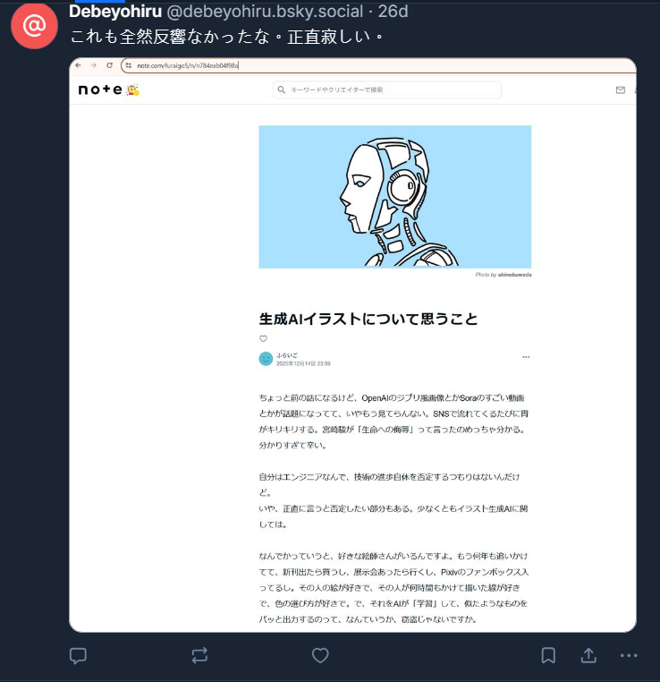

# debeyohiru_01_social

- Description
    
    The person under investigation is a software engineer, and from 2026 onward has been active under the ID `debeyohiru` .
    
    They appear to have started using this ID in January 2026. Can you identify the ID they used before that?
    
    As of January 2026, an account with their old ID still exists on the service [note](https://note.com/).
    
    Please answer that account ID.
    
    For example, if the account was `digital_jpn_gc`, the flag would be `SWIMMER{digital_jpn_gc}`.
    

Searching the name directly on Google will show us his account on [Bluesky](

https://bsky.app/profile/debeyohiru.bsky.social)

Inside one of the posts, we can see that there is a post on note.com

Copy the [link](https://note.com/furaigo5/n/n784eab04f98a) carefully and we can find the original post. We can see the name is `furaigo5`

<aside>
⚠️

You can actually derive the name from the image in Bluesky directly, as it is actually shown in the URL, which I did not see during the CTF

</aside>

Flag: `SWIMMER{furaigo5}`
