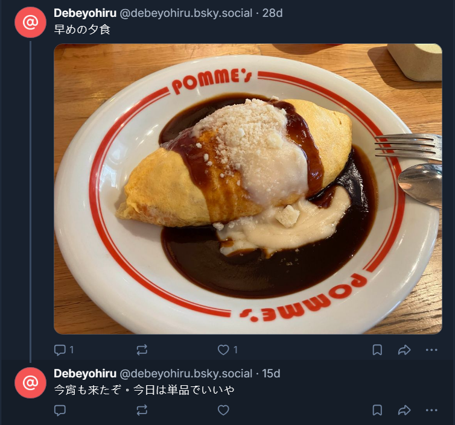

# debeyohiru_04_meal

- Description
    
    `debeyohiru` has a favorite dish and seems to eat it frequently. Most recently, it was confirmed that they ate this dish for dinner on January 10, 2026.
    
    Identify the menu item they ate for dinner on this day and answer with the name exactly as listed on the restaurant's menu.
    
    For example, if it is determined that they ate a Big Mac at McDonald's, the Flag would be SWIMMER{ビッグマック}. Please ensure the menu item name follows the Japanese notation used on the restaurant's menu.
    

In one of the [post](https://bsky.app/profile/debeyohiru.bsky.social/post/3mazue5yqdc2n) in Bluesky, there is a post with an image related to food

We first thought this was his favorite food, so we tried to look it up, but kept getting the wrong answer. Until we received the hints

- Hints
    
    First, let's identify his favorite dishes.
    
    A careful look at his social media posts may reveal something.
    
    Not only the posts, but also photos posted that day may be somewhere.
    
    Perhaps we can investigate from a different angle based on the photos posted on social media.
    By the way, it appears he ate something other than the "double cheese omelet rice with special demi-glace sauce."
    
    **Let's look for reviews on Google Maps based on Bluesky's information.**
    

We then tried searching for reviews on Google Maps and found [one](https://maps.app.goo.gl/XHGKUwWf9onjWBei7) with the same name as ふらいご, sorting the results by newest.

https://maps.app.goo.gl/LZdRwtBkSfzfayNR9

So apparently this is the correct answer

Do a little searching, and we can find the name of the dish in the [official account](https://www.instagram.com/p/DTPsh-1Eh3V/) in Instagram

Flag: `SWIMMER{豚肉とリンゴのホタテトマトクリームオムライス}`
