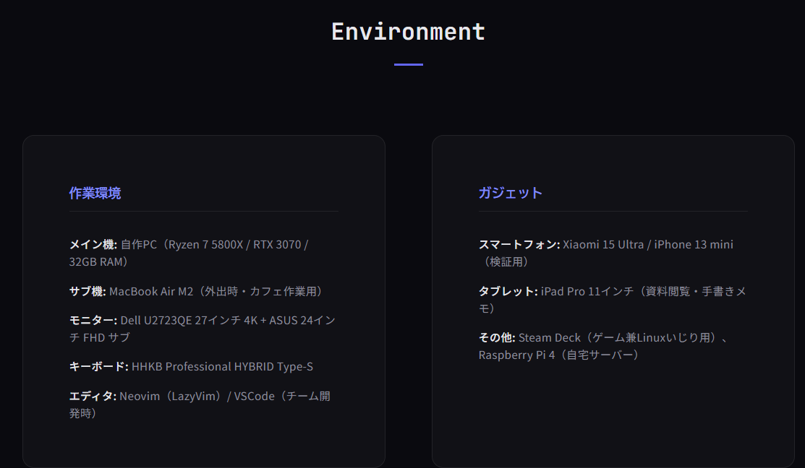

# debeyohiru_06_hidden2

- Description
    
    We want to know the smartphone models `debeyohiru` is believed to have used as of **December 2025**.
    
    If you believe they used multiple devices, answer all of them connected with underscores (`_`). In this case, the order does not matter.
    
    You do not need to include the manufacturer name.
    
    For example, if they used Xperia 10 VII and iPhone 17, the flag would be `SWIMMER{Xperia 10 VII_iPhone 17}`.
    

In his [personal profile](https://furaigo5.github.io/profile/), we do see the devices

However, we do want to know about the old devices

We first tried to find in the Wayback Machine, but failed. After a while, we searched for an available website archive and found it in [Archive Today]([https://archive.is/ORR6S](https://archive.is/ORR6S)).

With this, we find the smartphone models

Flag: `SWIMMER{Pixel 8 Pro_iPhone 13 mini}`
