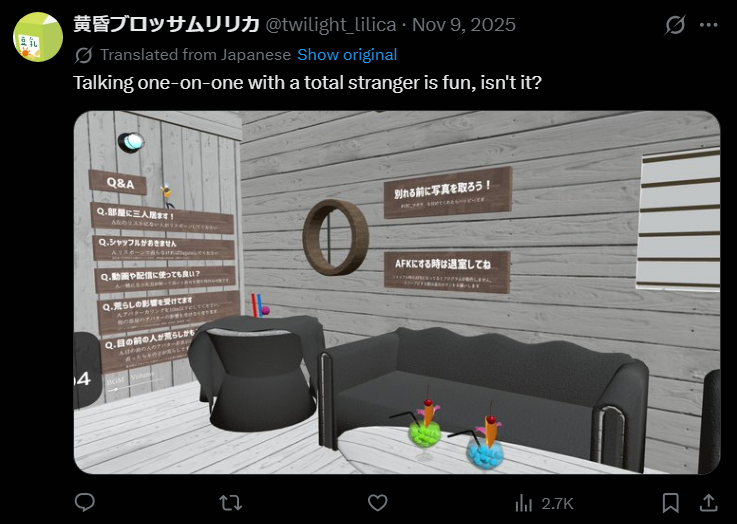

# lilica_03_virtual_world

- Description
    
    It seems `lilica` posted about VRChat activity on social media.
    
    In an image posted on November 9, 2025 (JST), a certain "world" appears. Please answer the ID of this world.
    
    You can view VRChat world information in a browser.
    
    For example, if the world URL were `https://vrchat.com/home/world/wrld_xxxxxxxx-xxxx-xxxx-xxxx-xxxxxxxxxxxx/info`,
    
    the flag would be `SWIMMER{wrld_xxxxxxxx-xxxx-xxxx-xxxx-xxxxxxxxxxxx}`.
    

We can find the image in [X](https://x.com/twilight_lilica/status/1987359447111639464)

Using Google Image search, we can find many results. I found the link in this [blog](https://vrchat-fbt.com/nagisa/)

Flag: `SWIMMER{https://vrchat.com/home/world/wrld_1b94e327-036b-4d09-81be-e898d71f02cb/info}`

<aside>
⚠️

I realize that I should not include `/info` in the flag, but they are being generous and accept anyways. I should not include it.

</aside>
