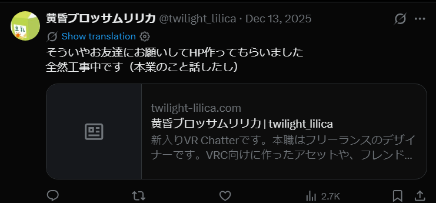

# lilica_04_domain

- Description
    
    `lilica` ran a personal website.
    
    When was its domain name registered? Answer in the `YYYY/MM/DD` format.
    
    For example, if the domain was registered on January 2, 2026, the flag would be `SWIMMER{2026/01/02}`
    

In one of the posts, we can see she mentioned her [personal website](https://twilight-lilica.com/)



Using the `whois` CLI utility, we can find when the domain was created easily

```bash
└─$ whois twilight-lilica.com|grep Creation                                                                                                                                                                                             
   Creation Date: 2025-10-05T07:08:47Z
Creation Date: 2025-10-05T07:08:47Z
```

Flag: `SWIMMER{2025/10/05}`
