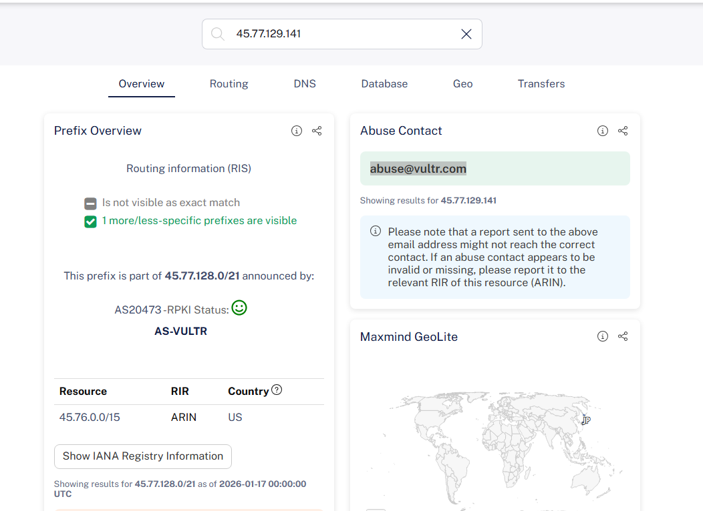

# lilica_05_hosting

- Description
    
    `lilica` hosts a personal site on a hosting service.
    
    The site itself is not violating any terms, but for caution, we want to know the contact address of the hosting service.
    
    Please answer the abuse-reporting email address for this hosting service.
    
    For example, if the address were `foobar@example.com`, the flag would be `SWIMMER{foobar@example.com}`.
    
    **Warning**: DO NOT SEND EMAIL to this address. **You do not need to send any emails to answer.**
    

We can continue to use the `whois` command line, but I have no idea which is the correct answer

```bash
└─$ whois 45.77.129.141|grep -i email                                                                                                                                                                                                      
OrgTechEmail:  network@constant.com
OrgAbuseEmail:  abuse@constant.com
OrgNOCEmail:  network@constant.com
OrgAbuseEmail:  abuse@vultr.com
OrgTechEmail:  tlynch@vultr.com
OrgTechEmail:  abuse@vultr.com
```

So we can use some online tools for help. Here I pick [RIPEstat](https://stat.ripe.net/resource/45.77.129.141#tab=overview)



Flag: `SWIMMER{abuse@vultr.com}`
