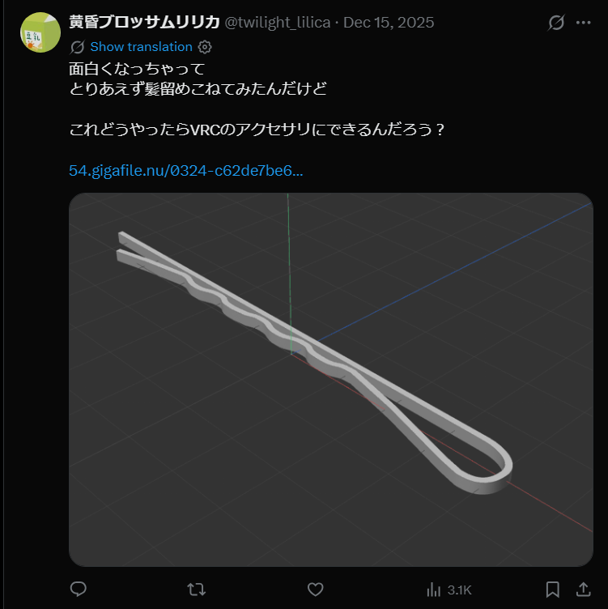

# lilica_06_name

- Description
    
    Please answer what you believe to be `lilica`'s real name.
    
    Answer in the Latin alphabet (romaji); you do not need to consider Kanji / Hiragana.
    
    For example, if the real name were `Sanae Takaichi`, the flag would be `SWIMMER{Sanae Takaichi}`.
    

This is quite challenging. Because the previous two challenges were related to her personal website, I spent way too much time finding the domain registration or, like in the ふらいご series, looking at the source code.

Until the hints were released, I had no idea where the name was hidden

- Hints
    
    ```markdown
    Is there anything we can deduce from the information posted on social media?
    
    **Are there any traces left in the downloadable file? Opening the file in an unusual way might reveal information.**
    ```
    

In [X](https://x.com/twilight_lilica/status/2000551415039791278), we can see there is a [downloadable file](https://t.co/TR5T7GFce8)



After that, try to find some useful info in the file.

`exiftool` result in no interesting info

```bash
└─$ exiftool simple_hair_pin.fbx 
ExifTool Version Number         : 13.36
File Name                       : simple_hair_pin.fbx
Directory                       : .
File Size                       : 36 kB
File Modification Date/Time     : 2026:01:25 08:46:50-05:00
File Access Date/Time           : 2026:01:25 08:46:50-05:00
File Inode Change Date/Time     : 2026:01:25 08:46:51-05:00
File Permissions                : -rw-rw-r--
Error                           : Unknown file type
```

But the `strings` result shows the name of Lilica in the file paths

```bash
└─$ strings simple_hair_pin.fbx 
Kaydara FBX Binary  
FBXHeaderExtensiont
FBXHeaderVersionI
FBXVersionI
EncryptionTypeI
CreationTimeStamp
VersionI
YearI
MonthI
DayI
HourI
MinuteI
SecondI
MillisecondIj
CreatorS$
FBX SDK/FBX Plugins version 2020.3.4
OtherFlags
TCDefinitionI
        SceneInfoS
GlobalInfo
SceneInfoS
UserDataK
TypeS
UserDatap
VersionId
MetaData
VersionId                                                                                                                                                                                                                                  
TitleS                                                                                                                                                                                                                                     
SubjectS                                                                                                                                                                                                                                   
AuthorS                                                                                                                                                                                                                                    
KeywordsS                                                                                                                                                                                                                                  
RevisionS                                                                                                                                                                                                                                  
CommentS                                                                                                                                                                                                                                   
Properties70j                                                                                                                                                                                                                              
DocumentUrlS                                                                                                                                                                                                                               
KStringS                                                                                                                                                                                                                                   
UrlS                                                                                                                                                                                                                                       
C:\Users\shiharu_nanaogi\Documents\modeling\vrc_test\hair_pin\simple_hair_pin.fbx                                                                                                                                                          
SrcDocumentUrlS                                                                                                                                                                                                                            
KStringS                                                                                                                                                                                                                                   
UrlS
C:\Users\shiharu_nanaogi\Documents\modeling\vrc_test\hair_pin\simple_hair_pin.fbxD
.
.
.
```

Flag: `SWIMMER{Shiharu Nanaogi}`
