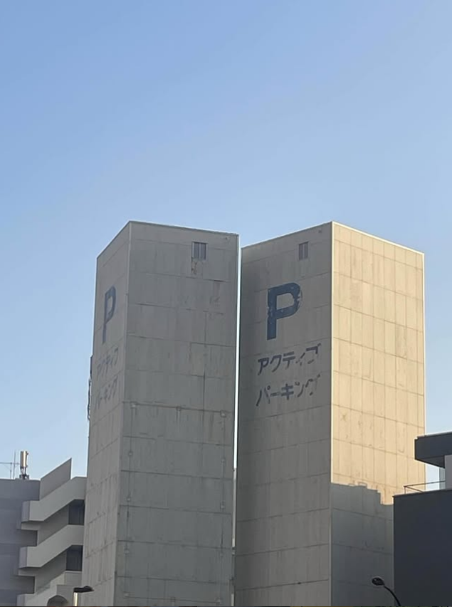

# lilica_07_work

- Description
    
    `lilica` seems to have an account on another social network.
    
    From that account, infer their workplace's nearest station and answer using the **Tokyo Metro station name**.
    
    For example, if the nearest station is `新宿三丁目駅` (Shinjuku-sanchome), the flag would be `SWIMMER{新宿三丁目}`.
    

We already know Lilica’s real name is `Shiharu Nanaogi` in the last challenge. Searching it in Instagram will reveal [her account](https://www.instagram.com/nanaogi_shiharu/)

In [one](https://www.instagram.com/p/DSTxI6-iRdF/) of the posts, she included an image taken by her during her lunch break

Searching アクティブパーキング(Means Active Parking in Japanese) will show [a spot](https://www.google.com/maps/place/%E3%82%A2%E3%82%AF%E3%83%86%E3%82%A3%E3%83%96%E3%83%91%E3%83%BC%E3%82%AD%E3%83%B3%E3%82%B0/@35.6421828,139.701016,17z/data=!4m14!1m7!3m6!1s0x60188b480f582c73:0xb22a151ea9f897a5!2z44Ki44Kv44OG44Kj44OW44OR44O844Kt44Oz44Kw!8m2!3d35.6420838!4d139.7009881!16s%2Fg%2F11jv37w6_8!3m5!1s0x60188b480f582c73:0xb22a151ea9f897a5!8m2!3d35.6420838!4d139.7009881!16s%2Fg%2F11jv37w6_8?entry=ttu&g_ep=EgoyMDI2MDEyMS4wIKXMDSoASAFQAw%3D%3D) in Google Map

And the closest station is `中目黒駅`

Flag: `SWIMMER{中目黒駅}`
