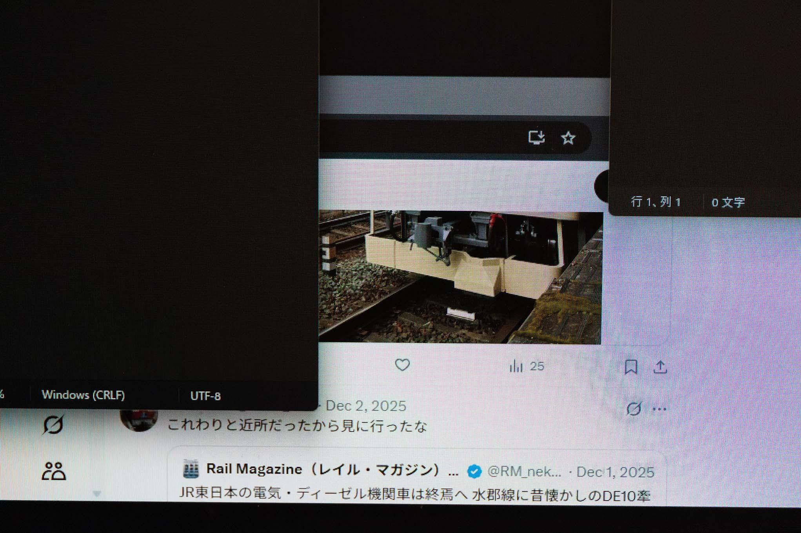
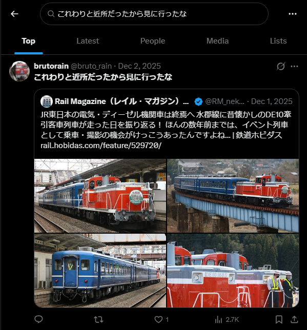

# Rain-01-special

- Description
    
    > As of 2026, `rain` appears to have had an X account. We have obtained a screenshot of their post. Identify the account from the screenshot, and answer the account's ID (screen name). For example, if the target account were @gov_online, the flag would be `SWIMMER{@gov_online}`.
    > 

Here is the Image we received

Because the name is blocked, we can try searching for the message “`これわりと近所だったから見に行ったな`" in x. And then we can find the [original post](https://x.com/search?q=%E3%81%93%E3%82%8C%E3%82%8F%E3%82%8A%E3%81%A8%E8%BF%91%E6%89%80%E3%81%A0%E3%81%A3%E3%81%9F%E3%81%8B%E3%82%89%E8%A6%8B%E3%81%AB%E8%A1%8C%E3%81%A3%E3%81%9F%E3%81%AA&src=typed_query)

We can see the account ID is `@bruto_rain`

Flag: `SWIMMER{@bruto_rain}`
