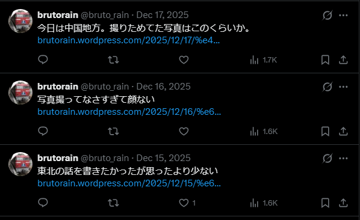
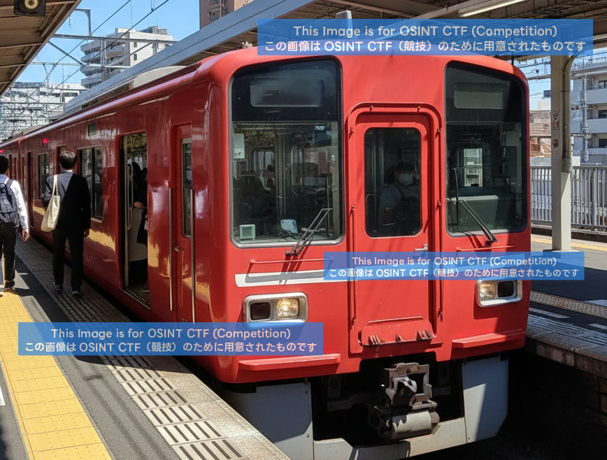
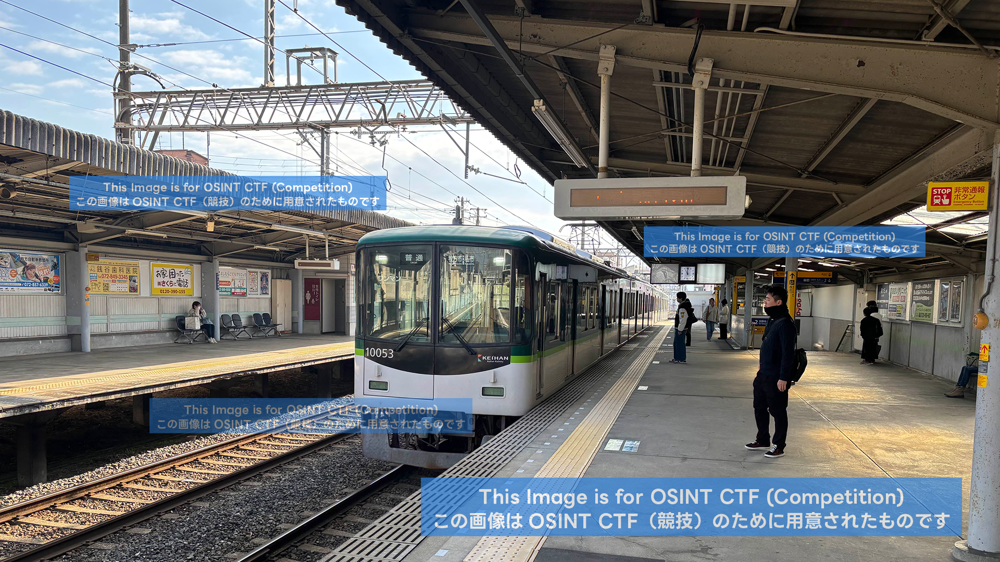
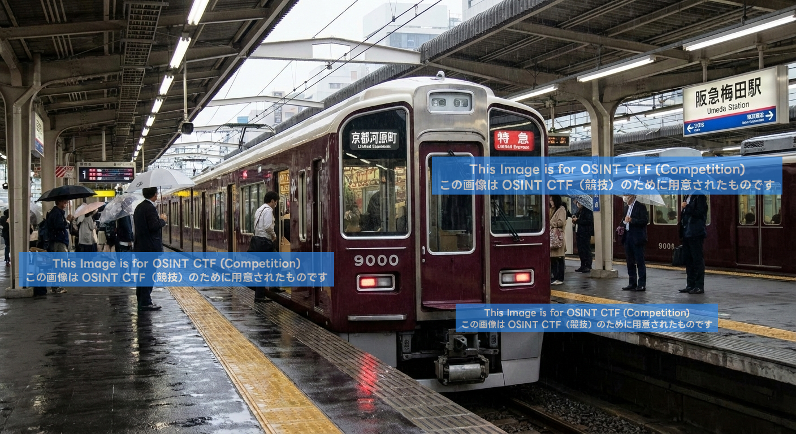
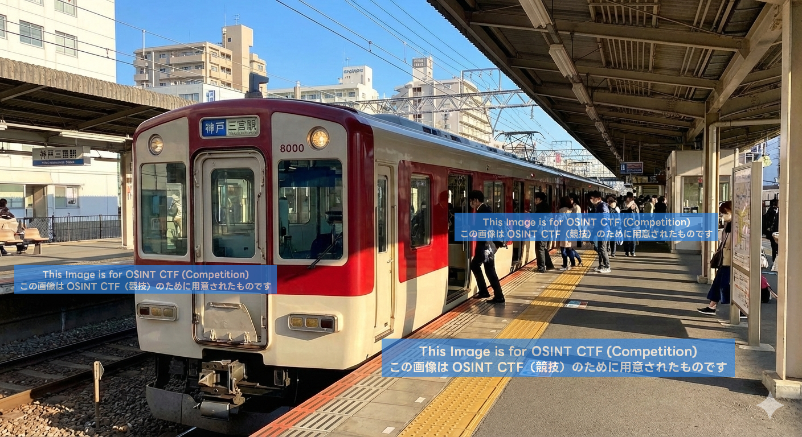

# rain_02_region

- Description
    
    > It seems Rain posted hobby content on their blog.
    > 
    > 
    > Most photos used in the posts were not taken by them, but not all of them are fake.
    > 
    > One photo appears to be genuinely taken. Please answer where it was shot on a map.
    > 

Sadly, I can’t solve it during the CTF:(

In x, we saw Rain has posted some blogs.

We can navigate to the links and arrive at the blogs using the [WordPress](https://brutorain.wordpress.com/) website.

- Here are the last released hints
    
    > Rain claims to live in the Kanto region, but this does not appear to be true.
    
    The photos he posts from his so-called "road trips" may contain actual photos he took.
    
    The photos Rain claims to have created appear to include some generated by AI. Furthermore, the majority of the photos Rain claims to have created that are not generated by AI appear to have been sourced from the internet.
    I wish I could somehow separate these...
    
    **If you've found the right image, it shouldn't be too hard to find out where it was taken. You might discover something new by doing an image search for the photo, or by searching for a string of characters contained in the photo. It also looks like we could make use of a system called Synth ID.**
    > 

 Synth ID is implemented on Gemini and can detect whether an image is AI-generated by analyzing its metadata.

Here is how I used it

I was too greedy during the CTF and asked it to recognize the picture taken by Rain. So this time, I only asked it to recognize the images that AI does not generate

According to Gemini, the photos below are not generated by AI:

- `kansai.jpg`
    
    
    
- `keihan-2.jpg`
    
    
    
- `hankyu-1.jpg`
    
    
    
- `sannnomiya-1.jpg`
    
    
    
- `tohoku-1.jpg`
    
    
    

For the kansai.png, I could not find the exact match of the train. In the results, we can see that most of the results have a display pad in the middle, which does not appear in the given photo. I guess we can skip this for now

As for `keihan-2.jpg`, it is very likely our answer, since there are no exact matches.

According to [Wikipedia](https://en.wikipedia.org/wiki/Keihan_Katano_Line), there are only 8 stations

In that image, we can see the station name on the right, which resonates very well with ‘星ヶ丘’.

We can find the coordinates in [Wikipedia](https://en.wikipedia.org/wiki/Hoshigaoka_Station_(Osaka))

Here are the coordinates on [Google Map](https://maps.app.goo.gl/rMA1n3GgFH8UTYFD8) that I submitted it after the CTF, and it is correct

`34.8075780532,135.6598247588`
