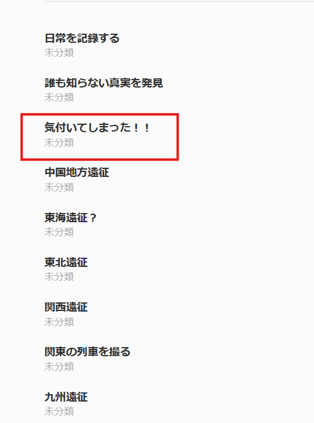

# rain_03_source1

- Description
    
    > `rain` believed that writing clickbait article titles would boost views.
    > 
    > 
    > They then became engrossed in creating and spreading disinformation.
    > 
    > In their very first fake article, an unrelated caption was attached to an image. Find the original source and answer which municipality's materials this image appeared in.
    > 
    > You do not need to include the prefecture name.
    > 
    > For example, if the picture were on the document about `平塚市` (Hiratsuka City), the flag would be `SWIMMER{平塚市}`.
    > 

In the [WordPress page](https://brutorain.wordpress.com/), this title sounds much different compared to others

Inside that blog, we can find an image

At the bottom, we can see ‘(一其)池過濾,中事工’, which probably means related to pool filtration or 浄水場 in Japanese

<aside>
📢

It should be 工事中 濾過池(其一), as is ancient Japanese/Chinese, people tend to write from right to left, that’s why I feel a bit weird the first time I read this

</aside>

Searching it will find the result(I need to omit OSINT because there are way too many write-ups out there)

When we open the page in [honkoku.org](https://app.honkoku.org/transcription/A665885145923E1270F323287C03076C/28), we will see the image!

Flag: `SWIMMER{豊橋市}`
