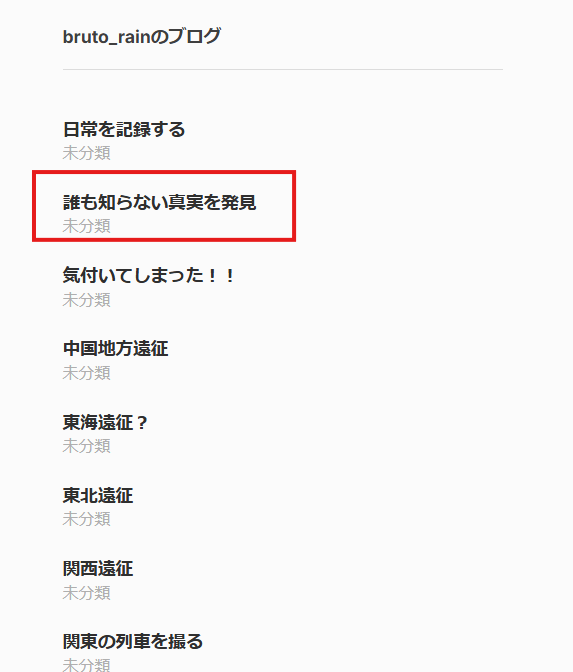

# rain_04_source2

- Description
    
    > In `rain`'s second fake article, it claims they found unpublished information, but this is likely false.
    > 
    > 
    > To debunk it, you need to find the original source.
    > 
    > The image comes from an old book that has been digitized, so you should be able to view the details.
    > 
    > Please answer the digital object identifier (DOI) of that source.
    > 
    > For example, if the answer were `12.34567/890123`, the flag would be `SWIMMER{12.34567/890123}`
    > 

Here is the [second fake article](https://brutorain.wordpress.com/2025/12/21/%e8%aa%b0%e3%82%82%e7%9f%a5%e3%82%89%e3%81%aa%e3%81%84%e7%9c%9f%e5%ae%9f%e3%82%92%e7%99%ba%e8%a6%8b/), as the ‘気付いてしまった！！’ is the first fake article that we did in the previous challenge, rain_03_source1 

Inside, we can see an image of a palace-like building

We can find the [building](https://commons.wikimedia.org/wiki/File:National_Diet_Building_Competition_Submission_Watanabe_Fukuzo.jpg) in Wikipedia using Google image search 

In the summary part, we can see the [source](http://dl.ndl.go.jp/info:ndljp/pid/967480/7) of the image

Click it, scroll down a bit, and we can find the DOI

Flag: `SWIMMER{10.11501/967480}`
