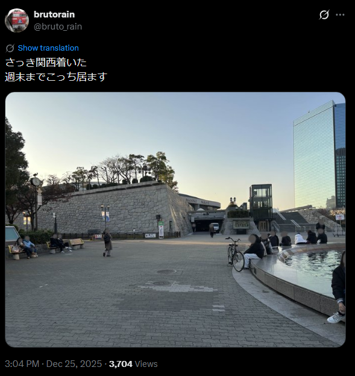

# rain_05_date

- Description
    
    > `rain`  posted on X that they visited a certain place on December 25, 2025 (JST).
    > 
    > 
    > However, the image seems to have been taken on a different day in 2025. Please answer the actual date the photo was taken in `YYYY/MM/DD`format.
    > 
    > Use Japan Standard Time (JST) for the date.
    > 
    > For example, if the correct date were June 8, 2025 in JST, the flag would be `SWIMMER{2025/06/08}`.
    > 

In [rain’s X account](https://x.com/bruto_rain/status/2004085702469075019), there is an image posted on 25/12

We can find this place very easily on [Google Map](https://maps.app.goo.gl/nBpuNGz2tRQT6ZnTA), as we can see ‘Osaka Jo Hall’ at the back.

However, it is about when, not where, so we do need to figure out how to find the date

The first details I can think of are the banner in the back. However, I soon realized that it is just a regular banner; I can not derive the time based on it

Next, I try to search for the poster, it is very blurry

And I found the poster very easily after the CTF. 

Using that [post by カオルッチィ★てるみーっこ♪レポ隊士](https://x.com/KaOrutcH/status/1997452194401206578), you can see that most of the comments are 7/12, which is the answer. We can also find the cleaner version of the poster in that post.

<aside>
⚠️

At that time, I could only use reverse image search to find the correct poster, which took me a lot of efforts to find this [blog by しんたろう](https://ameblo.jp/shintaro-seiko/image-12949680306-15729134414.html).

Inside one of the images, we can find the date `7/12`

At that time, I was fixed on the date `20/12` on t poster , but it should actually be `7/12`, as this is the date of the performance at 大阪城ホ一ル. The date is supported in [mbs.jp](https://www.mbs.jp/daiku/history/report/2025.shtml). Props to my teammate for solving it!

</aside>

Flag: `SWIMMER{2025/12/07}`
