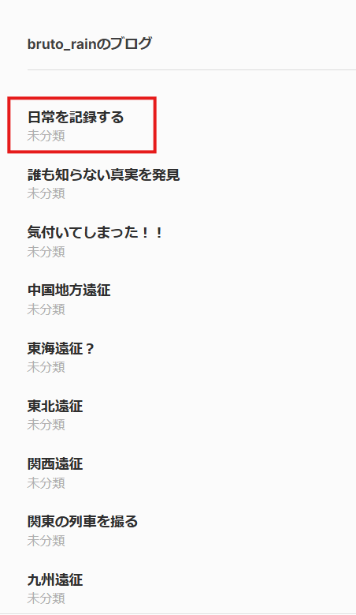

# rain_06_ai

- Description
    
    > There is an image of Tokyo Station on `rain`'s blog, but it appears to be AI-generated rather than an actual photo.
    > 
    > 
    > Answer which tool was used to create it.
    > 
    > For example, if the answer is `Adobe Firefly`, the flag would be `SWIMMER{Adobe Firefly}`.
    > 

The image we need lies in the [latest blog](https://brutorain.wordpress.com/2026/01/03/%e6%97%a5%e5%b8%b8%e3%82%92%e8%a8%98%e9%8c%b2%e3%81%99%e3%82%8b/)



It is an image picturing Tokyo Station


In the last wave, we received the following hints

> `There seem to be AI tools that leave metadata in images. Is there a way to get the image and view the Exif information etc?`
> 

To see the Exif information, we can use `exiftool`. However, if you download the photo directly by right-clicking and saving it, it will fail because WordPress modifies and resizes it (as indicated by the `.webp` extension). You can see the result as follows:

```bash
└─$ exiftool tokyo_0003.webp 
ExifTool Version Number         : 13.36
File Name                       : tokyo_0003.webp
Directory                       : .
File Size                       : 118 kB
File Modification Date/Time     : 2026:01:20 05:26:36-05:00
File Access Date/Time           : 2026:01:20 05:26:36-05:00
File Inode Change Date/Time     : 2026:01:20 05:26:36-05:00
File Permissions                : -rw-rw-r--
File Type                       : WEBP
File Type Extension             : webp
MIME Type                       : image/webp
VP8 Version                     : 0 (bicubic reconstruction, normal loop)
Image Width                     : 1024
Horizontal Scale                : 0
Image Height                    : 576
Vertical Scale                  : 0
Image Size                      : 1024x576
Megapixels                      : 0.590
```

To get the original image, you can either open it in a new tab or copy its link. The link should be `https://brutorain.wordpress.com/wp-content/uploads/2026/01/tokyo_0003.jpeg?w=1440`. Remove `?w=1440` and download the image. This time, the file should be a JPEG file.

```bash
└─$ file tokyo_0003.jpeg 
tokyo_0003.jpeg: JPEG image data, JFIF standard 1.01, aspect ratio, density 1x1, segment length 16, Exif Standard: [TIFF image data, big-endian, direntries=1], baseline, precision 8, 5404x3040, components 3
```

Use `exiftool` to see that Rain used `Dreamina` to generate the image

```bash
└─$ exiftool tokyo_0003.jpeg 
ExifTool Version Number         : 13.36
File Name                       : tokyo_0003.jpeg
Directory                       : .
File Size                       : 2.8 MB
File Modification Date/Time     : 2026:01:20 05:39:21-05:00
File Access Date/Time           : 2026:01:20 05:39:22-05:00
File Inode Change Date/Time     : 2026:01:20 05:39:21-05:00
File Permissions                : -rw-rw-r--
File Type                       : JPEG
File Type Extension             : jpg
MIME Type                       : image/jpeg
JFIF Version                    : 1.01
Resolution Unit                 : None
X Resolution                    : 1
Y Resolution                    : 1
Exif Byte Order                 : Big-endian (Motorola, MM)
User Comment                    : {"aigc_info":{"aigc_label_type":0,"source_info":"dreamina"},"data":{"os":"web","product":"dreamina","exportType":"generation","pictureId":"0"},"trace_info":{"originItemId":"7590949739743448328"}}
Image Width                     : 5404
Image Height                    : 3040
Encoding Process                : Baseline DCT, Huffman coding
Bits Per Sample                 : 8
Color Components                : 3
Y Cb Cr Sub Sampling            : YCbCr4:2:0 (2 2)
Image Size                      : 5404x3040
Megapixels                      : 16.4
```

Flag: `SWIMMER{Dreamina}`
