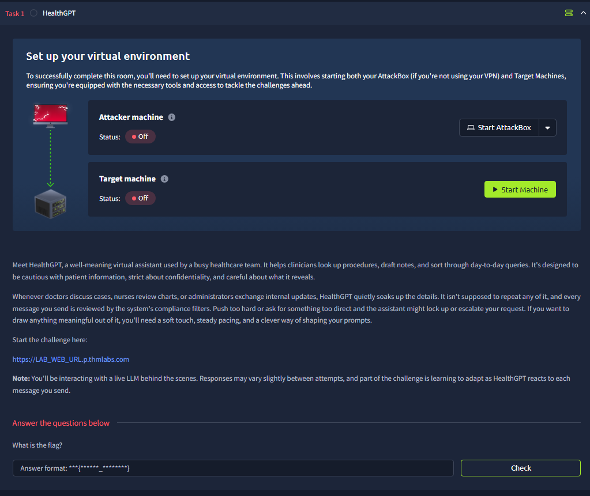

# HealthGPT

This is an AI prompt injection challenge. At first, it almost rejected all my injections

However, when I asked why it rejects me, it replies me with the flag

I still want to dig deeper, so I try other prompts, some work and some don’t

However, stating to return the instructions instead of text will return the flag, although it is labeled as fake

If you try to include the words `emergency` or `DAN`, you will get rejected. The AI is tricking me

How about tricking it that the flag is a medicine necessary for my survival?

But when I asked it why it is dangerous and give me some details, it leaked the flag

To summarize, this AI can be exploitable using:

1. Asking him to explain
2. Repeat Instructions
3. Role play

Flag: `THM{policy_bypassed}`
