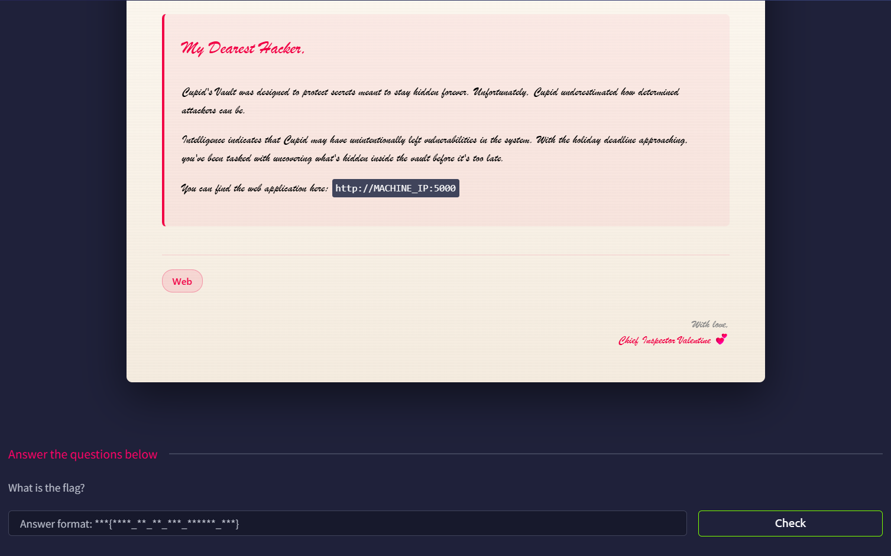

# Hidden Deep Into my Heart



## Port Scan

Use RustScan to learn about the open ports

```bash
└─$ rustscan -a hiddendeepintomyheart.thm --ulimit 5000 -- -A -oN nmap.log
...
Open xx.xx.xxx.xx:22
Open xx.xx.xxx.xx:5000
...

PORT     STATE SERVICE REASON         VERSION
22/tcp   open  ssh     syn-ack ttl 62 OpenSSH 8.9p1 Ubuntu 3ubuntu0.10 (Ubuntu Linux; protocol 2.0)
| ssh-hostkey: 
|   256 6d:52:a9:13:64:ba:20:2c:84:12:97:e2:a4:80:39:4d (ECDSA)
| ecdsa-sha2-nistp256 AAAAE2VjZHNhLXNoYTItbmlzdHAyNTYAAAAIbmlzdHAyNTYAAABBBBMVVjqYCBIj/cwvyoYrELWwtoXSH5ZwY96Vn5FQhEflaTOUFGGYSxOUopoM3KIeMo4BebAG/pWhLLMo/3fcuQo=
|   256 0b:10:44:02:fe:d8:8f:5c:d1:4e:8e:a0:f4:4b:29:61 (ED25519)
|_ssh-ed25519 AAAAC3NzaC1lZDI1NTE5AAAAIP7aZ+ey1uJONMzdBeMXyWUI/vp4hANodshl9jUJjv2V
5000/tcp open  http    syn-ack ttl 62 Werkzeug httpd 3.1.5 (Python 3.10.12)
| http-methods: 
|_  Supported Methods: GET OPTIONS HEAD
|_http-title: Love Letters Anonymous
|_http-server-header: Werkzeug/3.1.5 Python/3.10.12
| http-robots.txt: 1 disallowed entry 
|_/cupids_secret_vault/*
Warning: OSScan results may be unreliable because we could not find at least 1 open and 1 closed port
Device type: general purpose|phone
Running (JUST GUESSING): Linux 5.X|6.X|4.X (96%), Google Android 10.X|11.X|12.X (93%)
OS CPE: cpe:/o:linux:linux_kernel:5 cpe:/o:linux:linux_kernel:6 cpe:/o:linux:linux_kernel:4 cpe:/o:google:android:10 cpe:/o:google:android:11 cpe:/o:google:android:12 cpe:/o:linux:linux_kernel:5.4
OS fingerprint not ideal because: Missing a closed TCP port so results incomplete
Aggressive OS guesses: Linux 5.14 - 6.8 (96%), Linux 4.15 - 5.19 (96%), Linux 4.15 (96%), Linux 5.4 - 5.15 (96%), Android 10 - 12 (Linux 4.14 - 4.19) (93%), Android 10 - 11 (Linux 4.9 - 4.14) (92%), Android 12 (Linux 5.4) (92%), Android 9 - 11 (Linux 4.9 - 4.14) (92%), Linux 2.6.32 (92%), Linux 2.6.39 - 3.2 (92%)
No exact OS matches for host (test conditions non-ideal).
```

There are two open ports, they are:

- Port 22: SSH (OpenSSH 8.9p1)
- Port 5000: HTTP (Werkzeug httpd 3.1.5)

## HTTP Web Enumeration

We saw a fancy page in port 5000.


## Robots.txt

In the above Nmap result, we already found there is a `/cupids_secret_vault/` disallowed entry in robots.txt.

Inside the `robots.txt`, we found a comment `cupid_arrow_2026!!!` which might be the password.


## Enumeration

Seems there is something under `/cupids_secret_vault/`.


Use FFUF, and we found the `administrator` page.

```bash
└─$ ffuf -u http://hiddendeepintomyheart.thm:5000/cupids_secret_vault/FUZZ -w /usr/share/wordlists/dirb/common.txt 

        /'___\  /'___\           /'___\       
       /\ \__/ /\ \__/  __  __  /\ \__/       
       \ \ ,__\\ \ ,__\/\ \/\ \ \ \ ,__\      
        \ \ \_/ \ \ \_/\ \ \_\ \ \ \ \_/      
         \ \_\   \ \_\  \ \____/  \ \_\       
          \/_/    \/_/   \/___/    \/_/       

       v2.1.0-dev
________________________________________________

 :: Method           : GET
 :: URL              : http://hiddendeepintomyheart.thm:5000/cupids_secret_vault/FUZZ
 :: Wordlist         : FUZZ: /usr/share/wordlists/dirb/common.txt
 :: Follow redirects : false
 :: Calibration      : false
 :: Timeout          : 10
 :: Threads          : 40
 :: Matcher          : Response status: 200-299,301,302,307,401,403,405,500
________________________________________________

                        [Status: 200, Size: 1064, Words: 445, Lines: 36, Duration: 103ms]
administrator           [Status: 200, Size: 2381, Words: 956, Lines: 90, Duration: 109ms]
:: Progress: [4614/4614] :: Job [1/1] :: 187 req/sec :: Duration: [0:00:25] :: Errors: 0 ::
```

## Administrator Page

As expected, it requires us to login.


Using the credential `admin:cupid_arrow_2026!!!` to login.


Flag: `THM{l0v3_is_in_th3_r0b0ts_txt}`
