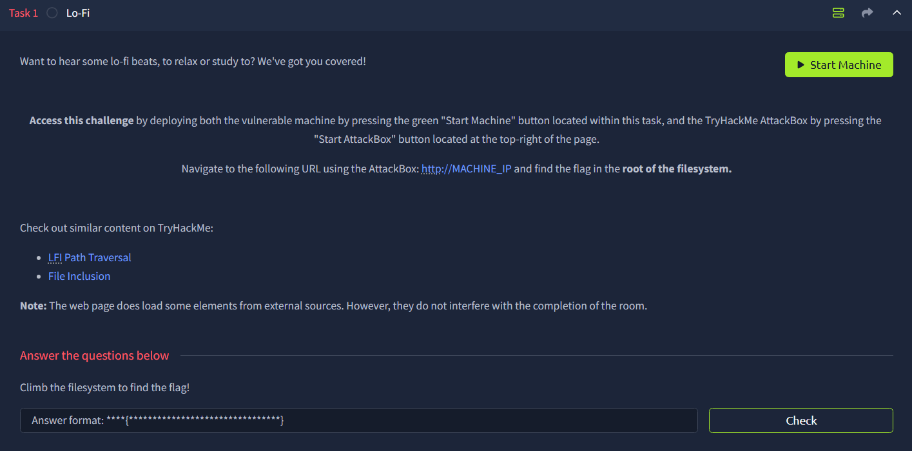

# Lo-Fi



## Enumeration

We can first do a simple enumeration

```bash
root@ip-xx-xx-xxx-xx:~/Downloads# rustscan -a xx.xx.xxx.xx -r 1-65535 --ulimit 5000 -- -A
.
.
.
Open xx.xx.xxx.xx:22
Open xx.xx.xxx.xx:80
.
.
.
PORT   STATE SERVICE REASON  VERSION
22/tcp open  ssh     syn-ack OpenSSH 8.2p1 Ubuntu 4ubuntu0.4 (Ubuntu Linux; protocol 2.0)
80/tcp open  http    syn-ack Apache httpd 2.2.22 ((Ubuntu))
| http-methods: 
|_  Supported Methods: GET HEAD POST OPTIONS
|_http-server-header: Apache/2.2.22 (Ubuntu)
|_http-title: Lo-Fi Music
Service Info: OS: Linux; CPE: cpe:/o:linux:linux_kernel
```

We can see that port 22 and 80 are opened

## HTTP (Port 80)

Navigate to port 80, and we can find 


If we take a look at the source code, we can see that when we click on one of the hyperlinks, it will change the page by changing the value inside `page`

```bash
<ul class="list-unstyled mb-0">
    <li><a href="/?page=relax.php">Relax</a></li>
    <li><a href="/?page=sleep.php">Sleep</a></li>
		<li><a href="/?page=chill.php">Chill</a></li>    
		<li><a href="/?page=coffee.php">Coffee</a></li>
		<li><a href="/?page=vibe.php">Vibe</a></li>
		<li><a href="/?page=game.php">Game</a></li>
</ul>
```

## Exploitation

So what if we use path transversal to read `/etc/passwd`? Well, it can really do it!


That’s means that we can now access to the flag.txt in the root (`/`) directory


Flag: `flag{e4478e0eab69bd642b8238765dcb7d18}`
