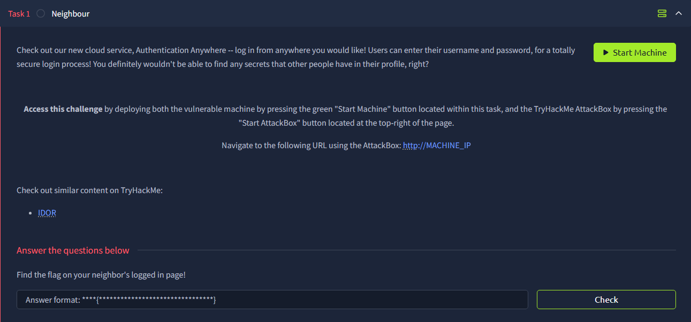

# Neighbour

There is a login form after we arrive on the page

If we read the source code, we can see there are test credentials `guest:guest`, we can use them to log in

After we log in, we can see that it references the current user (guest) in the URL. What if we change it to admin?

We get the flag!

Flag: `flag{66be95c478473d91a5358f2440c7af1f}`
