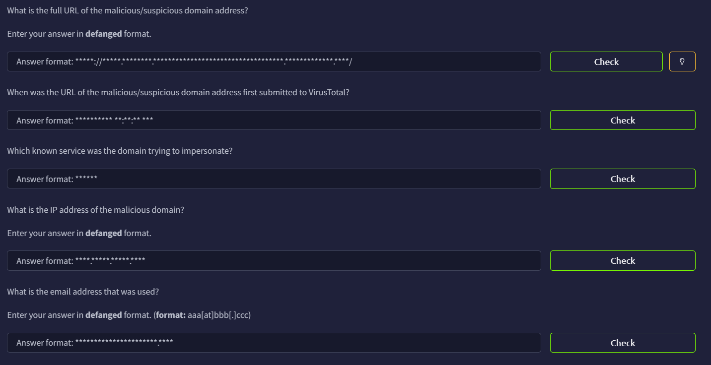

# TShark Challenge I: Teamwork



## Information Gathering Using TShark’s HTTP Filter

To kickstart, we can first filter all the HTTP traffic using the `-Y` flag.

```bash
tshark -r teamwork.pcap -Y http
   45   9.068328 192.168.1.100 ? 184.154.127.226 HTTP 413 GET / HTTP/1.1 
   47   9.269962 184.154.127.226 ? 192.168.1.100 HTTP 1514 [TCP Previous segment not captured] Continuation
   49   9.271064 184.154.127.226 ? 192.168.1.100 HTTP 1514 Continuation
   51   9.271278 184.154.127.226 ? 192.168.1.100 HTTP 1305 Continuation
   68   9.341951 192.168.1.100 ? 184.154.127.226 HTTP 413 GET / HTTP/1.1 
   86   9.643600 184.154.127.226 ? 192.168.1.100 HTTP 895 HTTP/1.1 200 OK  (text/html)
   94   9.796618 192.168.1.100 ? 184.154.127.226 HTTP 593 GET /js/script.js?_=1492480834538 HTTP/1.1 
  116  10.202554 184.154.127.226 ? 192.168.1.100 HTTP 106 [TCP Previous segment not captured] Continuation
  122  10.209199 192.168.1.100 ? 184.154.127.226 HTTP 642 POST /inc/visit.php HTTP/1.1  (application/x-www-form-urlencoded)
  125  10.478096 184.154.127.226 ? 192.168.1.100 HTTP 290 HTTP/1.1 200 OK 
  202  22.629586 192.168.1.100 ? 184.154.127.226 HTTP 850 POST /inc/login.php HTTP/1.1  (application/x-www-form-urlencoded)
  206  23.537399 184.154.127.226 ? 192.168.1.100 HTTP 434 HTTP/1.1 200 OK  (text/html)
  215  28.604818 192.168.1.100 ? 184.154.127.226 HTTP 551 GET /suspecious.php HTTP/1.1 
  217  28.763181 184.154.127.226 ? 192.168.1.100 HTTP 1351 [TCP Previous segment not captured] Continuation
  227  28.832076 192.168.1.100 ? 184.154.127.226 HTTP 550 GET /img/shield.png HTTP/1.1 
  235  28.885056 184.154.127.226 ? 192.168.1.100 HTTP 459 HTTP/1.1 200 OK  (PNG)
  442 108.661400 192.168.1.100 ? 184.154.127.226 HTTP 547 GET /update.php HTTP/1.1 
  447 108.832050 184.154.127.226 ? 192.168.1.100 HTTP 1514 [TCP Previous segment not captured] Continuation
  449 108.832324 184.154.127.226 ? 192.168.1.100 HTTP 1514 Continuation
  451 108.832702 184.154.127.226 ? 192.168.1.100 HTTP 1514 Continuation
  453 108.832960 184.154.127.226 ? 192.168.1.100 HTTP 1113 Continuation
  470 108.883557 192.168.1.100 ? 184.154.127.226 HTTP 534 GET /img/icon_checked.png HTTP/1.1 
  473 108.887831 192.168.1.100 ? 184.154.127.226 HTTP 534 GET /img/icon_uncheck.png HTTP/1.1 
  476 108.896445 192.168.1.100 ? 184.154.127.226 HTTP 530 GET /img/feedback.png HTTP/1.1 
  479 108.899572 192.168.1.100 ? 184.154.127.226 HTTP 548 GET /img/logo.svg HTTP/1.1 
  482 108.899756 192.168.1.100 ? 184.154.127.226 HTTP 592 GET /font/PayPalSansSmall-Medium.woff2 HTTP/1.1 
  485 108.900008 192.168.1.100 ? 184.154.127.226 HTTP 551 GET /img/setting.png HTTP/1.1 
  487 108.933892 184.154.127.226 ? 192.168.1.100 HTTP 861 [TCP Previous segment not captured] Continuation
  495 108.946220 184.154.127.226 ? 192.168.1.100 HTTP 670 [TCP Previous segment not captured] Continuation
  509 108.958360 184.154.127.226 ? 192.168.1.100 HTTP 760 HTTP/1.1 200 OK  (PNG)
  537 108.967591 184.154.127.226 ? 192.168.1.100 HTTP 1198 HTTP/1.1 200 OK  (PNG)
  548 108.986660 192.168.1.100 ? 184.154.127.226 HTTP 669 GET /js/jquery.creditCardValidator.min.js?_=1492480834539 HTTP/1.1 
  552 109.006015 192.168.1.100 ? 184.154.127.226 HTTP 549 GET /img/arrow.png HTTP/1.1 
  588 109.025751 192.168.1.100 ? 184.154.127.226 HTTP 529 GET /img/profile.png HTTP/1.1 
  589 109.025976 184.154.127.226 ? 192.168.1.100 HTTP 1295 HTTP/1.1 200 OK 
  594 109.042452 184.154.127.226 ? 192.168.1.100 HTTP 1425 HTTP/1.1 200 OK  (application/javascript)
  600 109.057366 184.154.127.226 ? 192.168.1.100 HTTP 807 HTTP/1.1 200 OK  (PNG)
  609 109.084057 184.154.127.226 ? 192.168.1.100 HTTP 1222 HTTP/1.1 200 OK  (PNG)
  616 109.096454 192.168.1.100 ? 184.154.127.226 HTTP 641 GET /js/cc.js?_=1492480834540 HTTP/1.1 
  622 109.149440 184.154.127.226 ? 192.168.1.100 HTTP 378 [TCP Previous segment not captured] Continuation
  628 109.161444 192.168.1.100 ? 184.154.127.226 HTTP 556 GET /img/csc_standard.png HTTP/1.1 
  631 109.204486 184.154.127.226 ? 192.168.1.100 HTTP 1021 HTTP/1.1 200 OK  (PNG)
  701 140.585328 192.168.1.100 ? 184.154.127.226 HTTP 536 GET / HTTP/1.1 
  710 140.722874 184.154.127.226 ? 192.168.1.100 HTTP 1251 HTTP/1.1 200 OK  (text/html)
  727 192.670855 192.168.1.100 ? 184.154.127.226 HTTP 555 GET /img/logo_ccVisa.gif HTTP/1.1 
  729 192.718647 184.154.127.226 ? 192.168.1.100 HTTP 888 HTTP/1.1 200 OK  (GIF89a)
  747 236.137939 192.168.1.100 ? 216.58.217.100 HTTP 1050 GET /tbr?client=navclient-auto&ch=63514382238&features=Rank&q=info%3Ahttp%3A%2F%2Fwww.paypal.com4uswebappsresetaccountrecovery.timeseaways.com%2F%23 HTTP/1.1 
  749 236.443725 216.58.217.100 ? 192.168.1.100 HTTP 1294 HTTP/1.1 403 Forbidden  (text/html)
```

The last two HTTP traffic seems suspicious, as the `403` and the weird `webappsresetaccountrecovery` caught my eye.

```bash
  747 236.137939 192.168.1.100 ? 216.58.217.100 HTTP 1050 GET /tbr?client=navclient-auto&ch=63514382238&features=Rank&q=info%3Ahttp%3A%2F%2Fwww.paypal.com4uswebappsresetaccountrecovery.timeseaways.com%2F%23 HTTP/1.1 
  749 236.443725 216.58.217.100 ? 192.168.1.100 HTTP 1294 HTTP/1.1 403 Forbidden  (text/html)
```

I am pretty sure this is the suspicious URL we are looking for, so I defang it immediately in CyberChef


I submitted `hxxp[://]www[.]paypal[.]com4uswebappsresetaccountrecovery[.]timeseaways[.]com` and it is indeed correct.

## VirusTotal

Pasting the URL on VirusTotal, we learn the data of the first submission, which is `2017-04-17 22:52:53 UTC`


At this point, we already know it is trying to impersonate PayPal.

Search the domain will also reveal the resolved IP `184[.]154[.]127[.]226`.


## Finding the Email

Finally, to learn about the email provided by the victim, we can just filter the HTTP traffic with the keyword `gmail`

```bash
tshark -r teamwork.pcap -Y "http contains \"gmail\"" -V|grep -i gmail
    Form item: "user" = "johnny5alive@gmail.com"
        Value: johnny5alive@gmail.com
```

We will learn the email is `johnny5alive[at]gmail[.]com`
