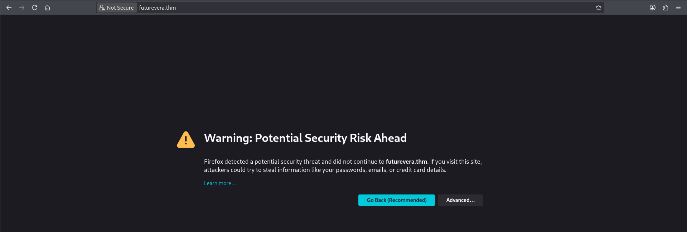

# TakeOver

## Introduction

This is an easy-rated challenge that requires us to find the flag, which should be in the website.

## Port Scanning

We first use RustScan to locate all opening ports

```python
└─$ rustscan -a futurevera.thm --ulimit 5000 -- -A
...
Open xx.xx.xxx.x:22
Open xx.xx.xxx.x:80
Open xx.xx.xxx.x:443
...
PORT    STATE SERVICE  REASON         VERSION
22/tcp  open  ssh      syn-ack ttl 62 OpenSSH 8.2p1 Ubuntu 4ubuntu0.13 (Ubuntu Linux; protocol 2.0)
| ssh-hostkey: 
|   3072 10:af:7e:1d:e3:b7:5f:86:e8:8b:f3:93:c3:71:05:d8 (RSA)
| ssh-rsa AAAAB3NzaC1yc2EAAAADAQABAAABgQDbFPgu9U7d3SvqSamthhKn29FTnthvB4JK7Z4hO/3Yco4+xSXuHsfzPaOQ43h5x/KOSxke1AlABONWe3WOwhC3va5dAYOWO4XK/gXMRg2RK2nTyKETjEeptLp9qceMsNyKpDEqKBYJ2R0cILrmoYQANsZ2cPdsyAIKnctUkE6W0KZ15QTqsrIG9WHg9yWdxAzLPzb7wJzHMwRYpIxKYaLHIQ3O3YMdpPngv9UVu8nY/O/L+d+WSPXU31lrB/G3oy5pBal+HBoGg4WlwdE7qZNFY5ic6DctFnjQuC2m3vR2rhGsEJqI05Fb9JQaYFSzOP7rDlwl8w/rxFrVKOa3OcwrElgwyZyUX+T6fDR7cfKyMllZk4xtsFLLzzdSrVLHH1H/w7KsXSfNeuIjiFb9JIDd7EEZw7OsmCy2c8CmI7iTICgkDrbiheAldmPfakk2p8j0JNLdZ6DPHhHSP7neThMFZqKLQh/UY+gRpaIqRBHV19tqLQvY9pWqQg34DnY4eic=
|   256 b7:b0:a3:f7:9c:dc:4f:46:69:cc:7e:99:3d:7f:36:6d (ECDSA)
| ecdsa-sha2-nistp256 AAAAE2VjZHNhLXNoYTItbmlzdHAyNTYAAAAIbmlzdHAyNTYAAABBBMhN8oKv7+afVAMlJaxZ1przOqp1sCpIG9h1+eDDE4mzAQmgi3NdXtS5cWzbx5u4yli53+Qtkupf6Wo4pR1ceKk=
|   256 e4:c8:71:91:40:a5:4f:e9:aa:41:54:0e:e1:86:2f:6c (ED25519)
|_ssh-ed25519 AAAAC3NzaC1lZDI1NTE5AAAAIKYzcmTMsJqpCvIWpcb5x5l4WOG3vp1W1YFp0Pqojg8W
80/tcp  open  http     syn-ack ttl 62 Apache httpd 2.4.41 ((Ubuntu))
| http-methods: 
|_  Supported Methods: GET HEAD POST OPTIONS
|_http-title: Did not follow redirect to https://futurevera.thm/
|_http-server-header: Apache/2.4.41 (Ubuntu)
443/tcp open  ssl/http syn-ack ttl 62 Apache httpd 2.4.41 ((Ubuntu))
|_ssl-date: TLS randomness does not represent time
|_http-title: FutureVera
| tls-alpn: 
|_  http/1.1
| http-methods: 
|_  Supported Methods: POST OPTIONS HEAD GET
| ssl-cert: Subject: commonName=futurevera.thm/organizationName=Futurevera/stateOrProvinceName=Oregon/countryName=US/organizationalUnitName=Thm/localityName=Portland
| Issuer: commonName=futurevera.thm/organizationName=Futurevera/stateOrProvinceName=Oregon/countryName=US/organizationalUnitName=Thm/localityName=Portland
| Public Key type: rsa
| Public Key bits: 2048
| Signature Algorithm: sha256WithRSAEncryption
| Not valid before: 2022-03-13T10:05:19
| Not valid after:  2023-03-13T10:05:19
| MD5:     2e8d 6097 6b23 188c 06d5 f2cd 8def dd3a
| SHA-1:   8023 fcfc 5e63 a29b 3d5e eaaf 8f70 8b35 d8eb c120
| SHA-256: bdff 4317 03bb 91a1 2144 4c8f e62a 2842 3b72 7169 858a 1f5f f618 dd3f efb0 aa33
| -----BEGIN CERTIFICATE-----
| MIIDuzCCAqOgAwIBAgIUMx0OgCh/xob6nWlsHR+iKDXKZRkwDQYJKoZIhvcNAQEL
| BQAwbTELMAkGA1UEBhMCVVMxDzANBgNVBAgMBk9yZWdvbjERMA8GA1UEBwwIUG9y
| dGxhbmQxEzARBgNVBAoMCkZ1dHVyZXZlcmExDDAKBgNVBAsMA1RobTEXMBUGA1UE
| AwwOZnV0dXJldmVyYS50aG0wHhcNMjIwMzEzMTAwNTE5WhcNMjMwMzEzMTAwNTE5
| WjBtMQswCQYDVQQGEwJVUzEPMA0GA1UECAwGT3JlZ29uMREwDwYDVQQHDAhQb3J0
| bGFuZDETMBEGA1UECgwKRnV0dXJldmVyYTEMMAoGA1UECwwDVGhtMRcwFQYDVQQD
| DA5mdXR1cmV2ZXJhLnRobTCCASIwDQYJKoZIhvcNAQEBBQADggEPADCCAQoCggEB
| AKZio9bT9ebOivcm+9xKKCUAobE2cdU5VFbi1Ve7oxsSGKWWEcsQlUn7tFj1jjKq
| hWDMZXxEW6aN3jU5p5zF6ATmwIuvNQqwZOaK8iKjXs8IWEBIQyz/iKBF6deWrN+8
| II+whTaSberFaND2G0VchB7OrOu/mlP1KNhm2kEKwak7YHxvFkSp7Nmu2yTQAnyp
| WK2CBh3tdeGSq7/lyo8W3la/kPKhb4lmtBMS/tKPFslMxlOv0cSbNsvFVgJQ7jti
| OZKPo/DAeaFIFB/32HocscQXM2VdQNXnQQ6M1cbBNskYWzvwp6di+wYzjjCWtM4o
| Rg+3c/k5hqkEftEiwV7xAXcCAwEAAaNTMFEwHQYDVR0OBBYEFD23WEwlBMTDTpWI
| 0eMU0IMaJyPJMB8GA1UdIwQYMBaAFD23WEwlBMTDTpWI0eMU0IMaJyPJMA8GA1Ud
| EwEB/wQFMAMBAf8wDQYJKoZIhvcNAQELBQADggEBACu3W2VV8zRdD4M7oUWN8S6f
| lM1z8aCkSckgFDEX7jtyJjWMQVwPizKkX17XQs6EgnWqD/PVt2Tf9dRhUH6FQmTK
| qh35hnsSOdO3sQB8CnQ3SnlbeUYXY2mY/aUhz/lAkx6mURGuSen8BSbuL4mcm5Dk
| AXxfa+SHc5XAjuYSlXVUSPy8noqFOLxvcGz+zPN2RQYwQkMDgQtUX2n0VcjwgTLN
| bEuEm210+IGPX+ZEQWsnSSmz0SyUryBwc5BsjMaFUdAncxEBKCn1p4oN8gm6NQ32
| FHFbghTgLgMTahuLWpXdeuVF87+pHUlroRHdgblQtb2wSwqVaDGHaLFiZcUMv/Y=
|_-----END CERTIFICATE-----
|_http-server-header: Apache/2.4.41 (Ubuntu)
Warning: OSScan results may be unreliable because we could not find at least 1 open and 1 closed port
Device type: general purpose|phone
Running (JUST GUESSING): Linux 5.X|6.X|4.X (96%), Google Android 10.X|11.X|12.X (93%)
OS CPE: cpe:/o:linux:linux_kernel:5 cpe:/o:linux:linux_kernel:6 cpe:/o:linux:linux_kernel:4 cpe:/o:google:android:10 cpe:/o:google:android:11 cpe:/o:google:android:12 cpe:/o:linux:linux_kernel:5.4
OS fingerprint not ideal because: Missing a closed TCP port so results incomplete
Aggressive OS guesses: Linux 5.14 - 6.8 (96%), Linux 4.15 - 5.19 (96%), Linux 4.15 (96%), Linux 5.4 - 5.15 (96%), Android 10 - 12 (Linux 4.14 - 4.19) (93%), Android 10 - 11 (Linux 4.9 - 4.14) (92%), Android 12 (Linux 5.4) (92%), Android 9 - 11 (Linux 4.9 - 4.14) (92%), Linux 2.6.32 (92%), Linux 2.6.39 - 3.2 (92%)
No exact OS matches for host (test conditions non-ideal).
```

There are 3 opening ports, they are:

- 22: SSH
- 80: HTTP
- 443: HTTPS

## HTTPS (Port 443)

### Self-Signed Certificate

When I decided to go to port 80 to take a look, it redirects me to port 443, with the following warning



We can click Advanced and view the certificate. The domain name is correct, but we are warned that it is a self-signed certificate.


### Main Page

To continue, we will accept the risk and continue, and before us is the FutureVera page.


The page itself reveals no information or hints about the flag, so I guess it is time for web enumeration.

### Web Content Enumeration

We will use the `dir` mode in Gobuster for the enumeration. Remember to include the `-k` flag to ignore the certificate warning.

```python
└─$ gobuster dir -u https://futurevera.thm -w /usr/share/wordlists/dirb/common.txt -k
===============================================================
Gobuster v3.8.2
by OJ Reeves (@TheColonial) & Christian Mehlmauer (@firefart)
===============================================================
[+] Url:                     https://futurevera.thm
[+] Method:                  GET
[+] Threads:                 10
[+] Wordlist:                /usr/share/wordlists/dirb/common.txt
[+] Negative Status codes:   404
[+] User Agent:              gobuster/3.8.2
[+] Timeout:                 10s
===============================================================
Starting gobuster in directory enumeration mode
===============================================================
.htaccess            (Status: 403) [Size: 280]
.htpasswd            (Status: 403) [Size: 280]
.hta                 (Status: 403) [Size: 280]
assets               (Status: 301) [Size: 319] [--> https://futurevera.thm/assets/]
css                  (Status: 301) [Size: 316] [--> https://futurevera.thm/css/]
index.html           (Status: 200) [Size: 4605]
js                   (Status: 301) [Size: 315] [--> https://futurevera.thm/js/]
server-status        (Status: 403) [Size: 280]
Progress: 4613 / 4613 (100.00%)
===============================================================
Finished
===============================================================
```

The above results shows no interesting endpoints.

### Subdomain Enumeration

So what I did is to see if there is any subdomains exist. We will use `--append-domain` to append the words into the Host header, and see if there is any results.

```python
└─$ gobuster vhost -u https://futurevera.thm -w /usr/share/wordlists/seclists/Discovery/DNS/subdomains-top1million-5000.txt -k --append-domain 
===============================================================
Gobuster v3.8.2
by OJ Reeves (@TheColonial) & Christian Mehlmauer (@firefart)
===============================================================
[+] Url:                       https://futurevera.thm
[+] Method:                    GET
[+] Threads:                   10
[+] Wordlist:                  /usr/share/wordlists/seclists/Discovery/DNS/subdomains-top1million-5000.txt
[+] User Agent:                gobuster/3.8.2
[+] Timeout:                   10s
[+] Append Domain:             true
[+] Exclude Hostname Length:   false
===============================================================
Starting gobuster in VHOST enumeration mode
===============================================================
blog.futurevera.thm Status: 421 [Size: 408]
support.futurevera.thm Status: 421 [Size: 411]
Progress: 4989 / 4989 (100.00%)
===============================================================
Finished
===============================================================
```

We saw there are `blog.futurevera.thm` and `support.futurevera.thm`. Remember to append them into `/etc/hosts`.

### Blog

We do see the same warning.


We proceed and find nothing special in the `blog` subdomain


### Support

However, when we go to `support.futurevera.thm` and view the certificate details, we can see there is a weird DNS Name `secrethelpdesk934752.support.futurevera.thm`


Add it into `/etc/hosts` again. And when we use cURL and see the headers, we find the flag is in the Location header.

```bash
└─$ curl http://secrethelpdesk934752.support.futurevera.thm -I
HTTP/1.1 302 Found
Date: Sat, 23 May 2026 14:50:32 GMT
Server: Apache/2.4.41 (Ubuntu)
Location: http://flag{beea0d6edfcee06a59b83fb50ae81b2f}.s3-website-us-west-3.amazonaws.com/
Content-Type: text/html; charset=UTF-8
```

We can also see the URL shows the flag when we navigate to `http://secrethelpdesk934752.support.futurevera.thm`


Flag: `flag{beea0d6edfcee06a59b83fb50ae81b2f}`
