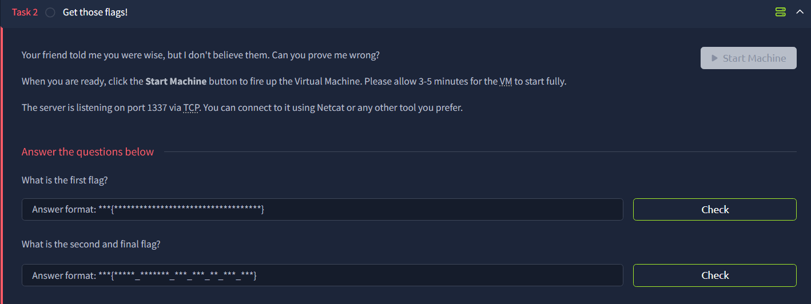

# W1seGuy



In this challenge, we need to find the encryption key. Notice that they key is only 5-character long.

```python
res = ''.join(random.choices(string.ascii_letters + string.digits, k=5)) 
key = str(res)
```

In my case, the ciphertext is `011c291e0a6435080b0e102c10240e2160070e19143a16561b39181d0d2f27201d550f272c2b1707`

We already know the flag format is `THM{`, so we can immediately know the first 4 characters of the key using the Known Plaintext Attack.

We just need to XOR with the know flag header `THM{`, and we know the first 4 letters are `UTde`


The next step is just trying to figure out the last letter/digit. We just need to enumerate all possibilities.

I got the key `UTdez` , and successfully retrieve the first flag: `THM{p1alntExtAtt4ckcAnr3alLyhUrty0urxOr}`


Submit the key to the server, and we can get the second flag: `THM{BrUt3_ForC1nG_XOR_cAn_B3_FuN_nO?}`

```bash
This XOR encoded text has flag 1: 011c291e0a6435080b0e102c10240e2160070e19143a16561b39181d0d2f27201d550f272c2b1707
What is the encryption key? UTdez
Congrats! That is the correct key! Here is flag 2: THM{BrUt3_ForC1nG_XOR_cAn_B3_FuN_nO?}

```

## Finished


